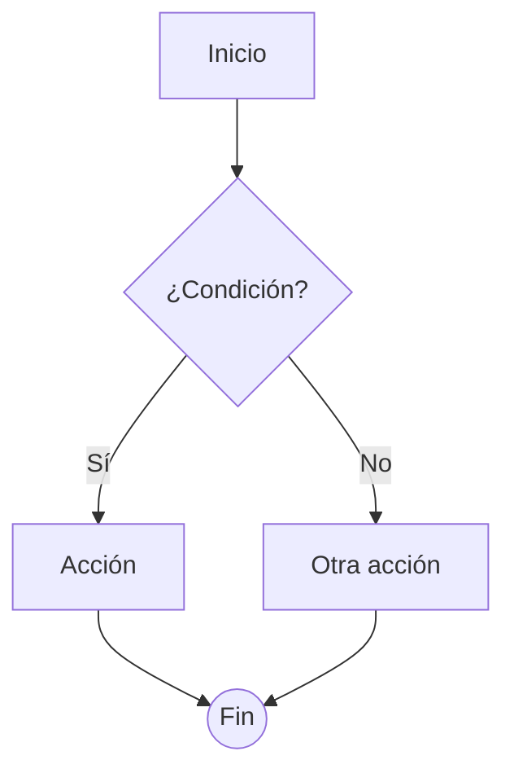

# FRD · 00 — MODELO CANÓNICO DE INTERACCIÓN Y FEEDBACK

> **Este es el documento de referencia.** Define CÓMO debe responder el sistema ante cualquier acción del usuario, para que TODO módulo se comporte igual. Antes de implementar o verificar cualquier pantalla, leer esto.
>
> **Propósito:** que cualquier acción (clic en un botón) tenga UN resultado predecible: qué modal abre, qué dice ese modal, qué error llega, qué toast/notificación/alerta aparece. Sin sorpresas. Sin `alert()` sueltos.

**Proyecto:** ManagerHotel (SOLMI OS)
**Versión:** 1.0 · **Fecha:** 2026-06-19
**Estado de la app hoy:** feedback inconsistente — algunos módulos usan `alert()` nativo, otros `console.error`, sin sistema unificado de toasts. **Este documento es el target a alcanzar.**

---

## 0. Cómo usar este documento

| Si quieres... | Lee... |
|---------------|--------|
| Saber qué modal/toast dispara un botón | §1 (Taxonomía de feedback) + §2 (Modales) + §3 (Toasts) |
| El texto exacto de un mensaje de error | §5 (Taxonomía de errores) + el `Mxx-*.md` del módulo |
| Verificar si una pantalla está correcta | Su `Mxx-*.md` → Decision Table → comparar con lo implementado |
| Documentar un módulo nuevo | Copiar `M01-PMS-Central.md` como molde y llenar las tablas |
| Entender un flujo completo | El diagrama Flow en el `Mxx-*.md` correspondiente |

**Regla de oro:** NINGÚN módulo puede inventar un patrón de feedback nuevo. Todo debe encajar en las categorías de §1. Si falta una categoría, se amplía ESTE documento, no se improvisa en la pantalla.

---

## 1. Taxonomía de feedback (las 6 categorías)

Toda respuesta del sistema a una acción del usuario cae en EXACTAMENTE una de estas 6 categorías. No hay séptima.

| # | Categoría | Cuándo se usa | Duración | ¿Bloquea? | Color |
|---|-----------|---------------|----------|-----------|-------|
| F1 | **Toast** | Confirmación rápida de acción exitosa o aviso leve | 3.5s auto | No | verde/rojo/ámbar/azul |
| F2 | **Modal** | Acción que requiere confirmación, formularios o detalle | Hasta cerrar | Sí (backdrop) | por subtipo |
| F3 | **Inline error** | Validación de campo de formulario en tiempo real | Mientras inválido | No | rojo |
| F4 | **Alert de página** | Aviso contextual permanente en la pantalla (no accional) | Hasta resolver | No | ámbar/azul |
| F5 | **Notificación (badge/push/inbox)** | Evento asíncrono externo o que el usuario no disparó directo | Persistente | No | campana 🔔 |
| F6 | **Loading state** | Toda llamada a backend en curso | Durante la request | Botón sí | gris/spinner |

**Anti-patrones PROHIBIDOS (estado actual a corregir):**

| ❌ Hoy existe | ✅ Debe ser |
|---------------|-----------|
| `alert('Error al hacer check-in')` | Toast error F1 con texto específico (ver §5) |
| `console.error(e)` silencioso | Toast error F1 + logging en servicio |
| Botón sin estado de carga | Loading F6 (spinner + `disabled`) |
| Cerrar modal sin feedback | Toast success F1 al confirmar |
| Validación solo al submit | Inline error F3 al blur + al escribir |

---

## 2. Sistema de Modales (F2)

### 2.1 Anatomía (fija)

Todo modal sigue esta estructura (ya existe en `checkin/index.vue` con `<Teleport to="body">`):

```
┌──── Overlay (z-50, bg-navy/40, backdrop-blur) ────┐
│  click.self = cerrar (excepto en tipo 'danger')    │
│   ┌── Card (bg-white, rounded-2xl, max-w por tipo)┐ │
│   │ HEADER (border-b, tintado por subtipo)         │ │
│   │   Título · botón ✕ cerrar                      │ │
│   ├─────────────────────────────────────────────────┤ │
│   │ BODY (p-5, contenido)                           │ │
│   ├─────────────────────────────────────────────────┤ │
│   │ FOOTER (border-t, botones de acción)            │ │
│   └─────────────────────────────────────────────────┘ │
└────────────────────────────────────────────────────┘
```

### 2.2 Subtipos de modal y sus reglas

| Subtipo | max-w | Header tint | Botón primario | Botón secundario | `click.self` cierra |
|---------|-------|-------------|----------------|------------------|---------------------|
| **confirm** (info/éxito) | `md` (28rem) | color/5 | Teal "Confirmar" | Gris "Cancelar" | Sí |
| **form** (crear/editar) | `lg` (32rem) | surface | Teal "Guardar" | Gris "Cancelar" | Sí (con confirmación si dirty) |
| **detail** (solo lectura) | `lg` | surface | Navy "Cerrar" | — | Sí |
| **danger** (eliminar/anular) | `md` | coral/5 | Coral "Eliminar/Anular" | Gris "Cancelar" | **NO** (evita cierre accidental) |
| **warning** (irreversible con consecuencias) | `md` | gold/5 | Gold "Continuar" | Gris "Cancelar" | Sí |

### 2.3 Reglas de botones en modales

1. El botón primario SIEMPRE a la derecha.
2. Texto del botón primario = verbo de acción + objeto: "Confirmar Check-in", "Guardar Reserva", "Eliminar Huésped". Nunca solo "OK" o "Aceptar".
3. Durante la acción (F6): botón primario → spinner + `disabled`, texto "Procesando...".
4. Si el modal es `form` y el usuario editó datos, al intentar cerrar (✕ o Esc) → abrir modal `confirm` secundario: "¿Descartar cambios?" [Descartar] [Seguir editando].
5. `danger` requiere cargar el botón primario 1.5s (anti-clic-accidental) antes de habilitar.

### 2.4 Cajas de advertencia dentro de modales

Cuando una acción tiene **consecuencias visibles en otros módulos**, el modal incluye una caja amarilla (`bg-gold/10 border-gold/20`) con icono ⚠. Ya existe el patrón en check-out:

> ⚠ La habitación pasará a estado "Sucia" y se creará tarea de limpieza

**Plantilla:** `⚠ [recurso] pasará a [estado] y se [acción derivada en otro módulo]`.

---

## 3. Sistema de Toasts (F1)

### 3.1 Anatomía

- Posición: **top-right** fijo, `z-[60]` (por encima de modales).
- Stack vertical, máximo 3 visibles (los demás se encolan).
- Auto-cierre a los **3.5s**. En hover → pausa el contador.
- Botón ✕ para cierre manual.
- Ancho fijo `360px`. Estructura: icono · título · descripción · ✕.

### 3.2 Variantes y texto canónico

| Variante | Color/borde | Icono | ¿Cuándo? |
|----------|-------------|-------|----------|
| **success** | teal/10 + teal | ✓ | Acción completada |
| **error** | coral/10 + coral | ✕ | Falló una acción |
| **warning** | gold/10 + gold | ⚠ | Éxito con advertencia |
| **info** | blue/10 + blue | ℹ | Aviso neutral |

### 3.3 Reglas de REDACCIÓN de toasts (obligatorio)

| ❌ Malo | ✅ Bueno | Regla |
|--------|---------|-------|
| "Error" | "No se pudo hacer el check-in" | Verbo + objeto |
| "Reserva guardada" | "Reserva de María López creada" | Incluir el recurso identificado |
| "Ocurrió un error inesperado" | "No hay conexión. Reintentá en unos segundos." | Decir la causa si se conoce (ver §5) |
| "Éxito" | "Huésped eliminado" | Acción en pasado + recurso |

**Estructura canónica de un toast:**
- **success/warning/info:** `[Recurso] [acción en pasado].` → ej: "Check-in confirmado para Hab 204."
- **error:** `No se pudo [acción]. [Causa legible].` → ej: "No se pudo guardar la reserva. Falta el campo Email."

**Prohibido:** textos técnicos (`TypeError`, `status 500`, stack traces, `undefined`). Eso va al log del servicio, no al usuario.

---

## 4. Estados de carga y vacío (F6)

### 4.1 Botones

| Estado | Apariencia | Comportamiento |
|--------|-----------|----------------|
| idle | normal | clicable |
| loading | spinner + texto "Procesando..." + opacidad-70 | `disabled`, no dispara de nuevo |
| success | ✓ teal 1s | vuelve a idle |
| error | vuelve a idle + toast error | reintentable |

### 4.2 Listas y pantallas

| Estado | Qué se muestra |
|--------|----------------|
| Cargando | **Skeleton** (cajas grises pulsando) con la misma forma que el contenido real — NUNCA spinner centrado solo |
| Vacío | Ilustración/icono + título + descripción + CTA. Ej: "Sin llegadas hoy" |
| Error de carga | Alert F4 roja en la zona + botón "Reintentar" |
| Sin permiso | Estado vacío específico: "No tenés permiso para ver esto. Contactá a tu administrador." |

---

## 5. Taxonomía de errores (la pieza central)

Todo error cae en una de 7 clases. Cada clase tiene un patrón de texto y una respuesta del sistema. **Esta tabla es la fuente de verdad para "qué dice el modal/toast de error".**

| Código | Clase de error | Causa típica | Texto al usuario (plantilla) | Feedback | ¿Reintentar? |
|--------|---------------|--------------|------------------------------|----------|--------------|
| E1 | **Validación de campo** | Campo requerido vacío, formato inválido | Inline: "[Campo] es obligatorio" / "Email inválido" | F3 inline | — |
| E2 | **Regla de negocio** | Habitación ya ocupada, overbooking, fecha en pasado | Toast: "No se pudo [acción]: [regla]. Ej: la Hab 204 ya está ocupada." | F1 error | No |
| E3 | **Permisos / 403** | Rol sin acceso, sin hotel asignado | Toast: "No tenés permiso para [acción]." + log audit | F1 error | No |
| E4 | **No encontrado / 404** | Recurso inexistente o de otro hotel | Toast: "No se encontró [recurso]." + redirect si era ruta | F1 error | No |
| E5 | **Conflicto de concurrencia / 409** | Alguien modificó el mismo dato | Modal confirm: "Alguien actualizó esto. ¿Recargar y volver a intentar?" | F2 confirm | Sí |
| E6 | **Red / servidor / 5xx** | Sin conexión, timeout, caída | Toast: "No hay conexión. Reintentá en unos segundos." + botón Reintentar | F1 error + F4 | Sí |
| E7 | **Error desconocido** | Cualquier cosa no clasificada | Toast: "Algo salió mal. Ya estamos avisados." + log con traceId | F1 error | Sí |

**Mapeo desde el backend (status HTTP → clase):**

```
400 → E1 o E2 (mirar body.code: 'VALIDATION' → E1, 'BUSINESS_RULE' → E2)
401 → redirigir a /login + toast info "Tu sesión expiró. Volvé a ingresar."
403 → E3
404 → E4
409 → E5
5xx / sin respuesta / timeout → E6
cualquier otro → E7
```

**Regla de logging:** TODO error E6/E7 se loguea en el servicio con `{ traceId, userId, hotelId, acción, payload resumido }`. El traceId NUNCA se muestra al usuario como número crudo; va al log.

---

## 6. Notificaciones (F5)

### 6.1 Canales

| Canal | Origen | Cómo llega |
|-------|--------|-----------|
| **In-app (campana 🔔)** | Eventos del sistema mientras el usuario está en la app | Badge en header + lista desplegable |
| **Push / app móvil** | Staff (M24) y Guest (M25) | Push nativa |
| **WhatsApp** | Confirmaciones a huéspedes, briefings (M17) | WhatsApp Business API |
| **Email** | Reservas, facturas, nómina | Transaccional |

### 6.2 Cuándo se genera una notificación in-app

Una notificación F5 se crea cuando ocurre un evento **que el usuario actual NO disparó directamente** o que es **resultado asíncrono** de algo:

| Evento | Quién la recibe | Texto |
|--------|-----------------|-------|
| Reserva nueva de OTA | Recepción/Admin del hotel | "Nueva reserva de Booking.com — María L., Hab 204" |
| Habitación marcada sucia (post check-out) | Housekeeping | "Hab 204 necesita limpieza" |
| Ticket de mantenimiento creado | Técnico asignado | "Nuevo ticket: A/C Hab 110 no enfría" |
| Pago confirmado | Admin/Billing | "Pago de $150 confirmado — Reserva #2831" |
| Overbooking evitado por Channel Mgr | Admin | "Overbooking evitado en Booking.com (Hab 204)" |
| Documento de empleado por vencer | RRHH | "Vence licencia de Juan Pérez en 7 días" |

### 6.3 Diferencia Toast (F1) vs Notificación (F5)

| | Toast F1 | Notificación F5 |
|--|----------|-----------------|
| Origen | Acción directa del usuario ahora | Evento externo/ajeno/async |
| Duración | 3.5s | Persistente hasta leer |
| Dónde | Top-right flotante | Campana + inbox |
| Ejemplo | "Reserva guardada" (acabo de guardar) | "Nueva reserva OTA" (llegó sola) |

---

## 7. Formato DECISION TABLE (cómo se documenta cada botón)

Cada módulo documenta sus interacciones con esta tabla. **Una fila = un trigger (clic/acción).** Las condiciones se combinan para producir un único resultado.

```
| Trigger (botón/acción) | Condición / Estado previo | Resultado principal | Modal/Toast (texto) | Errores posibles | Notificación (F5) |
|------------------------|---------------------------|---------------------|---------------------|------------------|-------------------|
```

**Convenciones de columnas:**
- **Trigger:** texto EXACTO del botón (ej: "Confirmar Check-in").
- **Condición:** qué debe ser verdad antes (ej: "reserva.status = confirmed Y roomId asignado").
- **Resultado:** estado posterior (ej: "reserva → checked_in, room → occupied").
- **Modal/Toast:** qué aparece y su texto literal entre comillas.
- **Errores:** códigos E1–E7 que pueden ocurrir y su texto.
- **Notificación:** evento F5 derivado (o "—" si ninguno).

### Ejemplo de fila completa (Check-in):

| Trigger | Condición | Resultado | Modal/Toast | Errores | Notif |
|---------|-----------|-----------|-------------|---------|-------|
| "Confirmar Check-in" | reserva=confirmed, hab=available | reserva→checked_in, hab→occupied | Toast success: "Check-in confirmado para Hab {n}." | E2 "La Hab {n} ya está ocupada" · E6 "Sin conexión" | F5 a Housekeeping: "{n} ahora ocupada" |

---

## 8. Formato FLOW (cómo se documenta un flujo)

Cada flujo crítico se dibuja con **Mermaid** (renderizable en GitHub/VSCode) + una **tabla de pasos numerada** para los que no rendericen.



**Reglas de notación:**
- `[ ]` rectángulo = paso/acción del sistema
- `{ }` rombo = decisión (condición)
- `(( ))` círculo = fin
- `[/ /]` = input del usuario
- Flecha con `-- E2 -->` = camino de error etiquetado con su código

**Cada flujo SIEMPRE documenta:**
1. Camino feliz (happy path)
2. Caminos de error (uno por cada código E aplicable)
3. Caminos de permiso denegado (E3)
4. Estado del sistema después de cada rama

---

## 9. Checklist de verificación por pantalla

Antes de marcar una pantalla como "correcta", debe cumplir TODO esto:

- [ ] Todo botón de acción tiene entrada en la Decision Table del módulo
- [ ] Ningún `alert()` / `confirm()` nativo del navegador
- [ ] Todo botón de acción tiene estado loading (F6)
- [ ] Todo éxito tiene toast success (F1)
- [ ] Todo error está clasificado E1–E7 con su texto canónico
- [ ] Acciones irreversibles usan modal `danger` o `warning`
- [ ] Acciones con consecuencias en otro módulo muestran caja ⚠
- [ ] Estados vacíos tienen ilustración + CTA (no string suelto)
- [ ] Listas tienen skeleton mientras cargan
- [ ] Rutas con `meta.requiresHotelAuth` / `requiresSuperAdmin` muestran estado "sin permiso" si se accede sin rol

---

## 10. Glosario

| Término | Significado |
|---------|-------------|
| **Trigger** | Lo que dispara la interacción (clic, submit, toggle) |
| **Happy path** | Flujo sin errores |
| **F1–F6** | Categorías de feedback (ver §1) |
| **E1–E7** | Clases de error (ver §5) |
| **Dirty** | Formulario con cambios sin guardar |
| **OTA** | Online Travel Agency (Booking, Airbnb, etc.) |
| **Overbooking** | Misma habitación vendida 2 veces |
| **Rack** | Vista calendario de disponibilidad |

---

*Este documento vive en `FRD/00-MASTER.md`. Cuando un módulo necesite un patrón nuevo, se documenta ACÁ primero, luego se aplica a todos.*
