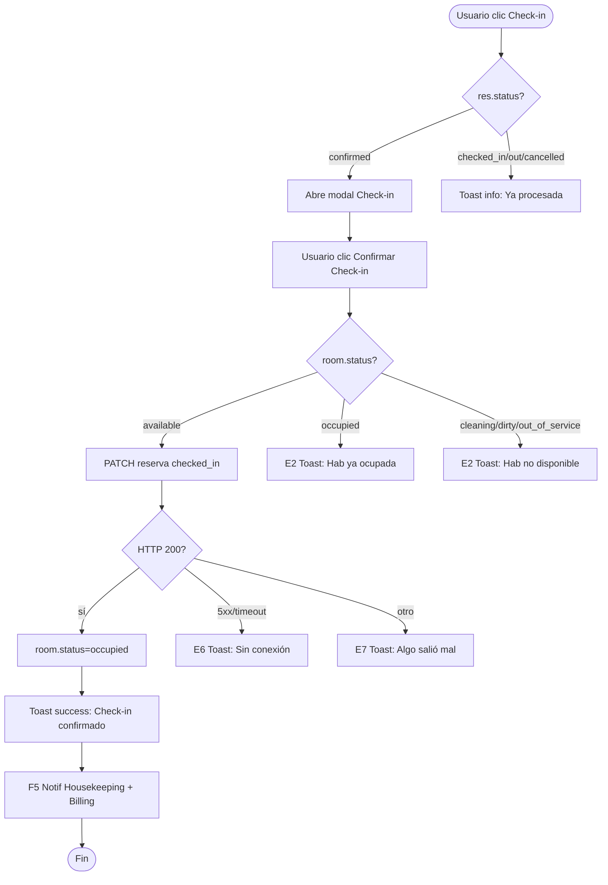
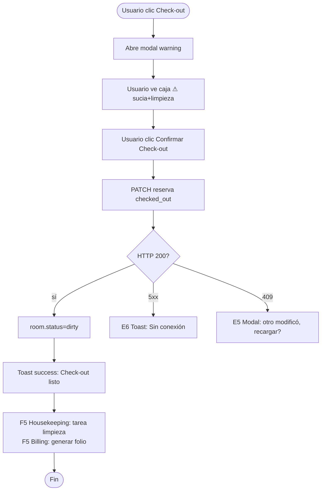
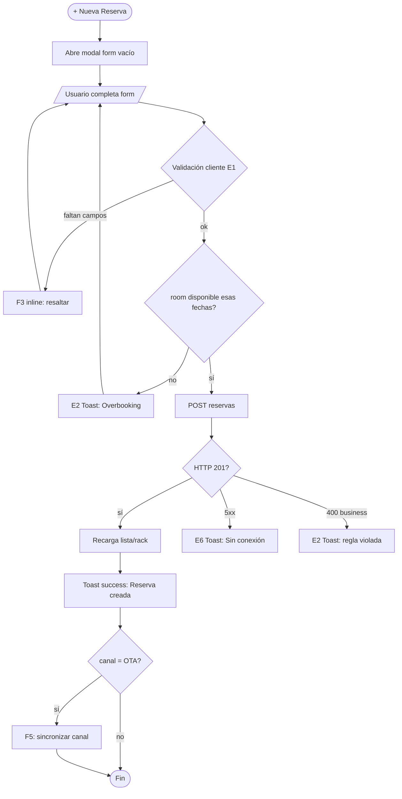
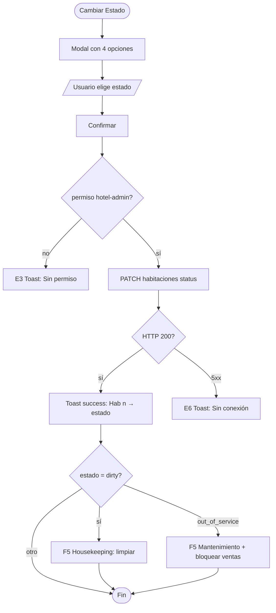

# FRD · M01 — PMS Central (Check-in, Check-out, Reservas, Habitaciones)

> **Módulo ejemplar.** Este documento demuestra CÓMO se documenta cada módulo siguiendo `00-MASTER.md`. Copiar este molde para M02, M05, M07, etc.
>
> Todo lo documentado acá está **extraído del código real** de `frontend/src/pages/` (checkin, reservations, rooms, dashboard). La columna "Gap" marca lo que hoy NO cumple el modelo canónico y hay que corregir.

**Módulo:** M01 — PMS Central
**Pantallas cubiertas:** Recepción Digital (Check-in/out) · Reservas · Habitaciones · Dashboard (acciones de cuarto)
**Servicios frontend:** `Reservation.service.ts`, `Room.service.ts`, `Operations.service.ts`
**Servicios backend:** módulos `reservas`, `habitaciones`, `huespedes`, `folios`

---

## 1. Modelo de datos (fuente de verdad)

### 1.1 Estados de Reserva (`reservation.status`)

| Estado | Significado | Color badge | ¿Ocupa habitación? |
|--------|-------------|-------------|---------------------|
| `pending` | Creada, sin confirmar / sin pago | gold | No |
| `confirmed` | Confirmada (paga o garantizada) | blue | No (la ocupa al check-in) |
| `checked_in` | Huésped adentro | teal | **Sí** |
| `checked_out` | Huésped salió | gray | No (libera tras limpieza) |
| `cancelled` | Cancelada | coral | No |

### 1.2 Estados de Habitación (`room.status`)

| Estado | Significado | Color | ¿Vendible? |
|--------|-------------|-------|-----------|
| `available` | Lista para recibir huésped | teal | Sí |
| `occupied` | Huésped adentro | coral | No |
| `cleaning` | Housekeeping limpiando | cyan | No |
| `dirty` | Sucia (post check-out), espera limpieza | gold | No |
| `out_of_service` | Fuera de servicio (mantenimiento/avería) | gray | No |

> ⚠ **INCONSISTENCIA DETECTADA (Gap #1):** la página `rooms/index.vue` solo ofrece 4 estados (`available`, `occupied`, `cleaning`, `out_of_service`) — **falta `dirty`**. Pero `checkin/index.vue` SÍ pone la habitación en `dirty` tras el check-out. Resolver: agregar `dirty` al listado de estados de `rooms`.

### 1.3 Canales / Origen (`reservation.source`)

`direct` · `booking` · `expedia` · `airbnb` · `google` · `whatsapp` · `phone` · `walk_in` · `email`

---

## 2. Pantalla — Recepción Digital (`/panel/checkin`)

Cabecera muestra: fecha · llegadas hoy · salidas hoy · en casa. Grid de habitaciones + 3 columnas (Llegadas / En Casa / Salidas).

### 2.1 Decision Table

| Trigger | Condición / Estado previo | Resultado | Modal/Toast (texto literal) | Errores posibles (códigos) | Notificación F5 |
|---------|---------------------------|-----------|------------------------------|-----------------------------|-----------------|
| Clic en tarjeta de habitación disponible | `room.status=available` | Abre detalle (sin acción) | — | — | — |
| Clic en tarjeta de habitación ocupada | `room.guestName` set | Abre **modal Check-in** (si la reserva está confirmada) o detalle | Modal `confirm` teal: header "Check-in" | E4 "No se encontró la reserva" | — |
| Clic en fila de "Llegadas Hoy" | `res.checkIn=hoy` Y `res.status=confirmed` | Abre **modal Check-in** | Modal `confirm` teal: muestra Hab/fechas/canal/total/adults/children | — | — |
| Botón **"Check-in"** (verde, columna Llegadas) | ídem arriba | Abre **modal Check-in** | ídem | — | — |
| Botón **"Confirmar Check-in"** (dentro modal) | `res.status=confirmed`, `room.status=available` | `res→checked_in`, `room→occupied` | **Toast success (target):** "Check-in confirmado para Hab {n}." + cierra modal | E2 "La Hab {n} ya está ocupada" · E6 "Sin conexión" | **Sí:** F5 a Housekeeping "Hab {n} ahora ocupada" |
| `confirmCheckin` falla | API error | Sin cambio de estado | **Toast error (target):** "No se pudo hacer el check-in. Reintentá en unos segundos." | E6/E7 | — |
| Clic en fila "En Casa" o **"Check-out"** (azul) | `res.status=checked_in` | Abre **modal Check-out** coral | Modal `warning`: header "Check-out" + caja ⚠ "⚠ La habitación pasará a estado 'Sucia' y se creará tarea de limpieza" | — | — |
| Botón **"Confirmar Check-out"** | `res.status=checked_in` | `res→checked_out`, `room→dirty` | **Toast success (target):** "Check-out de {huésped} listo. Hab {n} marcada para limpieza." + cierra | E6 "Sin conexión" | **Sí:** F5 a Housekeeping "Hab {n} necesita limpieza" + F5 a Billing "Generar folio de {huésped}" |
| Clic en fondo oscuro (`@click.self`) | modal abierto | Cierra modal sin acción | — | — | — |
| Botón **"Cancelar"** | modal abierto | Cierra modal sin acción | — | — | — |

**Gap actual (Check-in):**
- ❌ Hoy: error = `alert('Error al hacer check-in')` → debe ser Toast E6/E7 con texto canónico.
- ❌ Hoy: éxito **sin feedback** (solo cierra el modal) → falta Toast success.
- ❌ Hoy: sin estado loading en "Confirmar Check-in".
- ❌ Hoy: `doCheckin` no valida que la habitación esté `available` antes de ocupar (puede generar doble ocupación → E2 no implementado).

### 2.2 Flow — Check-in

### 2.3 Flow — Check-out

---

## 3. Pantalla — Reservas (`/panel/reservations`)

Dos vistas: **Lista** (tabla) y **Calendario** (rack semanal). Toolbar con toggle de vista + botón "+ Nueva Reserva".

### 3.1 Decision Table

| Trigger | Condición | Resultado | Modal/Toast (texto) | Errores | Notif F5 |
|---------|-----------|-----------|----------------------|---------|----------|
| Toggle **"📋 Lista" / "📅 Calendario"** | — | Cambia vista (sin recargar datos) | — | — | — |
| **"← Anterior" / "Siguiente →"** (calendario) | — | `weekOffset ±1`, recalcula rack | — | — | — |
| Clic en celda vacía del calendario (`+`) | `room` libre ese día | Abre **modal form** con `roomId`+`checkIn` precargados | Modal `form`: "Nueva Reserva" | — | — |
| Clic en bloque de reserva (calendario) | existe booking | Abre **modal detail**: nombre, #reserva, estado, canal, fechas, noches, total | Modal `detail` | — | — |
| Clic en fila (lista) | — | Abre **modal form en modo edición** (precargado) | Modal `form`: "Editar Reserva" | — | — |
| Botón **"+ Nueva Reserva"** | — | Abre **modal form** vacío | Modal `form`: "Nueva Reserva" | — | — |
| Campo Email con valor inválido, al blur | regex email falla | Inline rojo bajo el campo | F3: "Email inválido" | E1 | — |
| Campos Nombre/Check-in/Check-out vacíos + **"Crear Reserva"** | alguno vacío | No envía | **Target:** resaltar campos + F3 "Campo obligatorio". **Hoy:** `alert('Por favor completa los campos obligatorios')` | E1 | — |
| Botón **"Crear Reserva"** (form válido) | datos ok, modo nuevo | POST reserva `status=confirmed`, `total=base×nights+10%` | **Toast success (target):** "Reserva de {huésped} creada en Hab {n}." + cierra | E2 "La Hab {n} ya está reservada esas fechas (overbooking)" · E6 "Sin conexión" | **Sí:** si canal OTA → F5 "Sincronizar con {canal}" |
| Botón **"Guardar Cambios"** (modo edición) | form válido | PATCH reserva | **Gap #2:** HOY el edit **NO guarda** (solo cierra el modal). Debe: Toast success "Reserva actualizada." | E5 conflicto · E6 | — |
| Botón **"Cancelar"** | form dirty | **Target:** modal confirm "¿Descartar cambios?". **Hoy:** cierra directo | — | — | — |
| `checkInFromDetail` (botón Check-in en detalle) | booking confirmado | **Gap #3:** HOY muta estado en memoria (sin API). Debe llamar a `ReservationService.update` | — | — | — |

**Resumen de precio en form:** `total = room.basePrice × nights + (basePrice × nights × 0.10)`. Impuesto fijo 10%.

### 3.2 Flow — Crear Reserva

---

## 4. Pantalla — Habitaciones (`/panel/rooms`)

Grilla de tarjetas con paginación. Filtros por estado. Cada tarjeta → ver / cambiar estado / editar.

### 4.1 Decision Table

| Trigger | Condición | Resultado | Modal/Toast (texto) | Errores | Notif F5 |
|---------|-----------|-----------|----------------------|---------|----------|
| Filtro estado (Disponibles/Ocupadas/Limpieza/F‑S) | — | Filtra lista, resetea paginación | — | — | — |
| **"‹ Anterior / Siguiente ›"** y paginación numérica | — | Cambia página (deshabilitado en bordes) | — | — | — |
| Clic en tarjeta de habitación | — | Abre **modal detail**: número, tipo, precio, estado, huésped actual (si occupied), amenities | Modal `detail` | — | — |
| Botón **"Cambiar Estado"** (en tarjeta o en detail) | — | Abre **modal confirm** con 4 opciones (Disponible/Ocupada/Limpieza/F‑S) + descripción de cada una | Modal `confirm`: "Cambiar Estado — Hab {n}" | — | — |
| Seleccionar estado + confirmar | estado cambia | PATCH habitación `status` | **Toast success (target):** "Hab {n} → {estadoLabel}." | E6 "Sin conexión" · E3 "Sin permiso" | **Sí:** si pasa a `dirty` → F5 Housekeeping; si pasa a `out_of_service` → F5 Mantenimiento + bloquear reservas futuras |
| Botón **"Editar"** (en detail) | — | Abre **modal form** con datos cargados (número, tipo, precio, maxGuests, amenities, estado) | Modal `form`: "Editar Habitación" | — | — |
| Botón **"+ Nueva Habitación"** | — | Abre **modal form** vacío | Modal `form`: "Nueva Habitación" | — | — |
| **"Crear" / "Guardar"** sin número | `form.number` vacío | No envía | **Hoy:** `alert('Número requerido')`. **Target:** F3 inline "Número requerido" | E1 | — |
| **"Crear"** válido (nuevo) | número único | POST habitación | **Toast success (target):** "Habitación {n} creada." | E2 "Ya existe una habitación con ese número" · E3 · E6 | — |
| **"Guardar"** válido (edición) | — | PATCH habitación | **Toast success (target):** "Habitación {n} actualizada." | E5 · E6 | — |
| **"Cancelar"** (form) | — | Cierra modal | — | — | — |

**Gap actual (Rooms):**
- ❌ `alert()` en validación y errores → Toast/inline.
- ❌ Falta estado `dirty` en opciones (ver §1.2 Gap #1).
- ❌ Sin loading en botones de acción.

### 4.2 Flow — Cambiar Estado de Habitación

---

## 5. Pantalla — Dashboard (`/panel`) — acciones rápidas de cuarto

Modal de habitación accesible desde el dashboard, con botones de acción directa.

### 5.1 Decision Table

| Trigger | Condición | Resultado | Modal/Toast | Errores | Notif F5 |
|---------|-----------|-----------|-------------|---------|----------|
| Clic en tarjeta de cuarto | — | Abre **modal detail** con acciones | Modal `detail` | — | — |
| Botón **Check-in** (modal) | room tiene reserva confirmada hoy | `res→checked_in`, `room→occupied` | Toast success: "Check-in Hab {n}." | E2/E6 | F5 Housekeeping |
| Botón **Check-out** (modal) | `res=checked_in` | `res→checked_out`, `room→dirty` | Toast success + ⚠ caja sucia | E6 | F5 Housekeeping + Billing |
| Botón **Marcar Limpia** (markClean) | `room=dirty/cleaning` | `room→available` | Toast success: "Hab {n} disponible." | E6 | F5 Recepción: lista para venta |
| Botón **Fuera de Servicio** (markOutOfService) | cualquier estado | `room→out_of_service` | **Modal danger:** "¿Poner Hab {n} fuera de servicio? Se bloquearán las reservas futuras." | E6 | F5 Mantenimiento |
| Botón **Cerrar** (modal) | — | Cierra sin acción | — | — | — |

---

## 6. Consecuencias cross-módulo (eventos que dispara M01)

Estas son las acciones de M01 que **producen efectos en otros módulos** (deben generar F5 y/o sincronización):

| Acción en M01 | Módulo afectado | Efecto | Notificación F5 |
|---------------|-----------------|--------|-----------------|
| Check-in confirmado | Housekeeping (M07) | Hab pasa a ocupada, monitorear para limpieza al check-out | "Hab {n} ahora ocupada" |
| Check-out confirmado | Housekeeping (M07) | Crear tarea de limpieza, hab → dirty | "Hab {n} necesita limpieza" |
| Check-out confirmado | Billing/Folios (M13) | Generar folio del huésped, cobrar pendientes | "Generar folio de {huésped}" |
| Check-out confirmado | Facturación (M23) | Disparar emisión de factura si corresponde | — |
| Reserva creada vía OTA | Channel Manager (M02) | Sincronizar disponibilidad para evitar overbooking | "Sincronizar {canal}" |
| Hab → out_of_service | Mantenimiento (M08) | Crear ticket, bloquear inventario | "Hab {n} fuera de servicio" |
| Hab → available (markClean) | Motor de Reservas (M03) | Liberar para venta directa/OTA | "Hab {n} disponible" |
| Overbooking detectado | Channel Manager (M02) | Bloqueo automático en canales | "Overbooking evitado en {canal}" |

---

## 7. Reglas de negocio a validar en backend (E2)

El backend debe rechazar (HTTP 400 `BUSINESS_RULE`) estas situaciones, y el frontend mostrar el Toast E2 correspondiente:

1. **Check-in en hab ocupada** → "La Hab {n} ya está ocupada."
2. **Check-in de reserva cancelada/checked_out** → "La reserva no está confirmada."
3. **Crear reserva con fechas invertidas** (checkOut ≤ checkIn) → "La fecha de salida debe ser posterior al check-in."
4. **Overbooking** (hab ya reservada en rama de fechas solapada) → "La Hab {n} ya está reservada esas fechas."
5. **Check-in antes de la fecha de entrada** → "El check-in anticipado no está habilitado para esta reserva."
6. **Marcar disponible una hab con huésped en casa** → "No se puede liberar la Hab {n}: tiene huésped en check-in."
7. **Número de habitación duplicado** → "Ya existe una habitación con ese número."

---

## 8. Checklist de verificación M01

Estado actual vs. target (sección por sección). Marcar cuando se cumpla.

### Recepción Digital
- [ ] Toast success al confirmar check-in (hoy: nada)
- [ ] Toast error E6/E7 reemplaza `alert('Error al hacer check-in')`
- [ ] Validación E2 de hab disponible antes de check-in
- [ ] Botón "Confirmar Check-in" con estado loading
- [ ] Toast success al confirmar check-out
- [ ] Caja ⚠ ya existe (mantener)

### Reservas
- [ ] Validación inline E1 reemplaza `alert('Completa los campos')`
- [ ] Modo edición realmente guarda (Gap #2)
- [ ] `checkInFromDetail` llama a la API (Gap #3)
- [ ] Toast success al crear/editar
- [ ] Toast E2 de overbooking
- [ ] Modal confirm "¿Descartar cambios?" al cerrar form dirty

### Habitaciones
- [ ] Estado `dirty` en opciones (Gap #1)
- [ ] Inline E1 reemplaza `alert('Número requerido')`
- [ ] Toast success/error reemplaza `alert(e.message)`
- [ ] Botones con estado loading

### Dashboard
- [ ] Botones de acción con loading
- [ ] Modal danger antes de "Fuera de Servicio"
- [ ] Toast success en cada acción (check-in/out/clean/oos)

---

## 9. Pendiente de documentar en M01 (próximas iteraciones)

- [ ] Reservas grupales (M01 menciona grupales, no implementado en UI)
- [ ] Folios y cuentas por cobrar (vinculado a M13)
- [ ] Rack mensual (solo semanal hoy)
- [ ] Permisos por rol: ¿quién puede check-in vs solo ver? (definir matriz)

---

*Este es el molde. Replicar la misma estructura (1 modelo de datos → 2..n decision tables → flows → gaps → checklist) para cada módulo M02–M26.*
