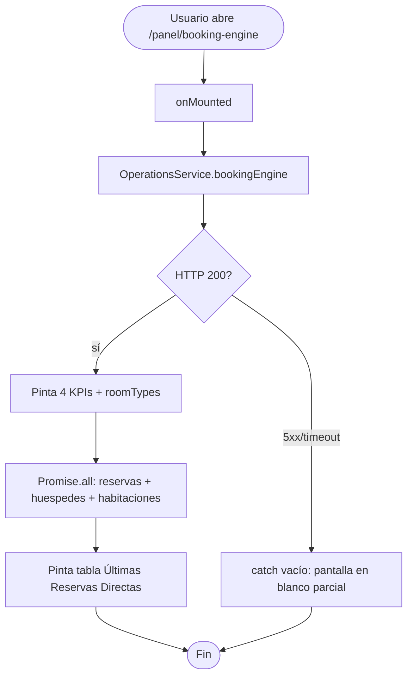
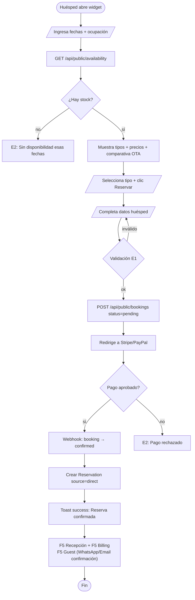

# FRD · M03 — Motor de Reservas & Google Hotel Ads

> **Módulo mayoritariamente PENDIENTE.** Hoy existe una sola pantalla de **configuración/admin** del motor (`/panel/booking-engine`) y un endpoint de agregación de KPIs (`/api/booking-engine`). **NO existe** el motor público de reservas (búsqueda de disponibilidad, selección de habitación, pago en línea, confirmación), ni la integración real con Google Hotel Ads, ni comparación de tarifas, ni seguimiento de conversiones.
>
> Todo lo marcado `[REAL]` está extraído del código. Todo lo marcado `[PENDIENTE]` es el target de producto según `modules.md` y **no debe asumirse implementado**.
>
> **Plan de implementación:** Ver `FRD/M03-TRD-Motor-Reservas.md` (TRD con 5 fases, tablas de decisiones, flujos y matriz MoSCoW).

**Módulo:** M03 — Motor de Reservas & Google Hotel Ads
**Pantallas cubiertas (hoy):** Configuración del Widget + KPIs de reservas directas (`/panel/booking-engine`)
**Pantallas target (no existen):** Motor público de reservas · Comparador de tarifas · Checkout de pago · Confirmación
**Servicios frontend:** `OperationsService.bookingEngine()` · `ReservationService.list()` (para "Últimas Reservas Directas")
**Servicios backend:** módulo `paquetes` (CRUD de upsells, NO es el motor) · endpoint agregación `/api/booking-engine` (en `composition-root.ts`)
**Dependencias cross-module:** `reservas` (M01) · `canales`/Channex (M02) · `folios`/pagos (M13) · `hoteles`

---

## 1. Modelo de datos (fuente de verdad)

### 1.1 Paquetes / Upsells (`packages`) — [REAL]

Tabla gestionada por `PaquetesModule`. **No son tarifas del motor**, son paquetes adicionales vendibles (upsell).

| Campo | Tipo | Default | Origen |
|-------|------|---------|--------|
| `id` | string (req) | — | `paquetes/model.ts:7` |
| `hotelId` | string (req, indexed) | — | `paquetes/model.ts:8` |
| `name` | string (req) | — | `paquetes/model.ts:9` |
| `description` | text | — | `paquetes/model.ts:10` |
| `type` | string | `"upsell"` | `paquetes/model.ts:11` |
| `price` | number (req) | — | `paquetes/model.ts:12` |
| `contents` | json | `[]` | `paquetes/model.ts:13` |
| `active` | number | `1` | `paquetes/model.ts:14` |
| `createdAt` / `updatedAt` | string (timestamps) | auto | `paquetes/model.ts:16` |

> ⚠ **INCONSISTENCIA DETECTADA (Gap #1):** `packages/index.vue:32,36` lee `pkg.precio` pero el modelo define `price`. El frontend **nunca** va a mostrar precio correcto salvo que el dato venga con otro nombre. Unificar: usar `price` en ambos lados.

### 1.2 Configuración multi-tenant (`configuration`) — [REAL · sin uso en M03]

KV store definido en `composition-root.ts:29-37` (tabla `configuration`, campos `id`/`hotelId`/`key`/`value` json). Endpoints `/api/configuracion/:clave` (GET) y `/api/configuracion` (POST, super_admin).

**Problema:** la pantalla `booking-engine/index.vue` **nunca lee ni escribe** esta tabla. Toda la config (tema, posición, moneda, idioma, opciones) vive en `ref()`/`reactive()` locales y se pierde al recargar.

### 1.3 Modelo de Motor de Reservas público — [PENDIENTE DE IMPLEMENTAR]

No existe en el backend. El target requiere:

| Entidad target | Campos mínimos | Estado |
|----------------|----------------|--------|
| `availability` (stock diario por habitación/tipo) | `roomId`/`roomType`, `date`, `available`, `price` | ❌ No existe |
| `rates` (tarifas publicables por canal) | `roomId`, `date`, `amount`, `currency`, `channel` | ❌ No existe (M02 sincroniza vía Channex, pero no hay store local) |
| `public_bookings` (reservas creadas desde el widget) | = `Reservations` con `source: 'direct'` + `paymentStatus` + `paymentRef` | ⚠ Parcial: `Reservations` soporta `source` pero **sin** campos de pago online |
| `payments` (intención/cobro de pago) | `reservationId`, `provider`, `amount`, `status`, `ref` | ❌ No existe módulo |

---

## 2. Pantalla — Configuración del Widget (`/panel/booking-engine`) — [REAL]

Cabecera: título "Motor de Reservas" · subtítulo "Google Hotel Ads · Widget Web" · badge "● Activo" (hardcodeado, no reflete estado real) · botón "Ver Widget".

4 KPIs: **Reservas Directas** (de N totales) · **Tasa Conversión** (directas/total %) · **Ingresos Directos** ($) · **Comisiones Ahorradas** (≈ 15% de revenue directo).

### 2.1 Decision Table

| Trigger | Condición / Estado previo | Resultado | Modal/Toast (texto literal) | Errores posibles (códigos) | Notificación F5 |
|---------|---------------------------|-----------|------------------------------|-----------------------------|-----------------|
| Carga de página (`onMounted`) | usuario autenticado | Llama `OperationsService.bookingEngine()` + `ReservationService.list()` + `/api/huespedes` + `/api/habitaciones` | — | E6 "Sin conexión" (hoy: `catch {}` silencioso) | — |
| Clic en botón tema (Navy/Cyan/Teal/Claro/Oscuro) | — | `selectedTheme = id` (solo UI local) | — | — | — |
| Cambio `<select>` Posición | — | `widgetPosition` local (corner/center/inline/popup) | — | — | — |
| Cambio `<select>` Moneda | — | `currency` local (USD/DOP/MXN/COP/EUR) | — | — | — |
| Cambio `<select>` Idioma | — | `language` local (es/en/pt/fr) | — | — | — |
| Toggle checkbox **"Confirmación Instantánea"** | — | `options.instantConfirmation` local | — | — | — |
| Toggle checkbox **"Pago en Línea"** (label "Stripe / PayPal") | — | `options.payNow` local | — | — | — |
| Toggle checkbox **"Google Hotel Ads"** (label "Sincronizar tarifas") | — | `options.googleHotel` local — **no dispara sync real** | — | — | — |
| Toggle checkbox **"Confirmación WhatsApp"** (label "Envío automático") | — | `options.whatsappConfirmation` local | — | — | — |
| Clic **"Personalizar"** (esquina superior derecha) | — | **Nada** (sin `@click`) | — | — | — |
| Clic **"Ver Widget"** (header) | — | **Nada** (sin `@click`, botón muerto) | — | — | — |
| Clic **"Copiar Código"** | — | `navigator.clipboard.writeText(...)` con URL hardcoded `https://widget.managerhotel.com/loader.js` (dominio inexistente) | Texto botón: "✓ Copiado" (2s) → vuelve a "Copiar Código" | — | — |
| Clic fila en **"Últimas Reservas Directas"** | — | **Nada** (solo hover) | — | — | — |
| Clic card en **"Room Types"** (sidebar) | — | **Nada** (solo preview) | — | — | — |

**Gaps actuales (Configuración del Widget):**
- ❌ **Ninguna configuración se persiste** (todo local) → debe guardar en `configuration` con key p.ej. `booking_engine.widget`.
- ❌ Botón **"Ver Widget"** muerto (sin handler) → debería abrir preview del widget real.
- ❌ Botón **"Personalizar"** muerto → sin destino.
- ❌ Badge "● Activo" **hardcodeado** (no reflete si el motor está prendido).
- ❌ Embed code referencia dominio **inexistente** (`widget.managerhotel.com/loader.js`).
- ❌ `onMounted` falla en **silencio** (`catch {}`) → debe mostrar F4 alert "No se pudo cargar el panel".
- ❌ Toggle Google Hotel Ads **no dispara sync** alguna.
- ❌ No hay botón "Guardar configuración" → no hay forma de confirmar el guardado (target).

### 2.2 Flow — Carga del panel (REAL hoy)

---

## 3. Pantalla — Motor público de reservas — [PENDIENTE DE IMPLEMENTAR]

**No existe.** No hay ruta `/booking`, no hay página, no hay componente de búsqueda, no hay date picker, no hay checkout de pago. Esta sección documenta el **target** de producto.

### 3.1 Decision Table (TARGET — a implementar)

| Trigger | Condición / Estado previo | Resultado | Modal/Toast (texto) | Errores | Notif F5 |
|---------|---------------------------|-----------|----------------------|---------|----------|
| Usuario ingresa en widget embebido | widget cargado en sitio del hotel | Muestra buscador: check-in, check-out, adultos, niños, código promo | — | — | — |
| Clic **"Buscar disponibilidad"** | fechas válidas, ocupación > 0 | Llama `GET /api/public/availability?from&to&guests` → lista de tipos con precio y stock | Skeleton F6 mientras carga | E2 "Sin disponibilidad esas fechas" · E6 | — |
| Seleccionar tipo de habitación + **"Reservar"** | stock > 0 ese día | Avanza a paso Datos del huésped | — | E4 "Tipo no encontrado" | — |
| Submit **"Continuar al pago"** | datos huésped válidos (nombre, email, teléfono) | Crea `public_booking` con `status=pending` → redirige a checkout proveedor (Stripe/PayPal) | F3 inline por campo inválido | E1 "Email inválido" | — |
| Retorno del gateway de pago | pago aprobado | `payment.status=paid` · `booking.status=confirmed` · crea `Reservation` con `source=direct` | Toast success: "¡Reserva confirmada! Enviamos los detalles a {email}." | E2 "Pago rechazado" · E6 | **Sí:** F5 a Recepción "Nueva reserva directa — {huésped}" · F5 a Billing "Pago $X confirmado" |
| Webhook de pago (async) | gateway notifica | Actualiza `payment` + `booking` | — | E7 (log + retry) | F5 Admin "Pago de $X confirmado — Reserva #{id}" |

### 3.2 Flow — Reserva directa pública (TARGET)

---

## 4. Consecuencias cross-módulo (eventos que M03 dispara o consume)

| Acción | Módulo afectado | Efecto | Notificación F5 | Estado |
|--------|-----------------|--------|-----------------|--------|
| Reserva creada desde widget público | **Reservas (M01)** | Crea `Reservation` con `source=direct`, `status=confirmed` (si pago OK) o `pending` | "Nueva reserva directa — {huésped}, Hab {tipo}" | [PENDIENTE] |
| Reserva directa confirmada | **Channel Manager (M02)** | Decrementar disponibilidad en Channex para evitar overbooking | "Sincronizar Channex (-1 {tipo})" | [PENDIENTE] |
| Pago confirmado en checkout | **Billing/Folios (M13)** | Crear folio abierto + registrar pago + generar recibo | "Pago de $X confirmado — Reserva #{id}" | [PENDIENTE] |
| Tarifa publicada en motor | **Channel Manager (M02)** | Misma tarifa debe reflejarse en Google Hotel Ads y OTAs (single source of truth) | — | [PENDIENTE] |
| Google Hotel Ads sync | **Channel Manager (M02)** | Feed de tarifas/disponibilidad → Google Hotel Ads API | "Tarifas sincronizadas con Google" | [PENDIENTE — hoy solo checkbox] |
| Reserva `checked_in` (desde M01) | **Motor (M03)** | Marcar como "consumada" para métrica de conversión | — | [PENDIENTE] |
| Habitación liberada (M01 → `available`) | **Motor (M03)** | Vuelve a aparecer como vendible en widget | — | [REAL vía endpoint agregación, pasivo] |

---

## 5. Reglas de negocio a validar en backend (E2) — [PARCIAL · ampliar]

El backend hoy **solo valida** CRUD genérico de paquetes (`paquetes/validators/schema.ts`). Falta toda la lógica del motor público. Reglas target a implementar:

1. **Sin disponibilidad en rango** → "No hay disponibilidad para esas fechas en este tipo de habitación."
2. **Fecha en pasado** (checkIn < hoy) → "La fecha de entrada no puede ser anterior a hoy."
3. **Estadía mínima** (si la tarifa la define) → "Esta tarifa requiere un mínimo de {n} noches."
4. **Tarifa cambiada** entre búsqueda y confirmación (race condition) → "La tarifa cambió. Nuevo precio: $X. ¿Continuar?" (E5 conflicto).
5. **Overbooking** (stock agotado por reserva OTA concurrente vía M02) → "Lo sentimos, esa habitación acaba de agotarse. Elegí otra."
6. **Pago rechazado** → "El pago fue rechazado por el proveedor. Probá con otra tarjeta."
7. **Adultos > capacidad del tipo** → "Ese tipo admite hasta {n} huéspedes."
8. **Widget deshabilitado** (config `booking_engine.enabled=false`) → "El motor de reservas está temporalmente deshabilitado."
9. **Precio de paquete negativo/cero** (E1, ya implícito en CRUD) → "El precio debe ser mayor a 0."

> **Reglas ya cubiertas por `PaquetesModule`:** validación de schema (E1) en POST/PUT vía `validateSchema` (`paquetes/controller.ts:31,38`). Auth por rol en todas las rutas (`paquetes/index.ts:43-47`).

---

## 6. Gap analysis (qué falta del módulo de producto)

| # | Gap | Dónde (file:line) | Severidad |
|---|-----|-------------------|-----------|
| G1 | **Motor público de reservas NO existe** — ni ruta, ni página, ni búsqueda, ni checkout | `frontend/src/router/index.ts:175-177` (solo admin config); sin `/booking` público | 🔴 BLOCKER |
| G2 | **Endpoint de availability NO existe** — no hay `GET /api/public/availability` | `composition-root.ts` — sin endpoint público; sin módulo `availability` | 🔴 BLOCKER |
| G3 | **Integración Google Hotel Ads = solo checkbox** — sin API, sin feed, sin sync de tarifas | `booking-engine/index.vue:124-128` (toggle local sin efecto) | 🔴 BLOCKER |
| G4 | **Pago en línea = solo checkbox** — sin Stripe/PayPal, sin webhook, sin `payments` table | `booking-engine/index.vue:117-121`; sin módulo pagos | 🔴 BLOCKER |
| G5 | **Configuración no se persiste** — toda local, se pierde al recargar | `booking-engine/index.vue:225-236` (`ref`/`reactive` sin backend); `configuration` table existe pero sin uso M03 | 🟠 ALTA |
| G6 | **Comparación de tarifas NO existe** — sin display OTA vs directo | no hay componente | 🟠 ALTA |
| G7 | **Seguimiento de conversiones NO existe** — sin events/analytics | sin código de tracking | 🟡 MEDIA |
| G8 | **Botón "Ver Widget" muerto** (sin `@click`) | `booking-engine/index.vue:15-17` | 🟡 MEDIA |
| G9 | **Botón "Personalizar" muerto** (sin `@click`) | `booking-engine/index.vue:54` | 🟡 MEDIA |
| G10 | **Badge "● Activo" hardcodeado** — no reflete estado real | `booking-engine/index.vue:14` | 🟡 MEDIA |
| G11 | **Embed code referencia dominio inexistente** `widget.managerhotel.com/loader.js` | `booking-engine/index.vue:305-310` | 🟠 ALTA |
| G12 | **`onMounted` falla en silencio** (`catch {}`) — sin F4 alert | `booking-engine/index.vue:301` | 🟡 MEDIA |
| G13 | **Inconsistencia campo precio** — modelo `price` vs frontend lee `pkg.precio` | `paquetes/model.ts:12` vs `packages/index.vue:32,36` | 🟠 ALTA |
| G14 | **Optimización móvil** — no hay motor móvil específico (req de modules.md) | sin media queries específicas del flujo público (no existe) | 🔴 BLOCKER (target) |
| G15 | **Sin módulo `availability` ni `rates` en backend** — no hay stock diario ni tarifas publicables | `backend/src/modules/` — solo `paquetes` (upsell) | 🔴 BLOCKER |
| G16 | **`OperationsService.bookingEngine()` solo lee agregación** — sin crear/actualizar config | `Operations.service.ts:23` | 🟡 MEDIA |

---

## 7. Checklist de verificación M03

Estado actual vs. target. Marcar cuando se cumpla.

### Configuración del Widget (REAL hoy, a corregir)
- [ ] Persistir config del widget en `configuration` (key `booking_engine.widget`) — hoy se pierde (G5)
- [ ] Botón "Ver Widget" abre preview real (G8)
- [ ] Botón "Personalizar" tiene destino o se elimina (G9)
- [ ] Badge "● Activo" lee estado real desde config (G10)
- [ ] Embed code usa dominio real del widget (G11)
- [ ] `onMounted` muestra F4 alert en error en vez de `catch {}` (G12)
- [ ] Botón "Guardar configuración" con toast success F1
- [ ] Toggle Google Hotel Ads dispara (o al menos marca) sync pendiente

### Motor público (PENDIENTE — a implementar)
- [ ] Ruta pública `/booking` (sin auth) con flujo completo (G1)
- [ ] Endpoint `GET /api/public/availability` con stock diario por tipo (G2, G15)
- [ ] Tabla `availability` y `rates` en backend (G15)
- [ ] Step 1: buscador (fechas + ocupación) con validación E1
- [ ] Step 2: resultados con precio + comparativa OTA (G6)
- [ ] Step 3: datos huésped con inline E1
- [ ] Step 4: checkout Stripe/PayPal real (G4)
- [ ] Webhook de pago → crea `Reservation` (`source=direct`) + folio + F5 (G4)
- [ ] Toast success al confirmar reserva
- [ ] Optimización móvil del flujo público (G14)
- [ ] Seguimiento de conversiones (events analytics) (G7)

### Integración Google Hotel Ads (PENDIENTE)
- [ ] Conexión a Google Hotel Ads API (feed de tarifas)
- [ ] Push de ARI (Availability/Rate/Inventory) desde motor → Google
- [ ] Recepción de bookings desde Google (si aplica commission model)
- [ ] Log + F5 "Tarifas sincronizadas con Google" (G3)

### Paquetes / Upsells (REAL — a estabilizar)
- [ ] Unificar `price` vs `precio` (G13)
- [ ] Validación `price > 0` en schema (regla E2 #9)
- [ ] Toast success al crear/editar paquete (hoy: revisar)
- [ ] Conectar paquetes al checkout del motor como upsell opcional

---

## 8. Pendiente de documentar en M03 (próximas iteraciones)

- [ ] Matriz de monedas y redondeo por canal (USD/DOP/MXN/COP/EUR)
- [ ] Política de cancelación y reembolsos (vincula con M13)
- [ ] Códigos promocionales / descuentos
- [ ] Multi-habitación en una sola reserva (hoy 1 reserva = 1 hab)
- [ ] Federación de widgets: ¿un widget por hotel o uno multi-propiedad?
- [ ] Compliance PCI del checkout (tokenización, sin PAN en backend)
- [ ] Matriz de roles: ¿quién activa/desactiva el motor? (hoy solo `hotel_admin`/`super_admin` ven la config)

---

*Este módulo es el de mayor brecha respecto al producto target: ~80% PENDIENTE. La pantalla existente es solo panel admin. Antes de prometer "motor de reservas" al cliente, cerrar G1, G2, G4, G15 como mínimo.*
