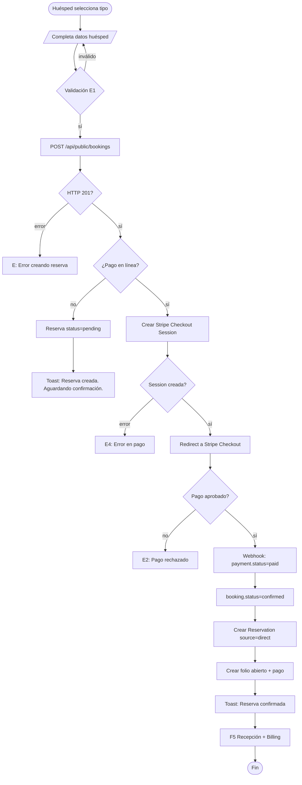
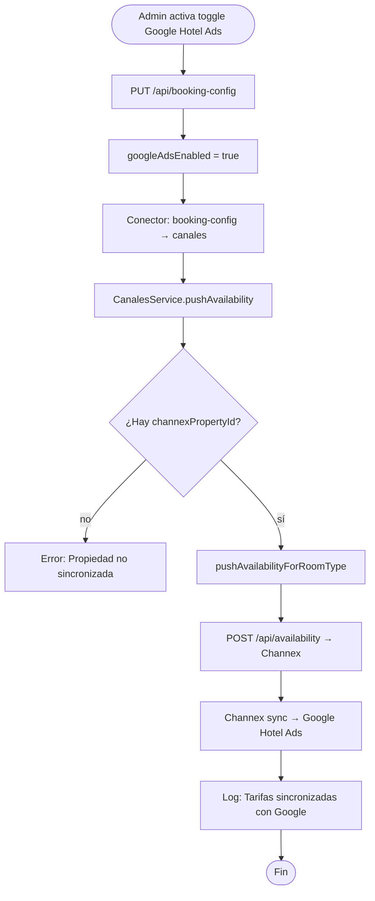

# TRD · M03 — Motor de Reservas & Google Hotel Ads

> **Technical Requirements Document** — Plan de implementación para cerrar los gaps del M03.
> Basado en: `FRD/M03-Motor-Reservas.md`, `modules.md`, `ARCHITECTURE.md`

**Fecha creación:** 2026-06-23
**Estado:** Plan aprobado, pendiente de implementación
**Estimación total:** 3-4 semanas (1 dev full-time)

---

## 1. Resumen Ejecutivo

El M03 tiene 16 gaps documentados (G1-G16). Los 4 BLOCKERs son:
- G1: No existe motor público de reservas
- G2: No existe endpoint de availability
- G3: Google Hotel Ads = solo checkbox
- G4: Pago en línea = solo checkbox
- G15: No hay módulo availability ni rates en backend

**Objetivo:** Motor de reservas directo funcional con pago en línea, comparable a Booking.com/Expedia.

---

## 2. Tabla de Decisiones Técnicas

### 2.1 Arquitectura del Motor Público

| Decisión | Opción A | Opción B | Opción C | **Recomendada** | Justificación |
|----------|----------|----------|----------|-----------------|---------------|
| **Framework motor público** | SPA Vue misma que admin | HTML + Tailwind standalone (sin framework) | Micro-frontend embebible | **B (standalone)** | Widgets embebidos en sitios WordPress/React del hotel. Sin dependencia de Vue runtime. |
| **Endpoint availability** | Nuevo módulo `availability` | Extender módulo `reservas` con query pública | Endpoint suelto en composition-root | **A (nuevo módulo)** | Separación de concerns. El módulo reservas es para admin, no para público. |
| **Persistencia de config widget** | Tabla `configuration` (KV existente) | Nueva tabla `booking_engine_config` | Config en JSON dentro de `hotels` | **A (configuration)** | Ya existe, multi-tenant, funciona. No crear tablas nuevas sin razón. |
| **Pago en línea** | Stripe Checkout Session (redirect) | Stripe Elements (embed) | Mercado Pago preference | **A (Stripe Checkout)** | Más simple, PCI-DSS compliant por defecto, sin PAN en backend. MVP first. |
| **Google Hotel Ads** | Google Hotel Ads API directa | Via Channex (ya integrado) | Feed XML manual | **B (via Channex)** | Ya tienes Channex conectado. Channex soporta Google Hotel Ads como canal. No duplicar integración. |
| **Comparación de tarifas** | Scraping de OTAs | Datos de Channex API | Hardcodeado por admin | **B (Channex API)** | Channex ya tiene acceso a tarifas de canales conectados. Usar esos datos. |
| **Analytics de conversiones** | Google Analytics 4 (gtag) | Events propios en DB | Mixpanel/Amplitude | **A (GA4) + B (DB)** | GA4 para métricas de marketing, DB para métricas de producto. Complementarios. |
| **ID de widget** | UUID del hotel | Slug del nombre | Hash del dominio | **B (slug)** | SEO friendly, legible, bookmarks. |

### 2.2 Stack Técnico del Widget

| Componente | Tecnología | Versión | Propósito |
|------------|-----------|---------|-----------|
| Widget embebido | Vanilla JS + Tailwind CDN | — | Sin framework runtime, lightweight |
| Checkout | Stripe Checkout (redirect) | v2024-12 | Hosted checkout page, PCI compliant |
| Availability API | arckode-framework module | — | Endpoint público SIN auth |
| Config | tabla `configuration` | — | KV store existente |
| Analytics | GA4 gtag.js | — | Events de conversión |

### 2.3 Decisiones de Negocio

| Decisión | Opción A | Opción B | **Recomendada** | Justificación |
|----------|----------|----------|-----------------|---------------|
| **Precio mostrado** | Solo precio directo | Directo vs OTA (comparación) | **B (comparación)** | Ventaja competitiva del motor: "Reservá directo y ahorrá $X" |
| **Moneda** | Fija por hotel | Detección automática por IP | **A (fija)** | MVP. Detección de IP agrega complejidad innecesaria. |
| **Mínimo de noches** | Sin mínimo | Configurable por hotel | **B (configurable)** | Los hoteles necesitan mínimos en temporada alta. |
| **Cancelación** | Sin política | Flexible / No reembolsable / Mixta | **B (configurable)** | El hotel define su política. |
| **Upsells en checkout** | No mostrar | Mostrar paquetes del hotel | **B (mostrar)** | Revenue adicional. Los paquetes ya existen en M01. |
| **Confirmación** | Instantánea (pago = confirmado) | Requiere aprobación manual | **A (instantánea)** | UX moderna. El hotel puede cancelar si hay problema. |

---

## 3. Modelo de Datos (Backend)

### 3.1 Tabla `booking_config` — Configuración del widget

```typescript
// booking-config/model.ts
orm.define('BookingConfig', {
  table: 'booking_config', timestamps: true,
  fields: {
    id: { type: 'string', required: true },
    hotelId: { type: 'string', required: true, indexed: true },
    enabled: { type: 'boolean', default: true },
    theme: { type: 'string', default: 'navy' },        // navy|cyan|teal|light|dark
    position: { type: 'string', default: 'corner' },    // corner|center|inline|popup
    currency: { type: 'string', default: 'USD' },
    language: { type: 'string', default: 'es' },
    minNights: { type: 'number', default: 1 },
    maxNights: { type: 'number', default: 30 },
    cancellationPolicy: { type: 'string', default: 'flexible' }, // flexible|non_refundable|custom
    showComparison: { type: 'boolean', default: true },  // mostrar vs OTA
    googleAdsEnabled: { type: 'boolean', default: false },
    whatsappConfirmation: { type: 'boolean', default: false },
    instantConfirmation: { type: 'boolean', default: true },
    stripeAccountId: { type: 'string', default: '' },
    allowedCountries: { type: 'json', default: [] },
  },
})
```

### 3.2 Tabla `public_bookings` — Reservas del widget

```typescript
// El módulo reservas YA tiene tabla `reservations`. No crear nueva tabla.
// Campos nuevos en `reservations`:

// En reservations model, agregar:
paymentStatus: { type: 'string', default: 'pending' },  // pending|paid|refunded|failed
paymentRef: { type: 'string', default: '' },             // Stripe session ID
paymentMethod: { type: 'string', default: '' },          // stripe|paypal|cash
source: { type: 'string', default: 'direct' },           // direct|ota|whatsapp|phone
promoCode: { type: 'string', default: '' },
```

### 3.3 Tabla `availability_cache` — Stock diario precacheado

```typescript
orm.define('AvailabilityCache', {
  table: 'availability_cache', timestamps: true,
  fields: {
    id: { type: 'string', required: true },
    hotelId: { type: 'string', required: true, indexed: true },
    roomType: { type: 'string', required: true },
    date: { type: 'string', required: true },            // YYYY-MM-DD
    totalRooms: { type: 'number', default: 0 },
    occupied: { type: 'number', default: 0 },
    blocked: { type: 'number', default: 0 },
    available: { type: 'number', default: 0 },
    price: { type: 'number', default: 0 },
    currency: { type: 'string', default: 'USD' },
  },
})
```

### 3.4 Tabla `conversion_events` — Analytics

```typescript
orm.define('ConversionEvents', {
  table: 'conversion_events', timestamps: true,
  fields: {
    id: { type: 'string', required: true },
    hotelId: { type: 'string', required: true, indexed: true },
    sessionId: { type: 'string', required: true },       // UUID por visita
    event: { type: 'string', required: true },           // search|view_room|start_booking|payment|confirm|abandon
    roomType: { type: 'string' },
    amount: { type: 'number' },
    source: { type: 'string' },                          // direct|google|facebook|email
    utmSource: { type: 'string' },
    utmMedium: { type: 'string' },
    utmCampaign: { type: 'string' },
    device: { type: 'string' },                          // mobile|desktop|tablet
    country: { type: 'string' },
  },
})
```

---

## 4. Endpoints Backend (Nuevos)

### 4.1 Endpoints Públicos (sin auth)

| Método | Ruta | Función | Módulo |
|--------|------|---------|--------|
| GET | `/api/public/availability` | Stock + precios por fechas | booking-engine |
| GET | `/api/public/hotel/:slug` | Info del hotel para widget | booking-engine |
| POST | `/api/public/bookings` | Crear reserva pendiente de pago | booking-engine |
| POST | `/api/public/webhook/stripe` | Webhook de Stripe (pago confirmado) | booking-engine |
| POST | `/api/public/conversion` | Registrar evento de conversión | booking-engine |

### 4.2 Endpoints Admin (auth requerida)

| Método | Ruta | Función | Módulo |
|--------|------|---------|--------|
| GET | `/api/booking-config` | Obtener config del widget | booking-engine |
| PUT | `/api/booking-config` | Actualizar config del widget | booking-engine |
| GET | `/api/booking-analytics` | Métricas de conversión | booking-engine |
| POST | `/api/booking-config/test` | Preview del widget | booking-engine |

---

## 5. Flujos de Implementación

### 5.1 Flujo — Búsqueda de Disponibilidad

```mermaid
flowchart TD
    A([Huésped abre widget]) --> B[/Selecciona fechas + ocupación/]
    B --> C{Fechas válidas?}
    C -- no --> X1[F3: Fechas inválidas]
    C -- sí --> D[GET /api/public/availability]
    D --> E{HTTP 200?}
    E -- error --> X2[E6: Sin conexión]
    E -- sí --> F{¿Hay stock?}
    F -- no --> X3[E2: Sin disponibilidad]
    F -- sí --> G[Muestra tipos + precios]
    G --> H{showComparison?}
    H -- sí --> I[fetch /api/channels → precios OTA]
    H -- no --> J[Muestra solo precio directo]
    I --> K[Muestra badge: "Ahorrás $X vs OTA"]
    J --> L([Huésped selecciona tipo])
    K --> L
```

### 5.2 Flujo — Crear Reserva + Pago



### 5.3 Flujo — Sync Google Hotel Ads (via Channex)



---

## 6. Fases de Implementación

### FASE 1 — Foundation (Semana 1)
**Objetivo:** Backend funcional con availability real

| # | Tarea | Archivos | Dependencia |
|---|-------|----------|-------------|
| 1.1 | Crear módulo `booking-engine` con `make:module` | `backend/src/modules/booking-engine/` | — |
| 1.2 | Modelo `BookingConfig` + migración | `model.ts` | — |
| 1.3 | Modelo `AvailabilityCache` + migración | `model.ts` | — |
| 1.4 | Modelo `ConversionEvents` + migración | `model.ts` | — |
| 1.5 | Endpoint `GET /api/public/availability` | `controller.ts` | 1.2, 1.3 |
| 1.6 | Endpoint `GET /api/public/hotel/:slug` | `controller.ts` | 1.2 |
| 1.7 | Lógica de cálculo de availability (reusar `usecases/availability.ts` de canales) | `usecases/availability.ts` | 1.3 |
| 1.8 | Conector `booking-config → canales` (push availability al cambiar config) | `src/connectors/` | 1.2 |
| 1.9 | Tests unitarios de availability | `tests/` | 1.7 |

**Gate:** `arckode analyze` 0 violaciones + tests pasan.

### FASE 2 — Widget Público (Semana 2)
**Objetivo:** Widget funcional con búsqueda + selección

| # | Tarea | Archivos | Dependencia |
|---|-------|----------|-------------|
| 2.1 | Widget standalone (HTML + Tailwind CDN + Vanilla JS) | `frontend/public/widget/` | FASE 1 |
| 2.2 | Componente buscador (fechas, ocupación, código promo) | `widget/booking.js` | 2.1 |
| 2.3 | Componente resultados (tipos, precios, comparativa OTA) | `widget/results.js` | 2.2 |
| 2.4 | Conectar widget con `/api/public/availability` | `widget/api.js` | 2.3, FASE 1 |
| 2.5 | Responsive mobile-first (375px → 1280px) | `widget/styles.css` | 2.1 |
| 2.6 | Embed script `loader.js` para sitios externos | `frontend/public/widget/loader.js` | 2.1 |
| 2.7 | Preview del widget en admin (`/panel/booking-engine`) | `booking-engine/index.vue` | 2.1 |

**Gate:** Widget funciona en navegador independiente + mobile responsive.

### FASE 3 — Checkout + Pago (Semana 3)
**Objetivo:** Pago en línea funcional con Stripe

| # | Tarea | Archivos | Dependencia |
|---|-------|----------|-------------|
| 3.1 | Endpoint `POST /api/public/bookings` (crear reserva pending) | `controller.ts` | FASE 1 |
| 3.2 | Integración Stripe Checkout Session | `usecases/stripe.ts` | 3.1 |
| 3.3 | Endpoint webhook `POST /api/public/webhook/stripe` | `controller.ts` | 3.2 |
| 3.4 | Lógica post-pago: booking→confirmed, crear Reservation, crear folio | `usecases/booking-flow.ts` | 3.3 |
| 3.5 | Notificación F5 a recepción + billing | `sockets.ts` | 3.4 |
| 3.6 | Validaciones de negocio (overbooking, precio cambiado, adultos>capacidad) | `validators/` | 3.1 |
| 3.7 | Tests de flujo completo | `tests/` | 3.4 |

**Gate:** Reserva completa con pago real en modo sandbox de Stripe.

### FASE 4 — Admin + Config (Semana 3-4)
**Objetivo:** Panel admin funcional con persistencia

| # | Tarea | Archivos | Dependencia |
|---|-------|----------|-------------|
| 4.1 | Endpoint `GET/PUT /api/booking-config` | `controller.ts` | FASE 1 |
| 4.2 | Persistir config del widget en `configuration` | `booking-engine/index.vue` | 4.1 |
| 4.3 | Botón "Ver Widget" → abre preview real | `booking-engine/index.vue` | FASE 2 |
| 4.4 | Badge "Activo/Inactivo" lee estado real | `booking-engine/index.vue` | 4.1 |
| 4.5 | Embed code con dominio real del hotel | `booking-engine/index.vue` | 4.1 |
| 4.6 | Botón "Guardar config" con toast success | `booking-engine/index.vue` | 4.2 |
| 4.7 | `onMounted` con F4 alert en error | `booking-engine/index.vue` | — |

**Gate:** Config se persiste, botones funcionan, sin errores en consola.

### FASE 5 — Analytics + Google (Semana 4)
**Objetivo:** Tracking de conversiones + Google Hotel Ads

| # | Tarea | Archivos | Dependencia |
|---|-------|----------|-------------|
| 5.1 | Endpoint `POST /api/public/conversion` | `controller.ts` | FASE 1 |
| 5.2 | Tracker de eventos en widget (search, view, book, pay) | `widget/tracker.js` | FASE 2 |
| 5.3 | Integrate GA4 gtag.js en widget | `widget/ga4.js` | 5.2 |
| 5.4 | Dashboard de analytics en admin (`/panel/booking-engine`) | `booking-engine/index.vue` | 5.1 |
| 5.5 | Conectar toggle Google Hotel Ads con Channex push | `connectors/` | FASE 1, FASE 4 |
| 5.6 | Endpoint `GET /api/booking-analytics` | `controller.ts` | 5.1 |
| 5.7 | Comparación de tarifas (directo vs OTA) en resultados | `widget/results.js` | FASE 2 |

**Gate:** Eventos se registran, analytics muestra datos, Google sync funciona.

---

## 7. Matriz de Prioridades (MoSCoW)

| Gap | Feature | Prioridad | Fase | Dependencias |
|-----|---------|-----------|------|--------------|
| G1 | Motor público de reservas | **Must** | 2 | FASE 1 |
| G2 | Endpoint availability | **Must** | 1 | — |
| G15 | Módulo availability + rates | **Must** | 1 | — |
| G4 | Pago en línea (Stripe) | **Must** | 3 | FASE 1, 2 |
| G5 | Persistir config widget | **Must** | 4 | FASE 1 |
| G14 | Optimización móvil | **Must** | 2 | — |
| G6 | Comparación de tarifas | **Should** | 5 | FASE 2 |
| G3 | Google Hotel Ads (via Channex) | **Should** | 5 | FASE 1, 4 |
| G7 | Seguimiento conversiones | **Should** | 5 | FASE 2 |
| G10 | Badge estado real | **Could** | 4 | FASE 1 |
| G11 | Embed code real | **Could** | 4 | FASE 2 |
| G8 | Botón "Ver Widget" | **Could** | 4 | FASE 2 |
| G12 | Error handling onMounted | **Could** | 4 | — |
| G13 | Unificar price/precio | **Could** | 4 | — |
| G9 | Botón "Personalizar" | **Won't** | — | Low value |
| G16 | OperationsService extend | **Won't** | — | Low value |

---

## 8. Dependencias Externas

| Servicio | Requisito | Costo | Alternativa si no existe |
|----------|-----------|-------|--------------------------|
| **Stripe** | Account + API keys | 2.9% + $0.30 por transacción | Mercado Pago, PayPal, solo "pending" manual |
| **Channex** | Ya conectado (staging) | Incluido | Google Hotel Ads API directa (más trabajo) |
| **Google Hotel Ads** | Merchant Center account | Gratis ( CPC model) | Solo mostrar precio directo sin "vs Google" |
| **GA4** | Google Analytics account | Gratis | Events propios en DB |

---

## 9. Riesgos y Mitigaciones

| Riesgo | Impacto | Mitigación |
|--------|---------|------------|
| Stripe no aprobado en sandbox | Bloquea FASE 3 | Usar modo test, aprobar antes de empezar FASE 3 |
| Channex no tiene Google Hotel Ads habilitado | Bloquea G3 | Verificar con Channex soporte antes de FASE 5 |
| Widget embebido no funciona en WordPress | Mala UX | Testear con popular WP themes antes de release |
| Race condition en availability (2 usuarios reservan misma habitación) | Overbooking | Lock optimista en POST /api/public/bookings + validación final |
| Config del widget se corrompe | Widget roto | Schema validation en PUT + backup en migration |

---

## 10. Criterios de Aceptación (Definition of Done)

### Para cada fase:
- [ ] `arckode analyze` = 0 violaciones
- [ ] `bun run typecheck` = 0 errores
- [ ] Tests unitarios pasan
- [ ] Endpoint funciona con curl/Postman
- [ ] Frontend funciona en Chrome + Safari + Mobile

### Para release completo:
- [ ] Widget público busca disponibilidad real
- [ ] Widget muestra precio + comparativa OTA
- [ ] Widget funciona en mobile (375px minimum)
- [ ] Pago Stripe funciona en sandbox
- [ ] Webhook confirma reserva automáticamente
- [ ] Config del widget se persiste y recupera
- [ ] Google Hotel Ads sync vía Channex
- [ ] Analytics registra eventos de conversión
- [ ] Admin puede ver métricas de conversión
- [ ] Sin errores en consola del navegador
- [ ] `arckode analyze` = 0 violaciones

---

*Plan generado el 2026-06-23. Actualizar cuando cada fase esté completa.*
