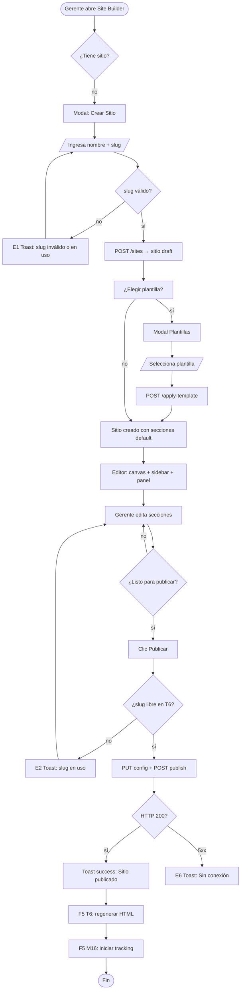
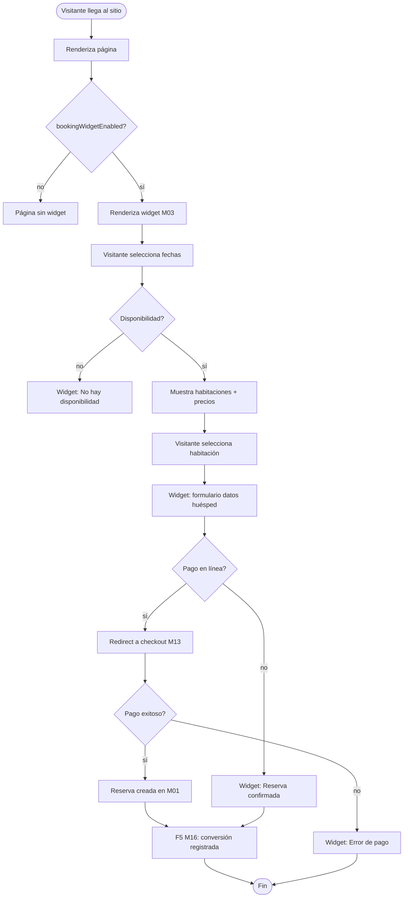
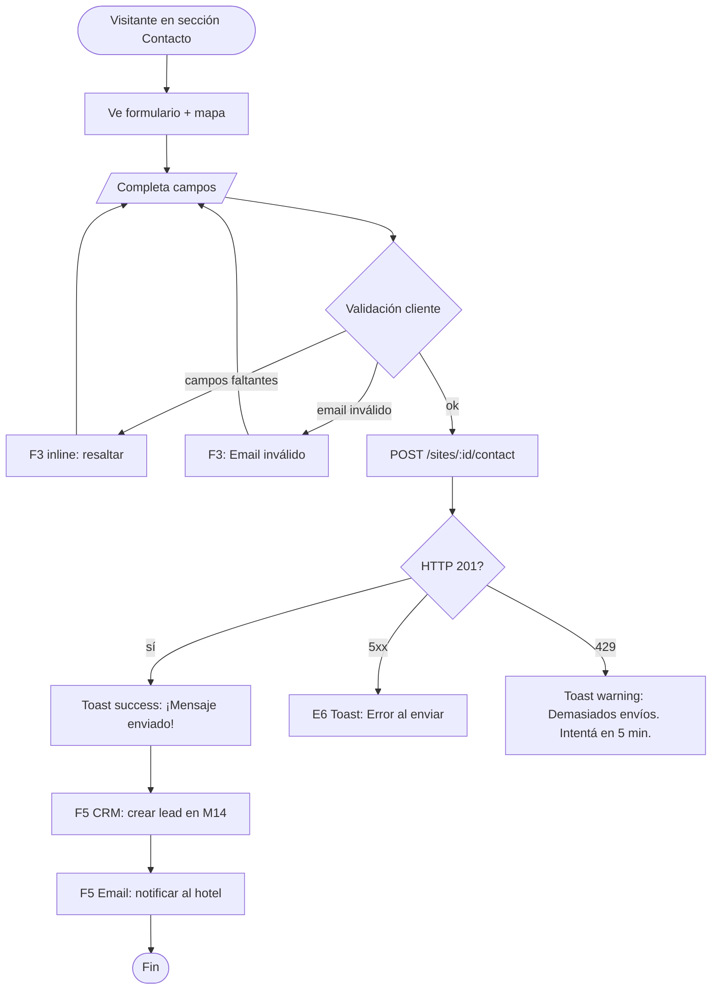

# FRD · M04 — Creador de Sitio Web

> **Módulo NO implementado.** No existe código en backend ni frontend para este módulo. Todo lo documentado acá es **target de producto** según `modules.md` y la integración esperada con T6 Landing, M03 Motor de Reservas y M16 BI.
>
> Todo lo marcado `[PENDIENTE]` es el comportamiento target y **no debe asumirse implementado**.

**Módulo:** M04 — Creador de Sitio Web
**Pantallas cubiertas (target):** Editor drag-and-drop · Gestión de plantillas · Configuración de dominio · Preview en vivo · Publicación
**Servicios frontend (target):** `SiteBuilder.service.ts` · `SiteTemplate.service.ts` · `SiteAnalytics.service.ts`
**Servicios backend (target):** módulo `sitios` · módulo `paginas` · módulo `secciones` · módulo `plantillas` · módulo `temas`
**Dependencias cross-module:** T6 Landing (renderizado público) · M03 Motor de Reservas (widget de booking embebido) · M16 BI (analytics del sitio) · M14 CRM (formularios de contacto) · hoteles (datos del hotel)

---

## 1. Propósito

M04 permite a los gerentes de hotel **crear y gestionar el sitio web público de su hotel** sin conocimientos técnicos. El módulo ofrece un editor visual (drag-and-drop o basado en plantillas) que genera páginas públicas (home, habitaciones, servicios, contacto, etc.) con un widget de reservas de M03 embebido. El sitio resultante se sirve vía T6 Landing y se analiza vía M16 BI.

**Flujo de alto nivel:**
```
Gerente diseña sitio en M04 → Publica → T6 sirve HTML público → Huésped visita → Widget M03 permite reservar → M16 trackea analytics
```

---

## 2. Modelo de datos (target)

### 2.1 Sitios (`sites`)

| Campo | Tipo | Default | Descripción |
|-------|------|---------|-------------|
| `id` | string (req) | — | UUID |
| `hotelId` | string (req, indexed) | — | FK → Hotels |
| `name` | string (req) | — | Nombre del sitio (ej: "Hotel Caribe Oficial") |
| `slug` | string (req, unique per hotel) | — | Subdominio/ruta (ej: "hotel-caribe") |
| `domain` | string | `null` | Dominio personalizado (ej: "www.hotelcaribe.com") |
| `status` | enum | `"draft"` | `draft` · `published` · `archived` |
| `templateId` | string | `null` | FK → Templates (plantilla base) |
| `themeId` | string | `null` | FK → Themes (colores/fuentes) |
| `logoUrl` | string | `null` | URL del logo del hotel |
| `faviconUrl` | string | `null` | URL del favicon |
| `metaTitle` | string | `null` | SEO title |
| `metaDescription` | text | `null` | SEO description |
| `ogImage` | string | `null` | Open Graph image URL |
| `primaryColor` | string | `"#0D4F8B"` | Color primario del sitio |
| `secondaryColor` | string | `"#00BFA5"` | Color secundario |
| `fontFamily` | string | `"Inter"` | Fuente principal |
| `bookingWidgetEnabled` | number | `1` | Mostrar widget de M03 |
| `bookingWidgetPosition` | string | `"corner"` | Posición del widget: `corner` · `inline` · `popup` |
| `analyticsEnabled` | number | `1` | Habilitar tracking M16 |
| `gaTrackingId` | string | `null` | Google Analytics ID (opcional) |
| `publishedAt` | string | `null` | Timestamp de última publicación |
| `createdAt` / `updatedAt` | string (timestamps) | auto | — |

### 2.2 Páginas (`site_pages`)

| Campo | Tipo | Default | Descripción |
|-------|------|---------|-------------|
| `id` | string (req) | — | UUID |
| `siteId` | string (req, indexed) | — | FK → Sites |
| `title` | string (req) | — | Título de la página (ej: "Nuestro Hotel") |
| `slug` | string (req) | — | Ruta (ej: "nosotros", "habitaciones", "contacto") |
| `isHome` | number | `0` | Es la página principal |
| `isPublished` | number | `1` | Visible en el sitio público |
| `sortOrder` | number | `0` | Orden en el nav |
| `metaTitle` | string | `null` | SEO override |
| `metaDescription` | text | `null` | SEO override |
| `createdAt` / `updatedAt` | string (timestamps) | auto | — |

### 2.3 Secciones (`site_sections`)

Cada página tiene múltiples secciones (bloques) ordenadas verticalmente.

| Campo | Tipo | Default | Descripción |
|-------|------|---------|-------------|
| `id` | string (req) | — | UUID |
| `pageId` | string (req, indexed) | — | FK → SitePages |
| `type` | enum (req) | — | Tipo de bloque: `hero` · `gallery` · `rooms` · `amenities` · `services` · `testimonials` · `contact` · `map` · `booking` · `text` · `gallery` · `video` · `cta` · `faq` · `social` |
| `title` | string | `null` | Título de la sección |
| `subtitle` | text | `null` | Subtítulo |
| `content` | json | `{}` | Contenido flexible por tipo (texto, imágenes, configuración) |
| `sortOrder` | number | `0` | Orden vertical dentro de la página |
| `isVisible` | number | `1` | Sección visible |
| `createdAt` / `updatedAt` | string (timestamps) | auto | — |

**Estructura de `content` por tipo de sección:**

| Tipo | Campos en `content` |
|------|---------------------|
| `hero` | `headline`, `subheadline`, `backgroundImage`, `ctaText`, `ctaLink` |
| `gallery` | `images: [{url, alt, caption}]`, `layout: 'grid' \| 'carousel' \| 'masonry'` |
| `rooms` | `source: 'auto' \| 'manual'`, `roomTypeIds: []`, `showPrice: bool`, `showAmenities: bool` |
| `amenities` | `items: [{icon, name, description}]`, `layout: 'grid' \| 'list'` |
| `services` | `items: [{icon, name, description, price, imageUrl}]` |
| `testimonials` | `items: [{name, avatar, quote, rating, hotel}]` |
| `contact` | `fields: ['name','email','phone','message']`, `recipientEmail`, `googleMapsUrl`, `address`, `phone`, `email` |
| `map` | `latitude`, `longitude`, `zoom`, `markerLabel` |
| `booking` | `widgetSize: 'full' \| 'compact'`, `showAvailability: bool` |
| `text` | `body` (HTML rich text), `alignment` |
| `video` | `videoUrl`, `thumbnailUrl`, `autoplay: bool` |
| `cta` | `headline`, `subheadline`, `buttonText`, `buttonLink`, `backgroundImage` |
| `faq` | `items: [{question, answer}]` |
| `social` | `platforms: [{name, url, icon}]` |

### 2.4 Plantillas (`site_templates`)

| Campo | Tipo | Default | Descripción |
|-------|------|---------|-------------|
| `id` | string (req) | — | UUID |
| `name` | string (req) | — | Nombre (ej: "Moderno", "Clásico", "Boutique") |
| `description` | text | — | Descripción |
| `thumbnail` | string | — | URL de preview |
| `category` | enum | — | `modern` · `classic` · `boutique` · `resort` · `budget` |
| `sections` | json | — | Array de secciones predefinidas (tipos + contenido default) |
| `isPremium` | number | `0` | Requiere plan Professional/Enterprise |
| `active` | number | `1` | — |
| `createdAt` / `updatedAt` | string (timestamps) | auto | — |

### 2.5 Temas (`site_themes`)

| Campo | Tipo | Default | Descripción |
|-------|------|---------|-------------|
| `id` | string (req) | — | UUID |
| `name` | string (req) | — | Nombre (ej: "Ocean Blue", "Forest Green", "Sunset") |
| `primaryColor` | string (req) | — | Hex |
| `secondaryColor` | string (req) | — | Hex |
| `accentColor` | string (req) | — | Hex |
| `bgColor` | string | `"#FFFFFF"` | — |
| `textColor` | string | `"#1A1A2E"` | — |
| `fontHeading` | string | `"Playfair Display"` | — |
| `fontBody` | string | `"Inter"` | — |
| `isPremium` | number | `0` | — |
| `active` | number | `1` | — |
| `createdAt` / `updatedAt` | string (timestamps) | auto | — |

### 2.6 Media (`site_media`)

| Campo | Tipo | Default | Descripción |
|-------|------|---------|-------------|
| `id` | string (req) | — | UUID |
| `siteId` | string (req, indexed) | — | FK → Sites |
| `filename` | string (req) | — | Nombre original |
| `url` | string (req) | — | URL pública (S3/R2) |
| `mimeType` | string | — | image/jpeg, image/png, video/mp4 |
| `size` | number | — | Bytes |
| `alt` | string | `""` | Texto alternativo |
| `createdAt` | string (timestamps) | auto | — |

### 2.7 Formularios de contacto (`site_contact_submissions`)

| Campo | Tipo | Default | Descripción |
|-------|------|---------|-------------|
| `id` | string (req) | — | UUID |
| `siteId` | string (req, indexed) | — | FK → Sites |
| `name` | string (req) | — | Nombre del visitante |
| `email` | string (req) | — | Email del visitante |
| `phone` | string | `null` | Teléfono |
| `message` | text (req) | — | Mensaje |
| `status` | enum | `"new"` | `new` · `read` · `archived` |
| `createdAt` | string (timestamps) | auto | — |

### 2.8 Analytics del sitio (`site_analytics`)

| Campo | Tipo | Default | Descripción |
|-------|------|---------|-------------|
| `id` | string (req) | — | UUID |
| `siteId` | string (req, indexed) | — | FK → Sites |
| `date` | string (req) | — | YYYY-MM-DD |
| `pageViews` | number | `0` | Visitas a páginas |
| `uniqueVisitors` | number | `0` | Visitantes únicos |
| `bounceRate` | number | `0` | % |
| `avgTimeOnSite` | number | `0` | Segundos |
| `bookingClicks` | number | `0` | Clicks en widget M03 |
| `bookingConversions` | number | `0` | Reservas completadas |
| `topPages` | json | `[]` | `[{path, views}]` |
| `referrerSources` | json | `[]` | `[{source, count}]` |
| `createdAt` | string (timestamps) | auto | — |

---

## 3. API Endpoints (target)

### 3.1 CRUD de Sitios

| Método | Ruta | Auth | Descripción |
|--------|------|------|-------------|
| `GET` | `/api/sites` | hotel_admin, super_admin | Listar sitios del hotel |
| `GET` | `/api/sites/:id` | hotel_admin | Obtener sitio con páginas y secciones |
| `POST` | `/api/sites` | hotel_admin | Crear sitio nuevo |
| `PUT` | `/api/sites/:id` | hotel_admin | Actualizar config del sitio |
| `DELETE` | `/api/sites/:id` | hotel_admin | Archivar sitio (soft delete) |
| `POST` | `/api/sites/:id/publish` | hotel_admin | Publicar sitio (genera HTML estático) |
| `POST` | `/api/sites/:id/unpublish` | hotel_admin | Quitar sitio de producción |
| `GET` | `/api/sites/:id/preview` | hotel_admin | Preview del sitio sin publicar |
| `GET` | `/api/sites/:id/seo-report` | hotel_admin | Auditoría SEO del sitio |

### 3.2 CRUD de Páginas

| Método | Ruta | Auth | Descripción |
|--------|------|------|-------------|
| `GET` | `/api/sites/:siteId/pages` | hotel_admin | Listar páginas del sitio |
| `GET` | `/api/sites/:siteId/pages/:pageId` | hotel_admin | Obtener página con secciones |
| `POST` | `/api/sites/:siteId/pages` | hotel_admin | Crear página |
| `PUT` | `/api/sites/:siteId/pages/:pageId` | hotel_admin | Actualizar página |
| `DELETE` | `/api/sites/:siteId/pages/:pageId` | hotel_admin | Eliminar página |
| `PUT` | `/api/sites/:siteId/pages/reorder` | hotel_admin | Reordenar páginas |

### 3.3 CRUD de Secciones

| Método | Ruta | Auth | Descripción |
|--------|------|------|-------------|
| `GET` | `/api/sites/:siteId/pages/:pageId/sections` | hotel_admin | Listar secciones |
| `POST` | `/api/sites/:siteId/pages/:pageId/sections` | hotel_admin | Agregar sección |
| `PUT` | `/api/sites/:siteId/sections/:sectionId` | hotel_admin | Actualizar sección (contenido, visibilidad) |
| `DELETE` | `/api/sites/:siteId/sections/:sectionId` | hotel_admin | Eliminar sección |
| `PUT` | `/api/sites/:siteId/pages/:pageId/sections/reorder` | hotel_admin | Reordenar secciones (drag-and-drop) |
| `POST` | `/api/sites/:siteId/sections/:sectionId/duplicate` | hotel_admin | Duplicar sección |

### 3.4 Plantillas y Temas

| Método | Ruta | Auth | Descripción |
|--------|------|------|-------------|
| `GET` | `/api/site-templates` | hotel_admin | Listar plantillas disponibles |
| `POST` | `/api/sites/:id/apply-template` | hotel_admin | Aplicar plantilla al sitio |
| `GET` | `/api/site-themes` | hotel_admin | Listar temas disponibles |
| `POST` | `/api/sites/:id/apply-theme` | hotel_admin | Aplicar tema al sitio |

### 3.5 Media

| Método | Ruta | Auth | Descripción |
|--------|------|------|-------------|
| `POST` | `/api/sites/:siteId/media` | hotel_admin | Subir imagen/video |
| `GET` | `/api/sites/:siteId/media` | hotel_admin | Listar media del sitio |
| `DELETE` | `/api/sites/:siteId/media/:mediaId` | hotel_admin | Eliminar media |

### 3.6 Formularios de contacto

| Método | Ruta | Auth | Descripción |
|--------|------|------|-------------|
| `POST` | `/api/sites/:siteId/contact` | **público** | Enviar formulario de contacto |
| `GET` | `/api/sites/:siteId/contact` | hotel_admin | Listar envíos |
| `PUT` | `/api/sites/:siteId/contact/:submissionId` | hotel_admin | Marcar como leído/archivado |

### 3.7 Analytics

| Método | Ruta | Auth | Descripción |
|--------|------|------|-------------|
| `GET` | `/api/sites/:siteId/analytics` | hotel_admin | Resumen de analytics (7d/30d/90d) |
| `GET` | `/api/sites/:siteId/analytics/daily` | hotel_admin | Datos diarios para gráfico |
| `POST` | `/api/sites/:siteId/analytics/track` | **público** | Registrar pageview/click (pixel) |

### 3.8 Renderizado público (T6)

| Método | Ruta | Auth | Descripción |
|--------|------|------|-------------|
| `GET` | `/site/:slug` | **público** | Renderizar página home del sitio |
| `GET` | `/site/:slug/:pageSlug` | **público** | Renderizar página específica |

> **Nota:** Las rutas públicas son servidas por T6 Landing (SSR o estático). M04 genera el contenido; T6 lo renderiza.

---

## 4. Pantalla — Editor del Sitio (`/panel/site-builder`) — [PENDIENTE]

### 4.1 Estructura de la pantalla

Layout de 3 paneles:

| Panel | Posición | Contenido |
|-------|----------|-----------|
| **Sidebar izquierdo** | 280px fijo | Lista de páginas + botón "Nueva Página" + configuración del sitio |
| **Canvas central** | Flex | Preview en vivo del sitio con secciones editables (click para editar) |
| **Panel derecho** | 320px fijo | Editor de la sección seleccionada (tipo, contenido, estilo) |

**Toolbar superior:**
- Nombre del sitio (editable inline)
- Badge de estado: `Borrador` / `Publicado`
- Botones: "Preview" (abre en nueva tab) · "Guardar" · "Publicar" (verde)
- Toggle: "Desktop / Tablet / Mobile" (cambia viewport del canvas)

### 4.2 Decision Table — Editor

| Trigger | Condición | Resultado | Modal/Toast (texto) | Errores |
|---------|-----------|-----------|---------------------|---------|
| Carga de página (`onMounted`) | — | `SiteBuilderService.getById(route.params.id)` → carga sitio + páginas + secciones | — | E6 "Sin conexión" |
| Clic en **page** en sidebar | — | Canvas muestra esa página | — | — |
| Clic en **"+ Nueva Página"** | — | Abre modal: título + slug (auto-gen) | Modal `form`: "Nueva Página" | E1 "El slug ya existe" |
| Clic en sección en canvas | — | Panel derecho muestra editor de esa sección | — | — |
| Cambios en panel derecho | — | Actualiza sección en memoria (dirty state) | — | — |
| Clic en **"+ Sección"** | — | Abre palette de tipos de sección (hero, gallery, rooms, etc.) | Panel: "Agregar Sección" | — |
| Drag & drop sección | — | Reordena `sortOrder` en memoria | — | — |
| Clic **"Guardar"** | dirty | `PUT` todas las secciones modificadas | **Toast success:** "Sitio guardado." | E6 "Sin conexión" · E5 "Conflicto: otro editó" |
| Clic **"Publicar"** | dirty | Guarda + `POST /publish` | **Toast success:** "Sitio publicado en {slug}.managerhotel.com" | E2 "El slug ya está en uso" · E6 |
| Clic **"Preview"** | — | Abre `/site/{slug}` en nueva tab | — | — |
| Toggle viewport (desktop/tablet/mobile) | — | Cambia ancho del canvas | — | — |
| Clic en **"Configuración del Sitio"** (⚙) | — | Abre modal: nombre, dominio, SEO, logo, colores, widget booking | Modal `form`: "Configuración del Sitio" | — |
| **"Guardar Configuración"** | modal abierto | `PUT /sites/:id` | **Toast success:** "Configuración actualizada." | E1 "El dominio ya está en uso" |
| Clic en página → **"Eliminar"** | — | Modal danger | **Modal danger:** "¿Eliminar página {title}? Esta acción no se puede deshacer." | — |
| Confirmar eliminar página | — | `DELETE /pages/:pageId` | **Toast success:** "Página eliminada." | E6 |

### 4.3 Decision Table — Secciones por tipo

| Tipo de sección | Campos editables en panel derecho | Validaciones | Notas |
|-----------------|-----------------------------------|-------------|-------|
| `hero` | headline, subheadline, backgroundImage (upload), ctaText, ctaLink | headline requerido | Imagen de fondo con overlay automático |
| `gallery` | images (upload múltiple), layout (grid/carousel/masonry) | al menos 1 imagen | Drag para reordenar |
| `rooms` | source (auto/manual), roomTypeIds, showPrice, showAmenities | — | `auto` trae de M01 habitaciones |
| `amenities` | items (icon + name + description), layout | al menos 1 item | Icons: library predefinida |
| `services` | items (icon + name + description + price + imageUrl) | — | Opcional: precios |
| `testimonials` | items (name + avatar + quote + rating) | — | Máx 6 |
| `contact` | fields, recipientEmail, address, phone, email, googleMapsUrl | recipientEmail requerido | Form envía a M14 CRM |
| `map` | latitude, longitude, zoom, markerLabel | lat/lng requeridos | Google Maps embed |
| `booking` | widgetSize, showAvailability | — | Embebe widget M03 |
| `text` | body (rich text editor), alignment | — | HTML sanitizado |
| `video` | videoUrl (YouTube/Vimeo), thumbnailUrl, autoplay | URL válida | Embed iframe |
| `cta` | headline, subheadline, buttonText, buttonLink, backgroundImage | headline + buttonRequerido | — |
| `faq` | items (question + answer) | al menos 1 item | Acordeón |
| `social` | platforms (name + url + icon) | — | Links a redes |

### 4.4 Palette de secciones (al clickear "+ Sección")

| Sección | Icono | Descripción |
|---------|-------|-------------|
| Hero | 🖼 | Banner principal con título, subtítulo, CTA e imagen de fondo |
| Galería de Fotos | 📸 | Grid, carrusel o masonry de imágenes |
| Habitaciones | 🛏 | Lista automática o manual de habitaciones (conecta M01) |
| Comodidades | ⭐ | Grid de amenidades del hotel |
| Servicios | 🧖 | Servicios con opción de precio |
| Testimonios | 💬 | Quotes de huéspedes |
| Formulario de Contacto | 📧 | Formulario que envía email + CRM |
| Mapa | 📍 | Google Maps con ubicación |
| Widget de Reservas | 🔗 | Embebe M03 Motor de Reservas |
| Texto / Rich Text | 📝 | Bloque de texto libre con editor |
| Video | 🎬 | Embed de YouTube/Vimeo |
| Call to Action | 🎯 | Banner con CTA y botón |
| Preguntas Frecuentes | ❓ | FAQ en acordeón |
| Redes Sociales | 📱 | Links a Instagram, Facebook, etc. |

---

## 5. Pantalla — Gestión de Plantillas (`/panel/site-builder/templates`) — [PENDIENTE]

Grid de plantillas disponibles con preview. Clic en "Usar" aplica al sitio.

### 5.1 Decision Table — Plantillas

| Trigger | Condición | Resultado | Modal/Toast | Errores |
|---------|-----------|-----------|-------------|---------|
| Carga de página | — | `GET /site-templates` | — | E6 |
| Filtro por categoría | — | Filtra grid | — | — |
| Clic en plantilla premium | plan = starter | **Modal upgrade:** "Esta plantilla requiere plan Professional o superior" | Modal `warning` | — |
| Clic en **"Usar Plantilla"** | plan compatible | `POST /sites/:id/apply-template` → reemplaza secciones | **Toast success:** "Plantilla '{name}' aplicada. Tus cambios no guardados se perderán." + confirm | — |
| Clic en **"Preview"** | — | Abre preview de la plantilla en nueva tab | — | — |

---

## 6. Pantalla — Gestión de Media (`/panel/site-builder/media`) — [PENDIENTE]

Galería de imágenes y videos subidos para el sitio.

### 6.1 Decision Table — Media

| Trigger | Condición | Resultado | Modal/Toast | Errores |
|---------|-----------|-----------|-------------|---------|
| Click en **"Subir"** | — | Abre file picker | — | — |
| Seleccionar archivo(s) | tipo no soportado | Rechaza | **Toast error:** "Formato no soportado. Usa JPG, PNG, GIF, MP4 o WebP." | E1 |
| Archivo > 10MB | — | Rechaza | **Toast error:** "El archivo supera 10MB." | E1 |
| Subida exitosa | — | `POST /media` → agrega a galería | **Toast success:** "Imagen subida." | E6 "Error al subir" |
| Clic en imagen | — | Abre modal: preview + campos (alt, caption) + botón "Usar en sección" + "Eliminar" | Modal `detail` | — |
| **"Eliminar"** media en uso | — | **Modal danger:** "Esta imagen está en uso en una sección. ¿Eliminar de todas formas?" | Modal `danger` | — |

---

## 7. Pantalla — Configuración del Sitio (modal) — [PENDIENTE]

Modal accesible desde el editor, con tabs:

### 7.1 Tab: General

| Campo | Tipo | Validación |
|-------|------|-----------|
| Nombre del sitio | text | requerido, máx 100 |
| Slug | text | requerido, regex `^[a-z0-9-]+$`, único por hotel |
| Logo | upload | imagen JPG/PNG, máx 2MB |
| Favicon | upload | imagen 32x32, máx 500KB |

### 7.2 Tab: Dominio

| Campo | Tipo | Descripción |
|-------|------|-------------|
| Dominio personalizado | text | ej: "www.hotelcaribe.com" |
| Estado DNS | badge | "Pendiente" / "Verificado" / "Error" |
| Instrucciones | texto | "Agrega un registro CNAME apuntando a sites.managerhotel.com" |
| Botón "Verificar DNS" | button | `POST /sites/:id/verify-domain` |

### 7.3 Tab: SEO

| Campo | Tipo | Default |
|-------|------|---------|
| Meta title | text | nombre del sitio |
| Meta description | textarea | — |
| OG Image | upload | — |
| Google Analytics ID | text | — |

### 7.4 Tab: Widget de Reservas

| Campo | Tipo | Default |
|-------|------|---------|
| Habilitar widget | toggle | `true` |
| Posición | select | `corner` / `inline` / `popup` |
| Texto del botón | text | "Reservar Ahora" |

### 7.5 Tab: Redes Sociales

| Campo | Tipo |
|-------|------|
| Instagram | text (URL) |
| Facebook | text (URL) |
| TripAdvisor | text (URL) |
| WhatsApp | text (número) |

---

## 8. Flow — Crear y Publicar Sitio



---

## 9. Flow — Widget de Reservas (M03 embebido)



---

## 10. Flow — Formulario de Contacto



---

## 11. Consecuencias cross-módulo (eventos que dispara M04)

| Acción en M04 | Módulo afectado | Efecto | Notificación F5 |
|---------------|-----------------|--------|-----------------|
| Sitio publicado | T6 Landing | Generar/regenerar HTML del sitio público | "Sitio {slug} publicado" |
| Widget habilitado | M03 Motor de Reservas | Embebe widget de reservas en el sitio | "Widget activo en {slug}" |
| Formulario enviado | M14 CRM | Crear lead/contacto del visitante | "Nuevo contacto desde {slug}" |
| Sección `rooms` con `source=auto` | M01 PMS | Lee habitaciones del hotel para mostrar en galería | — |
| Sitio publicado | M16 BI | Iniciar tracking de pageviews y conversiones | "Analytics activo en {slug}" |
| Media subida | Storage (S3/R2) | Almacenar archivo | — |
| Cambio de dominio | DNS | Verificar CNAME / SSL | — |

---

## 12. Reglas de negocio a validar en backend (E2)

1. **Slug único por hotel** → "Ya existe una página con ese slug en este sitio."
2. **Dominio único en plataforma** → "Ese dominio ya está en uso por otro hotel."
3. **Mínimo 1 página publicada** para publicar sitio → "El sitio debe tener al menos 1 página publicada."
4. **Página home no se puede eliminar** → "La página principal no se puede eliminar."
5. **Máximo 50 páginas por sitio** → "Has alcanzado el límite de 50 páginas."
6. **Máximo 10 secciones por página** → "Has alcanzado el límite de 10 secciones por página."
7. **Máximo 20 archivos de media por sitio (plan Starter)** → "Plan Starter: máximo 20 archivos. Upgrade a Professional para más."
8. **Tipos de sección válidos** → "Tipo de sección no válido."
9. **Nombre del sitio requerido** → "El nombre del sitio es obligatorio."
10. **Slug regex** → "El slug solo puede contener minúsculas, números y guiones."
11. **Contacto rate limit** → Máximo 5 envíos por IP por hora.
12. **HTML sanitizado** → Sección `text` no permite `<script>`, `<iframe>` (excepto video), ni `<style>` inline.

---

## 13. Gap analysis — Implementado vs Target

| # | Aspecto | Estado actual | Target | Ubicación |
|---|---------|--------------|--------|-----------|
| G1 | Backend módulo `sitios` | ❌ No existe | CRUD completo con ORM, controller, service, validators | `backend/src/modules/sitios/` |
| G2 | Backend módulo `paginas` | ❌ No existe | CRUD de páginas con ordenamiento | `backend/src/modules/paginas/` |
| G3 | Backend módulo `secciones` | ❌ No existe | CRUD de secciones con contenido JSON flexible | `backend/src/modules/secciones/` |
| G4 | Backend módulo `plantillas` | ❌ No existe | Tabla de plantillas + apply-template | `backend/src/modules/plantillas/` |
| G5 | Backend módulo `temas` | ❌ No existe | Tabla de temas + apply-theme | `backend/src/modules/temas/` |
| G6 | Backend módulo `media` | ❌ No exists | Upload a S3/R2 + CRUD | `backend/src/modules/media/` |
| G7 | Backend endpoint público `/site/:slug` | ❌ No existe | SSR o HTML estático servido por T6 | `T6 Landing` |
| G8 | Backend endpoint público `/contact` | ❌ No existe | Rate-limited, crea lead en CRM | `composition-root.ts` |
| G9 | Backend analytics endpoint | ❌ No existe | Tracking de pageviews, clicks, conversiones | `composition-root.ts` |
| G10 | Frontend page `site-builder/index.vue` | ❌ No existe | Editor drag-and-drop con 3 paneles | `frontend/src/pages/site-builder/` |
| G11 | Frontend page `site-builder/templates.vue` | ❌ No existe | Gallery de plantillas | `frontend/src/pages/site-builder/` |
| G12 | Frontend page `site-builder/media.vue` | ❌ No existe | Gestión de media | `frontend/src/pages/site-builder/` |
| G13 | Frontend service `SiteBuilder.service.ts` | ❌ No existe | API client para sitios/páginas/secciones | `frontend/src/services/` |
| G14 | Conector `sitios-landing` | ❌ No existe | Publicar sitio → regenerar HTML en T6 | `backend/src/connectors/` |
| G15 | Conector `sitios-analytics` | ❌ No existe | Tracking events → M16 BI | `backend/src/connectors/` |
| G16 | Conector `sitios-crm` | ❌ No existe | Formulario contacto → lead en M14 | `backend/src/connectors/` |
| G17 | Widget M03 embebido | ❌ No existe | Iframe/script del booking engine en el sitio público | Integración M03 → T6 |
| G18 | SEO meta tags | ❌ No existe | Generar `<title>`, `<meta>`, OG tags desde config del sitio | T6 render |
| G19 | Dominio personalizado + SSL | ❌ No exists | Verificación DNS + certificado SSL automático | Infra |
| G20 | Responsive preview | ❌ No existe | Toggle desktop/tablet/mobile en el editor | Frontend |

---

## 14. Dependencias de implementación

### 14.1 Backend — Orden sugerido

| Paso | Módulo | Dependencias |
|------|--------|-------------|
| 1 | `sitios` (CRUD base) | `hoteles` (FK) |
| 2 | `paginas` (CRUD) | `sitios` (FK) |
| 3 | `secciones` (CRUD con JSON content) | `paginas` (FK) |
| 4 | `plantillas` (CRUD + apply) | `sitios`, `paginas`, `secciones` |
| 5 | `temas` (CRUD + apply) | `sitios` |
| 6 | `media` (upload + CRUD) | `sitios` (FK) |
| 7 | Endpoint público `/site/:slug` | `sitios`, `paginas`, `secciones` |
| 8 | Endpoint `/contact` público | `sitios` + M14 CRM |
| 9 | Analytics tracking | `sitios` |
| 10 | Conectores | `sitios-landing`, `sitios-analytics`, `sitios-crm` |

### 14.2 Frontend — Orden sugerido

| Paso | Archivo | Dependencias |
|------|---------|-------------|
| 1 | `SiteBuilder.service.ts` | API client |
| 2 | `site-builder/index.vue` (editor) | service + 3 paneles |
| 3 | `site-builder/templates.vue` | service |
| 4 | `site-builder/media.vue` | service |
| 5 | Integración en `AdminLayout` (nav link) | router |

### 14.3 Integración cross-module

| Módulo | Tipo de integración | Prioridad |
|--------|---------------------|-----------|
| T6 Landing | M04 genera datos → T6 renderiza HTML público | **P0** |
| M03 Motor de Reservas | Widget de booking embebido en el sitio | **P0** |
| M16 BI | Analytics del sitio (pageviews, conversiones) | **P1** |
| M14 CRM | Formulario de contacto → lead | **P1** |
| M01 PMS | Sección `rooms` lee habitaciones del hotel | **P2** |
| M13 Cobros | Checkout de pago en línea desde widget | **P2** |

---

## 15. Checklist de verificación M04

### Backend
- [ ] Módulo `sitios` con CRUD completo (model, types, service, controller, validators, tests)
- [ ] Módulo `paginas` con CRUD completo
- [ ] Módulo `secciones` con CRUD + contenido JSON flexible
- [ ] Módulo `plantillas` con CRUD + apply-template
- [ ] Módulo `temas` con CRUD + apply-theme
- [ ] Módulo `media` con upload a S3/R2
- [ ] Endpoint público `GET /site/:slug` (sin auth)
- [ ] Endpoint público `POST /sites/:id/contact` (rate-limited)
- [ ] Endpoint `POST /sites/:id/publish`
- [ ] Endpoint analytics tracking
- [ ] Validaciones E2 (slug único, dominio único, límites, sanitización)
- [ ] Conectores: `sitios-landing`, `sitios-analytics`, `sitios-crm`
- [ ] `arckode analyze` = 0 violaciones

### Frontend
- [ ] `SiteBuilder.service.ts` con métodos para sitios/páginas/secciones/media
- [ ] `site-builder/index.vue` — editor 3 paneles (sidebar + canvas + panel derecho)
- [ ] Sidebar: lista de páginas + nueva página + configuración
- [ ] Canvas: preview en vivo con secciones editables
- [ ] Panel derecho: editor de sección seleccionada
- [ ] Palette de 14 tipos de sección
- [ ] Drag & drop para reordenar secciones
- [ ] Toggle viewport (desktop/tablet/mobile)
- [ ] `site-builder/templates.vue` — gallery de plantillas
- [ ] `site-builder/media.vue` — gestión de media
- [ ] Modal configuración del sitio (5 tabs: General, Dominio, SEO, Widget, Redes)
- [ ] Modal danger antes de eliminar página/sección
- [ ] Toast success/error en cada acción
- [ ] Loading states en botones
- [ ] `vstruct analyze` = 0 errores

### Integración
- [ ] T6 Landing renderiza sitios publicados
- [ ] Widget M03 embebido funcional
- [ ] Formulario contacto crea lead en M14
- [ ] Analytics tracking → M16 BI
- [ ] Sección `rooms` lee datos de M01

### SEO
- [ ] Meta title/description generados desde config del sitio
- [ ] Open Graph tags
- [ ] Canonical URL
- [ ] Schema.org Hotel

---

## 16. Pendiente de documentar en M04 (próximas iteraciones)

- [ ] Editor WYSIWYG rich text (librería: TipTap, ProseMirror, o similar)
- [ ] Versionado de páginas (historial de cambios, rollback)
- [ ] A/B testing de secciones
- [ ] Multi-idioma (es/en/pt/fr) por sitio
- [ ] Blogs integrados (CMS de blog)
- [ ] E-commerce integrado (M26 Marketplace)
- [ ] Chat en vivo widget (integración con M06 IA)
- [ ] Certificados SSL automático (Let's Encrypt)
- [ ] CDN para assets estáticos
- [ ] PWA (Progressive Web App) para el sitio del hotel
- [ ] Generador de sitemap.xml automático
- [ ] Integración con Google Search Console
- [ ] Cache de páginas publicadas (invalidación al re-publicar)

---

*Documento generado el 2026-06-19. Módulo NO implementado — todo es target de producto. Seguir molde de `M01-PMS-Central.md`.*
