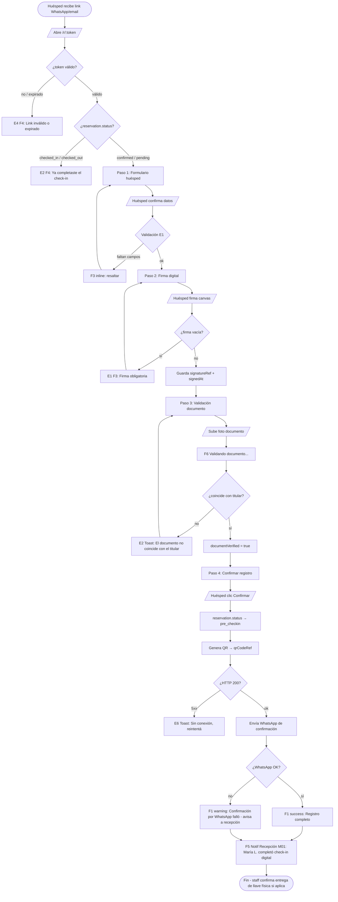

# FRD · M05 — Recepción Digital (Check-in/Out online del huésped)

> **Módulo de autoatención del huésped.** Documenta el flujo donde el huésped completa su registro **desde su propio móvil antes de llegar** al hotel, sin pasar por el mostrador de recepción.
>
> **⚠ DOCUMENTACIÓN DE ESTADO ASPIRACIONAL.** Salvo los cimientos de datos reutilizables (modelos `Reservations` y `Guests`), **ninguna de las 5 funcionalidades de M05 está implementada hoy.** Este FRD documenta el flujo *target* marcando cada pieza como REAL o PENDIENTE, y lista en §7 el análisis de brechas con referencias `file:line` exactas. **No se documenta como existente lo que no existe en código.**

**Módulo:** M05 — Recepción Digital
**Funcionalidades objetivo (según `modules.md:32-39`):**
- Check-In/Out 100% online desde el móvil
- Firma digital del contrato de hospedaje
- Validación de identidad y documentos
- Llaves digitales y códigos QR automáticos
- Confirmaciones automáticas por WhatsApp

**Pantallas reales cubiertas:** ninguna pantalla pública de huésped existe. La única pantalla con nombre "Recepción Digital" es el **panel de STAFF** (`/panel/checkin`) — esa se documenta en **M01** y aquí solo se referencia.
**Servicios frontend existentes:** `Reservation.service.ts`, `Guest.service.ts`, `Operations.service.ts` (el método `checkin()` es de lectura para staff).
**Servicios backend existentes:** módulos `reservas` (CRUD), `huespedes` (CRUD). Sin endpoints públicos ni casos de uso digitales.

---

## 0. Superposición con M01 — qué documenta cada uno

| | M01 — PMS Central | M05 — Recepción Digital |
|---|-------------------|--------------------------|
| **Quién opera** | Personal del hotel (recepcionista/admin) | El **huésped** mismo, desde su móvil |
| **Dónde** | Mostrador de recepción, `/panel/checkin` (autenticado) | Link público `/r/:token` (sin login del staff) |
| **Cuándo** | En el momento de la llegada, en persona | **Antes de llegar** al hotel |
| **Qué hace el sistema** | Staff confirma check-in con un clic → `status=checked_in` | Huésped completa datos, firma, valida documento, recibe QR → avisa al staff |
| **Estado de código** | ✅ Implementado (con gaps de feedback — ver M01 §2.1) | ❌ **No implementado** (0% del flujo digital) |

**Regla:** M01 documenta la pantalla `/panel/checkin` tal cual está hoy. **M05 NO duplica esa pantalla.** M05 describe el flujo digital del huésped que **termina notificando** a la pantalla de M01 (F5 al staff). La sección §2 referencia M01 y no la redocumenta.

---

## 1. Modelo de datos (fuente de verdad)

### 1.1 Estados de Reserva (`reservation.status`) — REAL hoy

Definido en `reservas/model.ts:13` (`status: { type: 'string', default: "pending" }`). La transición de estados la ejecuta hoy el staff vía `ReservationService.update(id, { status })` (ver `checkin/index.vue:376,394`).

| Estado | Significado | ¿Existe en código? |
|--------|-------------|--------------------|
| `pending` | Creada, sin confirmar | ✅ default del modelo |
| `confirmed` | Confirmada (paga o garantizada) | ✅ |
| `checked_in` | Huésped adentro (lo setea el staff) | ✅ `checkin/index.vue:376` |
| `checked_out` | Huésped salió (lo setea el staff) | ✅ `checkin/index.vue:394` |
| `cancelled` | Cancelada | ✅ |
| **`pre_checkin`** *(target M05)* | Huésped completó registro digital, firma y documento; **pendiente de revisión del staff** | ❌ **PENDIENTE** — no es un valor emitido por ningún código hoy |

> **Brecha:** el flujo digital necesita un estado intermedio `pre_checkin` (o equivalente) que **hoy no existe**, porque hoy el único camino a `checked_in` es el clic del staff en persona. M05 introduce el tránsito `confirmed → pre_checkin → checked_in`.

### 1.2 Campos de Reserva relevantes a M05 — REAL vs TARGET

Tabla `reservations` (`reservas/model.ts:4-23`). Marcado lo que **existe** vs lo que M05 **requiere agregar**:

| Campo | Tipo | ¿Existe hoy? | Uso en M05 |
|-------|------|--------------|------------|
| `id` | string | ✅ | Identificador de la reserva |
| `guestId` | string | ✅ | Vínculo al huésped |
| `roomId` | string | ✅ | Habitación asignada |
| `checkIn` / `checkOut` | string | ✅ | Fechas de estancia |
| `status` | string | ✅ | Máquina de estados (ver §1.1) |
| `channel` | string | ✅ | Origen (`direct`, `whatsapp`, `booking`...) |
| `totalAmount`, `deposit` | number | ✅ | Montos para el contrato |
| `adults`, `children` | number | ✅ | Datos del registro |
| **`checkinToken`** | string | ❌ **PENDIENTE** | Token único del link público `/r/:token` enviado al huésped |
| **`tokenExpiresAt`** | string | ❌ **PENDIENTE** | Expiración del link (regla E2 §6) |
| **`digitalCheckinStatus`** | string | ❌ **PENDIENTE** | `not_started` / `in_progress` / `awaiting_review` / `completed` |
| **`signedAt`** | string | ❌ **PENDIENTE** | Momento de la firma digital |
| **`signatureRef`** | string/json | ❌ **PENDIENTE** | Referencia a la imagen de firma (data-url o storage key) |
| **`documentVerified`** | boolean | ❌ **PENDIENTE** | Resultado de la validación de identidad |
| **`qrCodeRef`** | string | ❌ **PENDIENTE** | Llave digital generada |
| **`whatsappConfirmationSentAt`** | string | ❌ **PENDIENTE** | Confirmación enviada al huésped |

### 1.3 Campos de Huésped relevantes a M05 — REAL vs TARGET

Tabla `guests` (`huespedes/model.ts:4-22`):

| Campo | Tipo | ¿Existe hoy? | Uso en M05 |
|-------|------|--------------|------------|
| `name`, `email`, `phone` | string | ✅ | Datos base del registro digital |
| `document` | string | ✅ *(parcial)* | Número de documento — pero **sin estado de validación** |
| `nationality` | string | ✅ | Requerido por el contrato de hospedaje |
| **`documentType`** | string | ❌ **PENDIENTE** | Tipo de doc (pasaporte/DNI/cédula). Nota: el frontend lo mapea en `Guest.service.ts:10-13` pero **no existe en el schema de DB** |
| **`documentImageFront`** / **`documentImageBack`** | string | ❌ **PENDIENTE** | Foto/scan del documento |
| **`documentVerifiedAt`** | string | ❌ **PENDIENTE** | Sello temporal de validación |
| **`identityMatchScore`** | number | ❌ **PENDIENTE** | Score de coincidencia doc vs titular |

> **Inconsistencia detectada:** `Guest.service.ts:37,38` referencia `documentType`/`documentNumber` y `tipoDocumento`/`documento` (mapeo bilingüe), pero el modelo real `huespedes/model.ts` **solo tiene `document`** (un único string). Ese desajuste se hereda al construir M05.

### 1.4 Tablas/entidades NUEVAS que M05 requiere — PENDIENTE

Ninguna existe hoy. El flujo digital necesita:

| Entidad target | Propósito | Estado |
|----------------|-----------|--------|
| `DigitalCheckin` (o extensión de `Reservations`) | Sesión del flujo digital del huésped (token, pasos completados) | ❌ PENDIENTE |
| `DigitalSignature` | Imagen/objetos de la firma + hash de integridad | ❌ PENDIENTE |
| `DigitalKey` / `QrCode` | Llave digital emitida, validez, device vínculado | ❌ PENDIENTE |
| Integración **WhatsApp Business API** | Canal de confirmaciones salientes | ❌ PENDIENTE |

---

## 2. Pantalla REAL vs Pantalla TARGET

### 2.1 Pantalla REAL que existe hoy (referencia, NO se redocumenta)

**`/panel/checkin` — Recepción Digital (panel de STAFF).** Documentada en **M01 §2**. Es el único componente llamado "Recepción Digital" en el código (`checkin/index.vue:7`).

Lo que hace hoy ese panel respecto del check-in:
- Lista llegadas/salidas/en-casa del día (lee `OperationsService.planning()`, `RoomService.list()`).
- Staff clic en **"Check-in"** (`checkin/index.vue:61`) → abre modal → **"Confirmar Check-in"** (`checkin/index.vue:149`) → `ReservationService.update(guest.id, { status: 'checked_in' })` (`checkin/index.vue:376`) → `room.status='occupied'` (`checkin/index.vue:381`).
- En error: `alert('Error al hacer check-in')` (`checkin/index.vue:383`).
- **No hay firma, no hay validación de documento, no hay QR, no hay WhatsApp.** Es un cambio de estado directo.

> Ver M01 §2.1 para la Decision Table completa de esta pantalla. M05 **no la duplica**; la complementa con el flujo de autoatención que alimenta esa pantalla.

### 2.2 Pantalla TARGET — Portal de auto-check-in del huésped (`/r/:token`)

> **PENDIENTE DE IMPLEMENTAR.** La siguiente Decision Table describe el comportamiento **objetivo** del flujo digital del huésped. **Ninguna fila está implementada hoy.** Se documenta para fijar el contrato de diseño.

**Ruta target:** `/r/:token` (pública, sin `requiresHotelAuth`). El router actual (`frontend/src/router/index.ts:1-222`) **no contiene ninguna ruta pública de huésped** — solo `/` (landing de marketing) y `/login`. Agregar la ruta es parte del trabajo de M05.

#### Decision Table — Flujo de auto-check-in del huésped (TARGET)

| Trigger (botón/acción) | Condición / Estado previo | Resultado | Modal/Toast (texto target) | Errores posibles | Notif F5 |
|------------------------|---------------------------|-----------|----------------------------|------------------|----------|
| Huésped abre link `/r/:token` | token válido Y `reservation.digitalCheckinStatus = not_started` | Carga paso 1: datos del huésped pre-cargados (name/email/phone/nationality) | — | E4 "No se encontró tu reserva" · E2 "El link expiró" | — |
| Huésped abre link `/r/:token` | `reservation.status` ya en `checked_in` o `checked_out` | Pantalla de "ya completaste el check-in" | F4 azul: "Tu check-in ya fue confirmado el {fecha}." | E2 "La reserva ya tiene check-in" | — |
| Huésped abre link `/r/:token` | token inválido o no encontrado | Pantalla de error genérica | F4 roja: "El link no es válido. Contactá a recepción." | E4 "No se encontró tu reserva" | — |
| Botón **"Continuar"** (paso 1 datos) | `documentType`, `documentNumber`, `nationality` completos | Valida formato, avanza a paso 2 (firma) | — | E1 "Documento es obligatorio" · E1 "Email inválido" | — |
| Botón **"Firmar"** (paso 2 canvas) | firma no vacía | Guarda firma → `signatureRef`, `signedAt=now`, avanza a paso 3 | — | E1 "La firma es obligatoria" | — |
| Botón **"Subir documento"** (paso 3) | imagen legible | Sube frente/dorso → `documentImageFront/Back`, inicia validación (F6) | F6 spinner "Validando documento..." | E1 "Imagen ilegible" · E2 "El documento no coincide con el titular" | — |
| Validación de identidad OK | `identityMatchScore ≥ umbral` | `documentVerified=true`, avanza a paso 4 | — | — | — |
| Botón **"Confirmar registro"** (paso 4) | firma ✓ + documento ✓ | `reservation.status → pre_checkin`, genera QR → `qrCodeRef`, envía WhatsApp | Toast success: "¡Registro completo! Te enviamos tu llave digital por WhatsApp." | E6 "Sin conexión. Reintentá." | **Sí:** F5 a Recepción (M01) "María L. completó el check-in digital — Hab 204" |
| Generación de QR OK | `qrCodeRef` set | Muestra QR en pantalla + envía por WhatsApp | F1 success: "Llave digital lista. Revisá tu WhatsApp." | E7 "No se pudo generar la llave" | — |
| Envío de WhatsApp OK | `whatsappConfirmationSentAt` set | F1 info: "Confirmación enviada al +xx." | — | E6 "No se pudo enviar el WhatsApp. Te avisaremos a recepción." | F5 a Recepción si el WhatsApp falla |
| Staff recibe notificación F5 (en M01) | `reservation.status = pre_checkin` | Aparece en `/panel/checkin` con badge "Digital ✓" listo para confirmar física/llave física | — | — | — |

#### Pantalla de Check-out digital (TARGET)

M05 también cubre check-out online. Target: el huésped pulsa "Cerrar cuenta" desde su móvil → dispara el mismo efecto que el check-out de M01 (`status → checked_out`, `room → dirty`) **más** cierre de folio (M13) e invalidación de la llave digital QR.

| Trigger | Condición | Resultado | Modal/Toast | Errores | Notif F5 |
|---------|-----------|-----------|-------------|---------|----------|
| Botón **"Check-out"** (portal huésped) | `reservation.status=checked_in` Y folio sin saldo | `status → checked_out`, `room → dirty`, QR invalidado | F1 success: "Check-out listo. Dejanos tu opinión (M17)." | E2 "Tenés saldo pendiente en tu folio" | F5 Housekeeping "Hab {n} necesita limpieza" + F5 Billing |

---

## 3. Flow — Check-in digital del huésped (TARGET, no implementado)

> El siguiente diagrama describe el flujo **objetivo** completo. Cada nodo marcado ❌ no existe en el código actual.

**Caminos documentados (ver §8 MASTER):**
- ✅ Happy path: `A → ... → Y → Z`
- Error E1 (validación campo/firma): `G1`, `J1` — feedback inline F3
- Error E2 (regla de negocio): `X2` (ya check-in), `X3` (doc no coincide con titular)
- Error E4 (no encontrado): `X1` (token inválido/expirado)
- Error E6 (red/servidor): `X4`
- Estado posterior del sistema: `reservation.status = pre_checkin`, `digitalCheckinStatus = completed`, `qrCodeRef` emitido, `whatsappConfirmationSentAt` seteado, F5 entregada a la pantalla de staff de M01.

---

## 4. Consecuencias cross-módulo (eventos que dispara M05)

M05 es un **dispensador de eventos**: cada check-in digital completado repercute en varios módulos.

| Acción en M05 | Módulo afectado | Efecto | Notificación F5 target | Estado real hoy |
|---------------|-----------------|--------|------------------------|-----------------|
| Registro digital completado | **M01 PMS Central** (Recepción staff) | Reserva aparece marcada "Digital ✓", lista para entrega de llave física | "María L. completó el check-in digital — Hab 204" | ❌ No existe el evento; `/panel/checkin` no recibe notificaciones (no hay canal F5 real) |
| Check-in confirmado | **M07 Housekeeping** | Habitación pasa a ocupada, monitorear para limpieza al check-out | "Hab {n} ahora ocupada" | ⚠ Parcial: existe el conector `reservas-housekeeping.ts`, pero solo reacciona a `status === 'check_out'` (`:14`) **no a check-in**; además el frontend emite `'checked_out'` (`checkin/index.vue:394`) y el conector escucha `'check_out'` (`:14`) — **desajuste de valor, el conector nunca dispara** |
| Llave digital emitida | **Dispositivos / cerraduras (M25)** | QR habilitado en la cerradura de la hab | — | ❌ No existe integración con cerraduras inteligentes |
| Check-out digital | **M13 Folios / Billing** | Cerrar folio, cobrar pendientes | "Generar folio de {huésped}" | ⚠ Existe `POST /api/folios/:id/invoice` (`composition-root.ts:222`) pero **no se invoca desde el check-out** del huésped ni del staff |
| Check-out digital | **M07 Housekeeping** | Crear tarea de limpieza, hab → dirty | "Hab {n} necesita limpieza" | ⚠ Ver desajuste de conector arriba |
| Confirmación / recordatorio | **WhatsApp Business API** | Confirmación al huésped + briefing (M17) | — | ❌ No existe cliente de WhatsApp. `whatsapp` hoy es solo un valor de `reservation.channel` (`composition-root.ts:287-288`) — origen, no destino |
| Contrato firmado | **M23 Facturación / Legal** | Guardar contrato firmado para archivo legal/fiscal | — | ❌ No existe almacenamiento de contrato |

---

## 5. Reglas de negocio a validar en backend (E2)

El backend target debe rechazar (HTTP 400 `BUSINESS_RULE`) estas situaciones y el frontend mostrar el Toast E2 correspondiente. **Ninguna validación digital existe hoy**; las que sí existen son las de M01 (ver M01 §7).

| # | Regla (target M05) | Trigger | Texto al usuario (target) | ¿Existe validación hoy? |
|---|--------------------|---------|---------------------------|--------------------------|
| 1 | **Reserva ya tiene check-in** (link usado después de completado) | `reservation.status ∈ {checked_in, checked_out, cancelled}` al abrir el link | "La reserva ya tiene check-in confirmado." | ⚠ Parcial: el check-in de staff no valida esto tampoco (ver M01 §2.1 Gap) |
| 2 | **Token expirado** | `tokenExpiresAt < now` | "El link de check-in expiró. Solicitalo nuevamente a recepción." | ❌ No existe el campo `tokenExpiresAt` |
| 3 | **Documento no coincide con el titular** | `identityMatchScore < umbral` tras validación | "El documento no coincide con el titular de la reserva." | ❌ No existe validación de identidad |
| 4 | **Documento ya validado** (reenvío) | `documentVerified = true` y se reintenta | "Ya validaste tu documento." | ❌ No existe el campo |
| 5 | **Check-in antes de la ventana permitida** | `now < checkIn - ventanaConfigurada` | "El check-in digital abre {X}hs antes de tu llegada." | ❌ No existe (M01 §7-5 tampoco está implementado) |
| 6 | **Check-out con saldo pendiente** | folio con balance ≠ 0 | "Tenés saldo pendiente en tu folio. Regularizá antes de salir." | ❌ No existe validación de folio en check-out |
| 7 | **Token reutilizado en otra sesión** | token válido pero `digitalCheckinStatus=completed` | "Este check-in ya fue completado por otra sesión." | ❌ No existe |
| 8 | **Firma vacía** | `signatureRef` vacío al confirmar | "La firma es obligatoria para el contrato." | ❌ No existe el paso de firma |

> **Nota de seguridad:** el link `/r/:token` es la única autenticación del huésped. El backend **debe** validar `assertOwnership`-like del token contra `reservation.id` y rechazar tokens de otro hotel (regla E3 si el token existe pero no pertenece al hotel del contexto). Ningún mecanismo de este tipo existe hoy: las rutas públicas actuales son solo `/api/public/users` (`composition-root.ts:380`) y login.

---

## 6. Servicios y endpoints — REAL vs TARGET

### 6.1 Endpoints reales hoy (staff, todos autenticados)

De `reservas/index.ts:43-47` y `huespedes/index.ts:43-47`:

| Método | Ruta | Auth | Para qué sirve en M05 |
|--------|------|------|------------------------|
| GET | `/api/reservas` | `hotel_admin, receptionist, super_admin` | Staff lista reservas (no huésped) |
| GET | `/api/reservas/:id` | ídem | Staff ve una reserva |
| POST | `/api/reservas` | `hotel_admin, super_admin` | Staff crea reserva |
| PUT | `/api/reservas/:id` | `hotel_admin, super_admin` | Staff cambia `status` (así funciona el check-in de M01 hoy) |
| GET/POST/PUT/DELETE | `/api/huespedes...` | ídem | CRUD de huéspedes por staff |
| GET | `/api/checkin` | `hotel_admin, receptionist, super_admin` | Agregación del panel de staff (`composition-root.ts:265`) |

> **Ningún endpoint es público.** No hay `/api/public/r/:token`, ni `/api/checkin/digital/...`, ni upload de firma/documento, ni generación de QR, ni envío de WhatsApp.

### 6.2 Endpoints TARGET que M05 requiere (PENDIENTE)

| Método | Ruta | Auth | Propósito |
|--------|------|------|-----------|
| GET | `/api/public/r/:token` | **pública** (token) | Cargar la reserva del huésped por token |
| POST | `/api/public/r/:token/data` | pública (token) | Guardar paso 1 (datos huésped) |
| POST | `/api/public/r/:token/signature` | pública (token) | Guardar firma digital |
| POST | `/api/public/r/:token/document` | pública (token) | Subir documento → validación |
| POST | `/api/public/r/:token/confirm` | pública (token) | Confirmar registro → `pre_checkin` + QR + WhatsApp |
| POST | `/api/checkin/digital/:id/issue-key` | `hotel_admin, receptionist` | Staff emite/regenera llave digital |
| POST | `/api/checkin/digital/:id/revoke-key` | `hotel_admin, receptionist` | Invalidar QR (check-out / pérdida) |
| POST | `/api/whatsapp/send` | interna / sistema | Enviar confirmación (WhatsApp Business API) |

---

## 7. Análisis de brechas — qué falta por cada funcionalidad de `modules.md`

Referencias `file:line` exactas. Estado de implementación por feature M05:

### 7.1 ❌ Check-In/Out 100% online desde el móvil — NO IMPLEMENTADO
- **Sin ruta pública de huésped.** El router (`frontend/src/router/index.ts:1-222`) define únicamente `/` (landing), `/login`, `/panel/*` (`requiresHotelAuth`, `:94`) y `/admin/*`. No existe `/r/:token` ni ninguna ruta para huéspedes no autenticados.
- **Sin página de huésped.** `pages/landing/index.vue:1-523` es exclusivamente marketing (hero, features, pricing, testimonios); todos sus CTA ("Iniciar Sesión", "Prueba Gratis", "Comenzar Gratis" — `:20-21,47-50`) dirigen a `/login`. No contiene formulario de check-in.
- **Sin endpoint público.** Todas las rutas de `/api/reservas` requieren `auth.authenticate(...)` (`reservas/index.ts:43-47`); las de `/api/huespedes` también (`huespedes/index.ts:43-47`). Las únicas rutas sin auth son `/api/public/users` (`composition-root.ts:380`) y login.
- **Sin token en el modelo.** `Reservations` no tiene `checkinToken` ni `tokenExpiresAt` (`reservas/model.ts:4-23`).
- **Sin caso de uso digital.** `ReservasService` (`reservas/service.ts:17-93`) solo implementa CRUD genérico; no hay `startDigitalCheckin`, `completeDigitalCheckin`, etc.

### 7.2 ❌ Firma digital del contrato de hospedaje — NO IMPLEMENTADO
- **Sin campo de firma.** Ni `reservas/model.ts:4-23` ni `huespedes/model.ts:4-22` tienen `signature`, `signatureRef` o `signedAt`. Búsqueda en backend de `signature`/`firma`: 0 coincidencias.
- **Sin componente de firma.** Ningún componente de canvas/firma en `frontend/src/components/`. El modal de check-in actual (`checkin/index.vue:111-153`) solo muestra datos de solo lectura + botón "Confirmar Check-in" (`:149`); no hay paso de firma.
- **Sin almacenamiento de contrato.** No hay tabla/modelo de contrato firmado.

### 7.3 ❌ Validación de identidad y documentos — NO IMPLEMENTADO
- **`Guests.document` es un string plano** (`huespedes/model.ts:11`) sin estado de validación, sin imagen/scan, sin flag `documentVerified`.
- **Inconsistencia schema vs frontend.** `Guest.service.ts:10-13,37-38` mapea `documentType`/`documentNumber`/`tipoDocumento`/`documento`, pero el schema real solo tiene `document` (un campo). Esos campos extra **no existen en la BD**.
- **Sin servicio de validación.** No hay OCR, no hay servicio de verificación de identidad, no hay endpoint de upload de documento.

### 7.4 ❌ Llaves digitales y códigos QR automáticos — NO IMPLEMENTADO
- **Sin modelo de llave/QR.** Búsqueda de `qr`, `key`, `digitalKey` en backend: 0 coincidencias. Ningún campo en `Reservations` ni en `Rooms`.
- **Sin generación de QR.** No hay librería ni endpoint que emita códigos.
- **Sin integración con cerraduras inteligentes.** No hay adaptador de lock API.

### 7.5 ❌ Confirmaciones automáticas por WhatsApp — NO IMPLEMENTADO
- **`whatsapp` hoy es solo un valor de `reservation.channel`** (origen de la reserva), usado en `composition-root.ts:287-288` para contar reservas directas y en `Reservation.service.ts:34`. **No es un canal de salida.**
- **Sin cliente de WhatsApp Business API.** No hay `sendWhatsApp`, no hay adaptador, no hay template de confirmación de check-in.
- **El módulo `notificaciones`** (registrado en `composition-root.ts:66,80`) es CRUD de notificaciones in-app (F5 campana), **no** un emisor de WhatsApp.

### 7.6 Cimientos reutilizables que SÍ existen (base para construir M05)
- ✅ Máquina de estados de `Reservations` + `ReservasService.update()` — un flujo digital puede añadir `pre_checkin` reutilizando el update existente (`reservas/service.ts:77`).
- ✅ Campos base de huésped (`name, email, phone, document, nationality` — `huespedes/model.ts:8-12`) — el formulario digital los completa.
- ✅ Patrón de conector para disparar efectos cross-módulo (`reservas-housekeeping.ts`) — reusable para notificar a recepción al completar el check-in digital.
- ✅ Molde de modales/toasts del MASTER y de `checkin/index.vue` (`Teleport`, cajas ⚠) — reusable para las pantallas de confirmación.
- ✅ Conector de facturación `POST /api/folios/:id/invoice` (`composition-root.ts:222`) — base para cerrar folio al check-out digital.

---

## 8. Checklist de verificación M05

Estado actual (todo PENDIENTE) vs target. Marcar cuando se implemente.

### Backend
- [ ] Campo `checkinToken` + `tokenExpiresAt` en `Reservations` (§1.2)
- [ ] Estado `pre_checkin` en la máquina de estados
- [ ] Campos `signatureRef`, `signedAt`, `documentVerified`, `qrCodeRef`, `whatsappConfirmationSentAt`
- [ ] Endpoints públicos `/api/public/r/:token/*` (§6.2)
- [ ] Validación E2 §5-1 (reserva ya check-in)
- [ ] Validación E2 §5-2 (token expirado)
- [ ] Validación E2 §5-3 (documento no coincide con titular)
- [ ] Validación E2 §5-5 (check-in fuera de ventana)
- [ ] Servicio de validación de identidad (OCR/manual)
- [ ] Generación de QR + modelo `DigitalKey`
- [ ] Cliente WhatsApp Business API + templates de confirmación
- [ ] Conector `digital-checkin → recepción (M01)` para disparar F5 al staff
- [ ] Reparar desajuste del conector `reservas-housekeeping` (`'check_out'` vs `'checked_out'`, `reservas-housekeeping.ts:14`) — bug preexistente que afecta a M05/M07

### Frontend
- [ ] Ruta pública `/r/:token` (sin `requiresHotelAuth`) en el router
- [ ] Página `pages/guest-checkin/index.vue` con 4 pasos (datos → firma → doc → confirmar)
- [ ] Componente de firma canvas
- [ ] Componente de upload de documento (frente/dorso)
- [ ] Mostrar QR al confirmar + estado loading F6 en cada paso
- [ ] Toast success F1 al completar registro
- [ ] Toast/warning F1 si WhatsApp falla
- [ ] Estado vacío F4 si el link ya fue usado / expiró
- [ ] Integración con `/panel/checkin` (M01): badge "Digital ✓" + notificación F5 al staff
- [ ] Check-out digital con validación de saldo de folio (M13)

---

## 9. Pendiente de definir en M05 (próximas iteraciones)

- [ ] Política de expiración del token (¿24hs antes del check-in? ¿al check-out?)
- [ ] Ventana horaria permitida para check-in digital anticipado
- [ ] ¿El check-in digital `pre_checkin` auto-confirma `checked_in` o requiere clic del staff? (decisión de producto)
- [ ] Proveedor de validación de identidad (manual por staff vs OCR automático vs servicio externo)
- [ ] Proveedor de cerraduras inteligentes / formato de QR
- [ ] Proveedor de WhatsApp Business (oficial vs no oficial) y templates aprobados
- [ ] Matriz de permisos: ¿qué pasa si el huésped NO completa el check-in digital? ¿staff lo hace en persona vía M01?
- [ ] Retención/legal del contrato firmado (vinculado a M23 Facturación)

---

*Este FRD sigue el molde de `M01-PMS-Central.md` con códigos de feedback F1–F6 (`00-MASTER.md §1`) y errores E1–E7 (`00-MASTER.md §5`). Documenta el estado REAL del código y marca explícitamente como PENDIENTE toda funcionalidad no implementada, sin inventar el flujo digital como si existiera.*
