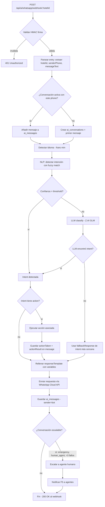
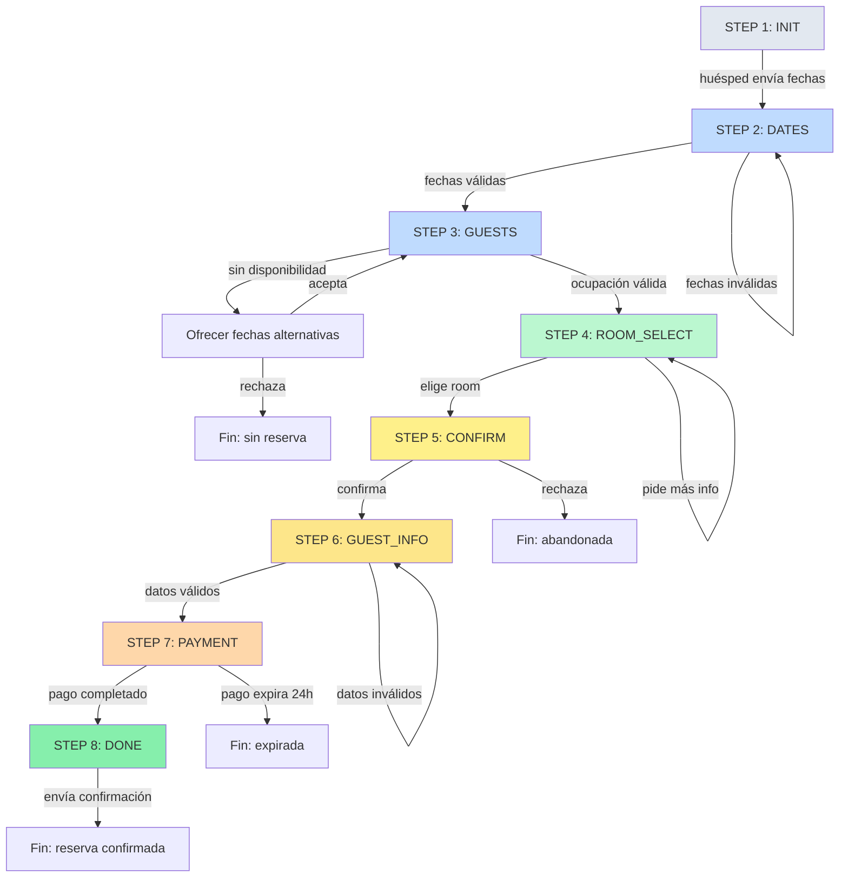
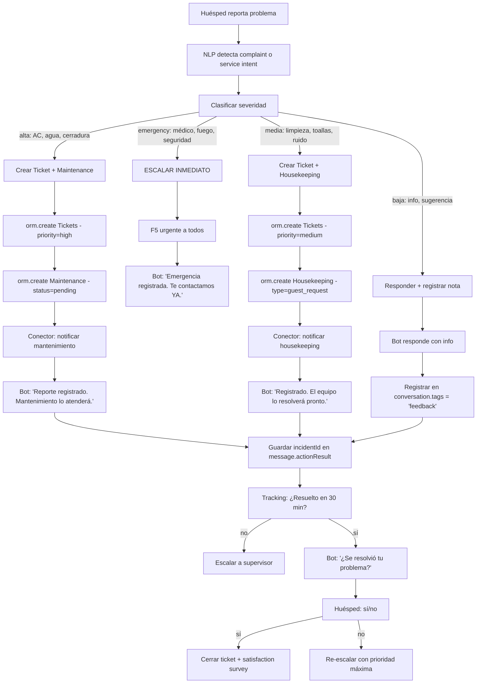
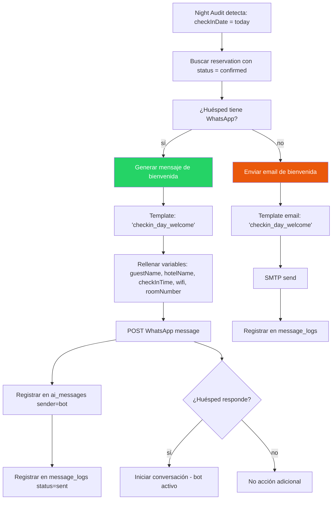

# M06 · AI Receptionist — Flows de Integración & Tablas de Decisión

> **Documento complementario al TRD.** Diagramas de flujo detallados, máquinas de estado y tablas de decisión para todas las operaciones del módulo M06.
> Para arquitectura y data model → `FRD/M06-TRD-IA-Recepcionista.md`

---

## 1. Máquina de Estados — Conversación

```
                    ┌──────────┐
                    │  ACTIVE  │ ←──────────────────────┐
                    │ (bot on) │                        │
                    └────┬─────┘                        │
                         │                              │
          ┌──────────────┼──────────────┐              │
          ▼              ▼              ▼              │
   ┌────────────┐ ┌───────────┐ ┌────────────┐        │
   │ TRANSFERRED│ │  WAITING  │ │  RESOLVED  │        │
   │ (agent on) │ │ (en cola) │ │  (cerrada)  │        │
   └─────┬──────┘ └─────┬─────┘ └────────────┘        │
         │               │                              │
         │  "devolver    │  agente                      │
         │   al bot"     │  disponible                  │
         │               ▼                              │
         │        ┌───────────┐                        │
         └───────>│ TRANSFERRED│────────────────────────┘
                  └───────────┘
```

**Transiciones:**
| De | A | Trigger |
|----|----|---------|
| ACTIVE | TRANSFERRED | Guest pide humano, 3 fallos bot, emergency |
| ACTIVE | WAITING | Guest pide humano pero no hay agente disponible |
| ACTIVE | RESOLVED | Guest confirma resolución, gratitude + cierre |
| WAITING | TRANSFERRED | Agente disponible toma la conversación |
| TRANSFERRED | ACTIVE | Agente devuelve al bot |
| TRANSFERRED | RESOLVED | Agente cierra la conversación |

---

## 2. Flow: WhatsApp Webhook → Respuesta (Core Loop)



---

## 3. Flow: Booking Flow State Machine (7 Pasos)



**Tabla de Decisión por Paso:**

| Step | Acción Backend | Validación | Timeout | Rollback |
|------|---------------|------------|---------|----------|
| INIT | Crear `ai_booking_flows` row | No duplicado activo | — | — |
| DATES | Parsear fechas con date-fns | checkIn ≥ today, checkOut > checkIn, ≤ 30 noches | — | — |
| GUESTS | Parsear números (NLP) | adults ≥ 1, ≤ room.capacity | — | — |
| ROOM_SELECT | `search_availability(checkIn, checkOut)` → ORM | Room disponible (overlap check) | — | — |
| CONFIRM | Presentar resumen con precio | — | 5 min sin respuesta → "¿Seguís ahí?" | — |
| GUEST_INFO | `orm.create(Guests)` + `orm.create(Reservations, status=pending)` | Email válido (regex), nombre no vacío | — | Delete guest+reservation si falla |
| PAYMENT | Stripe: create checkout session | — | 24h → expira, cancelar reservation | Cancel reservation si expira |
| DONE | Webhook Stripe → confirmar reservation + enviar confirmación WhatsApp | PaymentStatus = paid | — | — |

---

## 4. Flow: Escalamiento Bot → Agente Humano

```mermaid
flowchart TD
    A{Trigger de escalamiento} -->|emergency| B[CRÍTICO - inmediato]
    A -->|human_agent explícito| C[ALTO - inmediato]
    A -->|>3 fallos bot| D[MEDIO - inmediato]
    A -->|satisfaction ≤2| E[BAJO - async]

    B --> F[F5 urgente a TODOS los agentes]
    C --> G[Buscar agente disponible]
    D --> G
    E --> H[F5 informativa al admin]

    G --> I{¿Agente disponible?}
    I -->|sí| J[Asignar agente a conversación]
    I -->|no| K[status → waiting]

    J --> L[Bot envía: 'Te transfiero con {agentName}']
    J --> M[Agente recibe F5 + contexto completo]
    M --> N[Agente responde manualmente]

    K --> O[Bot envía: 'Estamos conectándote...']
    K --> P[F5 a todos: 'Conversación en espera']
    P --> Q[Poll cada 30s: ¿agente disponible?]
    Q --> I

    N --> R{¿Agente cierra o devuelve?}
    R -->|cierra| S[Resolved by agent]
    R -->|devuelve al bot| T[Status → active, bot retoma]

    F --> U[Agente de guardia notificado]
    H --> V[Admin revisa conversación]

    style B fill:#ef4444,color:white
    style C fill:#f97316,color:white
    style D fill:#eab308
    style E fill:#3b82f6,color:white
```

---

## 5. Flow: Payment Request (Huésped → Bot → Stripe)

```mermaid
flowchart TD
    A[Huésped: 'Quiero pagar'] --> B{¿Tiene guestId/reservationId en contexto?}
    B -->|sí| C[Buscar reservation por ID]
    B -->|no| D[Bot: '¿Email o # de confirmación?']
    D --> E[Huésped envía email o reservationId]
    E --> F{¿Encontrada?}
    F -->|no| G[Bot: 'No encontré tu reserva. ¿Otro dato?']
    F -->|sí| C
    C --> H{¿Reservation status?}
    H -->|cancelled| I[Bot: 'Esa reserva fue cancelada.']
    H -->|confirmed| J[Bot: 'Esa reserva ya está confirmada y pagada.']
    H -->|pending| K[Calcular pendingAmount = total - deposit]
    K --> L[Stripe: POST /v1/checkout/sessions]
    L --> M[Crear PaymentRequest en DB]
    M --> N[Bot envía payment link al huésped]
    N --> O[Timer: 24h expiry]

    O -->|pago recibido| P[Webhook Stripe: checkout.session.completed]
    P --> Q[Validar firma Stripe]
    Q --> R[Actualizar PaymentRequest.status = paid]
    R --> S[Actualizar Reservation.deposit += amount]
    S --> T{deposit >= totalAmount?}
    T -->|sí| U[Reservation.status = confirmed]
    T -->|no| V[Reservation.status = partial]
    U --> W[Bot: '✅ Pago confirmado. Reserva #{id} confirmada.']
    V --> X[Bot: '✅ Pago parcial recibido. Pendiente: ${pending}']

    O -->|expira sin pago| Y[Cancelar PaymentRequest]
    Y --> Z[Bot: 'Tu enlace de pago expiró. ¿Necesitas uno nuevo?']

    style P fill:#635bff,color:white
    style U fill:#86efac
    style V fill:#fde68a
```

---

## 6. Flow: Registro de Incidencia (Queja → Resolución)



---

## 7. Flow: Check-in Day Auto-Message (Proactivo)



---

## 8. Flow: Post-Estancia (Checkout + Review)

```mermaid
flowchart TD
    A[Night Audit: checkOutDate = yesterday] --> B[Reservation status = checked_out]
    B --> C[¿Pasaron 6 horas desde checkout?]
    C -->|sí| D[Enviar mensaje de agradecimiento]
    C -->|no| E[Esperar]

    D --> F[Template: 'post_stay_thankyou']
    F --> G{¿Huésped ya calificó?}
    G -->|sí| H[No enviar]
    G -->|no| I[Enviar mensaje + botones de satisfacción 1⭐-5⭐]

    I --> J[Huésped responde con rating]
    J --> K[Guardar satisfactionScore en conversation]
    K --> L{Score ≥ 4?}
    L -->|sí| M[Bot: '¡Gracias! Nos alegra que disfrutaras.']
    L -->|no| N[Bot: 'Lamentamos que no fuera perfecto. ¿Qué podemos mejorar?']

    N --> O[Huésped da feedback]
    O --> P[Registrar en conversation.tags = 'feedback']
    P --> Q[F5 a admin: 'Feedback negativo de {guestName}']

    M --> R{¿Score = 5?}
    R -->|sí| S[Bot: '¿Nos dejarías una reseña en Google/Booking?']
    S --> T[Enviar link de review]
    R -->|no| U[Fin]
```

---

## 9. Flow: Web Chat Widget Público

```mermaid
flowchart TD
    A[Usuario abre hotelwebsite.com] --> B[Widget se carga: GET /api/ai/chat/:slug/session]
    B --> C[Backend genera sessionId JWT - 15 min TTL]
    C --> D[Widget listo - muestra saludo: template 'webchat_greeting']

    D --> E[Usuario escribe mensaje]
    E --> F[POST /api/ai/chat/:slug/message - body: {sessionId, content}]
    F --> G[Validar JWT sessionId]
    G -->|expirado| H[401 + nueva session]
    G -->|válido| I[NLP: detectar intent]

    I --> J{Intent con acción?}
    J -->|booking_request| K[Iniciar booking flow - mismo que WhatsApp]
    J -->|faq| L[Responder con template]
    J -->|human_agent| M[Si agente online → transferir, si no → mensaje espera]
    J -->|emergency| N[Mostrar teléfono del hotel + escalar]

    K --> O[Flow de 7 pasos en el widget]
    L --> P[Respuesta inmediata]
    M --> Q[Cola de espera en widget]
    N --> R[Widget muestra número de emergencia]

    style B fill:#3b82f6,color:white
    style F fill:#3b82f6,color:white
```

---

## 10. Flow: Agregación Nocturna de Métricas (Night Audit)

```mermaid
flowchart TD
    A[CRON: 02:00 AM diario] --> B[POST /api/ai/metrics/aggregate]
    B --> C[Para cada hotel activo:]

    C --> D[Calcular fecha: yesterday]
    D --> E[Query ai_conversations WHERE startedAt LIKE 'yesterday%']
    E --> F[Query ai_messages WHERE createdAt LIKE 'yesterday%']

    F --> G[Calcular métricas:]

    G --> G1[totalConversations = count conversations]
    G --> G2[totalMessages = count messages]
    G --> G3[botResolved = count WHERE resolvedBy=bot]
    G --> G4[hybridResolved = count WHERE resolvedBy=hybrid]
    G --> G5[agentResolved = count WHERE resolvedBy=agent]
    G --> G6[escalatedToHuman = count WHERE status=transferred]
    G --> G7[avgConfidence = AVG confidence WHERE sender=bot]
    G --> G8[avgResponseTimeMs = AVG(responseTime)]
    G --> G9[avgSatisfaction = AVG satisfactionScore]
    G --> G10[topIntents = GROUP BY intentDetected ORDER BY count LIMIT 10]
    G --> G11[messagesByChannel = GROUP BY channel]
    G --> G12[bookingsGenerated = count ai_booking_flows WHERE completedAt LIKE 'yesterday%']
    G --> G13[upsellsAccepted = count WHERE upsellsOffered accepted=true]

    G1 --> H[UPSERT ai_metrics_daily WHERE hotelId+date]
    G2 --> H
    G3 --> H
    G4 --> H
    G5 --> H
    G6 --> H
    G7 --> H
    G8 --> H
    G9 --> H
    G10 --> H
    G11 --> H
    G12 --> H
    G13 --> H

    H --> I[Limpiar cache de métricas del hotel]
    I --> J[Fin - próximo hotel]
```

---

## 11. Tabla de Decisión: Canales de Comunicación

| Canal | Formato Respuesta | Longitud Máx | Elementos Soportados | Timeout | Rate Limit |
|-------|-------------------|-------------|---------------------|---------|------------|
| **WhatsApp** | Texto + emojis + botones interactivos | 4096 chars | Texto, imágenes, documentos, location, templates, quick reply buttons, list messages | 3s | 250 msg/s (Meta) |
| **Web Chat** | Texto + markdown + links | 2000 chars | Texto, imágenes, links, cards | 2s | 10 msg/min/IP |
| **Email** | HTML + texto plano | 10000 chars | HTML, imágenes, attachments | 5s | 50/hora/hotel |
| **Voice (OpenAI Realtime SIP)** | Audio full-duplex | ∞ (streaming) | Voz natural, interrupciones, function calling, transferencia | < 1s primer token | 1 llamada simultánea/número |
| **App Guest (futuro)** | Texto + rich UI | 4096 chars | Texto, imágenes, tarjetas interactivas | 2s | — |

---

## 12. Tabla de Decisión: Cuándo usar Bot vs LLM

| Situación | Usar | Latencia | Costo |
|-----------|------|----------|-------|
| Intención con fuzzy score > 0.65 | Bot (template) | < 50ms | $0 |
| Intención con fuzzy score < 0.65 | LLM classify | < 2s | ~$0.002/call |
| Respuesta con template válido | Bot (template + variables) | < 100ms | $0 |
| Respuesta sin template (conversación libre) | LLM generate | < 2s | ~$0.003/call |
| FAQ repetida en últimos 5 min | Cache (MemoryCache, TTL 300s) | < 10ms | $0 |
| Booking flow (paso estructurado) | Bot (state machine) | < 100ms | $0 |
| Conversación off-topic o compleja | LLM full generation | < 3s | ~$0.005/call |
| Emergencia detectada | Bot (template urgente + escalar) | < 100ms | $0 |
| **Llamada de voz (OpenAI Realtime SIP)** | **GPT-4o Realtime (STT+LLM+TTS nativo)** | **< 1s** | **~$0.10-0.25/min** |

---

## 13. Tabla de Errores y Manejo

| Código | Situación | Respuesta al Huésped | Acción Backend |
|--------|-----------|----------------------|----------------|
| E1 | WhatsApp webhook firma inválida | — (no responde, es ataque) | 401 + log security warning |
| E2 | WhatsApp API down / timeout | — (el mensaje no se entregó) | Retry 3x con exponential backoff. Log error. |
| E3 | LLM API timeout (> 5s) | Usar fallbackResponse de intent más cercana | Log. Incrementar métrica de fallback. |
| E4 | Hotel sin WhatsApp configurado | — | Solo opera web chat y email |
| E5 | Conversación cerrada recibe mensaje | "Esta conversación está cerrada. Escribe 'hola' para empezar una nueva." | Crear nueva conversación |
| E6 | Agente intenta tomar conversación ya asignada | Toast: "Esta conversación ya la tiene {otroAgente}" | 409 Conflict |
| E7 | Crear reserva falla (overlap) | "Esa habitación ya no está disponible. Tengo estas alternativas: ..." | Rollback booking flow a step=room_select |
| E8 | Payment link expira | "El enlace expiró. ¿Quieres que genere uno nuevo?" | Cancelar PaymentRequest. Ofrecer regenerar. |
| E9 | Archivo adjunto no soportado | "Por el momento solo recibo texto e imágenes. ¿Podés describirlo en texto?" | Guardar mensaje con contentType=unsupported |

---

## 14. Timeline de Mensajes Automáticos (Proactivos)

| Evento | Timing | Template | Canal | Condición |
|--------|--------|----------|-------|-----------|
| Reserva creada (sin pagar) | Inmediato | `booking_pending_payment` | WhatsApp/Email | reservation.status=pending |
| Pago confirmado | Inmediato | `booking_confirmed` | WhatsApp/Email | reservation.status=confirmed |
| 24h antes del check-in | 09:00 AM | `checkin_reminder_24h` | WhatsApp | checkIn = tomorrow |
| Día del check-in | 08:00 AM | `checkin_day_welcome` | WhatsApp | checkIn = today, status=confirmed |
| Día del check-out | 08:00 AM | `checkout_reminder` | WhatsApp | checkOut = today, status=checked_in |
| 6h post check-out | 18:00 PM | `post_stay_thankyou` | WhatsApp/Email | checkOut = yesterday |
| 48h post check-out | 10:00 AM | `review_request` | Email | No calificó aún, satisfactionScore null |
| Depósito pendiente 48h | 10:00 AM | `deposit_reminder` | WhatsApp | deposit < total, status=pending |
| Reserva expirada | Al expirar (24h sin pago) | `booking_expired` | WhatsApp | PaymentRequest expired |

---

## 15. Matriz de Integración Cross-Módulo

| Módulo Origen (M06) | Módulo Destino | Tipo | Método | Propósito |
|---------------------|----------------|------|--------|-----------|
| ai-recepcionista | reservas | Connector | `createReservation(data)` | Crear reserva desde booking flow |
| ai-recepcionista | reservas | Connector | `getReservation(id)` | Consultar reserva existente |
| ai-recepcionista | reservas | Connector | `cancelReservation(id, reason)` | Cancelar desde bot |
| ai-recepcionista | huespedes | Connector | `createGuest(data)` | Registrar huésped nuevo |
| ai-recepcionista | huespedes | Connector | `getGuestByEmail(email)` | Buscar huésped existente |
| ai-recepcionista | habitaciones | Connector | `searchAvailability(hotelId, dates)` | Buscar rooms disponibles |
| ai-recepcionista | folios | Connector | `getFolioByReservation(reservationId)` | Consultar saldo del huésped |
| ai-recepcionista | payments | Connector | `createPaymentLink(data)` | Generar link de pago |
| ai-recepcionista | payments | Connector | `checkPaymentStatus(paymentId)` | Verificar estado de pago |
| ai-recepcionista | housekeeping | Connector | `createTask(data)` | Crear tarea de limpieza |
| ai-recepcionista | mantenimiento | Connector | `createMaintenanceOrder(data)` | Crear orden de mantenimiento |
| ai-recepcionista | tickets | Connector | `createTicket(data)` | Registrar incidencia |
| ai-recepcionista | hoteles | Connector | `getHotelInfo(hotelId)` | Leer info del hotel |
| ai-recepcionista | canales | Connector | `pushAvailability(hotelId, roomId)` | Actualizar Channex tras booking |
| ai-recepcionista | notificaciones | Socket | `emit('ai:escalate', data)` | F5 a agentes en recepción |

---

## 16. Configuración de Webhooks (Meta WhatsApp Cloud API)

```
1. Hotel configura WhatsApp en /panel/ai-receptionist/config:
   - phoneNumberId: "123456789"
   - wabaId: "987654321"
   - accessToken: "EAAx..." (encriptado en DB)
   - verifyToken: "hotel_verify_token_abc"

2. Backend expone webhook público:
   GET  /api/ai/whatsapp/webhook/:hotelId?hub.mode=subscribe&hub.verify_token=xxx&hub.challenge=yyy
   POST /api/ai/whatsapp/webhook/:hotelId (mensajes entrantes)

3. Meta verificación (GET):
   - Comparar hub.verify_token con hotel.verifyToken
   - Si coincide → 200 con hub.challenge como body (text/plain)
   - Si no → 403

4. Meta envía mensaje (POST):
   {
     "object": "whatsapp_business_account",
     "entry": [{
       "id": "987654321",
       "changes": [{
         "value": {
           "messaging_product": "whatsapp",
           "metadata": { "display_phone_number": "+1234567890", "phone_number_id": "123456789" },
           "messages": [{
             "from": "+18295551234",
             "id": "wamid.abc123",
             "timestamp": "1234567890",
             "type": "text",
             "text": { "body": "Hola, quiero reservar" }
           }]
         }
       }]
     }]
   }

5. Backend procesa:
   - Validar HMAC: X-Hub-Signature-256 header
   - Extraer hotelId del URL param
   - Extraer sender: messages[0].from
   - Extraer content: messages[0].text.body
   - Procesar con NLP engine
   - Responder: POST https://graph.facebook.com/v18.0/{phoneNumberId}/messages
```

---

## 17. Flow: Llamada de Voz con IA (OpenAI Realtime SIP)

```mermaid
flowchart TD
    A[Huésped llama al número del hotel] --> B[Twilio recibe llamada]
    B --> C[SIP trunk redirige a sip://proj@sip.api.openai.com]
    C --> D[OpenAI Realtime: evento call.incoming]
    D --> E[Webhook a tu backend: POST /api/ai/voice/answer]
    
    E --> F{Configurar call}
    F --> G[Prompt: 'Eres recepcionista de {hotelName}...']
    F --> H[Voice: alloy/shimmer/echo]
    F --> I[Tools: search_rooms, create_booking, get_hotel_info, escalate_to_human]
    F --> J[Transfer number: recepción humana]
    
    I --> K[GPT-4o Realtime recibe audio del huésped]
    K --> L{¿Necesita datos del PMS?}
    
    L -->|sí| M[OpenAI llama tu function: search_rooms]
    M --> N[Tu backend consulta ORM]
    N --> O[Devuelve JSON con rooms disponibles]
    O --> P[OpenAI genera respuesta de voz]
    
    L -->|no| P
    
    P --> Q{¿Huésped pide humano?}
    Q -->|sí| R[OpenAI llama escalate_to_human]
    R --> S[Twilio transfiere llamada a recepción]
    Q -->|no| T[Seguir conversación]
    
    T --> U{Huésped cuelga}
    U --> V[OpenAI: evento call.ended]
    V --> W[Backend: guardar transcripción + métricas]
    
    style C fill:#635bff,color:white
    style K fill:#10a37f,color:white
    style M fill:#f59e0b
    style R fill:#ef4444,color:white
```

**Tools que el bot de voz expone a OpenAI:**

```typescript
const voiceTools = [
  { name: 'search_rooms', description: 'Buscar habitaciones disponibles por fechas', parameters: { checkIn: 'string', checkOut: 'string', adults: 'number' } },
  { name: 'create_booking', description: 'Crear reserva', parameters: { roomId: 'string', checkIn: 'string', checkOut: 'string', guestName: 'string', guestEmail: 'string', guestPhone: 'string', adults: 'number' } },
  { name: 'get_reservation', description: 'Consultar reserva por email o ID', parameters: { email: 'string', reservationId: 'string?' } },
  { name: 'cancel_booking', description: 'Cancelar reserva', parameters: { reservationId: 'string', reason: 'string' } },
  { name: 'get_hotel_info', description: 'Info del hotel (wifi, horarios, amenities)', parameters: {} },
  { name: 'escalate_to_human', description: 'Transferir a recepcionista humano', parameters: { reason: 'string' } },
  { name: 'send_payment_link', description: 'Enviar link de pago por WhatsApp/SMS', parameters: { reservationId: 'string', channel: "'whatsapp' | 'sms'" } },
]
```

**Costo real (3 min de llamada):** ~$0.05-0.08 total con DeepSeek + Edge TTS. El número Twilio cuesta ~$1/mes.
**Setup:** 30 minutos. Sin GPU. Voz neural natural (Edge TTS de Microsoft, gratis).
**Stack completo Low Cost:** whisper.cpp (STT, CPU) → DeepSeek API (LLM, $0.016/llamada) → Edge TTS (voz neural, CPU, $0). Total ~$6.50/mes para 100 llamadas.

---

*Flujos, estados y decisiones del módulo M06 — AI Receptionist. Complementa al TRD.*
