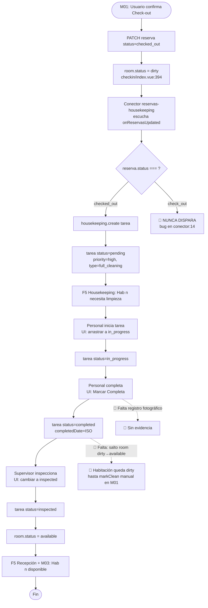

# FRD · M07 — Housekeeping Inteligente

> **Módulo de limpieza y estados de habitación.** Documentado siguiendo `00-MASTER.md`, extrayendo el comportamiento del código real de `backend/src/modules/housekeeping/`, `backend/src/connectors/reservas-housekeeping.ts`, `backend/src/composition-root.ts` y `frontend/src/pages/housekeeping/index.vue`.
>
> Todo lo documentado acá está **extraído del código real**. La columna "Gap" marca lo que hoy NO cumple el modelo canónico y hay que corregir. Las marcas 🔴 identifican **stubs / no implementado / bug**.

**Módulo:** M07 — Housekeeping Inteligente
**Pantallas cubiertas:** Housekeeping (`/panel/housekeeping`)
**Servicios frontend:** `OperationsService.housekeeping` (CRUD genérico vía `makeCrud('housekeeping')` en `Operations.service.ts`)
**Servicios backend:** módulo `housekeeping` · conector `reservas-housekeeping`
**Endpoint base:** `/api/housekeeping`

---

## 1. Modelo de datos (fuente de verdad)

### 1.1 Tarea de Housekeeping (`housekeeping.status`) — estado de la TAREA

> Modelo leído de `backend/src/modules/housekeeping/model.ts:5-19` y `frontend/src/pages/housekeeping/index.vue:395-400`.

| Estado | Significado | Color badge (UI) | ¿Genera trabajo? |
|--------|-------------|------------------|-------------------|
| `pending` | Tarea creada, esperando ser iniciada | orange | Sí (en cola) |
| `in_progress` | Personal trabajando en la habitación | cyan | Sí (en curso) |
| `completed` | Limpieza finalizada, lista para inspección | teal | No (espera verificación) |
| `inspected` | Verificada por supervisor, habitación lista para huésped | purple | No (cierre) |

**Defaults del ORM (`model.ts:11-13`):** `type = "full_cleaning"` · `priority = "medium"` · `status = "pending"`.

### 1.2 Tipos de tarea (`housekeeping.type`)

Leído de `frontend/src/pages/housekeeping/index.vue:412-414` (`TYPE_LABELS`, `TYPE_ICONS`, `TYPE_COLORS`):

| Clave backend | Label UI | Icono | Borde Kanban |
|---------------|----------|-------|--------------|
| `full_cleaning` | Full Cleaning | 🧹 | cyan-500 |
| `quick_cleaning` | Quick Clean | ✨ | teal-500 |
| `deep_cleaning` | Deep Clean | 🧼 | blue-600 |
| `inspection` | Inspection | 🔍 | purple-500 |
| `maintenance` | Maintenance | 🔧 | amber-500 |

> ⚠ **INCONSISTENCIA DETECTADA (Gap #2 — bug):** `frontend/src/pages/housekeeping/index.vue:233-241` el `<select>` "Tipo de Tarea" envía strings en **español** (`"Limpieza completa"`, `"Cambio de ropa"`, etc.), pero `TYPE_LABELS` y `TYPE_ICONS` esperan claves en **inglés** (`full_cleaning`, `quick_cleaning`…). Las tareas creadas desde la UI nunca matchean → se renderizan con label crudo y sin icono.

### 1.3 Prioridad (`housekeeping.priority`)

Leído de `frontend/src/pages/housekeeping/index.vue:410` (`PRI_LABELS`) y `:494-508` (`priorityClass` / `priorityBadgeClass`):

| Clave | Label UI | Color |
|-------|----------|-------|
| `low` | Low | surface (gris) |
| `medium` | Normal | gold/ámbar |
| `high` | High | coral |
| `urgent` | Urgent | red (sólido) |

### 1.4 Estados de Habitación — ciclo de vida cross-módulo

> **IMPORTANTE — reconciliación con M01 §1.2.** M07 **NO es dueño** del estado de la habitación. El dueño es el módulo `habitaciones` (M01). M07 solo lee `room.id` para asociar tareas y muestra `room.number`/`room.floor` desde `roomStore`. Los estados de habitación son los 5 definidos en `M01-PMS-Central.md §1.2`:

| Estado `room.status` | Significado en M07 | Color M01 | ¿Vendible? |
|----------------------|---------------------|-----------|-----------|
| `available` | Limpia y lista | teal | Sí |
| `occupied` | Huésped adentro (no requiere tarea) | coral | No |
| `dirty` | 🔴 Pendiente de limpieza (post check-out) — **debe** tener tarea M07 | gold | No |
| `cleaning` | Personal limpiando — la tarea M07 asociada debería estar `in_progress` | cyan | No |
| `out_of_service` | Fuera de servicio (mantenimiento/avería) | gray | No |

> 🔴 **GAP CRÍTICO — desconexión de estados (Gap #1):** El modelo de TAREA M07 (`pending/in_progress/completed/inspected`) **no está vinculado al modelo de HABITACIÓN** (`dirty/cleaning/available`). Cuando una tarea pasa a `completed`/`inspected`, **la habitación NO cambia de estado** — queda en `dirty` para siempre salvo que un operador pulse manualmente "Marcar Limpia" en el dashboard M01 (`M01-PMS-Central.md §5.1`). El flujo "completada → hab disponible" del brief del módulo **NO existe**. Ver §7 Gap #1.

### 1.5 Campos del modelo (`model.ts:4-19`)

| Campo | Tipo | Required | Default | Notas |
|-------|------|----------|---------|-------|
| `id` | string | sí | — | PK. El conector le inyecta `crypto.randomUUID()` (`reservas-housekeeping.ts:17`) |
| `roomId` | string | sí | — | FK lógica a `habitaciones.id` |
| `hotelId` | string | sí | — | Multi-tenant; indexed |
| `staffId` | string | no | — | Asignación. 🔴 El frontend usa `newTask.assignedTo` (nombre del personal), NO un id estable — ver Gap #5 |
| `type` | string | no | `full_cleaning` | Ver §1.2 |
| `priority` | string | no | `medium` | Ver §1.3 |
| `status` | string | no | `pending` | Ver §1.1 |
| `notes` | text | no | — | Instrucciones especiales |
| `assignedDate` | string | no | — | Hora de asignación/inicio (proxy de "start time") |
| `completedDate` | string | no | — | Hora de finalización (`completeTask` setea `new Date().toISOString()` — `index.vue:561`) |
| `cleaningItems` | json | no | — | Checklist serializado. 🔴 Se guarda como STRING y el frontend lo `JSON.parse` con try/catch (`index.vue:435`) — no hay schema de items |
| `createdAt` / `updatedAt` | auto | — | — | timestamps: true |

### 1.6 🔴 Campos del brief NO presentes en el modelo

| Campo del brief M07 | Estado |
|---------------------|--------|
| **Registro fotográfico (fotos)** | 🔴 **No implementado.** No existe campo `photos`/`evidence` en `model.ts`, ni endpoint de upload, ni UI. Ver §7 Gap #4. |
| **Control de tiempos por personal** (dashboard por empleado) | 🟡 **Parcial.** Existen `assignedDate` y `completedDate` por tarea, pero **no hay dashboard por personal** ni agregación. El staff está hardcoded (Gap #5). |
| **App móvil del equipo** | 🔴 **No implementada.** Solo existe la web app `/panel/housekeeping`. |
| **Asignación automática** | 🔴 **No implementada.** El botón "+ Asignar Tarea" abre un modal **manual** que solo lista tareas ya asignadas (no reasigna). Ver §7 Gap #3. |

---

## 2. Pantalla — Housekeeping (`/panel/housekeeping`)

> Ruta registrada en `frontend/src/router/index.ts:128-130`. Componente `@/pages/housekeeping/index.vue`.

Cabecera: toolbar con dos vistas (**Lista** / **Tablero Kanban**) + filtros por estado + botones "+ Asignar Tarea" y "+ Nueva Tarea". Stats de conteo (Pendientes / En Progreso / Completadas / Inspeccionadas / Total). Vista Lista = tabla 8 columnas. Vista Tablero = 4 columnas Kanban con **drag & drop** entre estados.

### 2.1 Decision Table

| Trigger (botón/acción) | Condición / Estado previo | Resultado | Modal/Toast (texto literal) | Errores posibles | Notif F5 |
|------------------------|---------------------------|-----------|------------------------------|------------------|----------|
| Toggle **"Lista" / "Tablero"** (`views` `index.vue:364-367`) | — | Cambia `activeView` (sin recargar datos) | — | — | — |
| Filtro **"Todas" / "Pendientes" / "En Progreso" / "Completadas"** (`statusFilters` `index.vue:369-374`) | — | Filtra `tasks` por `status` en vista Lista | — | — | — |
| Clic en tarjeta Kanban (`openViewTask` `:70`/`:516`) | existe `task` | Abre **modal "Detalle de Tarea"** (solo lectura) | Modal `detail` `max-w-lg`: muestra Hab, Tipo, Piso, Estado, Prioridad, Asignado, Tiempo Estimado, Inicio, Notas, Items | — | — |
| Clic en fila de tabla | existe `task` | Abre **modal "Detalle de Tarea"** | ídem | — | — |
| Botón **"Ver"** (tabla `:139`) | existe `task` | Abre modal Detalle | ídem | — | — |
| Botón **"Editar"** (`openEditTask` `:140`/`:531`) | existe `task` | 🔴 Abre modal "Nueva Tarea" **sin cargar** los datos de la tarea (`newTask` se resetea en `openNewTask`). No edita — ver Gap #6 | Modal `form`: "Nueva Tarea" | — | — |
| Botón **"Cambiar Estado"** (`openStatusModal` `:141`/`:536`) | existe `task` | Abre **modal "Cambiar Estado"** con 4 opciones (`pending`/`in_progress`/`completed`/`inspected`) + descripción | Modal `confirm` `max-w-md`: header "Cambiar Estado", muestra número de hab arriba | — | — |
| Seleccionar estado + confirmar (`changeStatus` `:567`) | estado ≠ actual | `PUT /api/housekeeping/:id` con `{ status: nuevo }`. Actualiza `task.status` en memoria | 🔴 **Hoy:** sin toast. **Target F1 success:** "Tarea {hab} → {estadoLabel}." | 🔴 **Hoy:** `alert(e?.message)` → **debe ser** Toast E6/E7 | **No implementada** (Target: si → `completed` → F5 Recepción "Hab {n} lista para inspección") |
| Drag tarea entre columnas Kanban (`onDrop` `:590`) | `draggedTask` set y `newStatus ≠ actual` | `PUT /api/housekeeping/:id` con `{ status: newStatus }` | 🔴 Sin toast. Target F1 success "Tarea movida a {col}." | 🔴 `alert(err?.message)` → Toast E6/E7 | — |
| Botón **"+ Nueva Tarea"** (`openNewTask` `:32`/`:521`) | — | Abre **modal form** vacío. Campos: Habitación*, Tipo Tarea*, Prioridad, Asignar a*, Notas | Modal `form` `max-w-lg`: header "Nueva Tarea" | — | — |
| Botón **"+ Asignar Tarea"** (`openAssignModal` `:29`/`:526`) | — | Abre **modal "Asignar Tareas Rápidas"**. 🔴 Solo muestra lista de tareas YA asignadas al staff seleccionado — no es una asignación real (`getTasksByStaff` `:464`). Lista desplegable de personal con 1 sola entrada hardcoded (Gap #5) | Modal `confirm` `max-w-lg`: header "Asignar Tareas Rápidas", botón único "Cerrar" | — | — |
| Botón **"Marcar Completa"** (modal detalle `:210`/`completeTask` `:559`) | `task.status ≠ completed` | `PUT /api/housekeeping/:id` con `{ status: 'completed', completedDate: ISO }`. Cierra modal y recarga | 🔴 Sin toast. **Target F1 success:** "Tarea de Hab {n} completada." | 🔴 `alert(e?.message)` → Toast E6/E7 | 🔴 **No implementada**. **Target:** F5 Recepción "Hab {n} lista para inspección"; al pasar a `inspected` → F5 "Hab {n} disponible" + liberar inventario (M03) |
| Botón **"Crear Tarea"** (`createTask` `:541`) | `roomNumber` y `type` no vacíos | `POST /api/housekeeping` con `{ roomId, hotelId, type, priority, status:'pending', notes, staffId }`. Cierra modal y recarga | 🔴 **Hoy:** si falta campo → **return silencioso** (sin feedback). **Target F3** inline "Habitación es obligatoria" + "Tipo de Tarea es obligatoria". En éxito: Target F1 success "Tarea creada para Hab {n}." | 🔴 **Hoy:** `alert(e?.message)` → Toast E6/E7. **Faltan E2** (ver §6) | — |
| Botón **"Cancelar" / "Cerrar" / ✕** (cualquier modal) | — | Cierra modal sin acción. `@click.self` en overlay también cierra | — | — | — |

**Resumen de feedback actual (estado real de la UI):**
- ❌ **Cero toasts** en toda la pantalla — ni éxito ni error.
- ❌ **3 usos de `alert()` nativo** (`createTask:556`, `completeTask:564`, `changeStatus:578`, `onDrop:603`) → violates F1 / F6 / E6 / E7.
- ❌ **Validación silenciosa** en `createTask` (return sin feedback si faltan campos).
- ❌ **Sin loading F6** en ningún botón de acción ("Crear Tarea", "Marcar Completa", "Cambiar Estado", drag-drop).
- ❌ **Sin estados vacíos** (skeleton, "sin tareas"). `loadData` envuelve todo en `try/catch` vacío (`:438`) — error de red invisible.
- ❌ **Sin caja ⚠** de consecuencias cross-módulo al completar/inspeccionar (debería avisar que libera la hab).

---

## 3. Flow — Ciclo de vida completo "Check-out → Limpieza → Hab disponible"

> Este es el flow **teorizado** por el brief. El diagrama marca con 🔴 los pasos rotos en el código actual.



### 3.1 Tabla de pasos numerada

| # | Paso | Estado real | Archivo |
|---|------|-------------|---------|
| 1 | M01 check-out → `reserva.status = 'checked_out'` | ✅ Implementado | `checkin/index.vue:394` |
| 2 | `room.status = 'dirty'` | ✅ Implementado | `checkin/index.vue` (M01 §2.1) |
| 3 | Conector escucha `onReservasUpdated` | 🟡 Registrado pero **condición incorrecta** | `reservas-housekeeping.ts:14` |
| 4 | Conector crea tarea M07 (`full_cleaning`, `high`, `pending`) | 🔴 **Bug**: la condición `=== 'check_out'` jamás se cumple. Debería ser `=== 'checked_out'` | `reservas-housekeeping.ts:14` vs `checkin/index.vue:394` |
| 5 | F5 a Housekeeping "Hab {n} necesita limpieza" | 🔴 No emitida (el `setSockets` del conector no genera F5) | `reservas-housekeeping.ts` |
| 6 | Staff inicia tarea → `in_progress` | ✅ UI: drag a columna "En Progreso" | `index.vue:590` `onDrop` |
| 7 | Staff completa → `completed` + `completedDate` | ✅ UI: botón "Marcar Completa" | `index.vue:559` `completeTask` |
| 8 | Registro fotográfico al completar | 🔴 **No implementado** | — |
| 9 | Supervisor inspecciona → `inspected` | ✅ UI: cambiar estado a "Inspeccionada" | `index.vue:567` `changeStatus` |
| 10 | Al `completed`/`inspected` → `room.status = 'available'` | 🔴 **No existe**. La hab queda `dirty` | — |
| 11 | F5 a Recepción + M03 "Hab disponible, liberar inventario" | 🔴 No emitida | — |
| 12 | App móvil del equipo recibe tarea y reporta avance | 🔴 No existe app móvil | — |

### 3.2 Caminos de error del flow

| Rama | Código | Texto canónico target |
|------|--------|------------------------|
| API 5xx / timeout al crear tarea (conector) | E6 | "No hay conexión. Reintentá en unos segundos." |
| `validateSchema` rechaza payload en POST | E1 | "Habitación es obligatoria" / "Hotel es obligatorio" |
| `roomId` no existe en `habitaciones` ( FK lógica rota ) | 🔴 **No validado** — debería ser E2 "La habitación no existe" | — |
| Usuario sin permiso (`hotel_admin`/`super_admin`) hace POST/PUT/DELETE | E3 | "No tenés permiso para crear/modificar tareas." (401 → redirect login; 403 → toast) |
| Concurrencia (otro staff cambia estado a la vez) | 🔴 **No manejado** — debería ser E5 modal "Alguien actualizó esto. ¿Recargar?" | — |

---

## 4. Consecuencias cross-módulo (eventos que M07 debería disparar o consumir)

> Tabla objetivo. Marca 🔴 lo que **no existe hoy** en el código.

| Acción en | Módulo afectado | Efecto esperado | Notificación F5 esperada | Estado real |
|-----------|-----------------|------------------|---------------------------|-------------|
| M01 Check-out confirmado | **M07 Housekeeping** | Crear tarea de limpieza (`full_cleaning`, `high`, `pending`) | "Hab {n} necesita limpieza" | 🔴 Conector registrado pero **bug en condición** (`check_out` vs `checked_out`) → no dispara |
| M07 tarea → `in_progress` | M01 Habitaciones | `room.status = cleaning` (coherencia visual en M01) | — | 🔴 No sincronizado |
| M07 tarea → `completed` | M01 Habitaciones / M03 Motor de Reservas | Marcar hab lista para inspección; al `inspected` → `room.status = available` y liberar inventario | "Hab {n} disponible" | 🔴 **No implementado** — la hab queda `dirty` |
| M07 tarea → `inspected` | M03 Motor de Reservas | Liberar para venta directa/OTA | "Hab {n} lista para venta" | 🔴 No emitida |
| M07 detecta avería durante limpieza | M08 Mantenimiento | Crear ticket de mantenimiento | "Nuevo ticket: avería en Hab {n}" | 🔴 No existe conector `housekeeping-mantenimiento`. El tipo `maintenance` existe como `type` pero no genera ticket |
| M08 crea ticket para una hab | M07 Housekeeping | `room.status = out_of_service` podría disparar tarea de "limpieza de corte" | — | 🔴 No conectado |
| M07 tarea creada manualmente | M24 Staff App / notificaciones | Push al staff asignado | "Nueva tarea asignada: Hab {n}" | 🔴 Sin app móvil, sin push |

---

## 5. Reglas de negocio a validar en backend (E2)

> El backend actual (`service.ts`, `controller.ts`, `validators/schema.ts`) **solo valida tipos** (que sean strings). **No valida ninguna regla de negocio.** Estas son las reglas que el backend **debería** rechazar con HTTP 400 `BUSINESS_RULE`:

| # | Regla | Texto E2 target | Estado |
|---|-------|------------------|--------|
| 1 | Asignar tarea a `staffId` que no es un empleado activo del hotel | "No se pudo asignar: el personal {staffId} no existe o no pertenece al hotel." | 🔴 No validado. Hoy `staffId` es un string libre — el frontend manda el **nombre** del staff, no un id |
| 2 | Marcar `completed` sin fotos si la política del hotel lo exige | "No se pudo completar: se requiere al menos 1 foto de evidencia." | 🔴 No implementado (no hay campo fotos, ver §7 Gap #4) |
| 3 | Marcar `completed` una tarea ya `completed`/`inspected` | "La tarea ya está completada." | 🔴 No validado |
| 4 | Crear tarea para `roomId` inexistente o de otro hotel | "La habitación no existe o no pertenece a tu hotel." | 🔴 No validado (FK lógica) |
| 5 | Pasar de `inspected` a `pending`/`in_progress` (reapertura sin permiso) | "No se puede reabrir una tarea inspeccionada sin permiso de supervisor." | 🔴 No validado |
| 6 | Marcar `inspected` una tarea que no pasó por `completed` | "No se puede inspeccionar: la tarea no fue completada." | 🔴 No validado |
| 7 | Crear tarea para una hab `available` sin justificación (sobrescribe limpieza innecesaria) | "La Hab {n} ya está limpia. ¿Confirmar tarea extra?" | 🔴 No validado |
| 8 | Tipo de tarea fuera del enum permitido (`full_cleaning`/`quick_cleaning`/`deep_cleaning`/`inspection`/`maintenance`) | "Tipo de tarea inválido." | 🔴 No validado — el schema (`validators/schema.ts:9`) solo exige `type: 'string'`. Acepta cualquier string |
| 9 | Estado fuera del enum (`pending`/`in_progress`/`completed`/`inspected`) | "Estado inválido." | 🔴 No validado — `status: 'string'` libre |
| 10 | Prioridad fuera del enum (`low`/`medium`/`high`/`urgent`) | "Prioridad inválida." | 🔴 No validado |

> **Nota sobre permisos:** Las rutas (`index.ts:43-47`) SÍ aplican `auth.authenticate('hotel_admin', 'receptionist', 'super_admin')` en GET y `auth.authenticate('hotel_admin', 'super_admin')` en POST/PUT/DELETE. **Recepcionistas pueden ver pero no mutar** — correcto. Pero **no hay rol `housekeeper`** (el personal de limpieza no tiene identidad en el sistema; ver Gap #5).

---

## 6. Gap analysis (con `archivo:línea`)

### Gap #1 — 🔴 BUG: conector de check-out NUNCA dispara (BLOCKER)
- **Dónde:** `backend/src/connectors/reservas-housekeeping.ts:14`
- **Síntoma:** La condición es `if (reserva.status === 'check_out')`, pero el frontend setea `'checked_out'` (`frontend/src/pages/checkin/index.vue:394`). El conector está registrado (`composition-root.ts:86`) pero **jamás crea una tarea**.
- **Fix:** `=== 'checked_out'` o normalizar el enum de estados de reserva.

### Gap #2 — 🔴 BUG: claves de tipo en español vs inglés
- **Dónde:** `frontend/src/pages/housekeeping/index.vue:233-241` (select envía `"Limpieza completa"`) vs `:412` `TYPE_LABELS` keys en inglés (`full_cleaning`). Y `backend/src/migrations/1781807164065_create_housekeeping.ts:9` crea defaults en español `'limpieza_completa'`, `'media'`, `'pendiente'` — **viola la regla DB English-Only** del CLAUDE.md.
- **Síntoma:** Las tareas creadas por UI muestran el string crudo sin icono ni color. Las creadas por la migración arrancan con claves que no matchean `TYPE_LABELS`.

### Gap #3 — 🔴 Asignación automática no implementada
- **Dónde:** `frontend/src/pages/housekeeping/index.vue:526-529` `openAssignModal`. El botón "+ Asignar Tarea" abre un modal que solo **lista** tareas ya asignadas (`getTasksByStaff` `:464`). No balancea carga, no sugiere personal, no reasigna.
- **Síntoma:** No existe algoritmo de auto-asignación (round-robin, menor carga, por piso). El staffId se setea solo desde el select de "Nueva Tarea".

### Gap #4 — 🔴 Registro fotográfico no implementado
- **Dónde:** ausente en `backend/src/modules/housekeeping/model.ts` (sin campo `photos`/`evidence`), ausente en `validators/schema.ts`, ausente en `index.vue` (sin input file, sin preview).
- **Síntoma:** No se puede adjuntar evidencia al completar una tarea. La regla E2 "marcar completada sin foto" (§5 #2) es imposible de aplicar.

### Gap #5 — 🔴 Staff hardcoded / sin identidad de personal
- **Dónde:** `frontend/src/pages/housekeeping/index.vue:402-404`
  ```ts
  const housekeepingStaff = [
    { id: 1, name: 'Housekeeping', role: 'Staff' },
  ]
  ```
- **Síntoma:** Solo 1 entrada falsa. No se consulta `/api/usuarios?role=housekeeper`. No existe rol `housekeeper` en `auth.authenticate(...)` (`index.ts:43-47`). El `staffId` guardado es el **nombre** que elige el operador (`newTask.assignedTo` `:552`), no un id estable — imposibleTrackear tiempos por persona.

### Gap #6 — 🔴 Botón "Editar" no edita
- **Dónde:** `frontend/src/pages/housekeeping/index.vue:531-534` `openEditTask` abre `showNewModal` pero **no carga** `selectedTask` en `newTask` (solo setea `selectedTask.value = task`). El modal abre vacío en modo "Nueva Tarea".
- **Síntoma:** No existe edición real de tareas. Solo se puede mutar `status` vía "Cambiar Estado".

### Gap #7 — 🔴 Delete no expuesto en UI
- **Dónde:** backend `controller.ts:44-48` y `index.ts:47` exponen `DELETE /api/housekeeping/:id`. El frontend `OperationsService.housekeeping.delete` existe (`Operations.service.ts:9`) pero **ningún botón lo invoca** en `index.vue`.
- **Síntoma:** Tarea creada por error no se puede eliminar desde la UI.

### Gap #8 — 🔴 Sin conexión de estados tarea ↔ habitación
- **Dónde:** ausente. No existe conector `housekeeping-habitaciones` (solo existe `habitaciones-canales.ts`). El módulo `housekeeping/service.ts` no emite eventos que `habitaciones` escuche.
- **Síntoma:** Completar/inspeccionar una tarea **no cambia** `room.status`. La hab queda `dirty` eternamente. Ver §1.4 y §4.

### Gap #9 — 🟡 Control de tiempos parcial
- **Dónde:** `model.ts:15-16` (`assignedDate`, `completedDate`), `index.vue:433` (muestra `startTime`), `index.vue:561` (setea `completedDate`).
- **Síntoma:** Hay timestamps por tarea, pero **no hay dashboard de tiempos por personal**, ni duración calculada, ni SLA por tipo de limpieza. `assignedDate` se interpreta como `startTime` (`index.vue:433` slice 11-16) pero el campo semánticamente es "fecha de asignación", no "fecha de inicio" — confuso.

### Gap #10 — 🔴 App móvil del equipo no existe
- **Dónde:** ausente. No hay app móvil (React Native/Flutter/PWA standalone), ni endpoints `/api/housekeeping/mobile/*`, ni push notifications (F5 push).
- **Síntoma:** El personal de limpieza debe usar la web app en `/panel/housekeeping` desde un navegador — no hay experiencia móvil dedicada.

### Gap #11 — 🟡 Seed roto
- **Dónde:** `backend/src/seeds/housekeeping.ts:7-12` inyecta campos `{ nombre, activo }` que **no existen** en el modelo (`model.ts:4-19` usa `roomId`, `hotelId`, `staffId`, `type`…).
- **Síntoma:** `bun run db:seed` falla o inserta registros corruptos.

### Gap #12 — 🔴 Feedback UI 100% fuera de standard (recopilación)
- **Dónde:** `frontend/src/pages/housekeeping/index.vue`
  - `createTask:556` — `alert(e?.message || 'Error al crear tarea')`
  - `completeTask:564` — `alert(e?.message || 'Error al completar tarea')`
  - `changeStatus:578` — `alert(e?.message || 'Error al cambiar estado')`
  - `onDrop:603` — `alert(err?.message || 'Error moving task')`
  - `loadData:438` — `catch { /* empty */ }` (error de red invisible)
  - `createTask:542` — `if (!newTask.value.roomNumber || !newTask.value.type) return` (validación silenciosa)
- **Síntoma:** Cero toasts F1, cero loading F6, cero inline F3, cero alertas de página F4. **Toda la pantalla viola el modelo canónico** (`00-MASTER.md`).

---

## 7. Checklist de verificación M07

Estado actual vs. target. Marcar cuando se cumpla.

### Pantalla Housekeeping — feedback
- [ ] Reemplazar 4 `alert()` por Toast E6/E7 (Gap #12)
- [ ] Toast success F1 al crear, completar, cambiar estado, mover (drag-drop)
- [ ] Loading F6 en botones "Crear Tarea", "Marcar Completa", "Cambiar Estado"
- [ ] Validación inline F3 al blur de Habitación / Tipo de Tarea (reemplazar `return` silencioso)
- [ ] Skeleton mientras carga lista (`loadData`)
- [ ] Estado vacío "Sin tareas — crear la primera" con ilustración + CTA
- [ ] Caja ⚠ "La habitación pasará a disponible y se liberará para venta" al `completed`/`inspected`

### Pantalla Housekeeping — funcionalidad
- [ ] Botón "Editar" realmente carga la tarea (Gap #6)
- [ ] Botón "Eliminar" expuesto (Gap #7) con modal `danger` + anti-clic 1.5s
- [ ] Select "Tipo de Tarea" envía claves en inglés (Gap #2)
- [ ] Select "Asignar a" trae personal real del backend (Gap #5)
- [ ] `housekeepingStaff` desde API, no hardcoded (Gap #5)
- [ ] Asignación automática o al menos sugerencia (Gap #3)
- [ ] Subida de fotos al completar (Gap #4)

### Backend
- [ ] Fix conector: `'checked_out'` (Gap #1)
- [ ] Fix migración: defaults en inglés (Gap #2)
- [ ] Fix seed: usar campos del modelo (Gap #11)
- [ ] Validar enum `type` / `status` / `priority` en schema (§5 #8/#9/#10)
- [ ] Validar `roomId` existente y del hotel (§5 #4)
- [ ] Validar transiciones de estado (§5 #3/#5/#6)
- [ ] Rol `housekeeper` en `auth.authenticate` + endpoints mobile
- [ ] Conexión `housekeeping-habitaciones`: completar → `room.status=cleaning`, inspeccionar → `room.status=available` (Gap #8)

### Cross-módulo
- [ ] F5 a Housekeeping al check-out (Gap #1 side-effect)
- [ ] F5 a Recepción + M03 al `inspected` (Gap #8)
- [ ] Conector `housekeeping-mantenimiento` para `type=maintenance` (§4)
- [ ] Dashboard de tiempos por personal (Gap #9)
- [ ] App móvil / push (Gap #10)

---

## 8. Pendiente de documentar en M07 (próximas iteraciones)

- [ ] Matriz de permisos por rol: `hotel_admin` (todo), `receptionist` (ver), `housekeeper` (ver sus tareas + completar), `super_admin` (todo).
- [ ] SLA por tipo de limpieza (¿cuánto tarda un `full_cleaning` vs `quick_cleaning`?).
- [ ] Plantillas de `cleaningItems` (checklist por tipo).
- [ ] Inspección con scoring (1-5 estrellas) — el estado `inspected` existe pero no guarda score ni inspector.
- [ ] Reporte diario de productividad del equipo (tareas completadas por persona, tiempo medio).
- [ ] Integración con lost & found (objetos olvidados durante limpieza).

---

*Este documento sigue el molde de `M01-PMS-Central.md`. Replicar la misma estructura (1 modelo de datos → decision tables → flows → cross-módulo → reglas E2 → gaps con file:line → checklist) para cada módulo M02–M26.*
