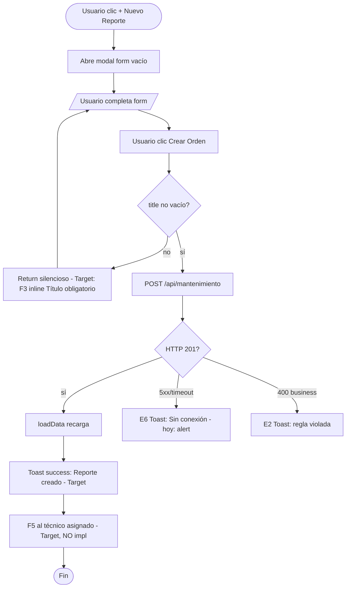
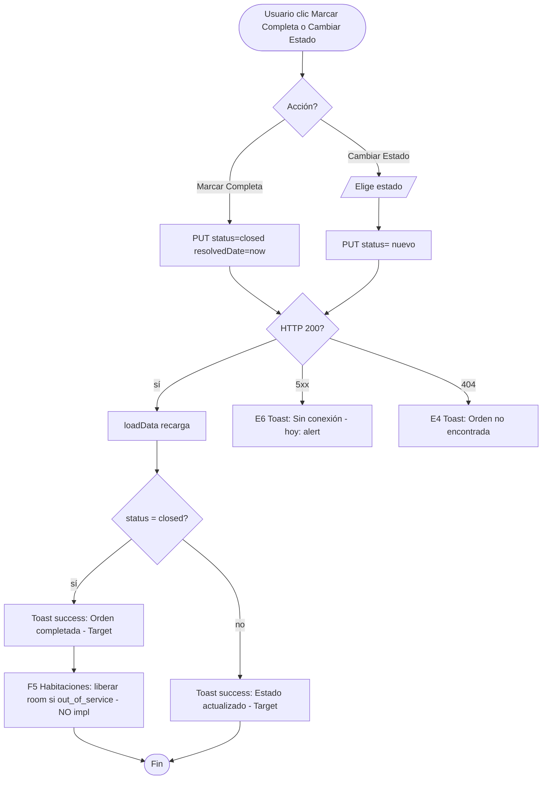

# FRD · M08 — Mantenimiento (Órdenes de trabajo, asignación a técnico, historial, preventivo)

> Documento extraído del **código real** de `backend/src/modules/mantenimiento/`, `backend/src/modules/tickets/`, `backend/src/composition-root.ts` y `frontend/src/pages/maintenance/index.vue`. La columna "Gap" marca lo que hoy NO cumple el modelo canónico (`00-MASTER.md`) y debe corregirse.
>
> ⚠ **Lectura importante:** el backend expone **DOS** módulos relacionados que NO están conectados entre sí:
> - **`mantenimiento`** (tabla `maintenance`) → es el que usa la pantalla `/panel/maintenance`. Son *órdenes de trabajo* (averías, reparaciones).
> - **`tickets`** (tabla `tickets`) → módulo de *tickets de soporte/helpdesk* con `userId` + `messages` (hilo de mensajes). Hoy solo lo lee el **super-admin** en el endpoint de monitoring (`composition-root.ts:363`). **NO aparece en la UI de mantenimiento.**

**Módulo:** M08 — Mantenimiento
**Pantallas cubiertas:** Mantenimiento (`/panel/maintenance`) — vistas Lista + Tablero Kanban.
**Servicios frontend:** `Operations.service.ts` → `OperationsService.mantenimiento` (CRUD genérico) y `OperationsService.tickets` (CRUD genérico, sin consumidor UI).
**Servicios backend:** módulos `mantenimiento` y `tickets`.
**Scope previsto (no todo implementado):** tickets de mantenimiento por personal, huéspedes o sensores · asignación a técnico · historial por equipo/asset · calendario preventivo · registro fotográfico.

---

## 1. Modelo de datos (fuente de verdad)

### 1.1 Estados de orden (`maintenance.status`)

El valor por defecto en BD es `"open"` (`model.ts:15`). La pantalla maneja **4 estados** en el Kanban, pero hay **inconsistencia** entre filtros, Kanban, y los mapas de color/label.

| Estado (DB) | Label UI | Significado | Color badge UI |
|-------------|----------|-------------|----------------|
| `open` | Abierta | Problema reportado, esperando asignación | orange |
| `in_progress` | En Progreso | Técnico trabajando | cyan |
| `waiting` | Esperando | Esperando repuestos o aprobación | purple |
| `closed` | Completada | Resuelto / verificado | teal |

> ⚠ **INCONSISTENCIA #1 (Gap de estados):** el scope previsto define `abierto/en_proceso/resuelto/cerrado`. La implementación real **omite `resuelto`** (pasa de `waiting`/`in_progress` directo a `closed`) y agrega `waiting` (que no estaba en el spec).
>
> ⚠ **BUG DE MAPEO #2:** `statusLabel` y `statusClass` (`index.vue:445-453`, `index.vue:435-443`) mapean la clave **`completed`**, pero `completeOrder` y los filtros usan **`closed`**. Resultado: las órdenes cerradas **no reciben color/label** y caen al fallback gris. Falta alinear clave → usar `closed` en todos los mapas.

### 1.2 Prioridades (`maintenance.priority`)

Default en BD: `"medium"` (`model.ts:14`). El modelo es `string` libre (sin enum).

| Valor esperado (DB) | Label UI (mapeo) | Color badge |
|---------------------|-----------------|-------------|
| `low` | Low | gris |
| `medium` | Normal | blue |
| `high` | High | orange |
| `urgent` | Urgent | red |

> ⚠ **INCONSISTENCIA #3:** el formulario **"Nuevo Reporte"** (`index.vue:252-256`) envía prioridades en **ESPAÑOL** (`Baja`/`Normal`/`Alta`/`Urgente`) directamente a la API (`createOrder` `index.vue:506`), pero `PRI_LABELS` (`index.vue:386`) espera claves **INGLESES** (`high/medium/low/urgent`). Al recargar, una orden creada con "Alta" NO machea `PRI_LABELS` y se muestra tal cual. Las stats de "Urgentes" (`index.vue:358`) comparan `priority === 'High' || 'Urgent'` y **no detectan** una prioridad guardada como "Alta"/"Urgente".

### 1.3 Categorías (`maintenance.category`)

Default en BD: `"general"` (`model.ts:13`). String libre.

| Origen | Valores |
|--------|---------|
| Backend (default / `CAT_LABELS` `index.vue:387`) | `hvac`, `plumbing`, `electronics`, `locks`, `general`, `carpentry`, `painting` (INGLÉS) |
| Formulario UI (`index.vue:239-247`) | `Eléctrico`, `Plomería`, `Aire Acondicionado`, `Carpintería`, `Pintura`, `Electrónica`, `Limpieza`, `Otro` (ESPAÑOL) |

> ⚠ **INCONSISTENCIA #4:** mismatch idioma categoría (igual que prioridad). `createOrder` envía el valor en español (`index.vue:505`), `CAT_LABELS` no machea, se muestra el string crudo.

### 1.4 Campos del modelo `maintenance` (`model.ts:5-20`)

| Campo | Tipo | Req | Default | file:line |
|-------|------|-----|---------|-----------|
| `id` | string | sí | — | `model.ts:7` |
| `hotelId` | string | sí, indexed | — | `model.ts:8` |
| `roomId` | string | no | — | `model.ts:9` |
| `roomNumber` | string | no | — | `model.ts:10` |
| `title` | string | sí | — | `model.ts:11` |
| `description` | text | no | — | `model.ts:12` |
| `category` | string | no | `"general"` | `model.ts:13` |
| `priority` | string | no | `"medium"` | `model.ts:14` |
| `status` | string | no | `"open"` | `model.ts:15` |
| `assignedTo` | string | no | — | `model.ts:16` |
| `estimatedCost` | number | no | `0` | `model.ts:17` |
| `reportedDate` | string | no | — | `model.ts:18` |
| `resolvedDate` | string | no | — | `model.ts:19` |

### 1.5 Modelo `tickets` (helpdesk, `tickets/model.ts:4-19`) — NO usado en la UI de mantenimiento

| Campo | Tipo | Req | Default | file:line |
|-------|------|-----|---------|-----------|
| `hotelId` | string | sí | — | `tickets/model.ts:8` |
| `userId` | string | sí | — | `tickets/model.ts:9` |
| `subject` | string | sí | — | `tickets/model.ts:10` |
| `category` | string | no | `"technical"` | `tickets/model.ts:11` |
| `priority` | string | no | `"medium"` | `tickets/model.ts:12` |
| `status` | string | no | `"open"` | `tickets/model.ts:13` |
| `description` | text | no | — | `tickets/model.ts:14` |
| `assignedTo` | string | no | — | `tickets/model.ts:15` |
| `messages` | json | no | `[]` | `tickets/model.ts:16` |

> ⚠ **NO IMPLEMENTADO en el modelo:** `equipo`/`asset` (historial por equipo), `source` (origen: personal/huésped/sensor), fotos/registro fotográfico, plan preventivo/recurrencia, SLA. Estos son **gaps del scope M08** (ver §7).

---

## 2. Pantalla — Mantenimiento (`/panel/maintenance`)

Header "Mantenimiento" (`index.vue:3`). Toolbar: toggle **Lista/Tablero** + filtros de estado + botón **"+ Nuevo Reporte"**. Stats: Abiertas · En Progreso · Urgentes · Completadas · Costo Total (`index.vue:351-362`).

### 2.1 Decision Table

| Trigger (botón/acción) | Condición / Estado previo | Resultado | Modal/Toast (texto literal) | Errores posibles | Notif F5 |
|------------------------|---------------------------|-----------|------------------------------|------------------|----------|
| Toggle **"Lista" / "Tablero"** (`index.vue:339-342`) | — | Cambia `activeView` (sin recargar datos) | — | — | — |
| Filtro **"Todas" / "Abiertas" / "En Progreso" / "Completadas"** (`index.vue:344-349`) | — | Filtra por `status` (Nota: **falta "Esperando"** en filtros aunque existe en Kanban) | — | — | — |
| Botón **"+ Nuevo Reporte"** (`index.vue:28`) | — | Abre **modal form** "Nuevo Reporte de Mantenimiento" (`index.vue:213`) con campos vacíos | Modal `form` | — | — |
| Botón **"Ver"** (fila, `index.vue:137`) | — | Abre **modal detail** "Detalle de Orden" (`index.vue:151`) | Modal `detail` | — | — |
| Botón **"Editar"** (fila, `index.vue:138`) | — | Abre **modal form** — **GAP:** `openEditOrder` (`index.vue:489-492`) setea `selectedOrder` pero el form está bindeado a `newOrder` (vacío) → **NO precarga los datos**. Editar no funciona. | Modal `form` | — | — |
| Botón **"Cambiar Estado"** (fila, `index.vue:139`) | — | Abre **modal confirm** "Cambiar Estado" (`index.vue:290`) con 4 opciones | Modal `confirm` | — | — |
| Select de estado (dentro modal "Cambiar Estado", `index.vue:299-313`) | clic en opción | `changeStatus` → PUT `status` (`index.vue:526-535`) | **Target:** Toast success "Orden actualizada a {estado}." **Hoy:** sin toast, solo cierra modal | E6 "Sin conexión" (`alert` `index.vue:534`) | **Target:** si pasa a `closed` → F5 Recepción "Hab {n} disponible" (NO implementado) |
| Drag de tarjeta a columna Kanban (`index.vue:62-64`, `onDrop` `index.vue:555-565`) | `status !== newStatus` | PUT `status` al soltar | **Hoy:** sin toast | E6 (`alert` `index.vue:563`) | — |
| Botón **"Crear Orden"** (`index.vue:281`) con `title` vacío | `!newOrder.title` | **No envía** — return silencioso (`index.vue:500`). **Hoy:** cero feedback. **Target:** F3 inline "Título obligatorio" | — | E1 (no implementado) | — |
| Botón **"Crear Orden"** (`index.vue:281`) con `title` válido | datos ok | POST `/api/mantenenimiento` (`createOrder` `index.vue:499-516`). Envía `status:'open'`, `category`/`priority` en español (ver §1.2/§1.3) | **Target:** Toast success "Reporte de mantenimiento creado." **Hoy:** solo `loadData()` + cierra modal, **sin toast** | E2 (no validado) · E6 (`alert` `index.vue:515`) | **Target:** F5 a técnico asignado "Nuevo ticket: {título}" (NO implementado) |
| Botón **"Marcar Completa"** (`index.vue:204`, modal detail) | orden no `closed` | PUT `{status:'closed', resolvedDate:now}` (`completeOrder` `index.vue:518-524`) | **Target:** Toast success "Orden completada." **Hoy:** sin toast + **BUG:** `statusClass`/`statusLabel` no reconocen `closed` (usan `completed`) | E6 (`alert` `index.vue:523`) | **Target:** F5 Habitaciones (liberar room si estaba `out_of_service`) — NO implementado |
| Botón **"Cancelar"** (`index.vue:280`, `index.vue:317`, `index.vue:203` "Cerrar") | modal abierto | Cierra sin acción | — | — | — |
| Clic en fondo oscuro (`@click.self`) | modal abierto | Cierra modal sin acción | — | — | — |

**Gaps actuales (Mantenimiento):**
- ❌ `alert()` en `createOrder` (`index.vue:515`), `completeOrder` (`index.vue:523`), `changeStatus` (`index.vue:534`), `onDrop` (`index.vue:563`) → Toast E6/E7.
- ❌ Sin estado loading (F6) en **ningún** botón de acción.
- ❌ Sin Toast success en crear/completar/cambiar estado.
- ❌ Validación solo de `title`; el form marca Ubicación/Categoría/Asignar a como `*` obligatorios (`index.vue:223,236,259`) pero **no se validan** (`createOrder` `index.vue:500`).
- ❌ `openEditOrder` no precarga el form (Gap #5).
- ❌ `loadData()` traga errores con `catch { /* empty */ }` (`index.vue:408`) → sin feedback de falla de carga (debería ser Alert F4 + reintentar).

### 2.2 Flow — Crear Reporte de Mantenimiento

### 2.3 Flow — Resolver / Cerrar orden (Marcar Completa + Cambiar Estado)

---

## 3. Consecuencias cross-módulo (eventos M08)

| Acción en M08 | Módulo afectado | Efecto | Estado actual |
|---------------|-----------------|--------|---------------|
| Orden creada (avería reportada) | Habitaciones (M01) | Si viene de room → marcar `out_of_service` + bloquear reservas futuras | **NO cableado** (no hay conector `mantenimiento-habitaciones`) |
| Orden cerrada / `closed` | Habitaciones (M01) | Liberar room (`out_of_service` → `dirty`/`available`) | **NO implementado** — `completeOrder` solo setea `resolvedDate` |
| Orden creada por huésped | Notificaciones (M22) / Staff (M24) | F5 a recepción + técnico asignado | **NO implementado** — no hay campo `source` ni socket consumido |
| Housekeeping detecta avería (M07) | Mantenimiento (M08) | Derivar tarea de limpieza a ticket de mantenimiento | **NO cableado** (existe conector `reservas-housekeeping` pero **no** `housekeeping-mantenimiento`) |
| Habitación → `out_of_service` (M01) | Mantenimiento (M08) | Crear orden automáticamente | **NO cableado** |
| Sensor IoT reporta falla | Mantenimiento (M08) | Ticket auto-creado con `source: 'sensor'` | **NO implementado** — sin integración IoT ni campo `source` |
| Orden con `estimatedCost` | Contabilidad/Gastos (M19) | Sumar al centro de costo del hotel | **NO implementado** — `estimatedCost` solo se acumula en stat local (`index.vue:354`) |

> ⚠ **Conexores inexistentes:** en `composition-root.ts` solo hay 2 conectores (`reservas-housekeeping` `:86`, `habitaciones-canales` `:90`). **Ninguno** toca mantenimiento. El efecto "M08 resuelto → libera room" (mencionado como target en `M01-PMS-Central.md` §6) **no existe en código**.

---

## 4. Reglas de negocio a validar en backend (E2)

El backend hoy **no implementa reglas E2** (el service es CRUD puro). Estas son las reglas que **debería** rechazar (HTTP 400 `BUSINESS_RULE`):

1. **Cerrar orden sin asignar técnico** → "No se puede cerrar la orden: falta asignar un técnico."
2. **Cerrar orden que ya está `closed`** → "La orden ya está completada."
3. **Asignar a un técnico inexistente / sin rol maintenance** → "El técnico asignado no es válido."
4. **`estimatedCost` negativo** → "El costo estimado no puede ser negativo." (hoy el schema solo valida tipo `number`, `schema.ts:15`)
5. **Transición de estado inválida** (ej. `closed` → `open` sin reabrir explícito) → "Transición de estado no permitida."
6. **Crear orden sin `hotelId`** → ya cubierto por `CreateMantenimientoSchema` (`schema.ts:6` required) → E1.
7. **`title` fuera de rango** (2–200) → ya cubierto (`schema.ts:7`) → E1.

> Nota: el `MantenimientoValidator`/schema **NO valida enums** de `status`/`priority`/`category` — acepta cualquier string (`schema.ts:11-17`). Esto permite guardar estados/prioridades inválidas (raíz de los bugs de §1.2/§1.3).

---

## 5. Pantallas relacionadas (super-admin monitoring)

El endpoint `/api/admin/monitoring` (`composition-root.ts:362-375`) — solo `super_admin` — expone métricas del módulo **`tickets`** (no `maintenance`):

| Métrica | Filtro | file:line |
|---------|--------|-----------|
| `ticketsAbiertos` | `status === 'open'` | `composition-root.ts:368` |
| `ticketsEnProgreso` | `status === 'in_progress'` | `composition-root.ts:369` |
| `ticketsUrgentes` | `priority === 'high' \|\| 'urgent'` | `composition-root.ts:370` |
| `ticketsResueltos` | `status === 'closed'` | `composition-root.ts:371` |

> ⚠ **Confusión de módulos:** el dashboard de plataforma monitorea `tickets` (helpdesk con `messages`), pero la **UI operativa** de mantenimiento usa `maintenance`. Son dos modelos paralelos sin relación. Unificar o documentar claramente el propósito de cada uno.

> ⚠ **Dashboard hotelero:** `/api/dashboard` (`composition-root.ts:104`) cuenta `rooms.filter(status === 'maintenance')`, pero el modelo de room de M01 no define estado `maintenance` (usa `out_of_service`). Inconsistencia cross-módulo → el contador de mantenimiento del dashboard **siempre da 0** si los rooms se marcan `out_of_service`.

---

## 6. Permisos (matriz de roles)

Definido en `mantenimiento/index.ts:43-47` y `tickets/index.ts:43-47`:

| Acción | `hotel_admin` | `receptionist` | `super_admin` |
|--------|:---:|:---:|:---:|
| GET (listar / ver) | ✅ | ✅ | ✅ |
| POST (crear orden) | ✅ | ❌ | ✅ |
| PUT (editar / cambiar estado) | ✅ | ❌ | ✅ |
| DELETE (eliminar) | ✅ | ❌ | ✅ |

> **Target:** un `maintenance_staff` / técnico solo debería ver/asignar las suyas y cambiar estado (no crear). Hoy **no existe ese rol** — usar `auth.authenticate(...roles)` con rol nuevo cuando se modele.

---

## 7. Gap analysis (file:line)

| # | Gap | Estado | file:line |
|---|-----|--------|-----------|
| G1 | `alert()` nativo en 4 acciones | Debe ser Toast E6/E7 | `index.vue:515`, `index.vue:523`, `index.vue:534`, `index.vue:563` |
| G2 | Sin Toast success en crear/completar/cambiar estado | Agregar F1 success | `index.vue:513-514`, `index.vue:521-522`, `index.vue:532-533` |
| G3 | Sin loading (F6) en botones de acción | Spinner + disabled | `index.vue:281` (Crear), `index.vue:204` (Marcar Completa), `:302` (estados) |
| G4 | Validación solo `title`, resto marcado `*` no validado | Inline E1 por campo | `index.vue:500` (solo `title`) vs `index.vue:223,236,259,266` |
| G5 | `openEditOrder` no precarga el form | Cargar `selectedOrder`→`newOrder` o separar modal edit | `index.vue:489-492` |
| G6 | `loadData` traga errores silencioso | Alert F4 + reintentar | `index.vue:408` (`catch { /* empty */ }`) |
| G7 | Mismatch prioridad español vs inglés (DB/UI) | Unificar a claves inglesas + labels ES | form `index.vue:252-256` vs `PRI_LABELS` `index.vue:386`, `createOrder` `index.vue:506` |
| G8 | Mismatch categoría español vs inglés | Ídem | form `index.vue:239-247` vs `CAT_LABELS` `index.vue:387`, `createOrder` `index.vue:505` |
| G9 | `statusClass`/`statusLabel` mapean `completed`, se usa `closed` | Cambiar a `closed` | `index.vue:435-443`, `index.vue:445-453` |
| G10 | Filtro estados **no incluye "Esperando"** (`waiting`) | Agregar a `statusFilters` | `index.vue:344-349` (falta `waiting`) |
| G11 | Estados sin enum en validator → acepta cualquier string | Agregar enum `open/in_progress/waiting/closed` | `schema.ts:11-17` |
| G12 | `equipo`/`asset` no existe (historial por equipo) | Nuevo campo + vista historial | `model.ts:5-20` (ausente) |
| G13 | `source` (personal/huésped/sensor) no existe | Nuevo campo enum | `model.ts:5-20` (ausente) |
| G14 | **Registro fotográfico** no implementado | Campo `photos: json[]` + upload | ausente en model y UI |
| G15 | **Calendario preventivo** no implementado | Nuevo modelo `maintenance_plan` (recurrencia) + vista calendario | ausente |
| G16 | **Historial por equipo** no implementado | Depende de G12 | ausente |
| G17 | Conector `mantenimiento → habitaciones` (resolver → liberar room) no existe | Crear connector | `composition-root.ts:74-90` (solo 2 conectores) |
| G18 | Conector `housekeeping → mantenimiento` (avería → ticket) no existe | Crear connector | `composition-root.ts:84-86` |
| G19 | `maintenanceStaff` **hardcodeado** a 1 entry genérica | Cargar desde módulo usuarios (rol técnico) | `index.vue:378-380` |
| G20 | `location` opciones **hardcodeadas** (Hab 101/102/201, Lobby...) | Cargar rooms reales + áreas comunes | `index.vue:224-233` |
| G21 | `estimatedTime` y `notes` se muestran pero siempre vacíos | Persistir en modelo o quitar de UI | `model.ts:5-20` (no hay `estimatedTime`/`notes`), `index.vue:189-190,199` |
| G22 | Dashboard hotelero cuenta `room.status === 'maintenance'` (estado inexistente) | Usar `out_of_service` o definir `maintenance` en room | `composition-root.ts:104` |
| G23 | `roomId` nunca se envía (solo `roomNumber` string) | Resolver roomId desde selección | `createOrder` `index.vue:509` |
| G24 | `assignedTo` guarda **nombre** del técnico, no id | Guardar id + mostrar nombre | `index.vue:510` |

---

## 8. Checklist de verificación M08

### Mantenimiento (`/panel/maintenance`)
- [ ] Toast E6/E7 reemplaza `alert()` en crear/completar/cambiar estado/drag-drop (G1)
- [ ] Toast success al crear orden, completar y cambiar estado (G2)
- [ ] Loading (F6) en "Crear Orden", "Marcar Completa", botones de estado (G3)
- [ ] Validación inline E1 de Ubicación/Categoría/Asignar a (G4)
- [ ] `openEditOrder` precarga el formulario (G5)
- [ ] `loadData` muestra Alert F4 + reintentar en vez de `catch {}` (G6)
- [ ] Unificar prioridad español/inglés (G7)
- [ ] Unificar categoría español/inglés (G8)
- [ ] `statusClass`/`statusLabel` usan `closed` (G9)
- [ ] Filtro incluye "Esperando" (G10)

### Backend
- [ ] Enum en validator de `status`/`priority`/`category` (G11)
- [ ] Reglas E2 de §4 (cerrar sin técnico, re-cerrar, costo negativo, transición inválida)
- [ ] Rol `maintenance_staff` con permisos de solo-asignación/estado (§6)

### Scope M08 (no implementado)
- [ ] Campo `equipo`/`asset` + vista historial por equipo (G12, G16)
- [ ] Campo `source` (personal/huésped/sensor) + auto-creación por sensor IoT (G13)
- [ ] Registro fotográfico (`photos`) + upload (G14)
- [ ] Calendario preventivo / plan recurrente (G15)

### Cross-módulo
- [ ] Conector `mantenimiento → habitaciones` (resuelto → liberar room) (G17)
- [ ] Conector `housekeeping → mantenimiento` (avería → ticket) (G18)
- [ ] F5 a técnico asignado al crear orden (target §2.1)
- [ ] Unificar `maintenance` vs `out_of_service` en dashboard (G22)

### Datos maestros
- [ ] `maintenanceStaff` cargado desde usuarios reales (G19)
- [ ] `location` cargado desde rooms + áreas comunes reales (G20)
- [ ] Persistir o quitar `estimatedTime`/`notes` (G21)
- [ ] Guardar `roomId` (no solo `roomNumber`) y `assignedTo` como id (G23, G24)

---

## 9. Pendiente de documentar en M08 (próximas iteraciones)

- [ ] Calendario preventivo con recurrencia (mensual/trimestral) y plantillas por tipo de equipo.
- [ ] SLA por prioridad (tiempo objetivo de resolución) y escalamiento automático.
- [ ] Registro fotográfico antes/después + adjuntos (presupuesto, factura de repuesto).
- [ ] App móvil para técnicos (M24) — toma de fotos, cambio de estado offline.
- [ ] Reporte de costos de mantenimiento por habitación/área (cruzar con M19 Gastos).
- [ ] Integración IoT: reglas auto-ticket por lectura de sensor (temp, humedad, leak).

---

*Documento generado leyendo código real. Marcar cada item del checklist (§8) al implementar. Toda cita de label entre comillas corresponde al texto exacto en `frontend/src/pages/maintenance/index.vue`.*
