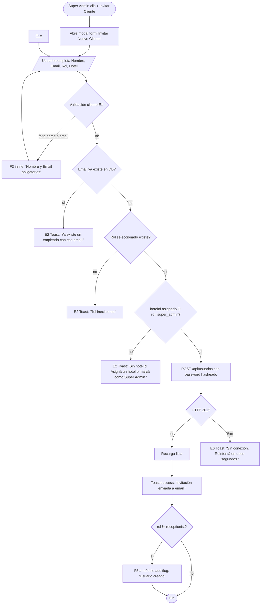
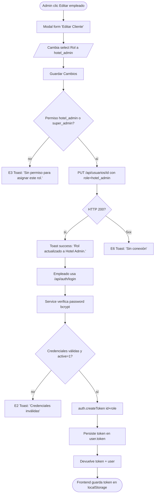
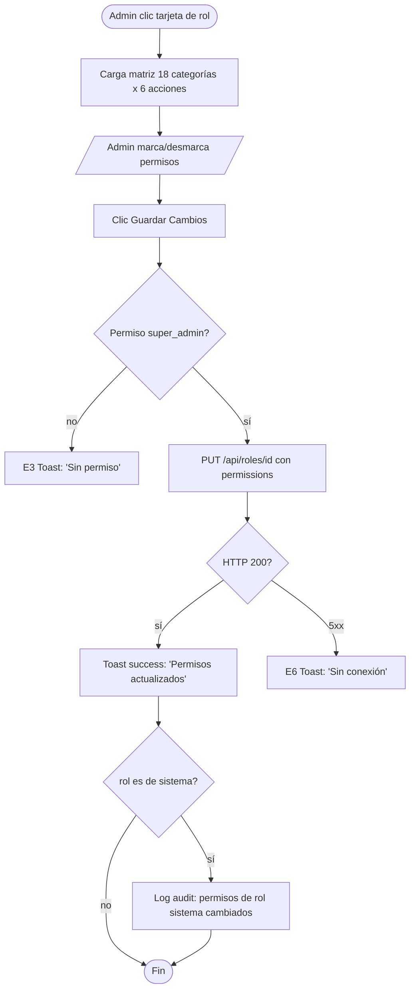

# FRD · M09 — Gestión de Empleados (Identidad, Roles y Expediente RRHH)

> **Módulo DOCUMENTADO contra código REAL.** La columna **REAL** marca lo que existe hoy en `backend/src/modules/usuarios` + `roles` y `frontend/src/pages/super-admin/`. La columna **PENDIENTE** marca lo que el alcance M09 pide pero **NO existe** en el código (expediente, contratos, vacaciones, evaluaciones, organigrama, alertas de vencimiento).
>
> **Veredicto del módulo:** hoy `usuarios`/`roles` es **solo auth + identidad + matriz de permisos**. El 80% del alcance RRHH de M09 **no está implementado**.

**Módulo:** M09 — Gestión de Empleados
**Pantallas cubiertas (hoy):** `/super-admin/users.vue` (Clientes/Propietarios) · `/super-admin/roles.vue` (Roles & Permisos)
**Pantallas PENDIENTES:** Expediente por empleado · Contratos/Licencias · Vacaciones/Permisos HR · Evaluaciones de desempeño · Organigrama · Alertas de vencimiento
**Servicios frontend:** `Auth.service.ts`, `SuperAdmin.service.ts` (NO existe `Users.service.ts` ni `Roles.service.ts` dedicados)
**Servicios backend:** módulos `usuarios` (auth + CRUD), `roles` (CRUD de roles + permisos), endpoints `/api/admin/*` en `composition-root.ts`

---

## 1. Modelo de datos (fuente de verdad)

### 1.1 Tabla `users` (`usuarios/model.ts:4-19`) — REAL

| Campo | Tipo | Reglas | ¿Existe? |
|-------|------|--------|----------|
| `id` | string | required | ✅ REAL |
| `name` | string | required | ✅ REAL |
| `email` | string | required, **unique**, indexed (`model.ts:9`) | ✅ REAL |
| `password` | string | required, hasheado bcrypt (`service.ts:41,55-56`) | ✅ REAL |
| `role` | string | default `"hotel_admin"` (`model.ts:11`) | ✅ REAL |
| `hotelId` | string | indexed, multi-tenant | ✅ REAL |
| `active` | number | default `1` (1=activo, 0=inactivo) | ✅ REAL |
| `token` | string | sesión JWT persistida | ✅ REAL |
| `avatar` | string | — | ✅ REAL |
| `phone` | string | — | ✅ REAL |
| `departmentId` / `position` / `salary` / `hireDate` / `contractEnd` / `vacationDays` | — | — | ❌ **PENDIENTE** |
| `documentNumber` / `documentExpiry` / `emergencyContact` | — | expediente | ❌ **PENDIENTE** |
| `managerId` (jefe directo para organigrama) | — | — | ❌ **PENDIENTE** |

> ⚠ **INCONSISTENCIA DTO vs MODELO (Gap #1):** `usuarios/types.ts:5-16` declara `UsuarioDTO` con `rol: 'admin'|'usuario'`, `passwordHash`, `emailVerificado`, `ultimoAcceso` — **ninguno de esos campos existe en el modelo ni en la DB**. El DTO es aspiracional y NO coincide con lo que el service devuelve (`service.ts:26,33` retorna `{ id, nombre, email, role, hotelId }`). El controlador **no usa este DTO**. Resolver: o borrar `types.ts` o alinearlo al modelo real.

### 1.2 Tabla `roles` (`roles/model.ts:4-17`) — REAL

| Campo | Tipo | Reglas | ¿Existe? |
|-------|------|--------|----------|
| `id` | string | required | ✅ REAL |
| `name` | string | required | ✅ REAL |
| `icon` | string | default `"👤"` | ✅ REAL |
| `color` | string | clase Tailwind (ej. `"bg-cyan/20 text-cyan"`) | ✅ REAL |
| `system` | number | default `0` (1 = rol de sistema, no borrable) | ✅ REAL |
| `hotelId` | string | multi-tenant | ✅ REAL |
| `permissions` | json | default `[]` — array de strings tipo `"reservations.create"` | ✅ REAL |
| `users` | number | default `0` — contador cacheado | ✅ REAL |
| `description` / `isDefault` | — | — | ❌ **PENDIENTE** |

### 1.3 Roles de sistema (hardcodeados en toda la app) — REAL

Estos tres roles son los únicos que el backend reconoce en `auth.authenticate(...)`:

| Rol (código) | Label UI | Dónde se valida | ¿Es custom? |
|---------------|----------|-----------------|-------------|
| `super_admin` | "Super Admin" | `auth.authenticate('super_admin')` en `/api/admin/*` y `composition-root.ts:331,349,353` | Sistema |
| `hotel_admin` | "Hotel Admin" | `auth.authenticate('hotel_admin','super_admin')` en `usuarios/index.ts:37-40` | Sistema |
| `receptionist` | "Recepcionista" | `auth.authenticate('hotel_admin','receptionist','super_admin')` en `usuarios/index.ts:34` | Sistema |

> ⚠ **GAP DE DISEÑO (Gap #2):** el modelo `roles` permite crear roles custom con `permissions` json, PERO el enforce real de acceso es por **rol hardcodeado** (`auth.authenticate('hotel_admin',...)`), NO por la matriz `permissions`. Es decir, la matriz de permisos de `roles.vue` **hoy no tiene efecto en el backend** (ver §4 Gap).

### 1.4 Modelo de Auth / JWT — REAL

| Pieza | Implementación | Dónde |
|-------|----------------|-------|
| Secret JWT | `process.env.JWT_SECRET` (required, `composition-root.ts:14`) | `composition-root.ts:19,42` |
| Expiración | `JWT_EXPIRES` default `24h`, refresh `7d` | `composition-root.ts:15-16,42` |
| Adapter | `jwtTokenAdapter` de arckode-framework | `composition-root.ts:8,42` |
| Payload del token | `{ id, role }` (NO incluye `hotelId`) | `usuarios/service.ts:24` |
| Login endpoint | `POST /api/auth/login` (público) | `usuarios/index.ts:33` |
| Sesión actual | `GET /api/auth/me` (cualquier rol autenticado) | `usuarios/index.ts:34` |
| Middleware | `auth.authenticate(...roles)` en cada ruta | todos los `index.ts` |
| Migración legacy | si el password guardado es plaintext → re-hashea a bcrypt en el primer login válido | `usuarios/service.ts:21-23` |

> ⚠ **GAP DE SEGURIDAD (Gap #3):** el token JWT carga `{ id, role }` pero **NO `hotelId`** (`service.ts:24`). El `hotelId` se resuelve en runtime desde la DB (`/api/auth/me` lo lee del registro). Eso significa que cambiar el `hotelId` de un user en DB cambia su scope sin reemitir token. Documentar y considerar incluir `hotelId` en el claim.

---

## 2. Pantalla — Gestión de Usuarios/Empleados (`/super-admin/users.vue`)

> Vista de **Super Admin** (plataforma). Lista "Clientes / Propietarios de Hoteles". Header con 5 métricas, filtros (búsqueda + rol + hotel + estado + sort), tabla con avatar/iniciales y acciones por fila.

### 2.1 Decision Table

| Trigger (botón/acción, label EXACTO) | Condición / Estado previo | Resultado | Modal/Toast (texto literal) | Errores posibles (códigos) | Notificación F5 |
|---------------------------------------|----------------------------|-----------|------------------------------|-----------------------------|-----------------|
| **"+ Invitar Cliente"** (`users.vue:11`) | rol=super_admin | Abre **modal form** vacío "Invitar Nuevo Cliente" (`users.vue:164`) | Modal `form` | — | — |
| **"📥 Exportar"** (`users.vue:10`) | — | Genera CSV y descarga `usuarios-YYYY-MM-DD.csv` (`users.vue:386-397`) | — | — | — |
| Clic en nombre de fila (`users.vue:84`) | — | Abre **modal Ver** "Detalle del Cliente" (`users.vue:123`) | Modal `detail` | — | — |
| **"Ver"** (`users.vue:103`) | — | Abre **modal Ver** "Detalle del Cliente" | Modal `detail` muestra: avatar, nombre, email, phone, rol, plan, hotel, habitaciones, última actividad, registro, permisos (`users.vue:138-151`) | — | — |
| **"Editar"** (`users.vue:104`) | — | Abre **modal form** "Editar Cliente" precargado (`users.vue:164`) | Modal `form` | — | — |
| **"Entrar"** (`users.vue:105`) | `user.status==='Activo'` Y `user.role!=='Super Admin'` | Impersonación: `auth.loginAs(targetUser)` + `router.push('/')` (`users.vue:348-362`) | — | E3 "Solo super_admin puede impersonar" (`auth.store.ts:54` rechaza si no es super) | — |
| **"Log"** (`users.vue:106`) | — | Abre **modal** "Actividad Reciente" (`users.vue:206`) con logs **hardcodeados** (`users.vue:331-338`) | Modal `detail` | — | — |
| **"Desactivar"** / **"Activar"** (`users.vue:107`) | toggle `status` | **HOY:** muta `user.status` en memoria (`users.vue:384`). **TARGET:** PATCH `/api/usuarios/:id` `{ active: 0/1 }` | **HOY:** ninguno. **TARGET:** Toast success "Empleado desactivado." | E3 · E6 | — |
| Select **"Rol \*"** en form (`users.vue:172-178`) | edición/creación | Asigna label: "Hotel Admin (Propietario)" / "Recepcionista" / "Super Admin" | — | E2 "Rol inexistente" (no validado hoy) | — |
| Select **"Hotel \*"** en form (`users.vue:179-184`) | edición/creación | Asigna `hotelId` (label hotel o "Plataforma") | — | E2 "Sin hotelId" (no validado hoy) | — |
| **"Enviar Invitación"** (`users.vue:196`, modo crear) | `name`+`email` presentes | **HOY:** push local a `users.value` (`users.vue:377-380`). **TARGET:** POST `/api/usuarios` → 201 + Toast success | **HOY:** nada. **TARGET:** Toast success "Invitación enviada a {email}." | E1 "Nombre y Email obligatorios" (`users.vue:370` guarda silencioso si faltan) · E2 "Email duplicado" · E6 | — |
| **"Guardar Cambios"** (`users.vue:196`, modo editar) | `editingUser.id` presente | **HOY:** reemplaza item en `users.value` (`users.vue:374-376`). **TARGET:** PUT `/api/usuarios/:id` | **HOY:** nada. **TARGET:** Toast success "Empleado actualizado." | E5 · E6 | — |
| **"Cancelar"** (`users.vue:195`) | modal form abierto | Cierra modal sin acción | — | — | — |
| **"Cerrar"** (`users.vue:154`, modal Ver) | modal detail abierto | Cierra modal | — | — | — |
| **"Editar"** (`users.vue:155`, dentro modal Ver) | modal detail abierto | Cierra Ver + abre modal Editar | — | — | — |
| Filtros (búsqueda/rol/hotel/estado/sort) (`users.vue:33-59`) | — | Filtran/sortean `filteredUsers` en cliente (`users.vue:312-329`). Sin llamada a backend. | — | — | — |

**Gap actual (Users — todos):**
- ❌ `saveUser()` (`users.vue:369-382`) **NO llama a la API**: solo muta `users.value` (array local). Recargar la página pierde el cambio. No existe `Users.service.ts`; `SuperAdmin.service.ts` solo tiene `users()` (GET), sin `create`/`update`/`delete`.
- ❌ `toggleUserStatus()` (`users.vue:384`) **NO persiste**: solo cambia el string en memoria.
- ❌ `loginAsUser()` (`users.vue:348-362`) es **impersonación solo frontend** (no hay token swap en backend, `auth.store.ts:53-58`). Cualquiera que muta el store se impersona.
- ❌ Ningún toast/modal de feedback en éxito o error (silencio total).
- ❌ Validación E1 débil: solo `if (!name || !email) return` (`users.vue:370`) — sin inline error, sin mensaje.
- ❌ `activityLogs` (`users.vue:331-338`) son **mocks estáticos**, no vienen de backend (módulo `auditlog` existe pero no se consulta acá).
- ❌ `phone` se mapea desde `u.telefono` (`users.vue:287`) pero el modelo real es `phone` (`model.ts:16`) → siempre llega vacío.

### 2.2 Flow — Crear empleado (target)

> ⚠ HOY este flujo **rompe en el paso F** (no hay POST). El flow documenta el TARGET.

### 2.3 Flow — Asignar rol + login (target)

---

## 3. Pantalla — Roles & Permisos (`/super-admin/roles.vue`)

> Vista de Super Admin. Grilla de tarjetas de roles, matriz de permisos por módulo (18 categorías × 6 acciones), y tabla de **feature flags por plan**.

### 3.1 Decision Table

| Trigger (label EXACTO) | Condición / Estado previo | Resultado | Modal/Toast (texto literal) | Errores posibles | Notif F5 |
|------------------------|----------------------------|-----------|------------------------------|------------------|----------|
| **"+ Crear Rol"** (`roles.vue:9`) | — | Abre **modal** "Crear Nuevo Rol" (`roles.vue:161`) | Modal `form`: campos Nombre + icono + color | — | — |
| Clic en tarjeta de rol (`roles.vue:16-19`) | — | Selecciona `selectedRole` + muestra matriz de permisos (`roles.vue:43-112`) | — | — | — |
| Checkbox permiso en matriz (`roles.vue:84-100`) | `selectedRole` set | Agrega/quita string `"modulo.accion"` (read/create/update/delete/export/admin) del array `selectedRole.permissions` | — | — | — |
| **"Seleccionar Todo"** (`roles.vue:50`) | `selectedRole` set | `selectedRole.permissions = allPerms` (18×6=108) (`roles.vue:261-270`) | — | — | — |
| **"Quitar Todo"** (`roles.vue:51`) | `selectedRole` set | `selectedRole.permissions = []` (`roles.vue:272-275`) | — | — | — |
| **"Guardar Cambios"** (`roles.vue:110`, matriz permisos) | `selectedRole` set | **HOY:** `savePermissions()` es `/* TODO: persist */` (`roles.vue:277`) — **no guarda**. **TARGET:** PUT `/api/roles/:id` `{ permissions: [...] }` + Toast success | **HOY:** nada. **TARGET:** Toast success "Permisos de {rol} actualizados." | E3 · E6 | — |
| Toggle feature flag por plan (`roles.vue:137-148`) | fila feature, columna plan | Cambia boolean `feature.starter/professional/enterprise` en memoria | — | — | — |
| **"Guardar Features"** (`roles.vue:155`) | — | **HOY:** sin handler (no hay `@click` persistente). **TARGET:** POST `/api/configuracion` `{ clave:'feature_flags', valor:[...] }` | **HOY:** nada. **TARGET:** Toast success "Features por plan guardados." | E6 | — |
| **"Cancelar"** (`roles.vue:184`, modal crear) | modal crear abierto | Cierra modal | — | — | — |
| **"Crear Rol"** (`roles.vue:185`, modal crear) | `newRole.name` no vacío | **HOY:** push local a `roles.value` (`roles.vue:279-291`). **TARGET:** POST `/api/roles` | **HOY:** nada. **TARGET:** Toast success "Rol {nombre} creado." | E1 (deshabilitado si name vacío, `roles.vue:185`) · E2 "Ya existe rol con ese nombre" · E6 | — |
| Badge **"Sistema"** (`roles.vue:28`) | `role.system===1` | Solo badge visual (no bloquea editar/borrar en UI — ver Gap) | — | — | — |

**Gap actual (Roles — todos):**
- ❌ `savePermissions()` (`roles.vue:277`) es **TODO vacío**: la matriz de permisos **no se persiste**. Todo el panel "Permisos" es cosmético.
- ❌ `createRole()` (`roles.vue:279-291`) solo hace `roles.value.push(...)` — no llama a POST `/api/roles`.
- ❌ **"Guardar Features"** (`roles.vue:155`) no tiene `@click` enlazado a lógica de guardado.
- ❌ Carga inicial (`roles.vue:236-248`) usa `http.get('/roles')` directo — sin service dedicado ni manejo de error (catch vacío).
- ❌ Mapeo de campos roto: `r.nombre` (`roles.vue:242`) pero el modelo real es `name` (`roles/model.ts:8`) → los nombres llegan `undefined`.
- ❌ Mapeo `r.usuarios` (`roles.vue:246`) pero el modelo real es `users` (`roles/model.ts:14`) → contador siempre 0.
- ❌ Permisos parsea `r.permissions` como string JSON (`roles.vue:246`) pero el ORM puede devolverlo ya como array (json type) → doble parseo falla.
- ❌ Ningún feedback toast/modal en ninguna acción.
- ❌ Badge "Sistema" NO impide borrar/editar el rol en la UI (`roles.vue:28` solo muestra badge).

### 3.2 Flow — Asignar rol + guardar permisos (target)

---

## 4. Consecuencias cross-módulo (eventos que M09 debería disparar)

| Acción en M09 | Módulo afectado | Efecto esperado | Estado | Notificación F5 |
|---------------|-----------------|-----------------|--------|-----------------|
| Empleado creado con rol `receptionist` | Auth (este módulo) | Login habilitado | ✅ REAL | — |
| Empleado **desactivado** (`active=0`) | Auth | Login bloqueado (`service.ts:17` rechaza `active===0`) | ✅ REAL (parcial: la UI no persiste el toggle) | — |
| Rol de empleado cambiado | Todos los módulos | Cambia qué rutas puede acceder (`auth.authenticate`) | ✅ REAL (enforce) / ❌ PENDIENTE (matriz custom no enforce) | — |
| Empleado creado | M10 — Asistencia | Debería crear registro de fichaje asociado | ❌ **PENDIENTE — M10 no existe** | — |
| Empleado creado / contrato firmado | M11 — Nómina | Debería crear registro de nómina y salario | ❌ **PENDIENTE — M11 no existe** | — |
| Documento de empleado por vencer (contrato/licencia) | Notificaciones (M-notif) | Debería disparar alerta "Vence licencia de {empleado} en 7 días" | ❌ **PENDIENTE** (módulo `notificaciones` existe pero no hay modelo de documentos) | — |
| Empleado desactivado | M10 — Asistencia | Debería cerrar fichajes abiertos | ❌ **PENDIENTE — M10 no existe** | — |
| Evaluación de desempeño completada | M11 — Nómina | Debería alimentar ajustes salariales/bonos | ❌ **PENDIENTE** | — |
| Cambio de departamento/jefe | Organigrama | Debería reestructurar árbol | ❌ **PENDIENTE — no hay organigrama** | — |

> **Nota M10/M11:** `composition-root.ts:75-82` lista los 21 módulos activos del sistema — **ninguno es asistencia ni nómina ni empleados**. M10 (Asistencia) y M11 (Nómina) son **módulos planeados no implementados**. Toda referencia cross-módulo a ellos es **target futuro**, no comportamiento actual.

---

## 5. Reglas de negocio a validar en backend (E2)

| # | Regla | Texto canónico del Toast E2 | ¿Implementada hoy? | Dónde debería ir |
|---|-------|------------------------------|--------------------|------------------|
| 1 | **Email duplicado** al crear usuario | "Ya existe un empleado con ese email." | ❌ NO — `usuarios/service.ts:40-43` no chequea unicidad antes de `repo.create`. El `unique:true` del modelo (`model.ts:9`) dependerá del ORM/SQLite pero el error sube como 500 crudo. | `service.create` antes de persistir |
| 2 | **Rol inexistente** al asignar | "Rol inexistente. Elegí Super Admin, Hotel Admin o Recepcionista." | ❌ NO — `service.update` (`service.ts:45-48`) acepta cualquier string en `role`. | `service.update` + validador enum |
| 3 | **Sin hotelId** para rol no-super_admin | "Sin hotelId. Asigná un hotel o marcá como Super Admin." | ❌ NO — nada valida que `hotel_admin`/`receptionist` tengan `hotelId`. | `service.create/update` |
| 4 | **Desactivar super_admin a sí mismo** | "No podés desactivar tu propia cuenta." | ❌ NO | `service.update` comparar `req.user.id` |
| 5 | **Último super_admin** | "No se puede desactivar: es el único Super Admin del sistema." | ❌ NO | `service.update` contar super_admin activos |
| 6 | **Login de usuario inactivo** | "Credenciales inválidas" (ya implementado, `service.ts:17`) | ✅ REAL (mensaje genérico, correcto por seguridad) | — |
| 7 | **Borrar rol de sistema** | "Los roles de sistema no se pueden eliminar." | ❌ NO — `roles/service.ts:86-92` no chequea `system`. | `service.delete` |
| 8 | **Borrar rol con usuarios asignados** | "El rol tiene {n} usuarios asignados. Reasignalos primero." | ❌ NO | `service.delete` contar users con ese role |

### 5.1 Reglas E1 (validación de campo) — PENDIENTE

| Campo | Regla | Texto F3 | ¿Implementada? |
|-------|-------|----------|----------------|
| `name` | required, 2-100 chars | "Nombre es obligatorio (mínimo 2 caracteres)." | ❌ Schema existe (`usuarios/validators/schema.ts:5`) pero **no se aplica** (`controller.ts:30-33` no llama `validateSchema`) |
| `email` | required, formato email, 5-200 | "Email inválido." | ❌ Ídem — schema muerto |
| `password` | required al crear, min 6 | "Contraseña mínima de 6 caracteres." | ❌ Ídem + `service.ts:41` defaultea a `'demo123'` si falta (peligroso) |
| `phone` | opcional | — | — |

> ⚠ **GAP CRÍTICO (Gap #4):** `usuarios/controller.ts:30-33` (`store`) y `:35-38` (`update`) **NO invocan `validateSchema()`**. El archivo `validators/schema.ts` existe pero es **código muerto**. Comparar con `roles/controller.ts:29-40` que SÍ valida. Esto viola REGLA #11 del framework.

### 5.2 Otros errores relevantes

| Código | Situación | Detalle |
|--------|-----------|---------|
| E3 | Rol sin acceso a `/api/usuarios` | `auth.authenticate('hotel_admin','super_admin')` (`usuarios/index.ts:37-40`) devuelve 403 si el rol no está en la lista. |
| E3 | hotel_admin intentando `/api/admin/*` | Reservado a `super_admin` (`composition-root.ts:349,353,357`). |
| E4 | `me()` de usuario borrado | `service.ts:32` lanza `NotFoundError('Usuario no encontrado')`. |
| E6 | SQLite caído | Cualquier `repo.*` propagará error 500 → mapear a E6. |
| — | **Security hole:** `/api/public/users` | `composition-root.ts:399-405` expone `name/email/role` de TODOS los usuarios **sin auth**. Documentado como "endpoint público para login". **Debe eliminarse o protegerse.** |

---

## 6. Gap analysis (REAL vs PENDIENTE, con file:line)

### 6.1 Lo que SÍ existe (REAL) — Auth + Identidad

| Feature | Archivo:línea | Estado |
|---------|---------------|--------|
| Login JWT con bcrypt | `usuarios/service.ts:15-27,54-62` | ✅ Funcional |
| Migración plaintext → bcrypt en login | `usuarios/service.ts:21-23` | ✅ Funcional |
| `GET /api/auth/me` | `usuarios/index.ts:34`, `controller.ts:19-22` | ✅ Funcional |
| CRUD `/api/usuarios` (hotel_admin+super) | `usuarios/index.ts:37-40` | ✅ Rutas, ❌ sin validación |
| CRUD `/api/roles` con validación | `roles/index.ts:43-47`, `controller.ts:29-40` | ✅ Funcional (validación mínima) |
| Matriz de permisos UI (18×6) | `roles.vue:213-232,81-101` | ✅ UI, ❌ no persiste |
| Multi-tenant por `hotelId` | `usuarios/model.ts:12`, `roles/model.ts:12` | ✅ Campo, ⚠ no enforceado en `list` |
| Super-admin endpoints | `composition-root.ts:349-394` | ✅ Funcional |
| Impersonación (solo frontend) | `auth.store.ts:53-58`, `users.vue:348-362` | ⚠ Inseguro |

### 6.2 Lo que FALTA (PENDIENTE) — alcance RRHH de M09

| Feature M09 | Existe hoy | Gap concreto |
|-------------|------------|--------------|
| **Expediente digital por empleado** | ❌ | No hay campos en `users` para datos personales extendidos (dni, domicilio, contacto emergencia, foto más allá de `avatar`). No hay tabla `employee_profiles`. |
| **Contratos** | ❌ | No hay tabla `contracts`. No hay campos `contractStart`/`contractEnd`/`contractType`. |
| **Licencias** | ❌ | No hay tabla `licenses`. No hay campos `licenseType`/`licenseExpiry`. |
| **Vacaciones** | ❌ | No hay tabla `vacations` ni `leave_requests`. No hay campo `vacationDaysBalance`. |
| **Permisos HR** (ausencias, no role-perms) | ❌ | Conflicto de naming: `permissions` en `roles` es permiso de sistema, no licencia HR. |
| **Evaluaciones de desempeño** | ❌ | No hay tabla `performance_reviews`. No hay campos `score`/`reviewDate`/`reviewer`. |
| **Organigrama por departamentos** | ❌ | No hay tabla `departments`. No hay campos `departmentId`/`managerId`/`position`. |
| **Alertas de vencimiento de documentos** | ❌ | Módulo `notificaciones` existe pero no hay job que escanee vencimientos (no hay documentos que vencer). |
| **Asistencia (M10)** | ❌ | No existe el módulo. |
| **Nómina (M11)** | ❌ | No existe el módulo. |

### 6.3 Bugs / inconsistencias detectadas (file:line)

| # | Bug | file:line | Severidad |
|---|-----|-----------|-----------|
| B1 | `/api/public/users` expone usuarios sin auth | `composition-root.ts:399-405` | 🔴 BLOCKER (seguridad) |
| B2 | `store`/`update` de usuarios sin `validateSchema` (schema muerto) | `usuarios/controller.ts:30-38` | 🔴 BLOCKER |
| B3 | `service.create` defaultea password a `'demo123'` si falta | `usuarios/service.ts:41` | 🔴 BLOCKER (seguridad) |
| B4 | `list(hotelId)` no enforcea el hotelId del caller → leak cross-hotel | `usuarios/controller.ts:24-28` + `service.ts:36-38` | 🔴 BLOCKER (multi-tenant) |
| B5 | DTO `UsuarioDTO` no coincide con el modelo real | `usuarios/types.ts:5-16` vs `model.ts:4-19` | 🟡 WARNING |
| B6 | Token JWT no incluye `hotelId` | `usuarios/service.ts:24` | 🟡 WARNING |
| B7 | `saveUser()`, `toggleUserStatus()` no persisten (mutación local) | `users.vue:369-384` | 🔴 BLOCKER (UX) |
| B8 | `savePermissions()` es `TODO` vacío | `roles.vue:277` | 🔴 BLOCKER (UX) |
| B9 | `createRole()` no llama a la API | `roles.vue:279-291` | 🔴 BLOCKER (UX) |
| B10 | Mapeo frontend roto: `r.nombre`/`r.usuarios` no existen (modelo usa `name`/`users`) | `roles.vue:242,246` | 🟡 WARNING |
| B11 | Mapeo `u.telefono` no existe (modelo usa `phone`) | `users.vue:287` | 🟡 WARNING |
| B12 | `loginAsUser` impersonación solo frontend (sin token swap) | `users.vue:348-362`, `auth.store.ts:53-58` | 🟡 WARNING (seguridad) |
| B13 | `auth.service.ts:30` lee `raw.nombre` pero la fuente real es inconsistente (`login` devuelve `nombre`, otros endpoints `name`) | `Auth.service.ts:30` | 🟡 WARNING |
| B14 | Roles custom no se enforcean: `auth.authenticate` solo reconoce 3 roles hardcodeados | `roles/index.ts:43-47` vs enforce en todos los módulos | 🟡 WARNING (diseño) |
| B15 | `activityLogs` en modal "Log" son mocks estáticos | `users.vue:331-338` | 🟢 SUGGESTION |

---

## 7. Checklist de verificación M09

Estado actual vs. target. Marcar cuando se cumpla.

### Auth / Login (REAL, operativo)
- [x] Login JWT con bcrypt funcional
- [x] `GET /api/auth/me`
- [x] Bloqueo de login si `active===0`
- [x] Migración legacy plaintext → bcrypt

### Gestión de Usuarios (`/super-admin/users.vue`)
- [ ] `saveUser()` llama a POST/PUT `/api/usuarios` (hoy: local) — `users.vue:369`
- [ ] `toggleUserStatus()` persiste `active` vía PUT — `users.vue:384`
- [ ] `validateSchema()` aplicado en `store`/`update` — `usuarios/controller.ts:30-38`
- [ ] Regla E2 email duplicado antes de crear — `usuarios/service.ts:40`
- [ ] Regla E2 rol válido (enum) — `usuarios/service.ts:45`
- [ ] Regla E2 hotelId requerido si rol ≠ super_admin
- [ ] `list()` enforcea hotelId del caller (no del query) — `usuarios/controller.ts:24-28`
- [ ] Toast success al crear/editar/desactivar
- [ ] Toast error E1/E2/E6 con texto canónico
- [ ] Inline error F3 en form (Nombre/Email)
- [ ] Estado loading en "Enviar Invitación" / "Guardar Cambios"
- [ ] Modal confirm "¿Descartar cambios?" si form dirty

### Roles & Permisos (`/super-admin/roles.vue`)
- [ ] `savePermissions()` persiste vía PUT `/api/roles/:id` (hoy: TODO vacío) — `roles.vue:277`
- [ ] `createRole()` llama a POST `/api/roles` (hoy: local) — `roles.vue:279`
- [ ] "Guardar Features" tiene handler y persiste — `roles.vue:155`
- [ ] Corregir mapeo `r.nombre`→`r.name`, `r.usuarios`→`r.users` — `roles.vue:242,246`
- [ ] Corregir mapeo `u.telefono`→`u.phone` — `users.vue:287`
- [ ] Bloquear edición/borrado de roles `system===1`
- [ ] Regla E2 "no borrar rol con usuarios asignados"
- [ ] Toast success/error en cada acción
- [ ] Service dedicado `Roles.service.ts` (hoy: `http.get` directo)

### Seguridad
- [ ] **Eliminar o proteger `/api/public/users`** — `composition-root.ts:399-405`
- [ ] Quitar default `'demo123'` en `service.create` — `usuarios/service.ts:41`
- [ ] Incluir `hotelId` en claim JWT — `usuarios/service.ts:24`
- [ ] Impersonación con token swap backend (no solo frontend) — `auth.store.ts:53-58`
- [ ] Auditoría de cambios de rol/desactivación (módulo `auditlog` existe, no se usa acá)

### Alcance RRHH (PENDIENTE — nuevo desarrollo)
- [ ] Tabla `departments` + campo `departmentId` en `users`
- [ ] Campo `managerId` en `users` para organigrama
- [ ] Tabla `employee_contracts` (tipo, inicio, fin, salario)
- [ ] Tabla `employee_documents` (tipo, archivo, vencimiento) → dispara alertas
- [ ] Tabla `leave_requests` (vacaciones, permisos, licencias, estados)
- [ ] Tabla `performance_reviews` (empleado, reviewer, score, fecha, notas)
- [ ] Pantalla Expediente por empleado (`/panel/employees/:id`)
- [ ] Pantalla Organigrama (árbol por `managerId`/`departmentId`)
- [ ] Pantalla Vacaciones/Permisos (solicitud + aprobación workflow)
- [ ] Job de alertas de vencimiento (conecta `employee_documents` → `notificaciones`)
- [ ] Cross-módulo con M10 (Asistencia) — requiere crear M10
- [ ] Cross-módulo con M11 (Nómina) — requiere crear M11

---

## 8. Pendiente de documentar en M09 (próximas iteraciones)

- [ ] Workflow de aprobación de vacaciones (empleado solicita → manager aprueba → calendario)
- [ ] Cálculo de días de vacaciones por antigüedad (requiere `hireDate`)
- [ ] Plantillas de evaluación de desempeño (periodicidad, criterios)
- [ ] Export de legajos (PDF)
- [ ] Integración con reloj biométrico / fichaje (M10)
- [ ] Integración con cálculo de salarios y recibos (M11)
- [ ] Matriz definitiva de roles custom enforceada en backend (hoy solo 3 hardcodeados)
- [ ] RBAC por `permissions` json real (hoy la matriz no tiene efecto en rutas)

---

## 9. Resumen ejecutivo

| Dimensión | Estado |
|-----------|--------|
| **Auth + login JWT** | ✅ REAL y funcional |
| **CRUD usuarios** | ⚠ Parcial: rutas existen, validación y persistencia UI rotas |
| **CRUD roles** | ⚠ Parcial: backend OK, UI no persiste permisos |
| **Matriz de permisos** | ❌ No enforceada (solo 3 roles hardcodeados) |
| **Expediente digital** | ❌ PENDIENTE |
| **Contratos / Licencias** | ❌ PENDIENTE |
| **Vacaciones / Permisos HR** | ❌ PENDIENTE |
| **Evaluaciones de desempeño** | ❌ PENDIENTE |
| **Organigrama por departamentos** | ❌ PENDIENTE |
| **Alertas de vencimiento** | ❌ PENDIENTE |
| **M10 Asistencia** | ❌ Módulo no existe |
| **M11 Nómina** | ❌ Módulo no existe |
| **Bloqueadores de seguridad** | 4 (B1-B4) |

> **Conclusión:** el módulo `usuarios`/`roles` **no es un módulo RRHH** — es la capa de auth/identidad. Para cumplir el alcance M09 (expediente, contratos, vacaciones, evaluaciones, organigrama, alertas) hace falta **un módulo nuevo `empleados`** (o extender `usuarios` con tablas relacionadas) más la creación de M10 y M11. La documentación de este FRD sirve como **contrato target** para ese desarrollo.

---

*Este documento sigue el molde de `00-MASTER.md` y `M01-PMS-Central.md`. Toda referencia a código está verificada contra los archivos listados en la cabecera.*
