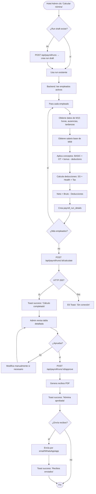

# FRD · M11 — Nómina Automatizada

> **Módulo NO implementado (target/spec).** Define el sistema de cálculo de nómina, deducciones, liquidación, recibos de pago, y cumplimiento laboral. NO existe código en frontend ni backend — todo es especificación para desarrollo futuro.
>
> **Veredicto del módulo:** 🔴 No implementado. Sin backend, sin frontend, sin integración fiscal.
> **Dependencias:** Requiere M09 (Empleados) como fuente de datos de salarios/contratos, y M10 (Asistencia) como fuente de horas trabajadas.

**Módulo:** M11 — Nómina Automatizada
**Pantallas cubiertas (target):** Nómina Principal (`/panel/payroll`) · Liquidación (`/panel/payroll/run`) · Recibos de Pago (`/panel/payroll/payslips`) · Configuración Nómina (`/panel/payroll/config`) · Historial de Pagos (`/panel/payroll/history`)
**Servicios frontend (target):** `Payroll.service.ts`
**Servicios backend (target):** módulo `payroll` (cálculo, liquidación, recibos, retenciones)

---

## 1. Modelo de datos (target schema)

### 1.1 Configuración de nómina (`payroll_config`)

| Campo | Tipo | Reglas | Descripción |
|-------|------|--------|-------------|
| `id` | string | required | — |
| `hotelId` | string | unique, multi-tenant | — |
| `currency` | string | default `USD` | Moneda de pago |
| `paymentFrequency` | enum | required | `biweekly` · `monthly` · `weekly` |
| `paymentDay` | number | required | Día del pago (1-28 para monthly, 1/15 para biweekly) |
| `overtimeMultiplier` | number | default 1.5 | Multiplicador horas extra |
| `nightShiftMultiplier` | number | default 1.25 | Multiplicador turno nocturno |
| `holidayMultiplier` | number | default 2.0 | Multiplicador días feriados |
| `socialSecurityRate` | number | required | % de seguro social (employer) |
| `healthInsuranceRate` | number | required | % de seguro salud (employee) |
| `incomeTaxRates` | json | required | Tramos de impuesto sobre la renta: `[{ from, to, rate }]` |
| `minimumWage` | number | nullable | Salario mínimo (si aplica en jurisdicción) |
| `maxOvertimeHoursWeekly` | number | default 12 | Máximo horas extra por semana |
| `provisionType` | enum | default `monthly` | `monthly` · `proportional` (aguinaldo proporcional) |
| `aguinaldoEnabled` | number | default 1 | Si aplica décimo tercer mes |
| `aguinaldoMonths` | number | default 2 | Meses de aguinaldo (2 = doble) |

### 1.2 Conceptos de薪酬 (`payroll_concepts`)

| Campo | Tipo | Reglas | Descripción |
|-------|------|--------|-------------|
| `id` | string | required | — |
| `hotelId` | string | indexed | — |
| `code` | string | required | Código corto: `BASIC`, `OT15`, `OT25`, `BONUS`, `HEALTH`, `SS`, `TAX`, `ADVANCE` |
| `name` | string | required | Nombre descriptivo |
| `type` | enum | required | `earning` · `deduction` · `contribution` · `tax` |
| `calculationMethod` | enum | required | `fixed` · `percentage` · `formula` · `hours_based` |
| `value` | number | nullable | Valor fijo o porcentaje |
| `formula` | text | nullable | Fórmula JavaScript (ej: `base * 0.10`) |
| `appliesTo` | json | nullable, array | Categorías de empleado a las que aplica |
| `priority` | number | default 0 | Orden de cálculo |
| `active` | number | default 1 | — |
| `system` | number | default 0 | 1 = concepto del sistema, no borrable |

### 1.3 Liquidación de nómina (`payroll_runs`)

| Campo | Tipo | Reglas | Descripción |
|-------|------|--------|-------------|
| `id` | string | required | — |
| `hotelId` | string | indexed | — |
| `period` | string | required | Período: "2026-06" o "2026-B1" (biweekly) |
| `startDate` | date | required | Inicio del período |
| `endDate` | date | required | Fin del período |
| `paymentDate` | date | required | Fecha de pago |
| `status` | enum | required | `draft` · `calculated` · `reviewed` · `approved` · `paid` · `cancelled` |
| `totalGross` | number | required | Total bruto |
| `totalDeductions` | number | required | Total deducciones |
| `totalNet` | number | required | Total neto |
| `employeeCount` | number | required | Empleados incluidos |
| `approvedBy` | string | nullable, FK → `users.id` | — |
| `approvedAt` | datetime | nullable | — |
| `paidAt` | datetime | nullable | — |
| `createdAt` | datetime | required | — |

### 1.4 Detalle de liquidación por empleado (`payroll_run_details`)

| Campo | Tipo | Reglas | Descripción |
|-------|------|--------|-------------|
| `id` | string | required | — |
| `runId` | string | required, FK → `payroll_runs.id` | Liquidación padre |
| `employeeId` | string | required, FK → `users.id` | — |
| `baseSalary` | number | required | Salario base del período |
| `daysWorked` | number | required | Días trabajados |
| `hoursWorked` | number | required | Horas normales trabajadas |
| `overtimeHours` | number | default 0 | Horas extra |
| `absences` | number | default 0 | Días ausentes sin justificación |
| `lateArrivals` | number | default 0 | Tardanzas |
| `earnings` | json | required | Desglose de devengados: `[{ conceptId, name, amount }]` |
| `deductions` | json | required | Desglose de deducciones: `[{ conceptId, name, amount }]` |
| `grossPay` | number | required | Bruto |
| `totalDeductions` | number | required | Total deducciones |
| `netPay` | number | required | Neto |
| `status` | enum | required | `pending` · `calculated` · `approved` · `paid` |
| `payslipGenerated` | number | default 0 | Si se generó el recibo |
| `createdAt` | datetime | required | — |

### 1.5 Recibos de pago (`payroll_payslips`)

| Campo | Tipo | Reglas | Descripción |
|-------|------|--------|-------------|
| `id` | string | required | — |
| `runDetailId` | string | required, FK → `payroll_run_details.id` | — |
| `employeeId` | string | required, FK → `users.id` | — |
| `hotelId` | string | indexed | — |
| `period` | string | required | — |
| `payslipNumber` | string | required, unique | Número secuencial: "REC-2026-06-001" |
| `pdfPath` | string | nullable | Ruta del PDF generado |
| `sentAt` | datetime | nullable | Cuándo se envió al empleado |
| `sentVia` | enum | nullable | `email` · `whatsapp` · `app` |
| `viewedAt` | datetime | nullable | Cuándo el empleado lo abrió |
| `createdAt` | datetime | required | — |

### 1.6 Historial de pagos (`payroll_payment_history`)

| Campo | Tipo | Reglas | Descripción |
|-------|------|--------|-------------|
| `id` | string | required | — |
| `runId` | string | required, FK → `payroll_runs.id` | — |
| `employeeId` | string | required, FK → `users.id` | — |
| `amount` | number | required | Monto pagado |
| `method` | enum | required | `bank_transfer` · `cash` · `check` · `digital_wallet` |
| `reference` | string | nullable | Número de referencia del pago |
| `paidAt` | datetime | required | — |
| `notes` | text | nullable | — |

---

## 2. Pantalla — Nómina Principal (`/panel/payroll`)

> ⚠ **NO implementado.** Toda esta sección es TARGET.

Dashboard de nómina con resumen del período actual, lista de empleados pendientes, y acciones de liquidación.

### 2.1 KPIs target

| KPI | Cálculo |
|-----|---------|
| **Período actual** | Último `payroll_run.status = draft/calculated` |
| **Empleados a liquidar** | Empleados activos sin liquidación en el período |
| **Monto total neto** | `totalNet` del run actual |
| **Total deducciones** | `totalDeductions` del run actual |
| **Próximo pago** | `paymentDate` del próximo run |
| **Aguinaldo pendiente** | Si `aguinaldoEnabled` y no se ha pagado el período |

### 2.2 Decision Table

| Trigger | Condición | Resultado | Modal/Toast (texto literal) | Errores | Notif F5 |
|---------|-----------|-----------|------------------------------|---------|----------|
| Cargar página `/panel/payroll` | sesión hotel_admin | Carga KPIs + último run + lista empleados pendientes | — | E6 | — |
| Botón **"🔄 Calcular nómina"** (período nuevo) | No hay `run` en estado `draft` para este período | POST `/api/payroll/runs` → crea run en `draft` | Toast success: "Liquidación del período {period} iniciada. {n} empleados a procesar." | E2 "Ya existe una liquidación para este período" · E6 | — |
| Botón **"📊 Calcular montos"** (en run draft) | `run.status = draft` | Calcula automáticamente: horas, deducciones, neto por empleado | Loading "Calculando nómina..." → Toast success: "Cálculo completado. Revisá antes de aprobar." | E2 "Faltan datos de asistencia para {n} empleados" · E6 | — |
| Botón **"👁 Revisar"** (en run calculated) | `run.status = calculated` | Abre tabla detallada con cada empleado: bruto, deducciones, neto | — | — | — |
| Botón **"✅ Aprobar nómina"** (en run calculated/reviewed) | `run.status = calculated` o `reviewed` | Modal warning: "¿Aprobar nómina del período {period}? Total: ${totalNet}" | Modal `warning`: "Aprobar liquidación" | — | — |
| **"Confirmar aprobación"** | `run.status = calculated` | `run → approved`, genera recibos para cada empleado | Toast success: "Nómina aprobada. {n} recibos generados." | E6 | F5 a empleados: "Tu recibo de pago del período {period} está disponible" |
| Botón **"💳 Marcar como pagada"** (en run approved) | `run.status = approved` | Abre modal: método de pago, referencia | Modal `form`: "Registrar Pago" | — | — |
| **"Confirmar pago"** | método + referencia presentes | `run → paid`, crea `payment_history` para cada empleado | Toast success: "Pago registrado. {n} empleados pagados." | E6 | F5 a empleados: "Tu pago del período {period} fue procesado" |
| Botón **"📥 Generar recibos"** (en run approved/paid) | — | Genera PDFs de recibos | Loading → Toast success: "Recibos generados." | E6 | — |
| Botón **"📧 Enviar recibos"** (en run approved/paid) | Recibos generados | Envía por email/WhatsApp/app | Loading → Toast success: "Recibos enviados a {n} empleados." | E6 | — |
| Botón **"❌ Cancelar liquidación"** | `run.status = draft` o `calculated` | Modal danger: "¿Cancelar liquidación del período {period}?" | Toast success: "Liquidación cancelada." | E2 "No se puede cancelar una liquidación ya pagada" · E6 | — |

### 2.3 Flow — Liquidación de nómina completa



---

## 3. Pantalla — Liquidación Detallada (`/panel/payroll/run`)

> ⚠ **TARGET.** No implementado.

Vista expandida de un run con tabla de todos los empleados y su desglose.

### 3.1 Decision Table

| Trigger | Condición | Resultado | Modal/Toast (texto) | Errores | Notif F5 |
|---------|-----------|-----------|----------------------|---------|----------|
| Clic en run de la lista | — | Abre vista detallada del run | — | E4 "Liquidación no encontrada" | — |
| **"✏ Editar empleado"** (en fila) | `run.status = draft` | Abre modal form: horas, bonos, deducciones manuales | Modal `form`: "Editar Liquidación — {empleado}" | — | — |
| **"Guardar edición"** | datos válidos | Recalcula neto del empleado | Toast success: "Liquidación de {empleado} actualizada." | E1 "Las horas no pueden ser negativas" · E6 | — |
| **"➕ Agregar empleado"** (no estaba en el cálculo) | — | Abre modal selector de empleado | Modal `form`: "Agregar a Liquidación" | E2 "Empleado ya está en esta liquidación" | — |
| **"➖ Quitar empleado"** | `run.status = draft` | Modal danger: "¿Quitar a {empleado} de esta liquidación?" | Toast success: "Empleado quitado." | E6 | — |
| **"📥 Exportar liquidación"** | — | Genera Excel con tabla completa | Toast success: "Liquidación exportada." | E6 | — |
| Filtro **"Todos / Pendientes / Aprobados / Pagados"** | — | Filtra tabla de empleados | — | — | — |
| Ordenar por columna (nombre, bruto, deducciones, neto) | — | Ordena tabla | — | — | — |

---

## 4. Pantalla — Recibos de Pago (`/panel/payroll/payslips`)

> ⚠ **TARGET.** No implementado.

Lista de recibos generados, con preview y envío.

### 4.1 Decision Table

| Trigger | Condición | Resultado | Modal/Toast (texto) | Errores | Notif F5 |
|---------|-----------|-----------|----------------------|---------|----------|
| Cargar página | — | Lista de recibos por período | — | E6 | — |
| Filtro **"Período / Empleado / Estado"** | — | Filtra tabla | — | — | — |
| **"👁 Ver recibo"** (en fila) | — | Abre **modal detail**: preview del recibo completo | Modal `detail`: "Recibo de Pago — {empleado} — {periodo}" | — | — |
| **"📥 Descargar PDF"** (en fila) | `pdfPath` existe | Descarga el PDF | — | E4 "Recibo no encontrado" · E6 | — |
| **"📧 Enviar por email"** (en fila) | — | Envía al email del empleado | Toast success: "Recibo enviado a {email}." | E6 "No se pudo enviar" | — |
| **"📱 Enviar por WhatsApp"** (en fila) | — | Envía PDF por WhatsApp | Toast success: "Recibo enviado por WhatsApp." | E6 | — |
| **"📧 Enviar todos"** (botón masivo) | — | Envía todos los recibos pendientes | Loading → Toast success: "Recibos enviados a {n} empleados." | E6 | — |
| **"📥 Exportar lista"** | — | Genera Excel con resumen de recibos | Toast success: "Lista exportada." | E6 | — |

### 4.2 Estructura del recibo (PDF target)

```
┌─────────────────────────────────────────┐
│  {Hotel Name} — Recibo de Pago          │
│  Período: Junio 2026                    │
│  Empleado: {nombre} | Cargo: {position}│
├─────────────────────────────────────────┤
│  DEVENGADOS                             │
│  Salario base .............. $1,200.00  │
│  Horas extra (15h × 1.5) .. $225.00    │
│  Bonificación .............. $100.00    │
│  Subtotal bruto ............ $1,525.00  │
├─────────────────────────────────────────┤
│  DEDUCCIONES                            │
│  Seguro social (5%) ........ $60.00     │
│  Seguro salud (3%) ......... $36.00     │
│  Impuesto renta (8%) ....... $96.00     │
│  Anticipo .................. $200.00     │
│  Subtotal deducciones ...... $392.00    │
├─────────────────────────────────────────┤
│  NETO A PAGAR .............. $1,133.00  │
├─────────────────────────────────────────┤
│  Firma: ____________  Fecha: 2026-06-30 │
└─────────────────────────────────────────┘
```

---

## 5. Pantalla — Configuración Nómina (`/panel/payroll/config`)

> ⚠ **TARGET.** No implementado.

Configuración de parámetros de nómina y conceptos de薪酬.

### 5.1 Decision Table

| Trigger | Condición | Resultado | Modal/Toast (texto) | Errores | Notif F5 |
|---------|-----------|-----------|----------------------|---------|----------|
| **"Configurar parámetros"** (pestaña) | — | Form: frecuencia, día de pago, moneda, multiplicadores | — | — | — |
| **"Guardar parámetros"** | datos válidos | PUT `/api/payroll/config` | Toast success: "Parámetros de nómina actualizados." | E1 "Día de pago inválido" · E6 | — |
| **"+ Nuevo concepto"** (pestaña conceptos) | — | Abre modal: código, nombre, tipo, método de cálculo, valor | Modal `form`: "Nuevo Concepto de Nómina" | — | — |
| **"Guardar concepto"** | código + nombre + método presentes | POST `/api/payroll/concepts` | Toast success: "Concepto '{nombre}' creado." | E1 · E2 "Ya existe un concepto con ese código" · E6 | — |
| Editar concepto | `system = 0` | Abre modal form precargado | Modal `form`: "Editar Concepto" | — | — |
| **"Eliminar"** concepto | `system = 0` | Modal danger: "¿Eliminar concepto '{nombre}'?" | Toast success: "Concepto eliminado." | E2 "Concepto de sistema no se puede eliminar" · E6 | — |
| **"🧪 Simular liquidación"** (botón test) | — | Abre modal: seleccionar empleado + inputs manuales | Modal `form`: "Simular Liquidación" | — | — |
| **"Calcular simulación"** | empleado seleccionado | Muestra resultado: bruto, deducciones, neto | — | E6 | — |
| **"Configurar tramos de impuesto"** (pestaña) | — | Tabla editable de tramos: desde, hasta, tasa | — | — | — |
| **"Guardar tramos"** | tramos válidos (sin gaps, sin overlap) | PUT `/api/payroll/config/income-tax` | Toast success: "Tramos de impuesto actualizados." | E2 "Hay gaps o overlaps en los tramos" · E6 | — |

---

## 6. Pantalla — Historial de Pagos (`/panel/payroll/history`)

> ⚠ **TARGET.** No implementado.

Log de todos los pagos realizados.

### 6.1 Decision Table

| Trigger | Condición | Resultado | Modal/Toast (texto) | Errores | Notif F5 |
|---------|-----------|-----------|----------------------|---------|----------|
| Cargar página | — | Tabla de pagos por empleado/período | — | E6 | — |
| Filtros (empleado, período, método, rango montos) | — | Filtra tabla | — | — | — |
| **"📥 Exportar"** | — | Genera Excel de historial | Toast success: "Historial exportado." | E6 | — |
| Clic en fila | — | Abre **modal detail**: empleado, monto, método, referencia, fecha | Modal `detail` | — | — |
| **"🔄 Revertir pago"** | `run.status = paid` y sin transferencia bancaria confirmada | Modal danger: "¿Revertir pago de {empleado}? Monto: ${monto}" | Toast success: "Pago revertido." | E2 "El pago ya fue confirmado por el banco" · E6 | — |
| **"📧 Re-enviar recibo"** (en detail) | — | Reenvía recibo por email | Toast success: "Recibo reenviado." | E6 | — |

---

## 7. Endpoints target (backend)

| Método | Ruta | Rol | Descripción | ¿Implementado? |
|--------|------|-----|-------------|----------------|
| GET | `/api/payroll/runs` | hotel_admin | Listar liquidaciones | ❌ no implementado |
| POST | `/api/payroll/runs` | hotel_admin | Crear nueva liquidación (draft) | ❌ no implementado |
| GET | `/api/payroll/runs/:id` | hotel_admin | Detalle de liquidación | ❌ no implementado |
| POST | `/api/payroll/runs/:id/calculate` | hotel_admin | Calcular montos de todos los empleados | ❌ no implementado |
| POST | `/api/payroll/runs/:id/approve` | hotel_admin | Aprobar liquidación | ❌ no implementado |
| POST | `/api/payroll/runs/:id/pay` | hotel_admin | Registrar pago | ❌ no implementado |
| POST | `/api/payroll/runs/:id/cancel` | hotel_admin | Cancelar liquidación | ❌ no implementado |
| GET | `/api/payroll/runs/:id/details` | hotel_admin | Detalle por empleado | ❌ no implementado |
| PUT | `/api/payroll/runs/:id/details/:detailId` | hotel_admin | Editar detalle de empleado | ❌ no implementado |
| POST | `/api/payroll/runs/:id/details` | hotel_admin | Agregar empleado a liquidación | ❌ no implementado |
| DELETE | `/api/payroll/runs/:id/details/:detailId` | hotel_admin | Quitar empleado de liquidación | ❌ no implementado |
| GET | `/api/payroll/payslips` | hotel_admin, employee | Listar recibos | ❌ no implementado |
| GET | `/api/payroll/payslips/:id` | hotel_admin, employee | Detalle del recibo | ❌ no implementado |
| GET | `/api/payroll/payslips/:id/pdf` | hotel_admin, employee | Descargar PDF del recibo | ❌ no implementado |
| POST | `/api/payroll/payslips/:id/send` | hotel_admin | Enviar recibo por email/WhatsApp | ❌ no implementado |
| POST | `/api/payroll/payslips/send-bulk` | hotel_admin | Enviar todos los recibos pendientes | ❌ no implementado |
| GET | `/api/payroll/config` | hotel_admin | Ver configuración | ❌ no implementado |
| PUT | `/api/payroll/config` | hotel_admin | Guardar configuración | ❌ no implementado |
| GET | `/api/payroll/concepts` | hotel_admin | Listar conceptos | ❌ no implementado |
| POST | `/api/payroll/concepts` | hotel_admin | Crear concepto | ❌ no implementado |
| PUT | `/api/payroll/concepts/:id` | hotel_admin | Editar concepto | ❌ no implementado |
| DELETE | `/api/payroll/concepts/:id` | hotel_admin | Eliminar concepto (no system) | ❌ no implementado |
| POST | `/api/payroll/simulate` | hotel_admin | Simular liquidación de un empleado | ❌ no implementado |
| GET | `/api/payroll/history` | hotel_admin | Historial de pagos | ❌ no implementado |
| POST | `/api/payroll/history/:id/revert` | hotel_admin | Revertir pago | ❌ no implementado |

---

## 8. Consecuencias cross-módulo (eventos que dispara M11)

| Acción en M11 | Módulo afectado | Efecto | Estado |
|---------------|-----------------|--------|--------|
| Liquidación aprobada | M09 — Empleados | Actualiza `lastPayrollDate` en expediente | ❌ target |
| Recibo generado | Notificaciones (M-notif) | F5 a empleado: "Tu recibo está disponible" | ❌ target |
| Pago registrado | M13 — Billing/Folios | Crea registro de gasto en accounting | ❌ target |
| Aguinaldo calculado | M09 — Empleados | Registra pago de aguinaldo en expediente | ❌ target |
| Empleado desactivado en M09 | M11 | Excluye de próxima liquidación | ❌ target |
| Horas extra de M10 | M11 | Se multiplican por `overtimeMultiplier` | ❌ target |
| Ausencias de M10 | M11 | Se descuentan del salario base | ❌ target |
| Permiso aprobado en M10 | M11 | No se descuenta como ausencia | ❌ target |
| Cambio de salario en M09 | M11 | Próxima liquidación usa nuevo salario | ❌ target |

---

## 9. Reglas de negocio (E2)

| # | Regla | Texto canónico | ¿Implementada? |
|---|-------|----------------|----------------|
| 1 | **Liquidación duplicada** | "Ya existe una liquidación para el período {period}. Edítala o cancélala." | ❌ target |
| 2 | **Liquidar sin datos de asistencia** | "Faltan datos de asistencia para {n} empleados. Completalos en Asistencia." | ❌ target |
| 3 | **Aprobar sin revisar** | "¿Estás seguro de aprobar sin revisar la liquidación?" (modal warning) | ❌ target |
| 4 | **Pagar liquidación no aprobada** | "Debés aprobar la liquidación antes de registrar el pago." | ❌ target |
| 5 | **Cancelar liquidación pagada** | "No se puede cancelar una liquidación ya pagada. Registrá un reverso." | ❌ target |
| 6 | **Neto negativo** | "El neto de {empleado} es negativo (${n}). Revisá las deducciones." | ❌ target |
| 7 | **Horas extra exceden máximo** | "Las horas extra de {empleado} ({n}h) exceden el máximo semanal ({max}h)." | ❌ target |
| 8 | **Concepto de sistema no borrable** | "Los conceptos del sistema no se pueden eliminar." | ❌ target |
| 9 | **Tramos de impuesto con gaps** | "Hay saltos en los tramos de impuesto. Revisá la configuración." | ❌ target |
| 10 | **Salario menor al mínimo** | "El salario de {empleado} está por debajo del mínimo legal (${min})." | ❌ target |

---

## 10. Gap analysis

| # | Feature | Existe hoy | Gap |
|---|---------|------------|-----|
| G1 | Cálculo automático de nómina | ❌ | No hay módulo, no hay lógica de cálculo |
| G2 | Conceptos de薪酬 configurables | ❌ | No hay tabla, no hay CRUD |
| G3 | Liquidación por período | ❌ | No hay tabla `payroll_runs`, no hay UI |
| G4 | Recibos de pago PDF | ❌ | No hay generación de PDF, no hay envío |
| G5 | Deducciones automáticas (SS, salud, impuesto) | ❌ | No hay cálculo, no hay configuración de tramos |
| G6 | Horas extra desde M10 | ❌ | No hay integración con M10 (no existe) |
| G7 | Aguinaldo / décimo tercer mes | ❌ | No hay cálculo proporcional |
| G8 | Historial de pagos | ❌ | No hay tabla, no hay UI |
| G9 | Configuración fiscal (tramos de impuesto) | ❌ | No hay configuración jurisdiccional |
| G10 | Envío de recibos por email/WhatsApp | ❌ | No hay integración de envío |
| G11 | Simulación de liquidación | ❌ | No hay endpoint de simulación |
| G12 | Reverso de pagos | ❌ | No hay lógica de reversión |

**Total de gaps: 12 features bloqueantes. Módulo completamente sin implementar.**

---

## 11. Checklist de verificación M11

### Backend
- [ ] Tabla `payroll_config` creada con config por hotel
- [ ] Tabla `payroll_concepts` con al menos 8 conceptos ejemplo (BASIC, OT15, OT25, BONUS, HEALTH, SS, TAX, ADVANCE)
- [ ] Tabla `payroll_runs` con run de ejemplo
- [ ] Tabla `payroll_run_details` con detalles por empleado
- [ ] Tabla `payroll_payslips` con recibos generados
- [ ] Tabla `payroll_payment_history` con pagos ejemplo
- [ ] Endpoint POST `/api/payroll/runs` crea run draft
- [ ] Endpoint POST `/api/payroll/runs/:id/calculate` calcula todos los empleados
- [ ] Cálculo correcto: salario base proporcional a días trabajados
- [ ] Cálculo correcto: horas extra × multiplicador
- [ ] Cálculo correcto: deducciones SS + salud + impuesto
- [ ] Cálculo correcto: neto = bruto - deducciones
- [ ] Generación de recibos PDF
- [ ] Envío de recibos por email
- [ ] Workflow: draft → calculated → approved → paid
- [ ] Validación E2: liquidación duplicada
- [ ] Validación E2: neto negativo
- [ ] Validación E2: horas extra exceden máximo
- [ ] Validación E2: concepto de sistema no borrable

### Frontend
- [ ] Página `/panel/payroll` con KPIs + lista de runs + acciones
- [ ] Página `/panel/payroll/run` con tabla detallada de empleados
- [ ] Página `/panel/payroll/payslips` con lista de recibos + envío
- [ ] Página `/panel/payroll/config` con parámetros + conceptos + tramos
- [ ] Página `/panel/payroll/history` con historial de pagos
- [ ] Modal `form` para editar liquidación de empleado
- [ ] Modal `form` para configurar parámetros
- [ ] Modal `form` para crear/editar conceptos
- [ ] Modal `form` para simular liquidación
- [ ] Modal `warning` antes de aprobar nómina
- [ ] Modal `danger` antes de cancelar liquidación
- [ ] Modal `detail` de recibo de pago (preview)
- [ ] Toast success en cada acción
- [ ] Toast error E1/E2/E6 con texto canónico
- [ ] Loading state (F6) en cálculo y generación de recibos
- [ ] Skeleton de carga en listas
- [ ] Estado vacío (F4): "Sin liquidaciones registradas"

### Integración
- [ ] M10 (Asistencia) provee datos de horas/ausencias al calcular
- [ ] M09 (Empleados) provee salario base y categoría
- [ ] Recibo PDF muestra datos correctos del empleado
- [ ] Cambio de salario en M09 se refleja en próxima liquidación
- [ ] Permiso aprobado en M10 no descuenta como ausencia

---

*Este documento sigue el molde de `M01-PMS-Central.md`. Módulo NO implementado — toda documentación es target/spec para desarrollo futuro.*
