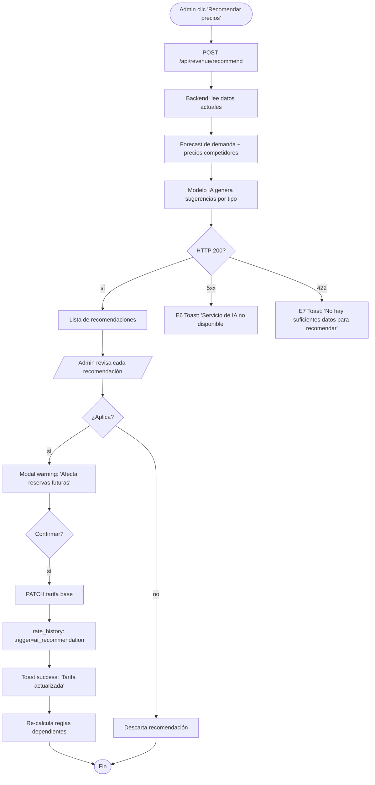
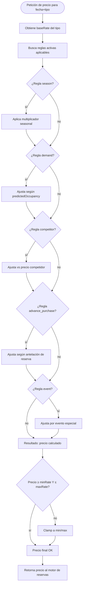

# FRD · M12 — Revenue Manager con IA

> **Módulo NO implementado (target/spec).** Define el sistema de pricing dinámico, forecast de demanda, análisis competitivo, y optimización de revenue para hoteles. NO existe código en frontend ni backend — todo es especificación para desarrollo futuro.
>
> **Veredicto del módulo:** 🔴 No implementado. Sin backend, sin frontend, sin integraciones de datos de mercado.

**Módulo:** M12 — Revenue Manager con IA
**Pantallas cubiertas (target):** Dashboard Revenue (`/panel/revenue`) · Configuración Pricing (`/panel/revenue/pricing`) · Forecast de Demanda (`/panel/revenue/forecast`) · Análisis Competitivo (`/panel/revenue/competitors`) · Historial de Cambios de Tarifa (`/panel/revenue/history`)
**Servicios frontend (target):** `Revenue.service.ts`, `Pricing.service.ts`
**Servicios backend (target):** módulo `revenue-manager` (pricing engine, forecast, competitor scraping)

---

## 1. Modelo de datos (target schema)

### 1.1 Tarifas base por tipo de habitación (`revenue_base_rates`)

| Campo | Tipo | Reglas | Descripción |
|-------|------|--------|-------------|
| `id` | string | required | — |
| `hotelId` | string | indexed, multi-tenant | Hotel propietario |
| `roomType` | string | required | Tipo de habitación (ej: "standard", "deluxe", "suite") |
| `baseRate` | number | required | Tarifa base (precio por noche) |
| `currency` | string | default `USD` | — |
| `seasonalMultiplier` | number | default 1.0 | Multiplicador de temporada |
| `minRate` | number | nullable | Precio mínimo (floor) |
| `maxRate` | number | nullable | Precio máximo (ceiling) |
| `updatedAt` | datetime | required | Última actualización |

### 1.2 Reglas de pricing (`revenue_pricing_rules`)

| Campo | Tipo | Reglas | Descripción |
|-------|------|--------|-------------|
| `id` | string | required | — |
| `hotelId` | string | indexed | — |
| `name` | string | required | Nombre de la regla (ej: "Weekend Premium") |
| `type` | enum | required | `seasonal` · `demand` · `competitor` · `event` · `advance_purchase` · `length_of_stay` |
| `priority` | number | default 0 | Desempate entre reglas (mayor = primero) |
| `condition` | json | required | Condiciones: `{ checkIn: { from, to }, daysOfWeek: [...], minAdvance: N, maxAdvance: N }` |
| `adjustmentType` | enum | required | `percentage` · `fixed` · `override` |
| `adjustmentValue` | number | required | Valor del ajuste (+/-) |
| `active` | number | default 1 | — |
| `createdBy` | enum | required | `ai` · `manual` · `system` |
| `expiresAt` | nullable | — | Fecha de expiración de la regla |

### 1.3 Forecast de demanda (`revenue_forecast`)

| Campo | Tipo | Reglas | Descripción |
|-------|------|--------|-------------|
| `id` | string | required | — |
| `hotelId` | string | indexed | — |
| `forecastDate` | date | required | Fecha a la que se refiere el forecast |
| `roomType` | string | nullable | null = total del hotel |
| `predictedOccupancy` | number | required, 0-100 | Ocupación predicha (%) |
| `predictedAdr` | number | required | ADR predicho |
| `predictedRevpar` | number | required | RevPAR predicho |
| `confidence` | number | required, 0-1 | Confianza del modelo |
| `sourceData` | json | nullable | Datos de entrada: { historicalOccupancy, events, dayOfWeek, trend } |
| `generatedAt` | datetime | required | Cuándo se generó el forecast |
| `actualOccupancy` | nullable | — | Ocupación real (para medir precisión) |
| `actualAdr` | nullable | — | ADR real (para medir precisión) |

### 1.4 Análisis competitivo (`revenue_competitors`)

| Campo | Tipo | Reglas | Descripción |
|-------|------|--------|-------------|
| `id` | string | required | — |
| `hotelId` | string | indexed | — |
| `competitorName` | string | required | Nombre del hotel competidor |
| `competitorUrl` | string | nullable | URL del sitio del competidor |
| `source` | enum | required | `manual` · `ota_scraper` · `rate_shopping` |
| `lastCheckedAt` | datetime | nullable | Última vez que se verificó el precio |
| `avgRate` | number | nullable | Tarifa promedio del competidor |
| `occupancyEstimate` | number | nullable, 0-100 | Estimación de ocupación |
| `reviewScore` | number | nullable, 0-10 | Rating en TripAdvisor/Google |
| `active` | number | default 1 | — |

### 1.5 Historial de cambios de tarifa (`revenue_rate_history`)

| Campo | Tipo | Reglas | Descripción |
|-------|------|--------|-------------|
| `id` | string | required | — |
| `hotelId` | string | indexed | — |
| `roomType` | string | required | — |
| `date` | date | required | Fecha de la tarifa aplicada |
| `rate` | number | required | Tarifa final aplicada |
| `baseRate` | number | required | Tarifa antes del ajuste |
| `ruleApplied` | string | nullable | ID de la regla aplicada |
| `trigger` | enum | required | `ai_recommendation` · `manual_override` · `rule_engine` · `seasonal_update` |
| `changedBy` | string | nullable | userId si fue manual |
| `createdAt` | datetime | required | Timestamp del cambio |

### 1.6 Configuración de IA del hotel (`revenue_ai_config`)

| Campo | Tipo | Reglas | Descripción |
|-------|------|--------|-------------|
| `id` | string | required | — |
| `hotelId` | string | unique | — |
| `autoPricingEnabled` | number | default 0 | Si la IA puede ajustar precios automáticamente |
| `aiConfidenceThreshold` | number | default 0.75 | Confianza mínima para aplicar cambio automático |
| `maxDailyAdjustment` | number | default 20 | Máximo % de ajuste diario sin aprobación humana |
| `competitorTrackingEnabled` | number | default 0 | Scraping de competidores activado |
| `competitorUrls` | json | nullable, array | URLs de competidores a trackear |
| `forecastHorizonDays` | number | default 30 | Días de forecast a generar |
| `pricingStrategy` | enum | default `balanced` | `aggressive` · `balanced` · `conservative` |
| `lastForecastGeneratedAt` | nullable | — | Última vez que se generó forecast |

---

## 2. Pantalla — Dashboard Revenue (`/panel/revenue`)

> ⚠ **NO implementado.** Toda esta sección es TARGET.

Dashboard principal con KPIs de revenue, tendencias, y acciones rápidas.

### 2.1 KPIs target

| KPI | Cálculo | Ubicación |
|-----|---------|-----------|
| **ADR actual** | Ingresos por hab. / hab. vendidas (período seleccionado) | KPI card principal |
| **RevPAR** | ADR × Ocupación | KPI card principal |
| **TRevPAR** | Ingresos totales / habitaciones disponibles | KPI card principal |
| **Ocupación** | Noches vendidas / noches disponibles × 100 | KPI card principal |
| **GOPPAR** | (Revenue - Costos operativos) / habitaciones disponibles | KPI card secundario |
| **Forecast vs Actual** | `predictedOccupancy` vs `actualOccupancy` | Gráfica de precisión |
| **Revenue index** | Revenue del hotel / Revenue del mercado (competitors) | Badge competitivo |

### 2.2 Decision Table

| Trigger | Condición | Resultado | Modal/Toast (texto literal) | Errores | Notif F5 |
|---------|-----------|-----------|------------------------------|---------|----------|
| Cargar página `/panel/revenue` | sesión hotel_admin | Carga KPIs + forecast + reglas activas | — | E6 si servicio de IA cae | — |
| Selector **"Hoy / 7 días / 30 días / 90 días"** | — | Recalcula KPIs para el período | — | E6 | — |
| Botón **"📈 Recomendar precios"** | `autoPricingEnabled = 0` o manual | Llama IA para generar recomendaciones de precio | Loading "Analizando mercado..." → Toast success: "Nuevas tarifas recomendadas. Revisá antes de aplicar." | E6 "Servicio de IA no disponible" · E7 "No hay suficientes datos para recomendar" | — |
| Botón **"✅ Aplicar recomendación"** (en lista de recomendaciones) | IA generó sugerencia | Abre **modal warning** antes de aplicar | Modal `warning`: "Aplicar tarifa {tipo}: ${nueva} (antes ${base}). Afecta reservas futuras." | — | — |
| **"Confirmar aplicación"** (dentro modal warning) | `res.status = confirmed` | PATCH tarifa base, crear registro en rate_history | Toast success: "Tarifa {tipo} actualizada a ${nueva}." | E6 | — |
| Botón **"Override manual"** (fijo, sin IA) | — | Abre **modal form** para override de precio | Modal `form`: "Override Manual — {tipo}" | — | — |
| **"Guardar override"** | precio > 0 y ≥ minRate y ≤ maxRate | PATCH tarifa base, `trigger = manual_override` | Toast success: "Override guardado. Tarifa: ${nueva}." | E2 "El precio debe estar entre ${min} y ${max}." · E6 | — |
| Toggle **"Auto-pricing"** | — | PATCH `autoPricingEnabled` | Toast success: "Auto-pricing {activado/desactivado}." | E6 | — |
| Botón **"📊 Ver competidores"** | — | Abre panel lateral o redirige a `/panel/revenue/competitors` | — | — | — |
| Botón **"🔄 Actualizar forecast"** | — | Re-ejecuta modelo de forecast | Loading "Generando forecast..." → Toast success: "Forecast actualizado para próximos {n} días." | E6 "No se pudo generar forecast" | — |

### 2.3 Flow — Recomendar y aplicar precios



---

## 3. Pantalla — Configuración Pricing (`/panel/revenue/pricing`)

> ⚠ **TARGET.** No implementado.

CRUD de reglas de pricing y configuración del motor de precios.

### 3.1 Decision Table

| Trigger | Condición | Resultado | Modal/Toast (texto) | Errores | Notif F5 |
|---------|-----------|-----------|----------------------|---------|----------|
| **"+ Nueva Regla"** | — | Abre modal form: nombre, tipo, condición, ajuste | Modal `form`: "Nueva Regla de Pricing" | — | — |
| **"Guardar Regla"** | campos válidos, `adjustmentValue` numérico | POST `/api/revenue/pricing-rules` | Toast success: "Regla '{nombre}' creada." | E1 "Faltan campos obligatorios" · E2 "La regla se superpone con otra existente" · E6 | — |
| Editar regla existente | — | Abre modal form precargado | Modal `form`: "Editar Regla" | — | — |
| Toggle **"Activa/Inactiva"** | — | PATCH `active` | — | E6 | — |
| **"Eliminar"** regla | `createdBy != ai` | Modal danger: "¿Eliminar regla '{nombre}'?" | Toast success: "Regla eliminada." | E2 "No se pueden eliminar reglas creadas por IA" · E6 | — |
| **"Duplicar regla"** | — | POST clon con nombre "{original} (copia)" | Toast success: "Regla duplicada." | E6 | — |
| **"Prioridad ↑/↓"** (flechas) | — | Intercambia prioridad con regla adyacente | — | E6 | — |
| **"Configurar tarifas base"** (pestaña) | — | Tabla editable de `revenue_base_rates` por tipo | — | — | — |
| **"Guardar tarifas base"** | todas las tarifas > 0 | PATCH todas las tarifas | Toast success: "Tarifas base actualizadas." | E2 "Tarifa mínima no puede superar la máxima" · E6 | — |

### 3.2 Flow — Motor de pricing (cómo se calcula el precio final)



---

## 4. Pantalla — Forecast de Demanda (`/panel/revenue/forecast`)

> ⚠ **TARGET.** No implementado.

Vista de forecast de ocupación y tarifas para los próximos 30-90 días.

### 4.1 Decision Table

| Trigger | Condición | Resultado | Modal/Toast (texto) | Errores | Notif F5 |
|---------|-----------|-----------|----------------------|---------|----------|
| Cargar página | — | GET `/api/revenue/forecast` → muestra gráfica de demanda | — | E6 | — |
| Selector **"30 / 60 / 90 días"** | — | Cambia horizonte de forecast | — | — | — |
| Botón **"🔄 Regenerar forecast"** | — | Re-ejecuta modelo con datos actualizados | Loading → Toast success: "Forecast regenerado." | E6 "No se pudo generar forecast" | — |
| Hover sobre día en gráfica | — | Tooltip: "Ocupación predicha: {n}% | ADR: ${n} | Confianza: {n}%" | — | — |
| Botón **"📈 Ver historial de precisión"** | — | Gráfica: forecast vs actual (últimos 30 días) | — | — | — |
| Botón **"📥 Exportar forecast"** | — | Genera CSV/Excel | Toast success: "Forecast exportado." | E6 | — |

### 4.2 Variables del modelo de forecast

| Variable | Fuente | Peso (target) |
|----------|--------|---------------|
| Ocupación del mismo día hace 1 año | `reservations` (histórico) | 25% |
| Tendencia del mismo mes pasado | `reservations` (histórico) | 20% |
| Día de la semana | Cálculo | 15% |
| Eventos locales | API externa (Google Events) | 15% |
| Antelación promedio de reserva | `reservations` (booking_date vs checkin) | 10% |
| Precio del competidor | `revenue_competitors` | 10% |
| Tendencia general del mercado | Datos OTA | 5% |

---

## 5. Pantalla — Análisis Competitivo (`/panel/revenue/competitors`)

> ⚠ **TARGET.** No implementado.

Gestión de competidores y comparativa de precios.

### 5.1 Decision Table

| Trigger | Condición | Resultado | Modal/Toast (texto) | Errores | Notif F5 |
|---------|-----------|-----------|----------------------|---------|----------|
| **"+ Agregar competidor"** | — | Abre modal form: nombre, URL, source | Modal `form`: "Agregar Competidor" | — | — |
| **"Guardar"** competidor | nombre no vacío | POST `/api/revenue/competitors` | Toast success: "Competidor '{nombre}' agregado." | E1 "Nombre obligatorio" · E6 | — |
| **"🔄 Verificar precios"** | competidor tiene URL o source | Llama a scraping/API de rates | Loading → Toast success: "Precios actualizados para {n} competidores." | E6 "No se pudieron obtener precios de {competidor}" | — |
| **"📊 Comparar tarifas"** (botón en fila) | — | Abre modal detail con comparativa lado a lado | Modal `detail` | — | — |
| **"Eliminar"** competidor | — | Modal danger: "¿Eliminar {competidor}?" | Toast success: "Competidor eliminado." | E6 | — |
| Filtro **"Todos / Solo activos"** | — | Filtra tabla | — | — | — |

### 5.2 Flow — Scraping de precios competidores

```mermaid
flowchart TD
    A([Cron job o trigger manual]) --> B[Para cada competidor activo]
    B --> C{source = ota_scraper?}
    C -- sí --> D[Scrape Booking.com / Expedia]
    D --> E[Extrae: precio por noche, disponibilidad, rating]
    C -- no --> F{source = rate_shopping?}
    F -- sí --> G[Consulta API de rate shopping]
    F -- no --> H[Source manual: no scraping]
    E --> I[Actualiza revenue_competitors.avgRate]
    G --> I
    I --> J[Compara vs tarifa del hotel]
    J --> K{Hotel más caro > 15%?}
    K -- sí --> L[Notificación F5: 'Hotel {nombre} es {n}% más caro']
    K -- no --> M{Hotel más barato > 15%?}
    M -- sí --> N[Notificación F5: 'Hotel {nombre} es {n}% más barato']
    M -- no --> O[Competitividad OK]
    L --> P([Fin])
    N --> P
    O --> P
    H --> P
```

---

## 6. Endpoints target (backend)

| Método | Ruta | Rol | Descripción | ¿Implementado? |
|--------|------|-----|-------------|----------------|
| GET | `/api/revenue/dashboard` | hotel_admin | KPIs de revenue del hotel | ❌ no implementado |
| GET | `/api/revenue/recommend` | hotel_admin | Recomendaciones IA de precios | ❌ no implementado |
| POST | `/api/revenue/recommend/apply` | hotel_admin | Aplicar recomendación | ❌ no implementado |
| GET | `/api/revenue/base-rates` | hotel_admin | Tarifas base por tipo | ❌ no implementado |
| PUT | `/api/revenue/base-rates` | hotel_admin | Actualizar tarifas base | ❌ no implementado |
| GET | `/api/revenue/pricing-rules` | hotel_admin | Listar reglas de pricing | ❌ no implementado |
| POST | `/api/revenue/pricing-rules` | hotel_admin | Crear regla | ❌ no implementado |
| PUT | `/api/revenue/pricing-rules/:id` | hotel_admin | Editar regla | ❌ no implementado |
| DELETE | `/api/revenue/pricing-rules/:id` | hotel_admin | Eliminar regla (no ai) | ❌ no implementado |
| GET | `/api/revenue/forecast` | hotel_admin | Forecast de demanda | ❌ no implementado |
| POST | `/api/revenue/forecast/generate` | hotel_admin | Regenerar forecast | ❌ no implementado |
| GET | `/api/revenue/forecast/accuracy` | hotel_admin | Historial de precisión | ❌ no implementado |
| GET | `/api/revenue/competitors` | hotel_admin | Listar competidores | ❌ no implementado |
| POST | `/api/revenue/competitors` | hotel_admin | Agregar competidor | ❌ no implementado |
| PUT | `/api/revenue/competitors/:id` | hotel_admin | Editar competidor | ❌ no implementado |
| DELETE | `/api/revenue/competitors/:id` | hotel_admin | Eliminar competidor | ❌ no implementado |
| POST | `/api/revenue/competitors/scrape` | hotel_admin | Ejecutar scraping | ❌ no implementado |
| GET | `/api/revenue/rate-history` | hotel_admin | Historial de cambios de tarifa | ❌ no implementado |
| GET | `/api/revenue/config` | hotel_admin | Configuración IA | ❌ no implementado |
| PUT | `/api/revenue/config` | hotel_admin | Guardar configuración IA | ❌ no implementado |

---

## 7. Consecuencias cross-módulo (eventos que dispara M12)

| Acción en M12 | Módulo afectado | Efecto | Estado |
|---------------|-----------------|--------|--------|
| Tarifa base actualizada | M01 — PMS Central | Nueva tarifa se aplica a futuras reservas (room.basePrice) | ❌ target |
| Tarifa base actualizada | M02 — Channel Manager | Sincronizar nuevo precio a OTAs | ❌ target |
| Tarifa base actualizada | M03 — Motor de Reservas | Nuevo precio en booking engine público | ❌ target |
| Auto-pricing ajusta precio | M12 (self) | rate_history registra cambio con trigger ai_recommendation | ❌ target |
| Forecast generado | M16 — BI | Alimenta datos de forecast en reportes | ❌ target |
| Competidor con precio mayor | Notificaciones | F5: "Hotel {n} es {x}% más caro" | ❌ target |
| Competidor con precio menor | Notificaciones | F5: "Hotel {n} es {x}% más barato" | ❌ target |
| Ocupación predicha > 80% | M01 — PMS Central | Bloquear descuentos, subir tarifa (si auto-pricing activo) | ❌ target |

---

## 8. Reglas de negocio (E2)

| # | Regla | Texto canónico | ¿Implementada? |
|---|-------|----------------|----------------|
| 1 | **Precio inferior al mínimo** | "El precio no puede ser inferior al mínimo establecido (${min})." | ❌ target |
| 2 | **Precio superior al máximo** | "El precio no puede superar el máximo establecido (${max})." | ❌ target |
| 3 | **Regla se superpone con otra** | "Esta regla se superpone con '{regla_existente}'. Ajustá las condiciones." | ❌ target |
| 4 | **Auto-pricing con confianza baja** | "Confianza insuficiente ({n}%). Revisá manualmente." | ❌ target |
| 5 | **Ajuste diario excede máximo** | "El ajuste de {n}% supera el máximo diario de {max}%. Se requiere aprobación." | ❌ target |
| 6 | **Sin datos históricos para forecast** | "No hay suficientes datos históricos para generar forecast." | ❌ target |
| 7 | **Competidor sin URL configurada** | "No se puede verificar precios: falta configurar URL del competidor." | ❌ target |
| 8 | **Regla de sistema no eliminable** | "Las reglas del sistema no se pueden eliminar." | ❌ target |

---

## 9. Gap analysis

| # | Feature | Existe hoy | Gap |
|---|---------|------------|-----|
| G1 | Motor de pricing dinámico | ❌ | No hay tablas, no hay engine de cálculo de precios |
| G2 | Reglas de pricing (seasonal/demand/competitor) | ❌ | No hay CRUD de reglas, no hay motor de evaluación |
| G3 | Forecast de demanda (modelo IA) | ❌ | No hay modelo de ML, no hay forecast table, no hay generación |
| G4 | Análisis competitivo / scraping | ❌ | No hay scraping, no hay competitor table, no hay comparativa |
| G5 | Recomendaciones IA de precios | ❌ | No hay modelo, no hay endpoint, no hay UI de sugerencias |
| G6 | Auto-pricing (aplicar sin intervención) | ❌ | No hay config, no hay lógica automática |
| G7 | Historial de cambios de tarifa | ❌ | No hay tabla rate_history, no hay UI |
| G8 | Dashboard de revenue | ❌ | No hay KPIs de revenue, no hay métricas |
| G9 | Integración con M02 (Channel Manager) | ❌ | No hay sincronización de precios a OTAs |
| G10 | Integración con M03 (Motor de Reservas) | ❌ | No hay feeding de precios al booking engine |

**Total de gaps: 10 features bloqueantes. Módulo completamente sin implementar.**

---

## 10. Checklist de verificación M12

### Backend
- [ ] Tabla `revenue_base_rates` creada con datos de prueba
- [ ] Tabla `revenue_pricing_rules` con al menos 3 reglas ejemplo
- [ ] Tabla `revenue_forecast` con forecast generado
- [ ] Tabla `revenue_competitors` con 3 competidores ejemplo
- [ ] Tabla `revenue_rate_history` con historial
- [ ] Tabla `revenue_ai_config` con config por hotel
- [ ] CRUD de reglas de pricing
- [ ] CRUD de competidores
- [ ] CRUD de tarifas base
- [ ] Engine de cálculo de precio final (base + reglas)
- [ ] Endpoint de recomendaciones IA
- [ ] Endpoint de forecast (generar + consultar)
- [ ] Endpoint de scraping de competidores
- [ ] Endpoint de historial de cambios
- [ ] Validación E2: precio fuera de rango
- [ ] Validación E2: regla superpuesta
- [ ] Validación E2: ajuste diario excede máximo

### Frontend
- [ ] Página `/panel/revenue` con KPIs + gráficas + recomendaciones
- [ ] Página `/panel/revenue/pricing` con CRUD de reglas + tarifas base
- [ ] Página `/panel/revenue/forecast` con gráfica de demanda
- [ ] Página `/panel/revenue/competitors` con tabla + comparativa
- [ ] Página `/panel/revenue/history` con historial de cambios
- [ ] Modal `form` para crear/editar reglas de pricing
- [ ] Modal `form` para override manual de precio
- [ ] Modal `warning` antes de aplicar recomendación IA
- [ ] Modal `detail` de comparativa competitiva
- [ ] Toast success en cada acción
- [ ] Toast error E1/E2/E6 con texto canónico
- [ ] Loading state (F6) en botones de acción
- [ ] Skeleton de carga en listas
- [ ] Estado vacío (F4): "Sin reglas de pricing configuradas"

### Integración
- [ ] Forecast genera datos coherentes con la historia del hotel
- [ ] Recomendaciones de IA son sensatas (dentro de rango min/max)
- [ ] Scraping obtiene precios de al menos 1 fuente
- [ ] Cambio de tarifa se refleja en M01 (room.basePrice)
- [ ] Cambio de tarifa se sincroniza a M02 (canales)

---

*Este documento sigue el molde de `M01-PMS-Central.md`. Módulo NO implementado — toda documentación es target/spec para desarrollo futuro.*
