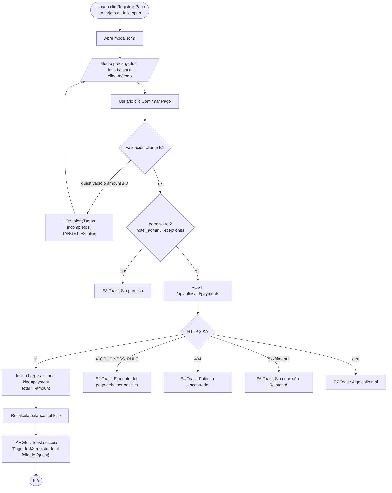
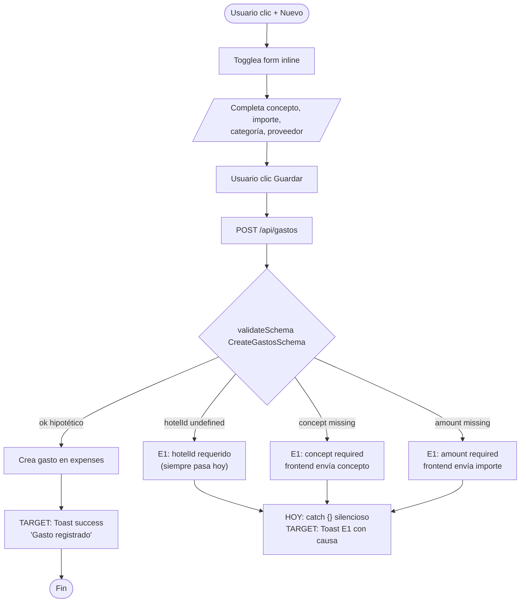

# FRD · M13 — Gestión de Cobros y Pagos (Folios, Pagos, Gastos)

> Documentado siguiendo el molde de `M01-PMS-Central.md` y los códigos de `00-MASTER.md` (F1–F6, E1–E7).
> Todo lo documentado está **extraído del código real**: `backend/src/modules/{folios,facturas,gastos}/`, `backend/src/composition-root.ts`, `frontend/src/pages/{billing,gastos}/index.vue` y `frontend/src/services/{Billing,Folios}.service.ts`. La columna "Gap" marca lo que NO cumple el modelo canónico.

**Módulo:** M13 — Gestión de Cobros y Pagos
**Pantallas cubiertas:** Facturación (`/panel/billing`) · Gastos (`/panel/gastos`)
**Servicios frontend:** `Billing.service.ts`, `Folios.service.ts` (+ `http` directo en gastos)
**Servicios backend:** módulos `folios`, `facturas`, `gastos` + endpoints cross-module en `composition-root.ts`

---

### ⚠ Superposición con M23 — Facturación Electrónica LATAM

M13 y **M23 comparten el módulo backend `facturas`** y la pantalla `/panel/billing` (pestaña "Facturas"). La división de responsabilidad es:

| Aspecto | M13 — Cobros/Pagos (este doc) | M23 — Facturación Electrónica |
|---------|-------------------------------|-------------------------------|
| **Foco** | Dinero entrando/saliendo: folios, pagos, métodos, gastos | Cumplimiento fiscal: NCF, envío a autoridades, 6 países LATAM |
| **Entidades** | `folios`, `folio_charges`, `expenses`, pagos (líneas `kind=payment`) | `invoices` (cabecera), campos `ncf`, `type='invoice'`, `taxes` |
| **Acciones UI** | "Registrar Pago", "+ Cargo", "Cerrar y Facturar", Gastos | "Emitir factura", validar NCF,envío DGII/AFIP/SAT… |
| **Rutas backend** | `/api/folios/*`, `/api/folios/:id/payments`, `/api/gastos`, `/api/facturas/:id/pay` | `/api/facturas` (POST `type=invoice`), generación de NCF |

El endpoint `POST /api/folios/:id/invoice` (composition-root.ts:222) es el **puente entre M13 y M23**: cierra el folio (M13) y dispara la creación de la factura fiscal (M23). Cualquier cambio en `facturas` impacta ambos docs.

---

## 1. Modelo de datos (fuente de verdad)

### 1.1 Folio (`folios/model.ts`) — cuenta acumulativa por reserva/huésped

Un folio acumula **líneas** (`folio_charges`) de dos tipos: cargos (`kind='charge'`) y pagos (`kind='payment'`). El balance es `chargesTotal − paymentsTotal`. Al cerrarse, genera una factura (M23).

| Campo | Tipo | Notas |
|-------|------|-------|
| `id` | string | PK |
| `hotelId` | string | multi-tenant, indexed |
| `reservationId` | string? | vínculo a M01 |
| `guestId` / `roomId` | string? | se heredan de la reserva al abrir |
| `status` | string | `'open'` · `'closed'` · `'void'` |
| `currency` | string | default `'USD'` |
| `invoiceId` | string? | se setea al cerrar+facturar (M23) |
| `openedAt` / `closedAt` | string? | timestamps de ciclo de vida |

**Campos derivados** (computados al leer en `folios/service.ts:81`):
`guestName`, `roomNumber`, `chargesTotal`, `paymentsTotal`, `balance`, `chargeCount`, `charges[]`.

### 1.2 Estados de Folio (`folios/types.ts:5`)

| Estado | Significado | Color badge | ¿Acepta cargos? | ¿Acepta pagos? |
|--------|-------------|-------------|-----------------|----------------|
| `open` | Folio activo, acumulando | teal | Sí | Sí |
| `closed` | Cerrado y facturado | gray | **No** (validado) | Sí* (ver gap §7) |
| `void` | Anulado | coral | No | No |

> *Gap: `applyPayment` **no valida** `folio.status` (`folios/service.ts:142`), así que hoy se puede pagar un folio ya cerrado. Documentado en §7 y §8.

### 1.3 Línea de folio — `folio_charges` (`folios/types.ts:9`)

| Campo | Tipo | Significado |
|-------|------|-------------|
| `kind` | `'charge'` \| `'payment'` | cargo positivo / pago negativo |
| `category` | enum | `room` · `minibar` · `restaurant` · `spa` · `laundry` · `phone` · `payment` · `tax` · `other` |
| `quantity` | number | default 1 |
| `amount` | number | base × qty (positivo en cargos, **negativo** en pagos) |
| `taxes` | number | impuesto calculado desde config (sólo cargos) |
| `total` | number | `amount + taxes` (pagos: negativo) |
| `source` | string | `'manual'` · `'night_audit'` · método de pago en pagos |
| `postedAt` | string? | fecha de afectación |

**Matemática** (`folios/usecases/folio-math.ts`):
- `chargesTotal = Σ total donde kind=charge`
- `paymentsTotal = Σ |total| donde kind=payment`
- `balance = chargesTotal − paymentsTotal`
- Impuesto: `tax = round2(base × rate / 100)` donde `rate` sale de `Configuration` (key `taxes` o `impuestos`), sumando tasas con flag `activo/active`.

### 1.4 Factura (`facturas/types.ts`) — compartida con M23

| Campo | Significado |
|-------|-------------|
| `type` | `'invoice'` \| `'payment'` \| `'folio'` \| `'receipt'` \| `'credit_note'` |
| `status` | `'pending'` \| `'paid'` \| `'overdue'` \| `'cancelled'` \| `'draft'` |
| `amount` | **TOTAL** (subtotal + impuestos) |
| `taxes` | monto de impuesto |
| `ncf` | Número de Comprobante Fiscal (LATAM, ver M23) |
| `paymentMethod` | método registrado al cobrar |
| `invoiceNumber` | auto-generado: `INV-{año}-{seq}` para invoices, `PAY-{ts}` para pagos |

**Reglas de emisión** (`facturas/service.ts:77`):
- `type='invoice'` → calcula impuesto desde config, genera `invoiceNumber` y `ncf`.
- `type='payment'` → status inicial `'paid'`, sin impuesto, número `PAY-{ts}`.

### 1.5 Gasto (`gastos/model.ts`, `gastos/types.ts`) — egresos del hotel

| Campo | Tipo | Notas |
|-------|------|-------|
| `hotelId` | string | required, indexed |
| `category` | string | default `'general'` |
| `concept` | string | **required** (descripción) |
| `amount` | number | **required** |
| `date` | string | fecha del gasto |
| `provider` | string? | proveedor |
| `invoiceNumber` | string? | factura del proveedor |
| `notes` | text? | detalle |
| `paid` | number | default 0 (monto ya pagado del gasto) |

> ⚠ **Inconsistencia ES/EN crítica (Gap §8):** el backend usa `concept`/`amount`/`provider`/`date`, pero `gastos/index.vue` envía y lee `concepto`/`importe`/`proveedor`/`fecha`. La pantalla **no funciona** contra este backend.

### 1.6 Métodos de pago (frontend, `billing/index.vue:411`)

Lista **hardcodeada** en la UI (no viene de config/backend):

| value | label | icono |
|-------|-------|-------|
| `card` | Tarjeta | 💳 |
| `cash` | Efectivo | 💵 |
| `transfer` | Transferencia | 🏦 |
| `link` | Link de pago | 🔗 |

> No hay validación backend del método (`ApplyPaymentSchema.method` es `string` libre). Cualquier valor pasa.

---

## 2. Pantalla — Facturación (`/panel/billing`)

Cabecera: título "Facturación" + subtítulo "Pagos, facturación electrónica LATAM y folios". Stats: Ingresos del Mes · Cobrado Hoy · Pendiente · Facturas Emitidas. Tres tabs: **"📄 Facturas"**, **"💳 Pagos"**, **"🏨 Folios"**.

### 2.1 Decision Table

| Trigger (botón exacto) | Condición / Estado previo | Resultado | Modal/Toast (texto literal) | Errores posibles | Notif F5 |
|------------------------|---------------------------|-----------|------------------------------|------------------|----------|
| **"Exportar"** (header) | — | **HOY:** nada (botón sin `@click`, `billing/index.vue:10`). **Target:** descargar CSV/Excel | — | — | — |
| **"+ Nuevo Pago"** (header, cyan) | — | Abre **modal form** "Registrar Pago" vacío (sin huésped precargado) | Modal `form`: header "Registrar Pago" | — | — |
| Tab **"📄 Facturas"** / **"💳 Pagos"** / **"🏨 Folios"** | — | Cambia vista (`activeTab`) sin recargar | — | — | — |
| Filtro **"Todas / Pagadas / Pendientes / Vencidas"** (select) | `invoiceFilter` | Filtra `filteredInvoices` por status | — | — | — |
| Clic en fila de factura | — | Abre **modal detail** "Factura #{n}" | Modal `detail`: estado, huésped, hab, items, subtotal, impuestos, total, caja e-Invoice si `ncf` | — | — |
| **"Ver"** (acción fila) | — | Igual que clic en fila | Modal `detail` | — | — |
| **"Cobrar"** (acción fila, sólo si `status='pending'`) | factura pendiente | Abre **modal form** "Registrar Pago" precargado con monto total | Modal `form`: `paymentTargetKind='invoice'`, monto = `inv.total` | — | — |
| Botón **"Registrar Pago"** (dentro del modal detail, si pending) | — | Cierra detail + abre form de pago | — | — | — |
| **"+ Cargo"** (tarjeta de folio, sólo si `status='open'`) | folio abierto | Abre **modal form** "Agregar Cargo — Hab {n}" | Modal `form`: conceptos select + monto + notas | — | — |
| **"Registrar Pago"** (tarjeta folio, sólo si `status='open'`) | folio abierto | Abre form "Registrar Pago" con monto = `folio.balance` | Modal `form`: `paymentTargetKind='folio'` | — | — |
| **"Cerrar y Facturar"** (tarjeta folio, sólo si `status='open'`) | folio abierto | **HOY:** `confirm()` nativo → POST `/folios/:id/invoice` → `alert()` éxito. **Target:** modal `warning` + caja ⚠ + Toast | **HOY:** `confirm("¿Cerrar el folio de {guest} y generar factura por ${total}?")` + `alert("Folio cerrado y factura generada: {num}")`. **Target:** Modal warning + Toast success "Folio cerrado. Factura {num} generada." | E2 "El folio no está abierto" · E3 "Sin permiso" · E6 | **Sí (target):** F5 a M23 "Factura {num} emitida" |
| Folio cerrado con `invoiceId` | `status='closed'` Y `invoiceId` set | Muestra badge "✓ Facturado" (sin acción) | — | — | — |
| **"Confirmar Pago"** (footer modal form) | `paymentForm.guest` vacío O `amount ≤ 0` | **HOY:** `alert('Datos incompletos')`. **Target:** F3 inline por campo | F3 target: "Huésped obligatorio" / "Monto inválido" | E1 | — |
| **"Confirmar Pago"** con datos válidos, target=folio | folio abierto, amount > 0 | `FoliosService.pay` → POST `/folios/:id/payments` (crea línea `kind=payment`, total negativo) | **Target:** Toast success "Pago de ${monto} registrado al folio de {guest}." **HOY:** sólo cierra modal sin feedback | E6 "Sin conexión" · E2 (si backend validase) | — |
| **"Confirmar Pago"** con datos válidos, target=invoice | invoice `pending` | `BillingService.pay` → POST `/facturas/:id/pay` (status→paid + crea registro `type=payment`) | **Target:** Toast success "Pago registrado. Factura {n} pagada." **HOY:** sin feedback | E6 · E4 "Factura no encontrada" | **Sí (target):** F5 Admin/Billing "Pago de ${m} confirmado" |
| **"Confirmar Pago"** sin target (pago suelto) | monto > 0 | `BillingService.create({type:'payment', status:'paid', paymentMethod})` | **Target:** Toast success "Pago registrado." **HOY:** sin feedback | E1 `hotelId` requerido · E6 | — |
| **"Agregar"** (footer modal cargo) sin concepto o monto ≤ 0 | form inválido | **HOY:** `alert('Datos incompletos')`. **Target:** F3 inline | F3 target: "Concepto obligatorio" / "Monto inválido" | E1 | — |
| **"Agregar"** con datos válidos | folio abierto | `FoliosService.charge` → POST `/folios/:id/charges` (calcula impuesto desde config) | **Target:** Toast success "Cargo de {concepto} agregado al folio de Hab {n}." **HOY:** sin feedback | E2 "El folio no está abierto" · E2 "El monto del cargo debe ser positivo" · E6 | — |
| **"Cancelar"** / **"Cerrar"** (footer modales) | — | Cierra modal sin acción | — | — | — |
| Clic en fondo oscuro (`@click.self`) | modal abierto | Cierra modal | — | — | — |
| Estado vacío en tab Folios | `folios.length === 0` | **HOY:** string suelto "No hay folios". **Target:** ilustración + CTA "Abrir folio" | — | — | — |

**Cálculo de stats** (`billing/index.vue:477`):
- `totalMonth` = Σ `total` de facturas `paid`.
- `totalToday` = Σ `amount` de pagos `paid` con `date === hoy`.
- `totalPending` = Σ `total` de facturas `pending` o `overdue`.

### 2.2 Flow — Registrar Pago a Folio



### 2.3 Flow — Agregar Cargo a Cuenta (folio)

```mermaid
flowchart TD
    A([Usuario clic + Cargo<br/>en folio open]) --> B[Abre modal form<br/>'Agregar Cargo — Hab {n}']
    B --> C[/Elige concepto select<br/>+ monto + notas/]
    C --> D[Usuario clic Agregar]
    D --> E{Validación cliente E1}
    E -- concepto vacío o amount ≤ 0 --> E1x["HOY: alert('Datos incompletos')<br/>TARGET: F3 inline"]
    E1x --> C
    E -- ok --> F[POST /api/folios/:id/charges]
    F --> G{service.postCharge}
    G -- folio.status != open --> X1["E2 Toast: El folio no está abierto"]
    G -- amount ≤ 0 --> X2["E2 Toast: El monto del cargo debe ser positivo"]
    G -- ok --> H[Calcula impuesto desde config<br/>crea línea kind=charge]
    H --> I{HTTP 201?}
    I -- sí --> J[Recarga folios]
    J --> K["TARGET: Toast success<br/>'Cargo de {concepto} agregado'"]
    K --> L([Fin])
    I -- 5xx --> X3[E6 Toast: Sin conexión]
    I -- 403 --> X4[E3 Toast: Sin permiso]
```

---

## 3. Pantalla — Gastos (`/panel/gastos`)

Cabecera simple: "Gastos" + total acumulado. Botón **"+ Nuevo"** toggela un formulario inline. Tabla de gastos existentes (sólo lectura — sin editar/eliminar).

### 3.1 Decision Table

| Trigger (botón exacto) | Condición / Estado previo | Resultado | Modal/Toast (texto literal) | Errores posibles | Notif F5 |
|------------------------|---------------------------|-----------|------------------------------|------------------|----------|
| **"+ Nuevo"** (header, navy) | `showNew=false` | Togglea formulario inline (no es modal) | Form: Concepto · Importe · Categoría · Proveedor | — | — |
| Form **"Guardar"** con campos vacíos | `concepto` o `importe` vacío | **HOY:** envía igual y falla en backend. **Target:** F3 inline | F3 target: "Concepto obligatorio" / "Importe inválido" | E1 "hotelId requerido" · E1 "concept required" · E1 "amount required" | — |
| **"Guardar"** con datos | form lleno | POST `/api/gastos` con `{...form, hotelId: undefined}` | **HOY:** `catch {}` silencioso → no feedback. **Target:** Toast success "Gasto {concept} registrado." | **E1 seguro:** `hotelId` es `undefined` y el schema lo requiere (`gastos/validators/schema.ts:4`) → 400 VALIDATION | — |
| Categoría select | — | Opciones: General · Suministros · Mantenimiento · Limpieza · Personal · Marketing | — | — | — |
| Tabla de gastos | `gastos.length > 0` | **HOY:** lee `g.concepto`/`g.importe`/`g.fecha`/`g.proveedor` → **campos vacíos** (backend devuelve `concept`/`amount`/`date`/`provider`) | — | — | — |
| Tabla vacía | `gastos.length === 0` | String "No hay gastos registrados" | — | — | — |
| Editar gasto | — | **No implementado** (no hay botón ni endpoint PUT expuesto en UI) | — | — | — |
| Eliminar gasto | — | **No implementado** (no hay botón; el endpoint DELETE sí existe en backend) | — | — | — |

> ⚠ **Bug crítico documentado (Gap §8):** la pantalla de gastos es **no funcional** contra el backend actual. Mismatch de campos ES↔EN + `hotelId` siempre undefined + lectura de campos inexistentes. Ver §8 para file:lines.

### 3.2 Flow — Agregar Gasto a Cuenta (con errores reales)



---

## 4. Consecuencias cross-módulo (eventos que dispara/recibe M13)

Acciones de M13 (o hacia M13) que **producen efectos en otros módulos** — deben generar F5 y/o sincronización:

| Acción | Módulo origen/destino | Efecto | Notificación F5 |
|--------|----------------------|--------|-----------------|
| Check-out confirmado (M01) | M01 → M13 | Generar folio del huésped, cobrar pendientes | F5 a Billing "Generar folio de {huésped}" (declarado en M01) |
| **Cerrar folio + facturar** (`POST /api/folios/:id/invoice`, `composition-root.ts:222`) | M13 → M23 | `folios.close` → `facturas.create({type:'invoice', amount:subtotal})` → `folios.setInvoice` | Target: F5 Admin "Factura {num} emitida" |
| **Night audit: post-room-charges** (`POST /api/folios/audit/post-room-charges`, `composition-root.ts:238`) | T3 Night Audit → M13 | Por cada reserva in-house: abre folio si no existe + posta cargo `category=room`, `source=night_audit`, monto = `room.basePrice` | — |
| Cargo de tarjeta procesado | M13 → M11 (Nómina) | **No implementado:** las comisiones por venta no alimentan nómina (sin conector) | — |
| Pago confirmado en factura | M13 → M16 (BI) | Suma a `revenueToday` / `pagosRecibidos` en dashboard/night-audit (`composition-root.ts:107,215`) | — |
| Gasto creado | M13 → M16 (BI) | **No implementado:** los gastos no restan del revenue en reportes (sólo reservas aportan) | — |
| Reembolso de pago | M13 → M23 (nota de crédito) | **No implementado:** no hay endpoint `/refund` ni `type=credit_note` en uso | — |
| Webhook Stripe/Mercado Pago | Externo → M13 | **No implementado:** no hay rutas `/webhooks/*` (ver SPEC M13 §Endpoints) | — |

> **Conector faltante:** no existe connector `folios-facturas` formal (sockets `onFolioClosed` está declarado en `folios/sockets.ts:6` pero **no se registra** en `composition-root.ts`). La orquestación close→invoice vive como endpoint cross-module en el root (líneas 222–235), no como connector. Decision de diseño a documentar.

---

## 5. Reglas de negocio a validar en backend (E2)

El backend **sí valida** estas reglas (HTTP 400 `BUSINESS_RULE`) y el frontend debe mostrar Toast E2:

1. **Postear cargo en folio no abierto** (`folios/service.ts:123`) → `"El folio no está abierto"`.
2. **Cerrar folio no abierto** (`folios/service.ts:167`) → `"El folio no está abierto"`.
3. **Monto de cargo ≤ 0** (`folios/service.ts:127`) → `"El monto del cargo debe ser positivo"`.
4. **Monto de pago ≤ 0** (`folios/service.ts:148`) → `"El monto del pago debe ser positivo"`.

### Reglas que el backend **NO valida hoy** (gaps a implementar)

| # | Regla faltante | Riesgo | Dónde falta |
|---|----------------|--------|-------------|
| G1 | **Pago mayor al saldo del folio** — `applyPayment` no compara `amount vs balance` | Saldo negativo sin control | `folios/service.ts:142` |
| G2 | **Pago en folio cerrado** — `applyPayment` no chequea `folio.status` | Cobros fantasma en folios facturados | `folios/service.ts:142` |
| G3 | **Método de pago inválido** — `ApplyPaymentSchema.method` es `string` libre | Acepta cualquier valor (ej. "foo") | `folios/validators/schema.ts:20` |
| G4 | **Categoría de cargo fuera del enum** — `PostChargeSchema.category` es `string` libre | Inconsistencia en reportes | `folios/validators/schema.ts:12` |
| G5 | **Gasto sin ownership check** — `GastosService` no llama `auth.assertOwnership` | IDOR: un hotel ve gastos de otro | `gastos/service.ts:60,69` |
| G6 | **Gasto con monto ≤ 0** — no hay validación | Gastos negativos/cero | `gastos/service.ts:69` |
| G7 | **Factura ya pagada** — `facturas.pay` no chequea `status` previo | Reprocesa pagos | `facturas/service.ts:132` |
| G8 | **Método requerido al pagar factura** — `PayFacturasDTO.method` es opcional | Pagos sin método | `facturas/types.ts:71` |
| G9 | **Currency del pago ≠ currency del folio** — sin check | Conversión errónea | — |

---

## 6. Gap analysis (file:line)

### 6.1 Anti-patrones de feedback (violaciones a `00-MASTER.md`)

| Patrón | file:line | Hoy | Target |
|--------|-----------|-----|--------|
| `alert()` nativo | `billing/index.vue:532` | `alert('Datos incompletos')` en `savePayment` | F3 inline por campo |
| `alert()` nativo | `billing/index.vue:559` | `alert(e?.message \|\| 'Error al guardar el pago')` | Toast E6/E7 con texto canónico |
| `alert()` nativo | `billing/index.vue:574` | `alert('Datos incompletos')` en `saveCharge` | F3 inline |
| `alert()` nativo | `billing/index.vue:582` | `alert(e?.message \|\| 'Error al guardar cargo')` | Toast error E2/E6 |
| `confirm()` + `alert()` | `billing/index.vue:586,590,592` | `confirm("¿Cerrar el folio...?")` + `alert("Folio cerrado...")` | Modal `warning` + caja ⚠ + Toast success |
| `catch {}` silencioso | `billing/index.vue:462` | `loadData` traga errores | Toast E6 + botón Reintentar |
| `catch {}` silencioso | `gastos/index.vue:13` | `loadData` traga errores | Toast E6 + estado de error |
| `catch {}` en POST gastos | `gastos/index.vue:40` | inline `await http.post(...)` sin catch visible | Toast E1/E6 |

### 6.2 Estados de carga (F6) ausentes

| Acción | file:line | Gap |
|--------|-----------|-----|
| `savePayment` | `billing/index.vue:531` | Sin `loading`, botón "Confirmar Pago" no se deshabilita |
| `saveCharge` | `billing/index.vue:573` | Sin `loading` en "Agregar" |
| `closeAndInvoice` | `billing/index.vue:585` | Sin `loading` durante POST `/folios/:id/invoice` |
| `loadData` / `loadFolios` | `billing/index.vue:433,465` | Sin skeleton en tablas de facturas/folios |
| `loadData` (gastos) | `gastos/index.vue:12` | `loading` ref existe (`:8`) pero **nunca se usa** |
| POST gastos | `gastos/index.vue:40` | Sin `loading` en "Guardar" |

### 6.3 Validaciones faltantes (E1/E2)

| Campo | file:line | Gap |
|--------|-----------|-----|
| Monto de pago negativo | `billing/index.vue:532` | Sólo valida `amount <= 0`, no el caso "mayor al saldo" (backend tampoco — ver G1) |
| Huésped requerido en pago suelto | `billing/index.vue:532` | `alert('Datos incompletos')` genérico, no discrimina campo |
| Concepto select vacío | `billing/index.vue:354` | `<option value="">Seleccionar...</option>` pasa al form si no se elige |
| **`hotelId` en POST gastos** | `gastos/index.vue:40` | Se envía `hotelId: undefined` → el backend siempre rechaza con E1 (schema requiere `hotelId`, `gastos/validators/schema.ts:4`) |

### 6.4 Bug crítico — Gastos ES/EN mismatch

| Campo frontend | file:line | Campo backend esperado | file:line backend |
|----------------|-----------|------------------------|-------------------|
| `form.concepto` | `gastos/index.vue:7,30` | `concept` (required) | `gastos/types.ts:9`, `validators/schema.ts:5` |
| `form.importe` | `gastos/index.vue:7,32` | `amount` (required) | `gastos/types.ts:10`, `validators/schema.ts:6` |
| `form.proveedor` | `gastos/index.vue:7,38` | `provider` | `gastos/types.ts:11` |
| `form.fecha` | `gastos/index.vue:7` | `date` | `gastos/types.ts:12` |
| Lectura `g.concepto / g.importe / g.fecha / g.proveedor` | `gastos/index.vue:46` | Respuesta usa `concept / amount / date / provider` | `gastos/types.ts:4-17` |

**Consecuencia:** la pantalla de gastos **nunca crea** un gasto (siempre 400 E1 por `hotelId`+`concept`+`amount` missing) y **siempre muestra** tabla con celdas vacías (campos inexistentes). Funcionalidad efectivamente muerta.

### 6.5 UX / estructura

| Item | file:line | Gap |
|------|-----------|-----|
| Botón "Exportar" muerto | `billing/index.vue:10` | Sin `@click` — no hace nada |
| Empty state "No hay folios" | `billing/index.vue:149` | String suelto, sin ilustración ni CTA |
| Empty state "No hay gastos registrados" | `gastos/index.vue:48` | String suelto, sin ilustración ni CTA |
| Modal sin subtipo `danger`/`warning` | `billing/index.vue:182,277,338` | Todos los modales son variaciones de `form`/`detail` sin respetar anatomía F2 de `00-MASTER.md §2.2` |
| Caja ⚠ cross-módulo ausente | `billing/index.vue:585` | "Cerrar y Facturar" no advierte que se emite factura fiscal (consecuencia M23) |
| `paymentMethods` hardcoded | `billing/index.vue:411` | No viene de config; no respesta "métodos activos por hotel" |
| Tab "Pagos" sin acciones | `billing/index.vue:106` | Sólo lectura — no hay "ver detalle" ni "reembolsar" |

### 6.6 Permisos (E3) — matriz observada en rutas

| Acción | Ruta | Roles permitidos | file:line |
|--------|------|------------------|-----------|
| Listar folios / facturas / gastos | GET | `hotel_admin`, `receptionist`, `super_admin` | `folios/index.ts:44`, `facturas/index.ts:48`, `gastos/index.ts:43` |
| Abrir folio | POST `/folios` | `hotel_admin`, `receptionist`, `super_admin` | `folios/index.ts:46` |
| Postear cargo / pago a folio | POST `/folios/:id/charges\|payments` | `hotel_admin`, `receptionist` (sin super_admin explícito) | `folios/index.ts:47-48` |
| **Cerrar folio** | POST `/folios/:id/close` | `hotel_admin`, `super_admin` (**receptionist NO**) | `folios/index.ts:49` |
| **Cerrar+Facturar (cross-module)** | POST `/folios/:id/invoice` | `hotel_admin`, `super_admin` (**receptionist NO**) | `composition-root.ts:222` |
| **Crear factura / cobrar factura** | POST `/facturas`, `/facturas/:id/pay` | `hotel_admin`, `super_admin` (**receptionist NO**) | `facturas/index.ts:50-51` |
| **Crear/editar/eliminar gasto** | POST/PUT/DELETE `/gastos` | `hotel_admin`, `super_admin` (**receptionist NO**) | `gastos/index.ts:45-47` |
| Night audit post-room-charges | POST `/folios/audit/post-room-charges` | `hotel_admin`, `super_admin` | `composition-root.ts:238` |

> **Inconsistencia de UX:** la UI de billing NO oculta "Cerrar y Facturar" ni "Cobrar" según rol. Un receptionist verá el botón, hará clic, y recién ahí recibirá E3. Falta `v-if` por rol o manejo del 403 con Toast E3.

---

## 7. Funcionalidades del SPEC no implementadas

Según `SPECS/M13-payment-management.spec.md` vs. código real:

| Funcionalidad SPEC | Estado | Notas |
|--------------------|--------|-------|
| Tarjetas con tokenización Stripe | **No implementado** | Sin `stripe` en deps, sin endpoint `/payments` propio |
| Mercado Pago | **No implementado** | Sin webhook ni preference |
| PayPal | **No implementado** | — |
| Enlaces de pago (`PaymentLink`) | **Parcial** — existe el método "Link de pago" en UI pero **no genera link**, sólo registra un pago con `method='link'` |
| Pre-autorización de tarjeta | **No implementado** | — |
| Reembolsos totales/parciales (`/refund`) | **No implementado** | Sin endpoint |
| Conciliación bancaria automática | **No implementado** | Sin `/billing/reconciliation`, sin import de extracto |
| Reporte diario de ingresos (`/billing/daily-report`) | **Parcial** — existe `/api/night-audit` con `pagosRecibidos`/`revenueHoy` pero no es específico de M13 |
| Exportación contable CSV/Excel (`/billing/export`) | **No implementado** — el botón "Exportar" existe en UI pero no tiene handler (`billing/index.vue:10`) |
| Depósitos / garantías (`Deposit`) | **No implementado** | Sin modelo |
| Webhooks Stripe / Mercado Pago | **No implementado** | Sin rutas `/webhooks/*` |
| Conversión de divisas | **No implementado** | `currency` existe en modelo pero es decorativo |
| 3D Secure / PCI-DSS | **No implementado** | — |
| Liberación auto de depósito 48h post check-out | **No implementado** | — |
| Conciliación diaria 06:00 | **No implementado** | — |

> Lo **único implementado** de M13: folios acumulativos (cargos+pagos), registro manual de pagos (efectivo/tarjeta/transfer/link como etiqueta), cierre→factura, y gastos CRUD backend (la UI está rota — ver §6.4).

---

## 8. Checklist de verificación M13

Estado actual vs. target. Marcar cuando se cumpla.

### Facturación (`/panel/billing`)
- [ ] Reemplazar `alert('Datos incompletos')` por F3 inline en `savePayment` (`billing/index.vue:532`)
- [ ] Reemplazar `alert(e?.message)` por Toast E6/E7 con texto canónico (`billing/index.vue:559,582,592`)
- [ ] Reemplazar `confirm()`+`alert()` en "Cerrar y Facturar" por modal `warning` + caja ⚠ + Toast success (`billing/index.vue:586-592`)
- [ ] Botón "Confirmar Pago" con estado loading F6
- [ ] Botón "Agregar" (cargo) con estado loading
- [ ] Botón "Cerrar y Facturar" con estado loading
- [ ] Skeleton en tablas de facturas/pagos/folios durante `loadData`
- [ ] Toast success en pago registrado (folio / factura / suelto)
- [ ] Toast success en cargo agregado
- [ ] Toast success en folio cerrado+facturado
- [ ] Empty state con ilustración + CTA en tab Folios ("No hay folios" → "Abrir primer folio")
- [ ] Botón "Exportar" con handler real (CSV/Excel) o quitarlo
- [ ] Ocultar "Cerrar y Facturar" / "Cobrar" si el rol no tiene permiso (E3 preemptivo)
- [ ] Manejar 403 del backend con Toast E3 "No tenés permiso para [acción]"
- [ ] Validación E1: monto ≤ 0, huésped vacío, concepto vacío — inline, no `alert`
- [ ] Validación cliente de "pago mayor al saldo" cuando exista regla backend (G1)

### Gastos (`/panel/gastos`)
- [ ] **FIX CRÍTICO:** alinear nombres de campo frontend↔backend (`concept`/`amount`/`provider`/`date`) — `gastos/index.vue:7,30,32,38,46`
- [ ] Enviar `hotelId` real (desde `auth.user.hotelId`) en POST — `gastos/index.vue:40`
- [ ] Reemplazar `catch {}` silencioso por Toast E1/E6 con causa
- [ ] Botón "Guardar" con estado loading (usar el `loading` ref ya declarado `:8`)
- [ ] Toast success al crear gasto
- [ ] Skeleton en tabla durante `loadData`
- [ ] Acción **Editar** gasto (endpoint PUT ya existe)
- [ ] Acción **Eliminar** gasto con modal `danger` (endpoint DELETE ya existe)
- [ ] Validación inline: concepto y importe requeridos, importe > 0

### Backend (reglas E2 faltantes, §5)
- [ ] G1: validar `pago ≤ folio.balance` en `folios/service.ts:142`
- [ ] G2: validar `folio.status === 'open'` en `applyPayment` (`folios/service.ts:142`)
- [ ] G3: enum de métodos válidos en `ApplyPaymentSchema.method`
- [ ] G4: enum de categorías en `PostChargeSchema.category`
- [ ] G5: `auth.assertOwnership` en `GastosService` (`gastos/service.ts:60,69,77,86`)
- [ ] G6: validar `amount > 0` al crear gasto
- [ ] G7: validar `status !== 'paid'` en `facturas.pay` (`facturas/service.ts:132`)
- [ ] G8: `method` requerido en `PayFacturasDTO`

### Cross-module / orquestación
- [ ] Decidir: ¿formalizar conector `folios-facturas` o mantener endpoint cross-module en root? (hoy mixto)
- [ ] Registrar socket `onFolioClosed` para disparar F5 a M23 cuando se emita factura
- [ ] Implementar conector M13 → M11 (comisiones por venta a nómina) cuando exista M11
- [ ] Botón "Exportar" conectado a endpoint `/billing/export` (SPEC M13)

---

## 9. Pendiente de documentar en M13 (próximas iteraciones)

- [ ] Reembolsos y notas de crédito cuando se implementen (`type='credit_note'` ya existe en types pero sin uso).
- [ ] Conciliación bancaria (cuando exista el endpoint `/billing/reconciliation`).
- [ ] Integración Stripe / Mercado Pago / SulusPay (webhooks, tokenización).
- [ ] Depósitos y garantías (modelo `Deposit` del SPEC, no implementado).
- [ ] Reporte diario de cobros (diferenciar de `/api/night-audit` que es más amplio).
- [ ] Divisa y conversión (hoy `currency` es decorativo).
- [ ] Matriz de permisos final: ¿receptionist puede cobrar pero no facturar? (Hoy sí puede cobrar folio, no puede cerrarlo ni cobrar factura).

---

*Este doc se rige por `00-MASTER.md`. Cualquier patrón de feedback nuevo se documenta allá primero. Superposición con `M23-Facturacion-LATAM.md` declarada en el header — coordinar cambios en el módulo `facturas` entre ambos.*
