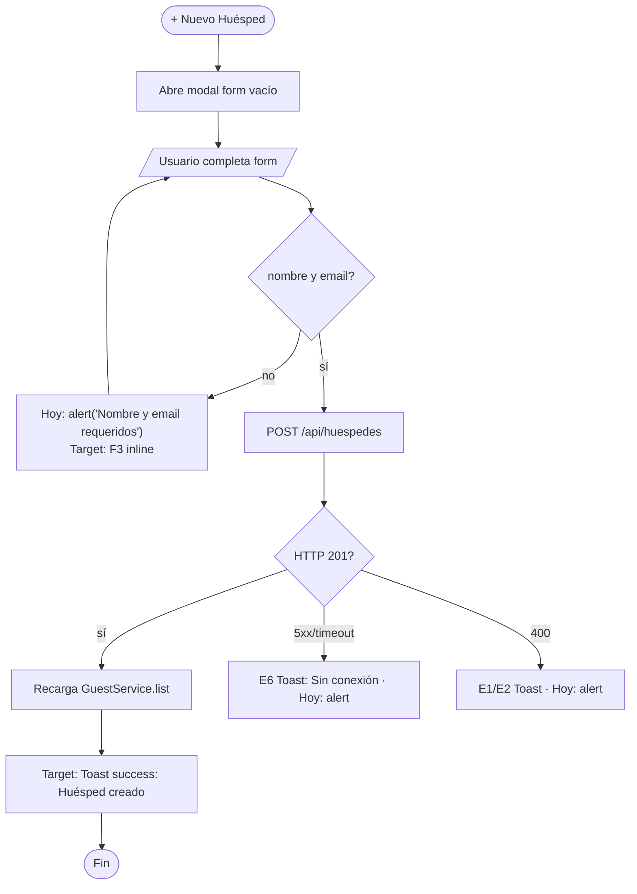
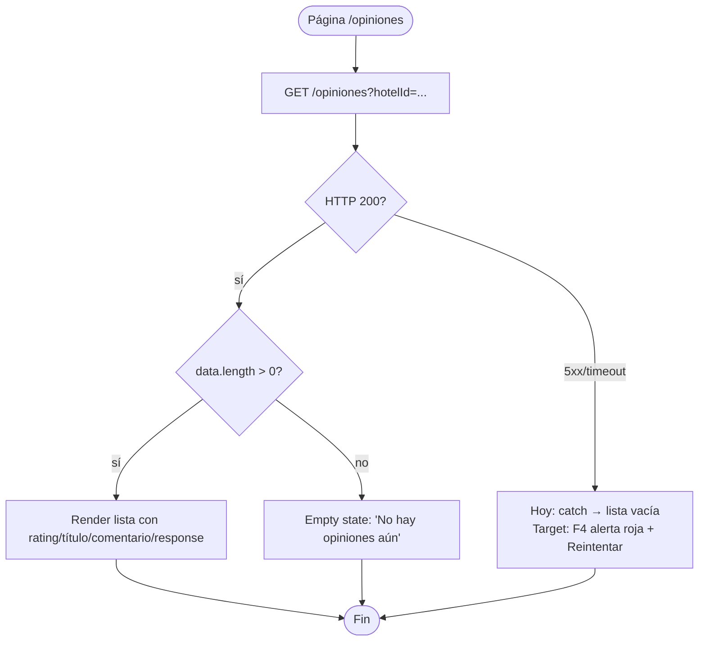

# FRD · M14 — CRM y Fidelización (Huéspedes, Opiniones, Programa de Puntos)

> **Módulo de Retención.** Documenta cómo el hotel conoce, segmenta y premia a sus huéspedes, y cómo recolecta feedback post-estadía. Sigue el molde de `00-MASTER.md` (códigos F1–F6 / E1–E7).
>
> Todo lo acá documentado está **extraído del código real** de `backend/src/modules/huespedes/` y `backend/src/modules/opiniones/`, más `frontend/src/pages/guests/` y `frontend/src/pages/opiniones/`. La columna **REAL** vs **PENDIENTE** marca qué existe hoy y qué falta para cumplir el alcance completo de CRM/Fidelización.

**Módulo:** M14 — CRM y Fidelización
**Pantallas cubiertas:** Huéspedes (`/panel/guests`) · Opiniones (`/panel/opiniones`)
**Servicios frontend:** `Guest.service.ts` (huéspedes) · `http` directo en `opiniones/index.vue` (sin service dedicado)
**Servicios backend:** módulos `huespedes` (tabla `guests`) y `opiniones` (tabla `reviews`)
**Endpoints:** `/api/huespedes` · `/api/huespedes/:id` · `/api/opiniones` · `/api/opiniones/:id`

---

## 1. Modelo de datos (fuente de verdad)

### 1.1 Entidad Huésped (`guests` — `huespedes/model.ts:5`)

| Campo | Tipo | Default | REAL / PENDIENTE | Notas |
|-------|------|---------|------------------|-------|
| `id` | string | — | REAL | PK |
| `name` | string | — | REAL | Nombre completo (no se separa first/last en DB) |
| `email` | string | — | REAL | Opcional en DB, obligatorio en form frontend |
| `phone` | string | — | REAL | |
| `document` | string | — | REAL | Pasaporte/ID |
| `nationality` | string | — | REAL | |
| `preferences` | json | — | REAL (campo) / PENDIENTE (uso) | El campo existe pero el form NUNCA lo envía al crear/editar (ver §6 Gap #3) |
| `totalStays` | number | `0` | REAL (campo) / PENDIENTE (cálculo) | Nunca se incrementa automáticamente (falta conector) |
| `totalSpent` | number | `0` | REAL (campo) / PENDIENTE (cálculo) | Nunca se suma automáticamente tras checkout |
| `tier` | string | `"bronze"` | REAL (campo) / PENDIENTE (lógica) | El campo existe pero ninguna regla lo promueve |
| `notes` | text | — | REAL | |
| `active` | number | `1` | REAL | Soft-delete flag (no usado por el servicio `delete` que hace hard delete) |
| `hotelId` | string | — | REAL | Multi-tenant, indexed |
| `createdAt` / `updatedAt` | timestamp | auto | REAL | |

> ⚠ **PENDIENTE — campos presentes en UI pero AUSENTES en el modelo:** `birthDate` (lo pide el form `guests/index.vue:263`, no existe en `model.ts`), `loyaltyPoints`/`points` (lo lee el mapper `Guest.service.ts:42` pero NO existe columna en `guests`). El frontend los muestra pero siempre llegan `0`/vacío desde la API.

### 1.2 Entidad Opinión (`reviews` — `opiniones/model.ts:5`)

| Campo | Tipo | Default | REAL / PENDIENTE | Notas |
|-------|------|---------|------------------|-------|
| `id` | string | — | REAL | PK |
| `hotelId` | string | — | REAL | Multi-tenant, indexed |
| `guestId` | string | — | REAL | FK lógico a `guests.id` (sin constraint) |
| `reservationId` | string | — | REAL | FK lógico a reservas (sin constraint) |
| `rating` | number | — | REAL | Requerido. ⚠ **Sin validación de rango 1–5** (ver §7 regla 6) |
| `title` | string | — | REAL | |
| `comment` | text | — | REAL | |
| `response` | text | — | REAL (campo) / PENDIENTE (UI) | La respuesta del hotel: el campo existe pero no hay UI para responder |
| `date` | string | — | REAL | Fecha de la reseña |
| `visible` | number | `1` | REAL (campo) / PENDIENTE (moderación) | Sin UI de toggle de visibilidad |
| `channel` | string | `'direct'` | REAL | Origen: `direct`, OTA, etc. |

### 1.3 Tiers de fidelización (cálculo **frontend only** — `guests/index.vue:396-401`)

| Tier | Condición (hardcoded UI) | Color | REAL / PENDIENTE |
|------|--------------------------|-------|------------------|
| `VIP` | `totalSpent >= 5000` | gold | REAL (display) / PENDIENTE (backend) |
| `Frecuente` | `stays >= 5` | teal | REAL (display) / PENDIENTE (backend) |
| `Regular` | resto | navy | REAL (display) |
| `bronze` (DB) | — | — | PENDIENTE — el modelo guarda `"bronze"` pero la UI recalcula y lo ignora |

> **Inconsistencia:** el backend guarda `tier` en DB (default `bronze`) pero la UI **nunca lo lee** — recalcula el tier en runtime con umbrales distintos. No hay un `silver`/`gold`/`platinum` real.

### 1.4 Filtros de segmentación (`guests/index.vue:39-44`)

| Valor `filterType` | Condición (frontend) | Origen |
|--------------------|----------------------|--------|
| `all` | — | Todos |
| `frequent` | `stays >= 5` | `guests/index.vue:376` |
| `new` | `stays <= 1` | `guests/index.vue:377` |
| `vip` | `totalSpent >= 5000` | `guests/index.vue:378` |

> **PENDIENTE:** segmentación en backend. Hoy todo es filtrado en memoria sobre la lista ya cargada (`HuespedesQuery` solo soporta `hotelId/status/type/category/search` — `huespedes/types.ts:53`, y `status/type/category` **no existen como campos** del modelo).

---

## 2. Pantalla — Huéspedes (`/panel/guests`)

Cabecera con 4 KPIs (Total / Activos Hoy / Frecuentes / Puntos Otorgados) + tabla con buscador y filtro de segmento + modales Ver / Crear / Editar.

> ⚠ **KPIs mentirosos hoy:** `activeToday` y `totalPoints` siempre son `0` porque `history[]` y `loyaltyPoints` nunca vienen populados (ver §6 Gap #1).

### 2.1 Decision Table

| Trigger | Condición / Estado previo | Resultado | Modal/Toast (texto literal) | Errores (códigos) | Notif F5 |
|---------|---------------------------|-----------|------------------------------|-------------------|----------|
| Input **"Buscar por nombre, email o teléfono…"** | — | Filtra `filteredGuests` en memoria | — | — | — |
| Select **filtro** (`Todos`/`Frecuentes`/`Nuevos`/`VIP`) | — | Refiltra por umbral hardcoded | — | — | — |
| Clic en fila de huésped | — | Abre **modal detail** "View Guest Profile" (`guests/index.vue:99`) | Modal `detail` (max-w-2xl): avatar + stats (estadías/gastado/puntos/tier) + contacto + preferencias + historial + notas | — | — |
| Botón **"Ver"** (fila) | — | Igual que clic en fila | Modal `detail` | — | — |
| Botón **"Editar"** (fila) | — | Abre **modal form** en modo edición (`guests/index.vue:222`) precargado | Modal `form`: "Editar Huésped" | — | — |
| Botón **"+ Nuevo Huésped"** (header) | — | Abre **modal form** vacío | Modal `form`: "Nuevo Huésped" | — | — |
| Toggle preferencias (chips) | `form.preferences` | Agrega/quita tag del array local | — | — | — |
| **"Crear Huésped"** con nombre o email vacío | `form.name` o `form.email` falsy | No envía | **Hoy:** `alert('Nombre y email requeridos')` (`guests/index.vue:437`). **Target:** F3 inline | E1 | — |
| **"Crear Huésped"** (form válido) | datos ok | POST `/api/huespedes`, recarga lista, cierra modal | **Hoy:** sin toast. **Target:** Toast success "Huésped {name} creado." | E2 "Ya existe un huésped con ese email" (no implementado) · E6 "Sin conexión" | — |
| **"Guardar Cambios"** (edición) | form válido | PUT `/api/huespedes/:id`, recarga lista, cierra | **Hoy:** sin toast. **Target:** Toast success "Huésped actualizado." | E5 conflicto · E6 | — |
| `saveGuest` falla | API error | Sin cambio | **Hoy:** `alert(e?.message || 'Error al guardar huésped')` (`guests/index.vue:479`). **Target:** Toast E6/E7 | E6/E7 | — |
| Botón **"Editar Perfil"** (dentro del detail) | modal detail abierto | Cierra detail, abre form edición | — | — | — |
| Botón **"Cancelar"** / ✕ / `@click.self` (overlay) | modal abierto | Cierra sin acción | — | — | — |

**Gap actual (Huéspedes):**
- ❌ `alert()` en validación (`guests/index.vue:437`) y en error (`:479`) → Toast/inline.
- ❌ **Sin toast de éxito** al crear/editar (solo cierra el modal).
- ❌ **Sin estado loading** en botones "Crear Huésped" / "Guardar Cambios".
- ❌ **`preferences` y `notes` se pierden:** el form los recolecta pero `saveGuest` NO los envía en el payload (`guests/index.vue:441-457`).
- ❌ **`birthDate` se pide pero no se envía ni existe en DB** (`guests/index.vue:421` lo setea, `:441-457` no lo manda).
- ❌ **Historial de estadías siempre vacío** (`history: []` en `:355` y `:475`) — no hay join con módulo `reservas`.
- ❌ Modal form NO avisa al cerrar con cambios sin guardar (F2 form-dirty).
- ❌ Botón **Eliminar** no existe en la UI (el service tiene `delete`, `Guest.service.ts:69`, pero ningún botón lo invoca).

### 2.2 Flow — Crear Huésped

---

## 3. Pantalla — Opiniones (`/panel/opiniones`)

Vista **read-only**. Tarjeta con total de reseñas + promedio de rating + lista de reseñas (rating, título, comentario, respuesta del hotel, canal). Sin creación, sin respuesta, sin filtros.

### 3.1 Decision Table

| Trigger | Condición / Estado previo | Resultado | Modal/Toast (texto literal) | Errores (códigos) | Notif F5 |
|---------|---------------------------|-----------|------------------------------|-------------------|----------|
| Carga de página (`onMounted`) | — | GET `/opiniones`, mapea `result.data` a lista | — | E4/E6 silenciados (`catch { opiniones.value = [] }`, `opiniones/index.vue:13`) | — |
| Sin reseñas | `opiniones.length === 0` | Muestra string "No hay opiniones aún" (`opiniones/index.vue:40`) | — | — | — |
| Reseña con `response` seteada | `o.response` truthy | Muestra bloque con fondo cyan + italic | — | — | — |
| Reseña sin `response` | `!o.response` | No muestra bloque de respuesta | — | — | — |
| Reseña sin `title` | `!o.title` | Muestra "Sin título" (`opiniones/index.vue:33`) | — | — | — |
| Reseña sin `channel` | `!o.channel` | Muestra "directa" (`opiniones/index.vue:35`) | — | — | — |

**Gap actual (Opiniones):**
- ❌ **NO hay creación de reseñas** desde la UI (el backend tiene POST, el frontend nunca lo invoca).
- ❌ **NO hay responder reseña** (campo `response` existe pero sin UI de edición).
- ❌ **NO hay moderación** (campo `visible` existe pero sin toggle, las reseñas invisibles se siguen guardando pero la UI no filtra por `visible=1`).
- ❌ **NO hay filtros** por rating / canal / fecha.
- ❌ **NO hay paginación** — `OpinionesService.list` trae todo.
- ❌ **Error de carga silenciado** (`catch { opiniones.value = [] }`) — el usuario ve "No hay opiniones" aunque el server esté caído (debería ser F4 roja + reintentar → E6).
- ❌ **Sin service dedicado:** `opiniones/index.vue:10` usa `http.get` directo, violando la regla "no `fetch()`/`http` en componentes" (debería existir `Opiniones.service.ts` como `Guest.service.ts`).
- ❌ **Sin linking a huésped/reserva:** `guestId` y `reservationId` se guardan pero la UI no los muestra ni resuelve el nombre del huésped.

### 3.2 Flow — Cargar Opiniones

---

## 4. Consecuencias cross-módulo (eventos que M14 debería disparar/recibir)

Estos son los flujos que **M14 debería tener con otros módulos** pero que **HOY NO ESTÁN CONECTADOS**. `composition-root.ts` registra los módulos `huespedes` (línea 76) y `opiniones` (línea 81) pero **no existe ningún connector** que los enlace (verificado: `grep` en `connectors/` no encuentra coincidencias).

| Acción esperada | Módulo origen → destino | Estado | Notificación F5 esperada |
|-----------------|------------------------|--------|--------------------------|
| Check-out confirmado → sumar 1 a `guest.totalStays` | M01 → M14 | **PENDIENTE** (no hay connector `reservas-huespedes`) | — |
| Check-out confirmado → sumar `totalAmount` a `guest.totalSpent` | M01 → M14 | **PENDIENTE** | — |
| Check-out confirmado → crear petición de reseña al huésped | M01 → M14 (opiniones) | **PENDIENTE** | F5 email/WhatsApp: "¿Cómo fue tu estadía?" |
| Check-out confirmado → sumar puntos de fidelización | M01 → M14 | **PENDIENTE** (no hay modelo de puntos) | — |
| `totalSpent` supera umbral → promover `tier` | M14 (interno) | **PENDIENTE** | F5 a Recepción: "{guest} ahora es VIP" |
| Reseña con `rating ≤ 2` → alertar al gerente | M14 → M01/M11 | **PENDIENTE** | F5 Admin: "Reseña negativa de {guest}" |
| Reserva creada → buscar/crear huésped por email | M01 → M14 | **PENDIENTE** | — |
| Folio cerrado → actualizar LTV del huésped | M13 → M14 | **PENDIENTE** | — |
| Cupón canjeado → descontar saldo | M14 → M01/M13 | **PENDIENTE** (no hay modelo de cupones) | — |

### Lo único REAL hoy cross-module

- `composition-root.ts:171` — el endpoint `/api/reports` calcula `topGuests` ordenando huéspedes por `totalSpent` (top 5). Es la única agregación tipo LTV que existe, pero es **read-only en Reports**, no alimenta M14.

---

## 5. Reglas de negocio a validar en backend (E2)

El backend debe rechazar (HTTP 400 `BUSINESS_RULE`) estas situaciones. **HOY NINGUNA está implementada** en `huespedes/service.ts` ni `opiniones/service.ts` (servicios son CRUD puro sin reglas).

| # | Regla | Texto al usuario (Toast E2) | Estado |
|---|-------|------------------------------|--------|
| 1 | Email duplicado en el mismo hotel al crear huésped | "Ya existe un huésped con ese email." | **PENDIENTE** |
| 2 | `document` duplicado en el mismo hotel | "Ya existe un huésped con ese documento." | **PENDIENTE** |
| 3 | Crear reseña con `rating` fuera de [1,5] | "El rating debe estar entre 1 y 5." | **PENDIENTE** (schema no valida rango) |
| 4 | Crear reseña sin `reservationId` ni `guestId` (reseña anónima no permitida) | "La reseña debe estar vinculada a una reserva." | **PENDIENTE** |
| 5 | Responder una reseña ya respondida | "Esta reseña ya tiene respuesta." | **PENDIENTE** |
| 6 | `totalSpent`/`totalStays` negativos | "Los totales no pueden ser negativos." | **PENDIENTE** |
| 7 | Promover `tier` sin cumplir umbral manualmente | "El huésped no cumple los requisitos para ese tier." | **PENDIENTE** |
| 8 | Canjear cupón expirado o sin saldo | "El cupón no es válido o está vencido." | **PENDIENTE** (sin modelo de cupones) |

---

## 6. Gap Analysis (con `archivo:línea`)

### Huéspedes

| # | Gap | dónde | Severidad |
|---|-----|-------|-----------|
| G1 | KPI "Activos Hoy" siempre `0` (depende de `history[].status==='current'` que nunca se popula) | `guests/index.vue:360` y `:355` | WARNING |
| G2 | KPI "Puntos Otorgados" siempre `0` (`loyaltyPoints` no viene del backend, no existe columna) | `guests/index.vue:362`, `Guest.service.ts:42` | WARNING |
| G3 | `preferences` y `notes` se pierden al guardar (no van en el payload de create/update) | `guests/index.vue:441-457` | **BLOCKER** |
| G4 | `birthDate` se pide en form pero no existe en modelo ni se envía | `guests/index.vue:263, 421` | WARNING |
| G5 | `tier` guardado en DB pero la UI lo recalcula y lo ignora | `model.ts:16` vs `guests/index.vue:396` | WARNING |
| G6 | `alert()` en validación de form | `guests/index.vue:437` | **BLOCKER** |
| G7 | `alert()` en error de API | `guests/index.vue:479` | **BLOCKER** |
| G8 | Sin toast de éxito al crear/editar huésped | `guests/index.vue:477` (solo `closeFormModal()`) | **BLOCKER** |
| G9 | Sin estado loading en botones de form | `guests/index.vue:291` | WARNING |
| G10 | Sin modal "¿descartar cambios?" al cerrar form dirty | `guests/index.vue:222` (overlay `@click.self`) | WARNING |
| G11 | Mapper `mapGuest` lee `g.nombre` (español) pero el modelo usa `name` (inglés) → nombres vacíos | `Guest.service.ts:28, 34` | **BLOCKER** |
| G12 | Mapper lee `g.nationality` pero `RawGuest` define `nacionalidad` → nacionalidad siempre vacía | `Guest.service.ts:16` vs `:39` | **BLOCKER** |
| G13 | Sin botón Eliminar en UI (service existe pero no se invoca) | `Guest.service.ts:69` huérfano | WARNING |
| G14 | `active` (soft-delete) existe pero el service hace hard `delete` | `huespedes/service.ts:86` | WARNING |
| G15 | `HuespedesQuery.status/type/category` no matchean ningún campo real del modelo | `huespedes/types.ts:54-56` | WARNING |

### Opiniones

| # | Gap | dónde | Severidad |
|---|-----|-------|-----------|
| G16 | UI solo lectura — sin crear, responder ni moderar | `opiniones/index.vue` (todo el archivo) | **BLOCKER** |
| G17 | Usa `http.get` directo en componente (sin service) | `opiniones/index.vue:3,10` | **BLOCKER** |
| G18 | Error de carga silenciado como "lista vacía" | `opiniones/index.vue:13` | **BLOCKER** |
| G19 | No filtra por `visible=1` (reseñas invisibles se mostrarían) | `opiniones/index.vue:10-11` | WARNING |
| G20 | No valida rango de `rating` (1–5) en backend | `opiniones/validators/schema.ts:5` | WARNING |
| G21 | `guestId`/`reservationId` guardados pero nunca resueltos a nombres en la UI | `opiniones/index.vue:29-39` | WARNING |
| G22 | Sin paginación (trae todas las reseñas) | `opiniones/service.ts:50` | WARNING |
| G23 | `response` sin workflow (no hay UI ni endpoint específico de "responder") | `opiniones/model.ts:14` | WARNING |

### Composición / Conectores

| # | Gap | dónde | Severidad |
|----|-----|-------|-----------|
| G24 | No existe connector `reservas-huespedes` (checkout no actualiza `totalStays`/`totalSpent`) | `composition-root.ts:86-91` (solo hay `reservas-housekeeping` y `habitaciones-canales`) | **BLOCKER** |
| G25 | No existe connector `reservas-opiniones` (checkout no dispara solicitud de reseña) | ausente | **BLOCKER** |
| G26 | `topGuests` se calcula en Reports pero M14 no lo consume | `composition-root.ts:171` | WARNING |

---

## 7. Programa de puntos, LTV y segmentación — ESTADO

| Capacidad CRM | Estado | Evidencia |
|---------------|--------|-----------|
| **Perfil de huésped** (datos de contacto) | ✅ REAL (con gaps) | CRUD completo `huespedes/service.ts`, form en `guests/index.vue` |
| **Preferencias persistidas** | ❌ PENDIENTE | Campo existe, form lo pide, pero `saveGuest` no lo envía (G3) |
| **Historial de estadías** | ❌ PENDIENTE | `history: []` hardcoded (`guests/index.vue:355`) |
| **Segmentación** | ⚠ PARCIAL | Solo filtros UI hardcoded; sin backend, sin segmentos editables |
| **Cálculo de LTV** | ❌ PENDIENTE | Solo `totalSpent` crudo (sin churn, sin forecast, sin recencia/frecuencia) |
| **Programa de puntos (acumulación)** | ❌ PENDIENTE | No hay columna `loyaltyPoints`, no hay regla de accrual |
| **Programa de puntos (redención)** | ❌ PENDIENTE | Sin modelo de canje |
| **Cupones / promociones** | ❌ PENDIENTE | No hay módulo ni modelo de cupones |
| **Upgrade automático de tier** | ❌ PENDIENTE | `tier` existe en DB pero nunca se muta por regla |
| **Recolección de reseñas** (post-checkout) | ❌ PENDIENTE | Sin connector ni trigger |
| **Reseñas internas** (CRUD) | ✅ REAL | `opiniones/service.ts` CRUD funcional |
| **Reseñas en UI** | ⚠ PARCIAL | Solo lectura, sin filtros ni paginación |
| **Responder reseña** | ❌ PENDIENTE | Campo `response` sin UI/endpoint |
| **Moderación de reseñas** | ❌ PENDIENTE | `visible` sin toggle |
| **Integración con OTAs** (Booking/Google reviews) | ❌ PENDIENTE | Sin sincronización externa |

---

## 8. Checklist de verificación M14

Estado actual vs. target. Marcar cuando se cumpla.

### Huéspedes
- [ ] Reemplazar `alert('Nombre y email requeridos')` por F3 inline (G6)
- [ ] Reemplazar `alert(e?.message)` por Toast E6/E7 (G7)
- [ ] Toast success al crear/editar huésped (G8)
- [ ] Estado loading en "Crear Huésped" / "Guardar Cambios" (G9)
- [ ] Enviar `preferences`, `notes` y `birthDate` en el payload (G3, G4)
- [ ] Agregar `birthDate` al modelo `guests` o quitar del form
- [ ] Fix mapper `mapGuest`: leer `name`/`nationality` no `nombre`/`nacionalidad` (G11, G12)
- [ ] Modal "¿descartar cambios?" al cerrar form dirty (G10)
- [ ] Poblar `history[]` desde módulo reservas (join por `guestId`)
- [ ] Implementar KPI "Activos Hoy" con dato real (G1)
- [ ] Definir fuente de verdad del `tier` (DB o cálculo) y unificar (G5)
- [ ] Botón Eliminar en UI con modal `danger` o quitar `GuestService.delete`
- [ ] Cambiar `delete` por soft-delete usando `active=0` (G14)

### Opiniones
- [ ] Crear `Opiniones.service.ts` (quitar `http.get` del componente, G17)
- [ ] Pantalla de crear reseña vinculada a reserva/huésped
- [ ] Workflow "Responder reseña" (form con `response`)
- [ ] Toggle de `visible` para moderación (G19, G23)
- [ ] Filtrar por `visible=1` en el listado público (G19)
- [ ] Validar `rating` entre 1 y 5 en schema (G20, §5 regla 3)
- [ ] Reemplazar `catch { opiniones = [] }` por F4 + Reintentar (G18)
- [ ] Mostrar nombre del huésped y #reserva en cada reseña (G21)
- [ ] Paginación + filtros por rating/canal/fecha (G22)

### Programa de fidelización (nuevo)
- [ ] Modelo `loyalty_points` (balance por huésped) o columna en `guests`
- [ ] Regla de accrual: X puntos por noche/dólar al checkout
- [ ] Connector `reservas-huespedes` que sume `totalStays`, `totalSpent` y puntos (G24)
- [ ] Reglas de upgrade automático de `tier` con umbrales configurables
- [ ] Modelo `coupons` + endpoint de validación/canje
- [ ] Cálculo de LTV (recencia + frecuencia + valor monetario)
- [ ] Connector `reservas-opiniones` para pedir reseña post-checkout (G25)
- [ ] Vista de segmentos guardados (más allá de los 4 filtros hardcoded)

---

## 9. Pendiente de documentar en M14 (próximas iteraciones)

- [ ] Matriz de roles: ¿recepcionista puede editar huéspedes? ¿Solo admin responde reseñas? (hoy `huespedes` POST/PUT/DELETE exige `hotel_admin`/`super_admin`, GET permite `receptionist` — `huespedes/index.ts:43-47`)
- [ ] Integración con WhatsApp/Email para envío de solicitud de reseña (vincular a M17 Briefings)
- [ ] Sincronización de reseñas OTA (Booking.com, Google) — hoy solo `channel: 'direct'`
- [ ] RGPD / privacidad: derecho al olvido sobre huéspedes (soft-delete + anonymize)
- [ ] Doble ópt-in para marketing segmentado
- [ ] Campañas de cupones con vencimiento y target por tier

---

*Este documento cubre M14 — CRM y Fidelización. Para patrones de feedback, ver `00-MASTER.md`. Para CRUD de huésped como actor de check-in/out, ver `M01-PMS-Central.md`.*
