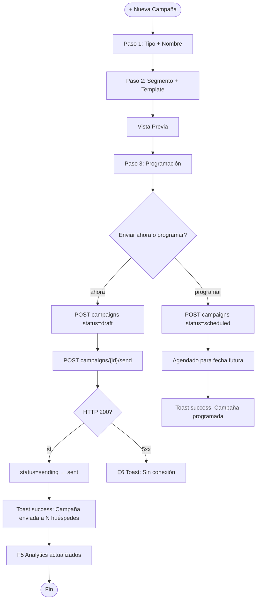
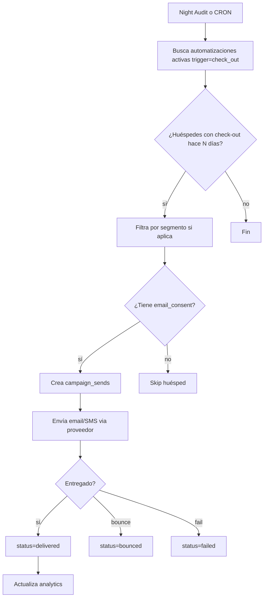

# FRD · M15 — Marketing Automatizado

> **Módulo no implementado.** Este documento define el comportamiento TARGET para el módulo de Marketing Automatizado de SOLMI OS. Sigue el molde de `M01-PMS-Central.md`.
>
> Todo lo documentado acá es **comportamiento esperado** basado en estándares de la industria hotelera. Las columnas "Gap" marcan que TODO está pendiente de implementación.

**Módulo:** M15 — Marketing Automatizado
**Estado:** 🔴 No implementado
**Fecha:** 2026-06-19
**Pantallas cubiertas:** Campañas · Segmentación · Email Marketing · SMS Marketing · Automatizaciones · Loyalty Campaigns · Analytics
**Servicios frontend target:** `Marketing.service.ts`, `Campaign.service.ts`, `Segment.service.ts`
**Servicios backend target:** módulos `marketing`, `campaigns`, `segments`, `email-templates`

---

## 1. Propósito

M15 permite a los hoteles crear y ejecutar campañas de marketing automatizadas dirigidas a huéspedes actuales, pasados y potenciales. Incluye segmentación avanzada, envío de emails transaccionales y promocionales, campañas SMS, automatizaciones basadas en eventos del PMS (check-out, cumpleaños, estancia prolongada), y programación de campañas de fidelización. Se integra directamente con M14 (CRM) para obtener datos de huéspedes y con M01 (PMS) para eventos de ciclo de vida.

---

## 2. Modelo de datos (target)

### 2.1 Campañas (`campaigns`)

| Columna | Tipo | Descripción |
|---------|------|-------------|
| `id` | UUID | PK |
| `hotel_id` | UUID | FK → hotels |
| `name` | VARCHAR(200) | Nombre interno de la campaña |
| `type` | ENUM | `email` · `sms` · `whatsapp` · `push` · `combined` |
| `status` | ENUM | `draft` · `scheduled` · `sending` · `sent` · `paused` · `cancelled` · `completed` |
| `segment_id` | UUID | FK → segments (audiencia destino) |
| `template_id` | UUID | FK → email_templates (opcional para combined) |
| `subject` | VARCHAR(300) | Asunto del email (solo type=email) |
| `body` | TEXT | Contenido del mensaje (HTML para email, texto para SMS) |
| `scheduled_at` | TIMESTAMP | Fecha/hora programada de envío |
| `sent_at` | TIMESTAMP | Fecha/hora real de envío |
| `created_by` | UUID | FK → users |
| `created_at` | TIMESTAMP | — |
| `updated_at` | TIMESTAMP | — |

### 2.2 Segmentos (`segments`)

| Columna | Tipo | Descripción |
|---------|------|-------------|
| `id` | UUID | PK |
| `hotel_id` | UUID | FK → hotels |
| `name` | VARCHAR(200) | Nombre del segmento |
| `description` | TEXT | Descripción del criterio |
| `rules` | JSONB | Reglas de segmentación (ver §2.3) |
| `dynamic` | BOOLEAN | `true` = se recalcula automáticamente, `false` = snapshot estático |
| `guest_count` | INTEGER | Conteo cacheado de huéspedes en el segmento |
| `last_calculated_at` | TIMESTAMP | Última recalculación |
| `created_at` | TIMESTAMP | — |
| `updated_at` | TIMESTAMP | — |

### 2.3 Estructura de `rules` (segmentación)

```json
{
  "operator": "AND",
  "conditions": [
    { "field": "total_stays", "operator": "gte", "value": 3 },
    { "field": "last_stay_date", "operator": "gte", "value": "2025-01-01" },
    { "field": "total_spent", "operator": "gte", "value": 5000 },
    { "field": "email_consent", "operator": "eq", "value": true }
  ]
}
```

**Campos disponibles para segmentación:**

| Categoría | Campos |
|-----------|--------|
| Demografía | `nationality`, `language`, `age_range`, `gender` |
| Historial estancia | `total_stays`, `total_nights`, `avg_nights`, `first_stay_date`, `last_stay_date` |
| Gasto | `total_spent`, `avg_spend_per_stay`, `room_type_preference` |
| Canal | `preferred_channel`, `first_channel` |
| Engagement | `email_opened_count`, `email_clicked_count`, `sms_replied_count`, `loyalty_tier` |
| Consentimiento | `email_consent`, `sms_consent`, `whatsapp_consent` |
| Eventos | `has_reservation_pending`, `birthday_month`, `days_since_last_stay` |

### 2.4 Plantillas de Email (`email_templates`)

| Columna | Tipo | Descripción |
|---------|------|-------------|
| `id` | UUID | PK |
| `hotel_id` | UUID | FK → hotels (NULL = plantilla global SOLMI) |
| `name` | VARCHAR(200) | Nombre de la plantilla |
| `category` | ENUM | `welcome` · `post_stay` · `promotion` · `loyalty` · `seasonal` · `custom` |
| `subject` | VARCHAR(300) | Asunto con variables `{{guest.name}}` |
| `html_body` | TEXT | HTML con variables dinámicas |
| `preview_text` | VARCHAR(200) | Texto de previsualización en inbox |
| `is_active` | BOOLEAN | — |
| `created_at` | TIMESTAMP | — |

**Variables disponibles en templates:**

`{{guest.name}}` · `{{guest.first_name}}` · `{{guest.email}}` · `{{guest.nationality}}` · `{{reservation.room_number}}` · `{{reservation.check_in}}` · `{{reservation.check_out}}` · `{{reservation.total}}` · `{{hotel.name}}` · `{{hotel.phone}}` · `{{loyalty.points}}` · `{{loyalty.tier}}`

### 2.5 Envíos (`campaign_sends`)

| Columna | Tipo | Descripción |
|---------|------|-------------|
| `id` | UUID | PK |
| `campaign_id` | UUID | FK → campaigns |
| `guest_id` | UUID | FK → guests |
| `channel` | ENUM | `email` · `sms` · `whatsapp` · `push` |
| `status` | ENUM | `pending` · `sent` · `delivered` · `opened` · `clicked` · `bounced` · `failed` |
| `sent_at` | TIMESTAMP | — |
| `delivered_at` | TIMESTAMP | — |
| `opened_at` | TIMESTAMP | — |
| `clicked_at` | TIMESTAMP | — |
| `error_message` | TEXT | Si falló el envío |
| `external_id` | VARCHAR(200) | ID del proveedor (SendGrid, Twilio, etc.) |

### 2.6 Automatizaciones (`automations`)

| Columna | Tipo | Descripción |
|---------|------|-------------|
| `id` | UUID | PK |
| `hotel_id` | UUID | FK → hotels |
| `name` | VARCHAR(200) | Nombre de la automatización |
| `trigger_event` | ENUM | `check_out` · `reservation_confirmed` · `days_before_checkin` · `days_after_checkin` · `birthday` · `loyalty_tier_change` · `no_stay_days` |
| `trigger_days` | INTEGER | Días antes/después del evento (ej: 3 = 3 días después del check-out) |
| `template_id` | UUID | FK → email_templates |
| `segment_id` | UUID | FK → segments (filtro adicional, opcional) |
| `channel` | ENUM | `email` · `sms` · `whatsapp` · `push` |
| `status` | ENUM | `active` · `paused` · `draft` |
| `total_sent` | INTEGER | Conteo acumulado |
| `last_triggered_at` | TIMESTAMP | — |
| `created_at` | TIMESTAMP | — |

### 2.7 Analytics de Campaña (`campaign_analytics`)

| Columna | Tipo | Descripción |
|---------|------|-------------|
| `id` | UUID | PK |
| `campaign_id` | UUID | FK → campaigns |
| `total_recipients` | INTEGER | Total destinatarios |
| `total_sent` | INTEGER | Enviados exitosamente |
| `total_delivered` | INTEGER | Entregados confirmados |
| `total_opened` | INTEGER | Emails abiertos |
| `total_clicked` | INTEGER | Con click en link |
| `total_bounced` | INTEGER | Rebotados |
| `total_unsubscribed` | INTEGER | Que se dieron de baja |
| `revenue_attributed` | DECIMAL(12,2) | Reservas atribuidas a la campaña |
| `calculated_at` | TIMESTAMP | — |

---

## 3. Pantalla — Campañas (`/panel/marketing/campaigns`)

Toolbar: botón "+ Nueva Campaña" · Filtros por estado y tipo · Toggle vista lista/calendario.

### 3.1 Decision Table

| Trigger | Condición | Resultado | Modal/Toast (texto) | Errores | Notif F5 |
|---------|-----------|-----------|----------------------|---------|----------|
| **"+ Nueva Campaña"** | — | Abre wizard de 3 pasos: 1) Tipo + Nombre → 2) Segmento + Template → 3) Programación + Revisión | Modal `form` lg: "Nueva Campaña" | — | — |
| Seleccionar tipo "Email" en paso 1 | — | Muestra campos: asunto, preview text, template selector | — | — | — |
| Seleccionar tipo "SMS" en paso 1 | — | Muestra: campo de texto (max 160 chars), contador de caracteres | — | — | — |
| Seleccionar tipo "Combinada" en paso 1 | — | Muestra: email + sms + push (múltiple canal) | — | — | — |
| Clic en segmento (paso 2) | — | Abre selector con previsualización: nombre, reglas, conteo de huéspedes | — | — | — |
| **"Vista Previa"** (paso 2) | template seleccionado | Renderiza preview del email/SMS con datos de ejemplo | Modal `detail`: "Vista Previa" | — | — |
| Seleccionar "Enviar ahora" (paso 3) | — | status = `sending`, ejecuta envío inmediato | — | — | — |
| Seleccionar "Programar" (paso 3) | fecha/hora en futuro | status = `scheduled`, agenda envío | — | E1 "La fecha debe ser futura" | — |
| Botón **"Crear Campaña"** (paso 3 válido) | datos completos | POST campaign → status=`draft` o `scheduled` | **Toast success:** "Campaña '{nombre}' creada." | E6 "Sin conexión" | — |
| Botón **"Enviar Ahora"** (en campaña draft) | campaña draft, segmento tiene huéspedes | status → `sending`, POST campaign/{id}/send | **Toast success:** "Campaña '{nombre}' enviada a {n} huéspedes." + loading | E2 "La campaña no tiene destinatarios" · E6 | — |
| Botón **"Pausar"** (en campaña scheduled/sending) | status = scheduled o sending | status → `paused` | **Toast success:** "Campaña '{nombre}' pausada." | E6 | — |
| Botón **"Reanudar"** (en campaña paused) | status = paused | status → `scheduled` | **Toast success:** "Campaña '{nombre}' reprogramada." | E6 | — |
| Botón **"Cancelar"** (en campaña scheduled) | status = scheduled | **Modal danger:** "¿Cancelar campaña '{nombre}'? No se enviará a los destinatarios." | Modal danger: coral | E6 | — |
| Clic en nombre de campaña | — | Abre detalle de campaña: métricas, lista de destinatarios, estado de cada envío | Modal `detail` | — | — |
| Botón **"Eliminar"** (en campaña draft/cancelled) | status = draft o cancelled | **Modal danger:** "¿Eliminar campaña '{nombre}'? Esta acción no se puede deshacer." | Modal danger | E6 | — |

### 3.2 Flow — Crear y Enviar Campaña



---

## 4. Pantalla — Segmentación (`/panel/marketing/segments`)

### 4.1 Decision Table

| Trigger | Condición | Resultado | Modal/Toast (texto) | Errores | Notif F5 |
|---------|-----------|-----------|----------------------|---------|----------|
| **"+ Nuevo Segmento"** | — | Abre modal form: nombre, descripción, reglas dinámicas, toggle estático/dinámico | Modal `form` lg: "Nuevo Segmento" | — | — |
| Agregar condición (form segmento) | — | Muestra dropdown de campo, operador, valor | — | — | — |
| **"Calcular Audiencia"** | al menos 1 condición | Ejecuta query contra BD, muestra conteo en vivo | Badge: "{n} huéspedes" | — | — |
| **"Guardar Segmento"** | nombre + al menos 1 condición | POST segments | **Toast success:** "Segmento '{nombre}' creado con {n} huéspedes." | E6 | — |
| **"Recalcular"** (segmento dinámico) | — | Re-ejecuta reglas, actualiza `guest_count` | **Toast success:** "Segmento '{nombre}' recalculado: {n} huéspedes." | E6 | — |
| **"Exportar"** (segmento) | — | Descarga CSV con huéspedes del segmento | — | E6 | — |
| Botón **"Usar en Campaña"** | — | Redirige a wizard de campaña con segmento preseleccionado | — | — | — |
| **"Editar"** (segmento) | — | Abre modal form precargado | Modal `form`: "Editar Segmento" | — | — |
| **"Eliminar"** (segmento sin campañas activas) | — | **Modal danger:** "¿Eliminar segmento '{nombre}'?" | Modal danger | E2 "No se puede eliminar: tiene campañas activas" · E6 | — |

---

## 5. Pantalla — Automatizaciones (`/panel/marketing/automations`)

### 5.1 Decision Table

| Trigger | Condición | Resultado | Modal/Toast (texto) | Errores | Notif F5 |
|---------|-----------|-----------|----------------------|---------|----------|
| **"+ Nueva Automatización"** | — | Abre modal form: nombre, trigger, días, template, canal, segmento (opcional) | Modal `form` lg: "Nueva Automatización" | — | — |
| Seleccionar trigger "Post Check-out" | — | Muestra campo "Días después del check-out" (default: 1) | — | — | — |
| Seleccionar trigger "Días antes del Check-in" | — | Muestra campo "Días antes" (default: 3) | — | — | — |
| Seleccionar trigger "Cumpleaños" | — | Muestra campo "Días antes del cumpleaños" (default: 7) | — | — | — |
| Seleccionar trigger "Sin estancia" | — | Muestra campo "Días sin estancia" (default: 90) | — | — | — |
| **"Guardar"** | nombre + trigger + template + canal | POST automations | **Toast success:** "Automatización '{nombre}' creada." | E6 | — |
| Toggle **"Activa/Pausada"** | — | PATCH automations status | **Toast success:** "Automatización '{nombre}' activada/pausada." | E6 | — |
| **"Ver Historial"** | — | Abre lista de envíos disparados por esta automatización | Modal `detail` | — | — |
| **"Eliminar"** | — | **Modal danger:** "¿Eliminar automatización '{nombre}'? No se desactivarán los envíos en curso." | Modal danger | E6 | — |

### 5.2 Flow — Automatización Post Check-out



---

## 6. Pantalla — Email Templates (`/panel/marketing/templates`)

### 6.1 Decision Table

| Trigger | Condición | Resultado | Modal/Toast (texto) | Errores | Notif F5 |
|---------|-----------|-----------|----------------------|---------|----------|
| **"+ Nueva Plantilla"** | — | Abre editor WYSIWYG con variables disponibles | Modal `form` xl: "Nueva Plantilla" | — | — |
| Seleccionar categoría | — | Filtra plantillas existentes + muestra sugerencias | — | — | — |
| Insertar variable `{{guest.name}}` | — | Inserta placeholder en el cursor del editor | — | — | — |
| **"Vista Previa"** | — | Renderiza con datos de ejemplo | Modal `detail` | — | — |
| **"Guardar Plantilla"** | nombre + subject + body | POST email_templates | **Toast success:** "Plantilla '{nombre}' guardada." | E6 | — |
| **"Duplicar"** (plantilla existente) | — | Crea copia con nombre "Copia de {original}" | **Toast success:** "Plantilla duplicada." | E6 | — |
| **"Eliminar"** (sin campañas activas) | — | **Modal danger:** "¿Eliminar plantilla '{nombre}'?" | Modal danger | E2 "No se puede eliminar: está en uso por campañas activas" · E6 | — |

---

## 7. Consecuencias cross-módulo (eventos que dispara M15)

| Acción en M15 | Módulo afectado | Efecto | Notificación F5 |
|---------------|-----------------|--------|-----------------|
| Campaña enviada | CRM (M14) | Actualizar `email_opened_count`, `email_clicked_count` del huésped | — |
| Huésped hace unsubscribe | CRM (M14) | Marcar `email_consent=false`, `sms_consent=false` | "Huésped {nombre} se dio de baja del marketing" |
| Automatización post check-out ejecutada | PMS (M01) | Leer reserva checked_out de hace N días | — |
| Campaña con revenue atribuido | BI (M16) | Actualizar métricas de canal de adquisición | — |
| Automatización de cumpleaños | Loyalty (M20) | Bonus de puntos por cumpleaños | "Felicitá a {nombre}: {n} puntos de cumpleaños" |

---

## 8. Gap analysis

| # | Gap | Severidad | Descripción |
|---|-----|-----------|-------------|
| G1 | Módulo completo no existe | 🔴 BLOCKER | No hay backend, frontend, ni servicios |
| G2 | Sin integración email provider | 🔴 BLOCKER | Necesita SendGrid/Mailgun/Twilio para envíos reales |
| G3 | Sin segmentación | 🔴 CRÍTICO | No hay motor de reglas para segmentar huéspedes |
| G4 | Sin automatizaciones | 🔴 CRÍTICO | No hay CRON/disparadores basados en eventos del PMS |
| G5 | Sin analytics de campaña | 🟡 ALTO | No hay tracking de opens/clicks/bounces |
| G6 | Sin templates editor | 🟡 ALTO | No hay editor WYSIWYG ni variables dinámicas |
| G7 | Sin integración M14 CRM | 🟡 ALTO | No hay lectura de datos de huéspedes para segmentación |
| G8 | Sin consentimiento GDPR | 🟡 ALTO | No hay gestión de opt-in/opt-out |
| G9 | Sin SMS provider | 🟠 MEDIO | No hay integración Twilio para SMS |
| G10 | Sin reportes de ROI | 🟠 MEDIO | No hay atribución de revenue a campañas |

---

## 9. Checklist de verificación M15

### Campañas
- [ ] Wizard de 3 pasos funcional
- [ ] Crear campaña email con asunto + template
- [ ] Crear campaña SMS con texto (max 160 chars)
- [ ] Crear campaña combinada (email + sms + push)
- [ ] Programar envío futuro
- [ ] Enviar ahora con confirmación
- [ ] Pausar/reanudar campaña scheduled
- [ ] Cancelar campaña (modal danger)
- [ ] Eliminar campaña draft/cancelled
- [ ] Vista lista con filtros por estado/tipo
- [ ] Vista calendario de campañas programadas
- [ ] Detalle de campaña con métricas en vivo

### Segmentación
- [ ] Crear segmento con reglas dinámicas
- [ ] Calcular audiencia en tiempo real
- [ ] Editar reglas de segmentación
- [ ] Recalcular segmento dinámico
- [ ] Exportar huéspedes del segmento a CSV
- [ ] Usar segmento en campaña (shortcut)

### Automatizaciones
- [ ] Crear automatización con trigger de evento
- [ ] Configurar días antes/después del evento
- [ ] Asignar template + canal
- [ ] Activar/pausar automatización
- [ ] Ver historial de envíos disparados
- [ ] Night Audit dispara automatizaciones pendientes

### Email Templates
- [ ] Editor WYSIWYG funcional
- [ ] Insertar variables dinámicas
- [ ] Vista previa con datos de ejemplo
- [ ] Duplicar plantilla existente
- [ ] Categorías de plantilla

### Analytics
- [ ] Dashboard de métricas por campaña
- [ ] Tracking de opens/clicks/bounces
- [ ] Revenue atribuido a campañas
- [ ] Tasa de unsubscribe por campaña

### Cross-módulo
- [ ] Actualiza CRM (M14) con engagement del huésped
- [ ] Respeta consentimiento del huésped (GDPR)
- [ ] Lee eventos de PMS (M01) para automatizaciones
- [ ] Notificaciones F5 en eventos clave

---

*Documento generado como target. Todo está pendiente de implementación. Copiar molde de `M01-PMS-Central.md`.*
