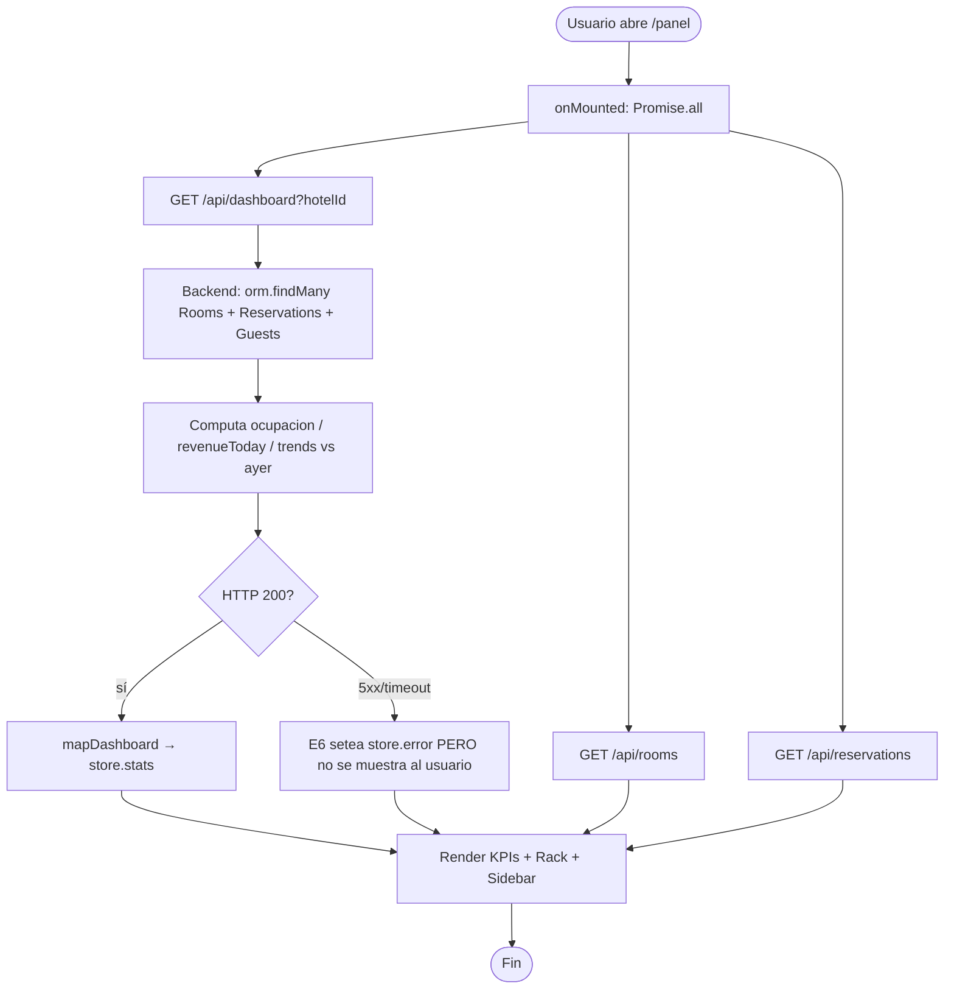
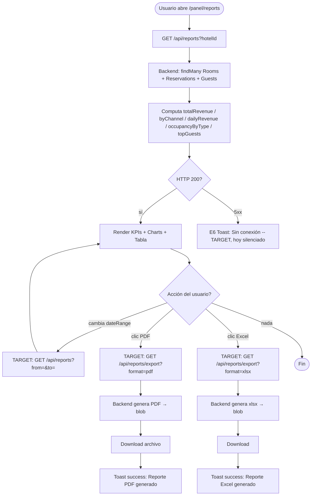

# FRD · M16 — Business Intelligence (Dashboard, Reportes, KPIs, Auditoría Nocturna)

> **Módulo de analítica y métricas operativas.** Documenta CÓMO se calculan y muestran los KPIs hoteleros (ocupación, ADR, RevPAR, ingresos, cancelaciones, pick-up) y los reportes exportables, siguiendo `00-MASTER.md`.
>
> Todo lo documentado acá está **extraído del código real** de `frontend/src/pages/{dashboard,reports}/index.vue`, `frontend/src/services/{Dashboard,Report}.service.ts` y `backend/src/composition-root.ts` (endpoints `/api/dashboard`, `/api/reports`, `/api/night-audit`, `/api/admin/analytics`). La columna "Gap" marca lo que hoy NO cumple el modelo canónico.

**Módulo:** M16 — Business Intelligence
**Pantallas cubiertas:** Dashboard (`/panel`) · Reportes (`/panel/reports`) · Auditoría Nocturna (`/api/night-audit`, sin UI) · Analytics SuperAdmin (`/panel/admin/analytics`)
**Servicios frontend:** `Dashboard.service.ts`, `Report.service.ts`, `SuperAdmin.service.ts` (analytics), Pinia `dashboard.store.ts`
**Servicios backend:** NO hay módulo BI dedicado. Los KPIs se computan **inline en `composition-root.ts`** (endpoints de agregación cross-module, lectura read-only vía `orm.findMany`).
**Endpoints:**
| Método | Ruta | Rol | Qué devuelve |
|--------|------|-----|--------------|
| GET | `/api/dashboard` | hotel_admin, receptionist, super_admin | KPIs operativos del día (ocupación, llegadas, salidas, ingresos hoy, trends) |
| GET | `/api/reports` | hotel_admin, super_admin | Reportes agregados (revenue total, byChannel, dailyRevenue, occupancyByType, topGuests) |
| GET | `/api/night-audit` | hotel_admin, super_admin | Cierre diario (ADR, RevPAR, noShows, pagosPendientes, impuestos) |
| GET | `/api/admin/analytics` | super_admin | Métricas cross-hotel (plataforma) |
| POST | `/api/folios/audit/post-room-charges` | hotel_admin, super_admin | Posta cargos de hab. a folios in-house (noche) |

---

## 1. Modelo de datos — KPIs y cómo se calculan (fuente: código real)

> ⚠ **Hallazgo crítico:** los KPIs **no se persisten** ni se sirven desde un módulo `reports/` o `analytics/`. Se **recomputan en cada request** en `composition-root.ts` leyendo `Rooms`, `Reservations`, `Guests` vía ORM. No hay caché ni pre-cómputo nocturno (salvo `night-audit` que también es on-demand).

### 1.1 Ocupación (`occupancy` / `ocupacion`)

**Definición target:** `ocupadas / total × 100`.
**Implementación real** (`composition-root.ts:119`):
```
occToday = rooms.length ? Math.round((occupied / rooms.length) * 100) : 0
```
donde `occupied = rooms.filter(r => r.status === 'occupied').length` (`:102`).

⚠ **Gap de cálculo (BUG):** la ocupación se computa contando habitaciones con `status === 'occupied'` **en el instante de la request**, no por noches vendidas. Una habitación `dirty` o `cleaning` post check-out **no se cuenta como ocupada** aunque la noche se haya vendido → la métrica subestima la ocupación real del día. El estándar hotelero cuenta noches vendidas / noches disponibles.

### 1.2 ADR (Average Daily Rate)

**Definición target:** `ingresos por habitaciones / habitaciones vendidas`.
**Implementación real** (`composition-root.ts:200`, solo en `/api/night-audit`):
```
adr = occupied > 0 ? Math.round(revenueTotal / occupied) : 0
```
donde `revenueTotal = res.reduce((s, r) => s + (r.totalAmount || 0), 0)` (`:193`).

⚠ **Gap de cálculo (BUG):**
1. Usa `revenueTotal` (suma de TODAS las reservas, sin filtrar por fecha) dividido por `occupied` (habitaciones ocupadas ahora). Numerador y denominador miden poblaciones distintas → ADR inválido.
2. En `/api/reports` (`:154`) se calcula un `channelADRs[ch] = revenue_del_canal / cantidad_de_reservas_del_canal` — divide por **reservas**, no por **noches**. Tampoco es ADR verdadero.
3. El dashboard NO muestra ADR en KPIs principales (solo `avgRate` derivado en el frontend `Dashboard.service.ts:30`, que replica la misma fórmula incorrecta).

### 1.3 RevPAR (Revenue Per Available Room)

**Definición target:** `ingresos totales / habitaciones disponibles` (= `ADR × ocupación`).
**Implementación real** (`composition-root.ts:201`):
```
revpar = rooms.length > 0 ? Math.round(revenueTotal / rooms.length) : 0
```
⚠ Mismo bug de numerador: `revenueTotal` es la suma histórica de todas las reservas (no del día/período). En `Dashboard.service.ts:31` se computa `revpar = revenue / totalRooms` (revenue total histórico / habitaciones → sin sentido operativo). El frontend `reports/index.vue` muestra RevPAR en la tabla (`:183`) pero **el backend `/api/reports` no lo envía** → siempre sale `$0` (gap: campo no provisto).

### 1.4 Ingresos (`revenue`)

Tres variantes en código:
- `revenue` = suma de `totalAmount` de TODAS las reservas (`composition-root.ts:125`). Histórico total.
- `revenueToday` = suma de `totalAmount` de reservas cuyo `checkIn` es hoy (`:107-110`). ⚠ Usa fecha de check-in, no fecha de consumo → una reserva de hace 5 días con check-in hoy suma "hoy".
- `dailyRevenue` (en `/api/reports:147`) = agrupación por `checkIn` día → mismo sesgo.

`revenueBreakdown`, `topCountries`, `upcomingArrivals` se declaran en el **tipo TypeScript** `ReportData` (`Report.service.ts:11-13`) y el frontend los consume (`reports/index.vue:366-387`) **pero el backend NO los devuelve** → siempre listas vacías.

### 1.5 Pick-up y Lead time

⚠ **NO IMPLEMENTADOS.** No existen campos, endpoints ni UI que computen:
- **Pick-up** (reservas nuevas en una ventana vs. total).
- **Lead time** (días entre booking-date y check-in-date).

No aparecen en `composition-root.ts`, ni en servicios, ni en pantallas. **Gap completo.**

### 1.6 Cancelaciones

**Implementación real** (`composition-root.ts:160`):
```
canceledReservations: res.filter(r => r.status === 'cancelled').length
```
Frontend (`reports/index.vue:323`) calcula `Tasa Cancelación = canceladas / total × 100`. Solo soporta número absoluto y % — no hay tendencias ni comparativos.

### 1.7 Trend (vs. ayer)

Único comparativo implementado (`composition-root.ts:116-121`): ocupa y revenue **de hoy vs. ayer**. Solo dirección (`up|down|stable`), sin magnitud (% del `change` queda siempre `''` en `dashboard/index.vue:293-296`). **No hay comparativos por semana/mes/trimestre/año** pese a que el selector de `dateRange` los ofrece (`reports/index.vue:11-16`) — el selector **no envía nada al backend**.

---

## 2. Pantalla — Dashboard (`/panel`)

Cabecera: 4 KPIs (Ocupación · Llegadas Hoy · Salidas Hoy · Ingresos Hoy) con badge de trend. Rack visual de habitaciones + sidebar (Llegadas/Salidas/Incidencias) + modal de cuarto con acciones.

**Auth:** `meta.requiresHotelAuth` (router:94). Backend exige `hotel_admin | receptionist | super_admin` (`composition-root.ts:97`).

### 2.1 Decision Table

| Trigger (botón/acción) | Condición / Estado previo | Resultado | Modal/Toast (texto literal) | Errores posibles (códigos) | Notificación F5 |
|------------------------|---------------------------|-----------|------------------------------|-----------------------------|-----------------|
| Cargar página `/panel` (`onMounted`, `dashboard/index.vue:346`) | sesión activa | `Promise.all([fetchStats, fetchRooms, fetchReservations])` | — (sin feedback visible de carga) | E6 si `/api/dashboard` cae → store.error seteado, **NO mostrado al usuario** | — |
| Filtro **"Todas / Libres / Ocupadas / Limpieza"** (rack) | `activeFilter` cambia | Filtra `rooms` sin recargar | — | — | — |
| Clic en celda de habitación (`openRoomModal`) | — | Abre **modal detail** Teleport (`:135`) con estado, huésped actual/próximo, tarifa, amenities | Modal `detail` (sin confirmación) | — | — |
| Botón **"Check-in"** (en modal, `v-if=available`) | `room.status=available` | Cierra modal + `roomStore.updateRoomStatus(id, 'occupied')` (`:458-465`) | **Gap:** sin toast success; sin modal de confirmación. En error re-fetch silencioso | E6/E7 **silenciados** (`catch {}` vacío) | F5 Housekeeping (target) |
| Botón **"Check-out"** (`v-if=occupied`) | — | `updateRoomStatus(id, 'cleaning')` (`:467-474`) | **Gap:** sin toast, sin caja ⚠ "hab pasará a limpieza" | E6 silenciado | F5 Housekeeping (target) |
| Botón **"Marcar Limpia"** (`v-if=cleaning`) | — | `updateRoomStatus(id, 'available')` | **Gap:** sin toast success | E6 silenciado | F5 Recepción |
| Botón **"F/S"** (Fuera de Servicio, `v-if!=out_of_service`) | — | `updateRoomStatus(id, 'out_of_service')` (`:485-492`) | **Gap GRAVE:** debería ser **modal danger** "¿Poner Hab {n} fuera de servicio? Se bloquearán reservas futuras." Hoy ejecuta directo sin confirmación | E6 silenciado | F5 Mantenimiento |
| Botón **"Cerrar"** (modal) | — | Cierra sin acción | — | — | — |
| Clic en backdrop (`@click.self`) | modal abierto | Cierra sin acción | — | — | — |
| KPI "Ingresos Hoy" badge trend | `trends.revenue.direction` | Muestra `↑` / `↓` / `→` (sin número) | — | — | — |

**Gap actual (Dashboard):**
- ❌ Ninguna acción del modal de cuarto tiene toast success (target: F1 por cada acción — ver M01 §5.1).
- ❌ `catch {}` vacío en check-in/out/clean/oos → errores E6/E7 **tragados**, sin toast al usuario ni log.
- ❌ "F/S" ejecuta sin modal danger (violación de `00-MASTER.md` §2.2 — acción irreversible).
- ❌ Sin loading state (F6) en botones del modal durante la request.
- ❌ ADR/RevPAR NO se muestran en la UI del dashboard aunque el tipo `DashboardStats` los incluye (`dashboard.store.ts:24`).

### 2.2 Flow — Cargar Dashboard + Calcular KPIs



---

## 3. Pantalla — Reportes (`/panel/reports`)

Cabecera: selector `dateRange` (Hoy/Semana/Mes/Trimestre/Año) + botones **"📄 PDF"** y **"📊 Excel"**. 5 KPIs principales + chart de ingresos + ocupación por tipo + rendimiento por canal + tabla detallada (Total/Ocupadas/Libres/Ocupación/ADR/RevPAR) + Top Huéspedes/Países/Llegadas + desglose de ingresos.

**Auth:** `meta.requiresHotelAdmin` (router:125). Backend `/api/reports` exige `hotel_admin | super_admin` (`composition-root.ts:139`).

### 3.1 Decision Table

| Trigger | Condición | Resultado | Modal/Toast (texto literal) | Errores (códigos) | Notif F5 |
|---------|-----------|-----------|------------------------------|-------------------|----------|
| Cargar página (`onMounted`, `reports/index.vue:362`) | sesión hotel_admin | `ReportService.get(hotelId)` | — | E6 → `catch {}` vacío (`:363`) **silenciado**, pantalla queda en ceros | — |
| Select **`dateRange`** (Hoy/Semana/Mes/Trimestre/Año) | cambia `dateRange.value` | Cambia `dateRangeLabel` en el header del chart (`:36`). **NO dispara nueva request al backend** → selector puramente cosmético | — | — | — |
| Toggle **"Diario / Semanal / Mensual"** (chart ingresos) | cambia `revenuePeriod.value` | Cambia label del título pero **no re-agrega los datos** (mismo `chartBars` siempre) | — | — | — |
| Botón **"📄 PDF"** (`:17`) | — | **Gap CRÍTICO:** botón sin `@click`, sin handler, sin endpoint `/api/reports/export`. Es **decorativo**, no funciona | — | — | — |
| Botón **"📊 Excel"** (`:18`) | — | **Gap CRÍTICO:** ídem PDF — botón sin handler, sin export real | — | — | — |
| Botón **"Exportar"** (tabla ocupación detallada, `:125`) | — | **Gap CRÍTICO:** ídem — texto azul, sin handler, sin acción | — | — | — |
| Hover sobre barra de `chartBars` | — | Muestra tooltip con valor/día (`:51`) | — | — | — |
| Hover sobre barra de `dailyOccupancy` | — | Muestra `{occupied}/{total}` (`:131`) — pero `occupied` y `total` son siempre `0` (gap: `dailyOccupancy` se mapea desde `dailyRevenue` sin esos campos, `:401-407`) | — | — | — |
| Clic en fila de Top Huéspedes / Próximas Llegadas | `cursor-pointer` | **Gap:** aparenta ser clicable pero no tiene `@click` → dead click | — | — | — |

**Gap actual (Reportes — los más graves del módulo):**
- ❌ **PDF y Excel NO implementados** (3 botones decorativos: `reports/index.vue:17,18,125`). No hay endpoint backend de export. **Es la feature #1 pedida en el scope M16.**
- ❌ **`dateRange` no filtra nada** — el selector cambia labels pero `/api/reports` recibe los mismos datos siempre (no pasa `dateRange` al backend, y el backend no lo acepta).
- ❌ **Comparativos por período NO existen** — la columna "trend" de los 5 KPIs siempre muestra `0%` (`reports/index.vue:320-324`, `trend: 0` hardcodeado).
- ❌ **ADR y RevPAR de la tabla siempre `$0`** — frontend los hardcodea (`:397 adr:0, revpar:0`) porque el backend `/api/reports` no los envía por tipo.
- ❌ `dailyOccupancy` mapea `percentage: 0` siempre (`:405`) → chart de ocupación diario **no muestra datos reales**.
- ❌ `topCountries`, `upcomingArrivals`, `revenueBreakdown` están en el tipo pero **el backend no los devuelve** → secciones vacías.
- ❌ `try { } catch { /* vacío */ }` en `onMounted` (`:363`) — error silenciado, el usuario ve ceros sin saber por qué.
- ❌ Sin estados de carga (F6 skeleton) ni estados vacíos (F4).
- ❌ Sin alertas por desviación (alerta si ocupación/revenue caen X% vs. período anterior) — feature del scope M16, **no implementada**.

### 3.2 Flow — Calcular Reportes + Export (target)



---

## 4. Pantalla — Auditoría Nocturna (`/api/night-audit`, SIN UI)

⚠ **Hallazgo:** el endpoint existe y computa ADR/RevPAR/no-shows/impuestos/pagos, pero **NO HAY PANTALLA en `frontend/src/pages/`** que lo consuma. Es una API huérfana. El único consumidor es `POST /api/folios/audit/post-room-charges` (posta de cargos).

### 4.1 Métricas que computa (`composition-root.ts:185-220`)

| Campo | Cálculo (línea) |
|-------|-----------------|
| `ocupacion` | `occupied / rooms.length × 100` (`:192`) |
| `ingresosHabitaciones` | `Σ totalAmount` de reservas con checkIn hoy (`:194`) |
| `ingresosServicios` | `Σ deposit` de todas las reservas (`:195`) |
| `impuestos` | `ingresosHabitaciones × 0.18` (18% fijo hardcodeado, `:208`) |
| `adr` | `revenueTotal / occupied` (`:200`) |
| `revpar` | `revenueTotal / rooms.length` (`:201`) |
| `adrAyer` | `revenueAyer / max(occupied, 1)` (`:202`) |
| `noShows` | reservas con checkIn hoy y `status=pending` (`:198`) |
| `pagosPendientes` | `Σ max(0, totalAmount − deposit)` de no-canceladas (`:216`) |
| `reembolsos` | `0` hardcodeado (`:218`) |

**Gap:** No hay UI, no hay botón "Ejecutar auditoría nocturna", no hay F1 toast, no hay F6 loading. Endpoint invisible.

---

## 5. Consecuencias cross-módulo (qué consume M16)

M16 es **consumidor puro (read-only)** — no escribe estado de otros módulos. Depende de:

| Módulo consumido | Tablas/Datos leídos | Dónde |
|------------------|---------------------|-------|
| **M01 — PMS Central** | `Reservations` (status, totalAmount, channel, checkIn/Out, deposit) | `composition-root.ts:100,141,188` |
| **M01 — PMS Central** | `Rooms` (status, type, basePrice) | `:99,142,187` |
| **M01 — PMS Central** | `Guests` (name, totalSpent, totalStays) | `:101,143` |
| **M13 — Billing/Folios** | `Folios` (vía `folios.summary`) — solo en `/api/folios/:id/invoice` | `:226` |
| **M23 — Facturación** | `Facturas` (crea factura desde folio — side-effect) | `:228-232` |

**Side-effects que M16 SÍ produce (cuidado):**
| Acción | Módulo afectado | Efecto |
|--------|-----------------|--------|
| `POST /api/folios/audit/post-room-charges` | **M13 Folios** | Crea o abre folio y posta cargo `category:'room'` por `room.basePrice` a cada reserva in-house (`:238-263`) |
| `POST /api/folios/:id/invoice` | **M23 Facturas** | Genera factura electrónica desde folio cerrado (`:222-235`) |

> ⚠ La posta de cargos (`post-room-charges`) **filtra por `status === 'confirmed'`** (`:247`), no por `checked_in`. Reservas confirmadas pero no llegadas reciben cargo de habitación → **bug de regla de negocio** (E2 sin validar).

---

## 6. Reglas de negocio a validar (E2)

El backend debe rechazar (HTTP 400 `BUSINESS_RULE`) estas situaciones, hoy **NO validadas**:

1. **Rango de fechas inválido** (`from > to` en `/api/reports?from=&to=`) → "La fecha de fin debe ser posterior a la de inicio." **Hoy: no existe el parámetro, no se valida.**
2. **Hotel sin datos** (0 habitaciones o 0 reservas) → debe devolver estructura vacía válida, no error. **Hoy:** devuelve `{}` si no hay hotelId (`:98,140`) → el frontend revienta silenciosamente (mostrar estado vacío F4).
3. **Multi-hotel sin `hotelId` para no-super-admin** → E3 "Sin hotel asignado." **Hoy:** `hotelOf` cae al primer hotel del ORM (`:94`) → filtrado débil, riesgo de leak cross-hotel.
4. **Super-admin sin `hotelId` intentando `/api/reports`** → debe elegir hotel o ver consolidado. **Hoy:** recibe el primer hotel arbitrario.
5. **Post-room-charges a reserva no in-house** (`status !== 'checked_in'`) → E2 "La reserva {id} no está in-house." **Hoy:** filtra por `confirmed` (bug).
6. **Re-ejecutar auditoría nocturna del mismo día** → E2 "La auditoría del {fecha} ya fue ejecutada." **Hoy:** no hay tracking, se puede re-postear cargos duplicados.
7. **`impuestos = 0.18` hardcodeado** (`:208`) → debe leerse de configuración del hotel (M22 Configuración). **Hoy:** fixed.

---

## 7. Gap Analysis (file:line)

| # | Gap | Severidad | Ubicación |
|---|-----|-----------|-----------|
| G1 | **Export PDF/Excel NO implementado** — 3 botones decorativos sin handler ni endpoint | 🔴 BLOCKER | `reports/index.vue:17,18,125` · backend sin `/api/reports/export` |
| G2 | **Pick-up NO implementado** — feature del scope M16, sin campo ni cálculo | 🔴 BLOCKER | sin referencia en código |
| G3 | **Lead time NO implementado** — feature del scope M16 | 🔴 BLOCKER | sin referencia en código |
| G4 | **Alertas por desviación NO implementadas** — feature del scope M16 | 🔴 BLOCKER | sin referencia en código |
| G5 | **ADR calculado mal**: numerador=revenue histórico, denominador=habitaciones ocupadas ahora | 🔴 BLOCKER | `composition-root.ts:200,202`, `Dashboard.service.ts:30`, `:154` |
| G6 | **RevPAR calculado mal**: revenue total histórico / habitaciones totales | 🔴 BLOCKER | `composition-root.ts:201`, `Dashboard.service.ts:31` |
| G7 | **Ocupación mide instante, no noches vendidas** — subreporta | 🟠 WARNING | `composition-root.ts:102,119,192` |
| G8 | **`dateRange` selector puramente cosmético** — no pasa al backend | 🟠 WARNING | `reports/index.vue:301,362-364` |
| G9 | **Comparativos por período NO existen** — `trend` siempre `0` en reports | 🟠 WARNING | `reports/index.vue:320-324` |
| G10 | **ADR/RevPAR por tipo siempre `$0`** — backend no los envía, frontend hardcodea | 🟠 WARNING | `composition-root.ts:148-152` (falta), `reports/index.vue:397` |
| G11 | **`dailyOccupancy` siempre `0%`** — mapea desde `dailyRevenue` sin ocupación real | 🟠 WARNING | `reports/index.vue:401-407` |
| G12 | **`topCountries`, `upcomingArrivals`, `revenueBreakdown` declarados pero no servidos** | 🟠 WARNING | tipo en `Report.service.ts:11-13`, falta en `composition-root.ts:158-163` |
| G13 | **`catch {}` vacío en `onMounted`** — errores E6/E7 silenciados, usuario ve ceros sin causa | 🟠 WARNING | `reports/index.vue:363`, `dashboard/index.vue:464,473,482,491` |
| G14 | **"F/S" en modal de cuarto sin confirmación danger** — acción irreversible sin gate | 🔴 BLOCKER | `dashboard/index.vue:245-251,485-492` |
| G15 | **Sin toasts success en acciones del modal de cuarto** (check-in/out/clean/oos) | 🟠 WARNING | `dashboard/index.vue:458-492` |
| G16 | **Sin loading state (F6)** en botones del modal ni en carga de reportes/dashboard | 🟠 WARNING | `dashboard/index.vue`, `reports/index.vue` (sin `loading` ref) |
| G17 | **Sin estados vacíos (F4)** — pantallas en ceros sin ilustración ni CTA | 🟠 WARNING | ambas páginas |
| G18 | **Auditoría nocturna sin UI** — endpoint huérfano | 🟠 WARNING | `composition-root.ts:185-220` |
| G19 | **`post-room-charges` filtra por `confirmed` en vez de `checked_in`** — cobra a no-llegados | 🔴 BLOCKER | `composition-root.ts:247` |
| G20 | **`impuestos = 0.18` hardcodeado** — debería ser config del hotel | 🟠 WARNING | `composition-root.ts:208` |
| G21 | **No hay caché ni pre-cómputo** — cada `/api/dashboard` y `/api/reports` relee todo vía ORM | 🟠 WARNING | `composition-root.ts:97-164` |
| G22 | **`revenueToday` usa fecha de check-in, no de consumo** — sesga ingresos del día | 🟠 WARNING | `composition-root.ts:107-110,194` |
| G23 | **Multi-hotel leak**: `hotelOf` cae al primer hotel si falta `hotelId` | 🔴 BLOCKER (seguridad) | `composition-root.ts:94` |

---

## 8. Checklist de verificación M16

Estado actual vs. target. Marcar cuando se cumpla.

### Cálculo de KPIs
- [ ] Ocupación = noches vendidas / noches disponibles (G7)
- [ ] ADR = ingresos del día por hab. / habitaciones vendidas ese día (G5)
- [ ] RevPAR = ADR × ocupación (= ingresos del día / hab. disponibles) (G6)
- [ ] Ingresos por fecha de consumo, no de check-in (G22)
- [ ] Impuestos leídos de configuración del hotel (G20)
- [ ] Caché o pre-cómputo nocturno para evitar recomputo en cada request (G21)

### Dashboard
- [ ] Toast success al confirmar check-in/out/clean/oos (G15)
- [ ] Toast E6/E7 reemplaza `catch {}` vacío (G13)
- [ ] Modal danger antes de "F/S" (G14)
- [ ] Botones con estado loading (G16)
- [ ] Estado vacío (F4) si `/api/dashboard` devuelve `{}` (G17)
- [ ] Mostrar ADR/RevPAR en KPIs (hoy ocultos)

### Reportes
- [ ] Export PDF real (`/api/reports/export?format=pdf`) (G1)
- [ ] Export Excel real (`/api/reports/export?format=xlsx`) (G1)
- [ ] `dateRange` envía `from`/`to` al backend (G8)
- [ ] Comparativos por período (trend real, no hardcodeado `0`) (G9)
- [ ] ADR y RevPAR por tipo servidos por backend (G10)
- [ ] `dailyOccupancy` con datos reales (G11)
- [ ] `topCountries`, `upcomingArrivals`, `revenueBreakdown` servidos por backend (G12)
- [ ] Skeleton de carga + estado vacío + estado error (G16, G17)
- [ ] `try/catch` con toast E6/E7 (G13)

### Métricas faltantes (scope M16)
- [ ] **Pick-up** (reservas nuevas por ventana) (G2)
- [ ] **Lead time** (booking date → check-in) (G3)
- [ ] **Alertas por desviación** (ocupación/revenue caen X% vs. período anterior → F4 + F5) (G4)

### Auditoría Nocturna
- [ ] UI dedicada en `/panel/night-audit` (G18)
- [ ] `post-room-charges` filtra por `checked_in` no `confirmed` (G19)
- [ ] Bloquear re-ejecución del mismo día (E2 §6.6)
- [ ] Toast success "Auditoría del {fecha} ejecutada — {n} cargos posteados"

### Seguridad / multi-hotel
- [ ] `hotelOf` rechaza ambigüedad para no-super-admin (G23)
- [ ] Validar `hotelId` pertenece al usuario (E3)

---

## 9. Pendiente de documentar en M16 (próximas iteraciones)

- [ ] Analytics SuperAdmin (`/api/admin/analytics`, `SuperAdmin.service.ts:54`) — consolidado cross-hotel
- [ ] Reportes fiscales / impositivos (vinculado a M23 Facturación)
- [ ] Forecast de demanda (no existe en código)
- [ ] Benchmark competitivo (no existe)
- [ ] Exportación programada (cron) por email (no existe)
- [ ] Integación con BI externo (Metabase / Power BI vía API) (no existe)

---

*Este documento sigue el molde de `M01-PMS-Central.md`. Replicar la misma estructura (1 modelo de datos → 2..n decision tables → flows → gap analysis → checklist) para cada módulo M02–M26.*
