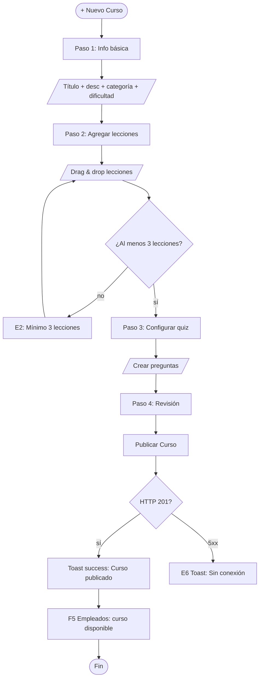

# FRD · M18 — SOLMI Academy (Plataforma de Capacitación)

> **Módulo no implementado.** Este documento define el comportamiento TARGET para la plataforma de capacitación SOLMI Academy de SOLMI OS. Sigue el molde de `M01-PMS-Central.md`.
>
> Todo lo documentado acá es **comportamiento esperado** basado en estándares de capacitación hotelera (Hilton University, Marriott Voyage, IHG Academy). Las columnas "Gap" marcan que TODO está pendiente de implementación.

**Módulo:** M18 — SOLMI Academy
**Estado:** 🔴 No implementado
**Fecha:** 2026-06-19
**Pantallas cubiertas:** Dashboard · Cursos · Lecciones · Certificaciones · Progreso · Instructor · Configuración
**Servicios frontend target:** `Academy.service.ts`, `Course.service.ts`, `Certification.service.ts`
**Servicios backend target:** módulos `academy`, `courses`, `lessons`, `certifications`, `progress`

---

## 1. Propósito

M18 es una plataforma de aprendizaje en línea (LMS) para capacitar al personal hotelero en los procesos y estándares de SOLMI OS. Ofrece cursos estructurados (onboarding, servicio al cliente, housekeeping, front desk, safety), lecciones con video/texto/quiz, certificaciones por rol, seguimiento de progreso, y un sistema de instructor para crear contenido. Se integra con M09 (Empleados) para asignar cursos por rol y con M01 (PMS) para contextualizar el contenido según el módulo que el empleado use.

---

## 2. Modelo de datos (target)

### 2.1 Cursos (`courses`)

| Columna | Tipo | Descripción |
|---------|------|-------------|
| `id` | UUID | PK |
| `hotel_id` | UUID | FK → hotels (NULL = curso global SOLMI) |
| `title` | VARCHAR(300) | Nombre del curso |
| `description` | TEXT | Descripción del curso |
| `category` | ENUM | `onboarding` · `front_desk` · `housekeeping` · `maintenance` · `food_beverage` · `safety` · `leadership` · `technology` · `soft_skills` |
| `difficulty` | ENUM | `beginner` · `intermediate` · `advanced` |
| `duration_hours` | DECIMAL(4,1) | Duración estimada en horas |
| `thumbnail_url` | VARCHAR(500) | Imagen del curso |
| `instructor_id` | UUID | FK → users (instructor creador) |
| `is_published` | BOOLEAN | — |
| `is_mandatory` | BOOLEAN | Curso obligatorio para ciertos roles |
| `mandatory_for_roles` | JSONB | `["front_desk", "housekeeping"]` — roles que deben completarlo |
| `total_lessons` | INTEGER | Conteo cacheado |
| `total_enrollments` | INTEGER | Conteo cacheado |
| `avg_rating` | DECIMAL(2,1) | Rating promedio (1-5) |
| `sort_order` | INTEGER | — |
| `created_at` | TIMESTAMP | — |
| `updated_at` | TIMESTAMP | — |

### 2.2 Lecciones (`lessons`)

| Columna | Tipo | Descripción |
|---------|------|-------------|
| `id` | UUID | PK |
| `course_id` | UUID | FK → courses |
| `title` | VARCHAR(300) | Nombre de la lección |
| `content_type` | ENUM | `video` · `text` · `quiz` · `interactive` · `document` |
| `content` | TEXT | Contenido HTML/texto de la lección |
| `video_url` | VARCHAR(500) | URL del video (s3/cloudfront) |
| `video_duration_seconds` | INTEGER | Duración del video |
| `quiz_data` | JSONB | Preguntas y respuestas del quiz (ver §2.3) |
| `sort_order` | INTEGER | Orden dentro del curso |
| `is_preview` | BOOLEAN | Lección gratuita de preview |
| `passing_score` | INTEGER | Score mínimo para aprobar quiz (default: 80%) |
| `max_attempts` | INTEGER | Intentos máximos del quiz (default: 3) |
| `created_at` | TIMESTAMP | — |

### 2.3 Estructura de `quiz_data`

```json
{
  "questions": [
    {
      "id": "q1",
      "text": "¿Cuál es el primer paso al hacer check-in?",
      "type": "multiple_choice",
      "options": [
        { "id": "a", "text": "Cobrar la reserva" },
        { "id": "b", "text": "Verificar identidad del huésped" },
        { "id": "c", "text": "Asignar habitación" },
        { "id": "d", "text": "Entregar llave" }
      ],
      "correct_answer": "b",
      "explanation": "El primer paso es verificar la identidad del huésped para seguridad."
    }
  ]
}
```

### 2.4 Inscripciones (`enrollments`)

| Columna | Tipo | Descripción |
|---------|------|-------------|
| `id` | UUID | PK |
| `course_id` | UUID | FK → courses |
| `employee_id` | UUID | FK → employees (M09) |
| `status` | ENUM | `enrolled` · `in_progress` · `completed` · `dropped` |
| `progress_percent` | INTEGER | 0-100 |
| `started_at` | TIMESTAMP | — |
| `completed_at` | TIMESTAMP | — |
| `deadline_at` | TIMESTAMP | Fecha límite (si curso obligatorio) |
| `certificate_url` | VARCHAR(500) | URL del certificado PDF |
| `certificate_number` | VARCHAR(50) | Número único del certificado |
| `rating` | INTEGER | 1-5 (opinión del empleado al completar) |
| `feedback` | TEXT | Comentario del empleado |
| `created_at` | TIMESTAMP | — |

### 2.5 Progreso de Lección (`lesson_progress`)

| Columna | Tipo | Descripción |
|---------|------|-------------|
| `id` | UUID | PK |
| `enrollment_id` | UUID | FK → enrollments |
| `lesson_id` | UUID | FK → lessons |
| `status` | ENUM | `not_started` · `in_progress` · `completed` |
| `video_watched_percent` | INTEGER | % del video visto |
| `quiz_score` | INTEGER | Score del quiz (0-100) |
| `quiz_attempts` | INTEGER | Número de intentos |
| `time_spent_seconds` | INTEGER | Tiempo total en la lección |
| `completed_at` | TIMESTAMP | — |

### 2.6 Certificaciones (`certifications`)

| Columna | Tipo | Descripción |
|---------|------|-------------|
| `id` | UUID | PK |
| `name` | VARCHAR(200) | Nombre de la certificación |
| `description` | TEXT | — |
| `required_courses` | JSONB | Lista de course_ids que deben completarse |
| `validity_months` | INTEGER | Meses de validez (ej: 12) |
| `badge_url` | VARCHAR(500) | Imagen del badge |
| `is_active` | BOOLEAN | — |
| `created_at` | TIMESTAMP | — |

### 2.7 Certificaciones de Empleado (`employee_certifications`)

| Columna | Tipo | Descripción |
|---------|------|-------------|
| `id` | UUID | PK |
| `employee_id` | UUID | FK → employees |
| `certification_id` | UUID | FK → certifications |
| `earned_at` | TIMESTAMP | — |
| `expires_at` | TIMESTAMP | — |
| `certificate_url` | VARCHAR(500) | — |
| `status` | ENUM | `active` · `expired` · `revoked` |

---

## 3. Pantalla — Dashboard Academy (`/panel/academy`)

### 3.1 Decision Table

| Trigger | Condición | Resultado | Modal/Toast (texto) | Errores | Notif F5 |
|---------|-----------|-----------|----------------------|---------|----------|
| Clic en **"Dashboard"** | — | KPIs: cursos publicados, empleados inscritos, tasa completado, certificaciones emitidas, tiempo promedio | — | — | — |
| Clic en **"Mis Cursos"** (empleado) | — | Lista de cursos inscritos con progreso | — | — | — |
| Clic en **"Catálogo"** | — | Grid de cursos disponibles para inscripción | — | — | — |
| Clic en **"Certificaciones"** | — | Lista de certificaciones activas y progreso | — | — | — |
| Filtro por categoría (dashboard) | — | Filtra métricas por `front_desk`, `housekeeping`, etc. | — | — | — |
| **"Exportar Reporte"** | — | Descarga CSV con progreso de todos los empleados | — | E6 | — |

---

## 4. Pantalla — Cursos (`/panel/academy/courses`)

### 4.1 Decision Table

| Trigger | Condición | Resultado | Modal/Toast (texto) | Errores | Notif F5 |
|---------|-----------|-----------|----------------------|---------|----------|
| **"+ Nuevo Curso"** | instructor/admin | Abre wizard: 1) Info básica → 2) Lecciones → 3) Config quiz → 4) Publicar | Modal `form` xl: "Nuevo Curso" | — | — |
| Paso 1: título + descripción + categoría + dificultad | — | Guarda borrador | — | E1 "Título es obligatorio" | — |
| Paso 2: agregar lecciones | — | Drag & drop para ordenar, tipo de contenido, duración estimada | — | — | — |
| **"+ Agregar Lección"** | — | Sub-modal: título, tipo (video/text/quiz), contenido | — | — | — |
| Paso 3: configurar quiz | — | Editor de preguntas: texto, opciones, respuesta correcta, explicación | — | — | — |
| **"Publicar Curso"** | al menos 3 lecciones, 1 quiz | is_published = true | **Toast success:** "Curso '{título}' publicado." | E2 "Necesita al menos 3 lecciones" · E6 | — |
| Clic en curso publicado | — | Abre detalle: descripción, lecciones, progreso de inscritos, ratings | Modal `detail` | — | — |
| **"Editar Curso"** | — | Abre form precargado | Modal `form`: "Editar Curso" | — | — |
| **"Duplicar Curso"** | — | Crea copia como draft | **Toast success:** "Curso duplicado como borrador." | E6 | — |
| **"Archivar Curso"** | — | is_published = false | **Toast success:** "Curso '{título}' archivado." | E6 | — |
| **"Eliminar Curso"** (sin inscripciones) | — | **Modal danger:** "¿Eliminar curso '{título}'? Se perderán todas las lecciones." | Modal danger | E2 "No se puede eliminar: tiene inscripciones activas" · E6 | — |

### 4.2 Flow — Crear Curso



---

## 5. Pantalla — Lección / Player (`/panel/academy/courses/:id/lessons/:lessonId`)

### 5.1 Decision Table

| Trigger | Condición | Resultado | Modal/Toast (texto) | Errores | Notif F5 |
|---------|-----------|-----------|----------------------|---------|----------|
| Abrir lección tipo **video** | — | Reproductor de video con tracking de progreso cada 10s | — | — | — |
| Video llega a 100% | — | Marca lección como completada, avanza al siguiente | **Toast success:** "Lección '{título}' completada." | — | — |
| Abrir lección tipo **quiz** | — | Muestra preguntas, botón "Enviar respuestas" | — | — | — |
| **"Enviar Respuestas"** | respondió todas las preguntas | Calcula score, compara con `passing_score` | — | — | — |
| Score >= passing_score | — | Lección completada, avanza | **Toast success:** "¡Aprobado! Score: {n}%. Siguiente lección." | — | — |
| Score < passing_score | intentos < max_attempts | Muestra score + explicaciones, botón "Reintentar" | **Toast warning:** "No aprobado. Score: {n}%. Podés reintentar ({m} intentos restantes)." | — | — |
| Score < passing_score | intentos = max_attempts | Lección bloqueada, curso retenido | **Toast error:** "Intentos agotados. Contactá a tu instructor para reintentar." | — | F5 Admin: "Empleado {nombre} bloqueado en quiz de {curso}" |
| **"Siguiente Lección"** | — | Navega a la siguiente lección del curso | — | — | — |
| **"Lección Anterior"** | — | Navega a la lección anterior | — | — | — |
| Última lección completada | curso completo | Marca curso como completado, genera certificado si aplica | **Toast success:** "¡Curso '{título}' completado! Certificado disponible." | — | F5 Certificaciones |

---

## 6. Pantalla — Certificaciones (`/panel/academy/certifications`)

### 6.1 Decision Table

| Trigger | Condición | Resultado | Modal/Toast (texto) | Errores | Notif F5 |
|---------|-----------|-----------|----------------------|---------|----------|
| **"+ Nueva Certificación"** | admin | Abre modal form: nombre, cursos requeridos, validez, badge | Modal `form` lg: "Nueva Certificación" | — | — |
| Seleccionar cursos requeridos | — | Multi-select de cursos publicados | — | — | — |
| **"Guardar Certificación"** | datos válidos | POST certifications | **Toast success:** "Certificación '{nombre}' creada." | E6 | — |
| Clic en certificación | — | Detalle: cursos requeridos, empleados certificados, vencimientos próximos | Modal `detail` | — | — |
| **"Descargar Certificado"** (empleado) | certificación activa | Descarga PDF con nombre, fecha, código verificación | — | E6 | — |
| **"Verificar Certificado"** (público) | — | Formulario: código de certificado → muestra estado | — | E4 "Certificado no encontrado" | — |
| **"Revocar Certificación"** (empleado específico) | — | **Modal danger:** "¿Revocar certificación de {empleado}?" | Modal danger | E6 | — |
| **"Eliminar"** (sin empleados certificados) | — | **Modal danger:** "¿Eliminar certificación '{nombre}'?" | Modal danger | E2 "No se puede eliminar: tiene empleados certificados" · E6 | — |

---

## 7. Pantalla — Progreso de Empleados (`/panel/academy/progress`)

### 7.1 Decision Table

| Trigger | Condición | Resultado | Modal/Toast (texto) | Errores | Notif F5 |
|---------|-----------|-----------|----------------------|---------|----------|
| Filtro por empleado | — | Muestra todos los cursos del empleado, progreso, estado | — | — | — |
| Filtro por curso | — | Muestra todos los inscritos al curso, progreso individual | — | — | — |
| Filtro por estado (enrolled/in_progress/completed) | — | Filtra la lista | — | — | — |
| Clic en empleado | — | Detalle: cursos inscritos, tiempo total, certificaciones, último acceso | Modal `detail` | — | — |
| **"Asignar Curso"** (admin) | — | Multi-select de cursos + empleado + fecha límite | **Toast success:** "Curso '{título}' asignado a {empleado}. Deadline: {fecha}." | E2 "El empleado ya está inscrito en este curso" · E6 | F5 Empleado: "Tenés un curso nuevo asignado" |
| **"Recordatorio"** (admin, deadline próximo) | — | Envía email/push al empleado | **Toast success:** "Recordatorio enviado a {empleado}." | E6 | — |
| **"Exonerar"** (admin) | — | Marca curso como completado sin lecciones | **Toast success:** "{empleado} exonerado de '{título}'." | E6 | — |

---

## 8. Consecuencias cross-módulo (eventos que dispara M18)

| Acción en M18 | Módulo afectado | Efecto | Notificación F5 |
|---------------|-----------------|--------|-----------------|
| Curso obligatorio completado | Empleados (M09) | Actualizar badge/certificación del empleado | "Curso obligatorio completado para {empleado}" |
| Certificación obtenida | Empleados (M09) | Agregar certificación activa al perfil | "Nueva certificación: {nombre}" |
| Certificación por vencer | Empleados (M09) | Alerta 30 días antes de vencimiento | "Certificación de {empleado} vence en {n} días" |
| Curso obligatorio no completado (deadline) | Empleados (M09) | Marcar incumplimiento | "⚠ {empleado} no completó '{título}' antes del deadline" |
| Nuevo curso publicado | Marketing (M15) | Enviar email a empleados elegibles | "Nuevo curso disponible: {título}" |
| Empleado completa curso onboarding | PMS (M01) | Desbloquear acceso a módulos según rol | — |

---

## 9. Gap analysis

| # | Gap | Severidad | Descripción |
|---|-----|-----------|-------------|
| G1 | Módulo completo no existe | 🔴 BLOCKER | No hay backend, frontend, ni servicios |
| G2 | Sin LMS core | 🔴 BLOCKER | No hay estructura de cursos, lecciones, o progreso |
| G3 | Sin reproductor de video | 🔴 CRÍTICO | No hay player con tracking de progreso |
| G4 | Sin sistema de quizzes | 🔴 CRÍTICO | No hay evaluaciones ni scoring |
| G5 | Sin certificaciones | 🟡 ALTO | No hay generación de badges/certificados PDF |
| G6 | Sin integración M09 Empleados | 🟡 ALTO | No hay asignación por rol ni seguimiento |
| G7 | Sin instructor role | 🟡 ALTO | No hay creación de contenido por instructores |
| G8 | Sin analytics de aprendizaje | 🟠 MEDIO | No hay reportes de completado, tiempo, engagement |
| G9 | Sin gamificación | 🟠 MEDIO | No hay badges, leaderboard, o puntos por cursos |
| G10 | Sin offline/mobile | 🟠 MEDIO | No hay soporte para ver contenido sin conexión |

---

## 10. Checklist de verificación M18

### Cursos
- [ ] Crear curso con info básica (título, desc, categoría, dificultad)
- [ ] Agregar lecciones de diferentes tipos (video, text, quiz, interactive)
- [ ] Drag & drop para ordenar lecciones
- [ ] Publicar curso (mínimo 3 lecciones)
- [ ] Duplicar curso existente
- [ ] Archivar/eliminar curso
- [ ] Vista grid con thumbnails y categorías

### Lecciones / Player
- [ ] Reproductor de video con tracking cada 10s
- [ ] Lecciones de texto con renderizado HTML
- [ ] Quiz con múltiples preguntas y scoring
- [ ] Reintentos de quiz (max_attempts)
- [ ] Navegación siguiente/anterior lección
- [ ] Auto-marcar completada al llegar a 100%

### Certificaciones
- [ ] Crear certificación con cursos requeridos
- [ ] Generar certificado PDF al completar todos los cursos
- [ ] Descargar certificado
- [ ] Verificar certificado por código
- [ ] Revocar certificación de empleado
- [ ] Alerta de vencimiento (30 días antes)

### Progreso
- [ ] Filtro por empleado / curso / estado
- [ ] Asignar curso a empleado con deadline
- [ ] Enviar recordatorio
- [ ] Exonerar empleado de curso
- [ ] Dashboard con métricas de completado

### Cross-módulo
- [ ] Actualiza perfil de empleado (M09) con certificaciones
- [ ] Desbloquea acceso a módulos según rol (M01)
- [ ] Envía email de cursos nuevos (M15)
- [ ] Notificaciones F5 en eventos clave

---

*Documento generado como target. Todo está pendiente de implementación. Copiar molde de `M01-PMS-Central.md`.*
