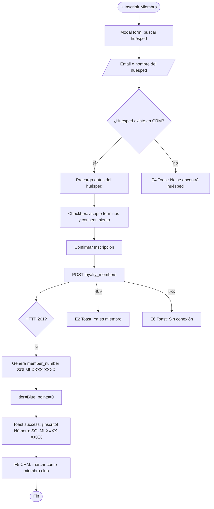

# FRD · M20 — SOLMI Club (Programa de Fidelización)

> **Módulo no implementado.** Este documento define el comportamiento TARGET para el programa de lealtad SOLMI Club de SOLMI OS. Sigue el molde de `M01-PMS-Central.md`.
>
> Todo lo documentado acá es **comportamiento esperado** basado en estándares de la industria hotelera (Marriott Bonvoy, Hilton Honors, IHG Rewards). Las columnas "Gap" marcan que TODO está pendiente de implementación.

**Módulo:** M20 — SOLMI Club
**Estado:** 🔴 No implementado
**Fecha:** 2026-06-19
**Pantallas cubiertas:** Dashboard Loyalty · Tiers · Puntos · Recompensas · Historial · Configuración
**Servicios frontend target:** `Loyalty.service.ts`, `Points.service.ts`, `Rewards.service.ts`
**Servicios backend target:** módulos `loyalty`, `points`, `rewards`, `tiers`

---

## 1. Propósito

M20 implementa un programa de fidelización completo para hoteles en la plataforma SOLMI. Los huéspedes acumulan puntos por estancias, consumos y interacciones, suben de nivel (tier) según actividad, y canjean puntos por recompensas (noches gratis, upgrades, servicios, descuentos). El hotel configura reglas de acumulación, niveles, y catálogo de recompensas. Se integra con M14 (CRM) para datos de huéspedes, M15 (Marketing) para campañas de loyalty, y M01 (PMS) para eventos de check-in/check-out.

---

## 2. Modelo de datos (target)

### 2.1 Miembros (`loyalty_members`)

| Columna | Tipo | Descripción |
|---------|------|-------------|
| `id` | UUID | PK |
| `hotel_id` | UUID | FK → hotels |
| `guest_id` | UUID | FK → guests |
| `member_number` | VARCHAR(20) | Número único de miembro (formato: SOLMI-XXXX-XXXX) |
| `tier_id` | UUID | FK → loyalty_tiers |
| `total_points` | INTEGER | Puntos disponibles para canje |
| `lifetime_points` | INTEGER | Puntos acumuladosifetime (nunca se resetea) |
| `tier_qualifying_points` | INTEGER | Puntos del periodo actual para calificar tier |
| `status` | ENUM | `active` · `suspended` · `closed` |
| `enrolled_at` | TIMESTAMP | Fecha de inscripción |
| `tier_qualified_at` | TIMESTAMP | Última vez que calificó tier |
| `next_tier_reset_at` | TIMESTAMP | Fecha de reset del periodo de calificación |
| `created_at` | TIMESTAMP | — |
| `updated_at` | TIMESTAMP | — |

### 2.2 Niveles / Tiers (`loyalty_tiers`)

| Columna | Tipo | Descripción |
|---------|------|-------------|
| `id` | UUID | PK |
| `hotel_id` | UUID | FK → hotels |
| `name` | VARCHAR(50) | Nombre del tier (ej: "Silver", "Gold", "Platinum", "Diamond") |
| `slug` | VARCHAR(50) | Identificador único |
| `min_qualifying_points` | INTEGER | Puntos mínimos para calificar |
| `points_multiplier` | DECIMAL(3,2) | Multiplicador de acumulación (1.0 = base, 1.5 = +50%) |
| `benefits` | JSONB | Lista de beneficios (ver §2.3) |
| `color` | VARCHAR(20) | Color del badge en UI |
| `icon` | VARCHAR(50) | Icono del tier |
| `sort_order` | INTEGER | Orden ascendente |
| `created_at` | TIMESTAMP | — |

### 2.3 Estructura de `benefits` (tier)

```json
{
  "early_checkin": true,
  "late_checkout": true,
  "room_upgrade": "subject_to_availability",
  "free_breakfast": true,
  "lounge_access": false,
  "free_wifi_premium": true,
  "welcome_amenity": "bottle_of_wine",
  "bonus_points_per_night": 500,
  "priority_checkin": true,
  "concierge": false
}
```

**Tiers predefinidos (target):**

| Tier | Puntos mínimos | Multiplicador | Beneficios clave |
|------|---------------|---------------|------------------|
| **Blue** (base) | 0 | 1.0x | Acumulación base, acceso app |
| **Silver** | 10,000 | 1.2x | Early check-in, late checkout, +10% puntos |
| **Gold** | 25,000 | 1.5x | Room upgrade, breakfast gratis, lounge |
| **Platinum** | 50,000 | 2.0x | Suite upgrade, concierge, amenity premium |
| **Diamond** | 100,000 | 3.0x | Todo Platinum + noche gratis anual, chauffeur |

### 2.4 Transacciones de Puntos (`points_transactions`)

| Columna | Tipo | Descripción |
|---------|------|-------------|
| `id` | UUID | PK |
| `member_id` | UUID | FK → loyalty_members |
| `type` | ENUM | `earned` · `redeemed` · `expired` · `adjusted` · `bonus` · `transferred` |
| `points` | INTEGER | Cantidad (positivo=gana, negativo=canjea) |
| `balance_after` | INTEGER | Balance después de la transacción |
| `source` | ENUM | `stay` · `consumption` · `referral` · `campaign` · `manual` · `redemption` · `birthday` · `anniversary` |
| `reference_type` | VARCHAR(50) | `reservation` · `invoice` · `campaign` · `manual` |
| `reference_id` | UUID | ID del registro relacionado |
| `description` | TEXT | Descripción legible |
| `expires_at` | TIMESTAMP | Fecha de expiración de los puntos |
| `created_at` | TIMESTAMP | — |

### 2.5 Catálogo de Recompensas (`rewards_catalog`)

| Columna | Tipo | Descripción |
|---------|------|-------------|
| `id` | UUID | PK |
| `hotel_id` | UUID | FK → hotels |
| `name` | VARCHAR(200) | Nombre de la recompensa |
| `description` | TEXT | Descripción detallada |
| `category` | ENUM | `room_night` · `room_upgrade` · `dining` · `spa` · `experience` · `discount` · `partner` · `merchandise` |
| `points_cost` | INTEGER | Puntos necesarios para canjear |
| `cash_value` | DECIMAL(10,2) | Valor en efectivo (para cálculos) |
| `image_url` | VARCHAR(500) | Imagen de la recompensa |
| `stock` | INTEGER | Disponible (NULL = ilimitado) |
| `min_tier` | UUID | FK → loyalty_tiers (tier mínimo para canjear) |
| `is_active` | BOOLEAN | — |
| `redemption_limit_per_member` | INTEGER | Límite por miembro (NULL = sin límite) |
| `valid_from` | TIMESTAMP | — |
| `valid_until` | TIMESTAMP | — |
| `created_at` | TIMESTAMP | — |

### 2.6 Canjes (`redemptions`)

| Columna | Tipo | Descripción |
|---------|------|-------------|
| `id` | UUID | PK |
| `member_id` | UUID | FK → loyalty_members |
| `reward_id` | UUID | FK → rewards_catalog |
| `points_spent` | INTEGER | Puntos canjeados |
| `status` | ENUM | `pending` · `confirmed` · `fulfilled` · `cancelled` · `expired` |
| `fulfilled_at` | TIMESTAMP | — |
| `reservation_id` | UUID | FK → reservations (si aplica) |
| `notes` | TEXT | Notas del canje |
| `created_at` | TIMESTAMP | — |

### 2.7 Referidos (`referrals`)

| Columna | Tipo | Descripción |
|---------|------|-------------|
| `id` | UUID | PK |
| `referrer_member_id` | UUID | FK → loyalty_members |
| `referred_guest_id` | UUID | FK → guests |
| `referral_code` | VARCHAR(20) | Código único |
| `status` | ENUM | `pending` · `completed` · `rewarded` |
| `bonus_points_awarded` | INTEGER | Puntos otorgados al referidor |
| `referred_check_in_date` | TIMESTAMP | Check-in del referido |
| `created_at` | TIMESTAMP | — |

---

## 3. Pantalla — Dashboard Loyalty (`/panel/loyalty`)

Resumen ejecutivo: miembros totales, puntos acumulados, canjes, distribución de tiers.

### 3.1 Decision Table

| Trigger | Condición | Resultado | Modal/Toast (texto) | Errores | Notif F5 |
|---------|-----------|-----------|----------------------|---------|----------|
| Clic en **"Dashboard"** (default) | — | Muestra KPIs: miembros activos, puntos emitidos este mes, canjes, tasa de canje | — | — | — |
| Clic en **"Miembros"** | — | Lista de miembros con búsqueda, filtros por tier/estado | — | — | — |
| Clic en **"Catálogo"** | — | Grid de recompensas disponibles | — | — | — |
| Clic en **"Configuración"** | — | Editor de tiers + reglas de acumulación | — | — | — |
| Filtro por rango de fechas (dashboard) | — | Recalcula KPIs para el periodo | — | — | — |
| **"Exportar Miembros"** | — | Descarga CSV con todos los miembros | — | E6 | — |
| **"Exportar Transacciones"** | — | Descarga CSV con historial de puntos | — | E6 | — |

---

## 4. Pantalla — Miembros (`/panel/loyalty/members`)

### 4.1 Decision Table

| Trigger | Condición | Resultado | Modal/Toast (texto) | Errores | Notif F5 |
|---------|-----------|-----------|----------------------|---------|----------|
| **"+ Inscribir Miembro"** | — | Abre modal form: buscar huésped existente (por email/nombre) o crear nuevo | Modal `form` lg: "Inscribir en SOLMI Club" | — | — |
| Búsqueda de huésped (form inscripción) | huésped existe en M14 | Precarga datos: nombre, email, historial de estancias | — | E4 "No se encontró huésped con ese email" | — |
| **"Confirmar Inscripción"** | huésped seleccionado, consentimiento aceptado | POST loyalty_members → genera member_number, tier=Blue | **Toast success:** "¡{nombre} inscrito en SOLMI Club! Número: SOLMI-XXXX-XXXX." | E2 "El huésped ya es miembro" · E6 | — |
| Clic en fila de miembro | — | Abre detalle: perfil, balance de puntos, tier, historial de transacciones, canjes | Modal `detail` | — | — |
| **"Ajustar Puntos"** (manual) | hotel-admin | Abre modal: motivo del ajuste, cantidad (+/-) | **Modal form:** "Ajuste Manual de Puntos" | — | — |
| Confirmar ajuste | motivo + cantidad válida | POST points/adjust | **Toast success:** "Puntos ajustados: {+/-n} para {nombre}. Nuevo balance: {total}." | E2 "Balance insuficiente para ajuste negativo" · E6 | — |
| **"Suspender Miembro"** | — | **Modal danger:** "¿Suspender a {nombre}? Perderá acceso a beneficios." | Modal danger | E6 | — |
| **"Reactivar Miembro"** | miembro suspendido | status → active | **Toast success:** "{nombre} reactivado en SOLMI Club." | E6 | — |
| **"Cerrar Cuenta"** | — | **Modal danger:** "¿Cerrar cuenta de {nombre}? Se perderán {n} puntos permanentemente." + input "ESCRIBIR CERRAR para confirmar" | Modal danger con input | E2 "Escribir CERRAR para confirmar" · E6 | — |
| **"Ver Historial Completo"** | — | Lista cronológica de transacciones de puntos | Modal `detail`: "Historial de Puntos" | — | — |

### 4.2 Flow — Inscribir Miembro



---

## 5. Pantalla — Catálogo de Recompensas (`/panel/loyalty/rewards`)

### 5.1 Decision Table

| Trigger | Condición | Resultado | Modal/Toast (texto) | Errores | Notif F5 |
|---------|-----------|-----------|----------------------|---------|----------|
| **"+ Nueva Recompensa"** | hotel-admin | Abre modal form: nombre, categoría, costo en puntos, stock, tier mínimo, vigencia | Modal `form` lg: "Nueva Recompensa" | — | — |
| Seleccionar categoría "Noche Gratis" | — | Auto-configura: costo = precio base × 1, stock = NULL | — | — | — |
| Seleccionar categoría "Upgrade" | — | Auto-configura: costo = 2000 puntos | — | — | — |
| **"Guardar Recompensa"** | datos válidos | POST rewards_catalog | **Toast success:** "Recompensa '{nombre}' creada." | E6 | — |
| Clic en tarjeta de recompensa | — | Abre detalle: nombre, descripción, costo, stock, canjes realizados | Modal `detail` | — | — |
| **"Canjear"** (desde detalle, miembro) | `total_points >= points_cost`, `tier >= min_tier` | Abre modal confirmación | Modal `confirm`: "¿Canjear {nombre} por {n} puntos?" | — | — |
| **"Confirmar Canje"** | puntos suficientes | POST redemptions → deduction de puntos | **Toast success:** "¡{nombre} canjeado! Se descontaron {n} puntos." | E2 "Puntos insuficientes" · E2 "Tier mínimo no alcanzado" · E6 | F5 CRM: actualizar historial |
| **"Editar Recompensa"** | — | Abre modal form precargado | Modal `form`: "Editar Recompensa" | — | — |
| **"Desactivar"** (recompensa activa) | — | is_active → false | **Toast success:** "Recompensa '{nombre}' desactivada." | E6 | — |
| **"Eliminar"** (sin canjes) | — | **Modal danger:** "¿Eliminar recompensa '{nombre}'?" | Modal danger | E2 "No se puede eliminar: tiene canjes registrados" · E6 | — |

---

## 6. Pantalla — Configuración de Tiers (`/panel/loyalty/config`)

### 6.1 Decision Table

| Trigger | Condición | Resultado | Modal/Toast (texto) | Errores | Notif F5 |
|---------|-----------|-----------|----------------------|---------|----------|
| **"Editar Tier"** (Silver/Gold/etc.) | — | Abre modal: nombre, puntos mínimos, multiplicador, beneficios (checkboxes) | Modal `form`: "Editar Tier {nombre}" | — | — |
| Toggle beneficio (checkbox) | — | Actualiza JSON de benefits en vivo | — | — | — |
| **"Guardar Cambios"** | tier válido | PATCH loyalty_tiers | **Toast success:** "Tier '{nombre}' actualizado. Los miembros serán reevaluados en el próximo night audit." | E2 "Los puntos mínimos deben ser mayores al tier anterior" · E6 | — |
| **"+ Nuevo Tier"** | — | Abre modal vacío | Modal `form`: "Nuevo Tier" | — | — |
| **"Eliminar Tier"** (sin miembros) | — | **Modal danger:** "¿Eliminar tier '{nombre}'?" | Modal danger | E2 "No se puede eliminar: tiene miembros asignados" · E6 | — |
| Configurar **"Reglas de Acumulación"** | — | Abre sección: puntos por noche, puntos por dólar, bonos por tier | Modal `form`: "Reglas de Acumulación" | — | — |
| **"Guardar Reglas"** | reglas válidas | PATCH loyalty_config | **Toast success:** "Reglas de acumulación actualizadas." | E6 | — |
| **"Recalcular Todos los Tiers"** | — | Ejecuta batch: evalúa cada miembro contra puntos_qualifying del periodo | **Toast success:** "Tiers recalculados: {n} miembros evaluados, {m} actualizados." + loading largo | E6 | — |

### 6.2 Flow — Recálculo de Tiers (Night Audit)

```mermaid
flowchart TD
    A[Night Audit o manual] --> B[SELECT miembros activos]
    B --> C[Para cada miembro]
    C --> D{tier_qualifying_points >= next tier threshold?}
    D -- sí, sube --> E[PATCH tier_id al nuevo nivel]
    E --> F[ points_transaction type=bonus: "Tier upgrade bonus"]
    F --> G[Notificación push: "¡Felicidades! Subiste a {nuevo_tier}"]
    D -- sí, baja --> H[PATCH tier_id al nivel inferior]
    H --> I[Notificación: "Tu tier ha cambiado a {nuevo_tier}"]
    D -- no cambia --> J[Skip]
    G --> K[Continuar]
    I --> K
    J --> K
    K --> L{¿Hay más miembros?}
    L -- sí --> C
    L -- no --> M[Actualizar contadores de dashboard]
    M --> N([Fin])
```

---

## 7. Consecuencias cross-módulo (eventos que dispara M20)

| Acción en M20 | Módulo afectado | Efecto | Notificación F5 |
|---------------|-----------------|--------|-----------------|
| Check-in de miembro | PMS (M01) | Acumular puntos por noche (reglas de acumulación) | "+{n} puntos para {miembro}" |
| Check-out de miembro | PMS (M01) | Acumular puntos por consumo total | — |
| Canje de noche gratis | PMS (M01) | Crear reserva con descuento 100% | "Canje confirmado: noche en Hab {n}" |
| Canje de upgrade | PMS (M01) | Marcar upgrade en reserva | "Upgrade a {tipo_hab} para {miembro}" |
| Inscripción de miembro | CRM (M14) | Marcar como miembro club, tier=Blue | — |
| Cambio de tier | Marketing (M15) | Disparar automatización "tier_change" | "Campaña de bienvenida a {nuevo_tier}" |
| Puntos por referral | CRM (M14) | Actualizar historial del referidor | "¡{nombre} ganó {n} puntos por referir!" |
| Huésped cumple años | Marketing (M15) | Bonus de cumpleaños (si automatización activa) | "Bonus de cumpleaños: {n} puntos" |
| Puntos expiran | — | Batch night audit: puntos con `expires_at` vencido → `type=expired` | "Se expiraron {n} puntos de {miembro}" |

---

## 8. Gap analysis

| # | Gap | Severidad | Descripción |
|---|-----|-----------|-------------|
| G1 | Módulo completo no existe | 🔴 BLOCKER | No hay backend, frontend, ni servicios |
| G2 | Sin programa de puntos | 🔴 BLOCKER | No hay acumulación, canje, ni expiración |
| G3 | Sin tiers | 🔴 BLOCKER | No hay niveles de fidelización |
| G4 | Sin catálogo de recompensas | 🔴 CRÍTICO | No hay items canjeables |
| G5 | Sin integración M14 CRM | 🟡 ALTO | No hay lectura de huéspedes para inscripción |
| G6 | Sin integración M01 PMS | 🟡 ALTO | No hay acumulación automática por estancia |
| G7 | Sin notificaciones push | 🟡 ALTO | No hay alertas de tier upgrade / puntos |
| G8 | Sin sistema de referrals | 🟠 MEDIO | No hay programa de referidos |
| G9 | Sin expiración de puntos | 🟠 MEDIO | No hay batch de expiración |
| G10 | Sin reportes de loyalty | 🟠 MEDIO | No hay analytics de programa |

---

## 9. Checklist de verificación M20

### Dashboard
- [ ] KPIs: miembros activos, puntos emitidos, canjes, tasa de canje
- [ ] Filtros por rango de fechas
- [ ] Exportar miembros a CSV
- [ ] Exportar transacciones a CSV

### Miembros
- [ ] Inscribir miembro (buscar huésped existente)
- [ ] Generar número SOLMI-XXXX-XXXX
- [ ] Asignar tier Blue automáticamente
- [ ] Ajuste manual de puntos (con motivo)
- [ ] Suspender/reactivar miembro
- [ ] Cerrar cuenta (confirmación con input)
- [ ] Ver historial de transacciones

### Catálogo de Recompensas
- [ ] Crear recompensa con categoría, costo, stock
- [ ] Configurar tier mínimo por recompensa
- [ ] Canjear recompensa (validar puntos + tier)
- [ ] Desactivar/eliminar recompensa
- [ ] Vista grid con imágenes

### Configuración
- [ ] Editar tiers (nombre, puntos, multiplicador, beneficios)
- [ ] Crear tier personalizado
- [ ] Configurar reglas de acumulación (puntos/noche, puntos/$)
- [ ] Recalcular todos los tiers manualmente
- [ ] Eliminar tier sin miembros

### Cross-módulo
- [ ] Acumula puntos al check-out (M01)
- [ ] Canje de noche gratis crea reserva (M01)
- [ ] Actualiza CRM con datos de loyalty (M14)
- [ ] Dispara automatización en cambio de tier (M15)
- [ ] Night audit ejecuta expiración de puntos
- [ ] Notificaciones push en tier upgrade

---

*Documento generado como target. Todo está pendiente de implementación. Copiar molde de `M01-PMS-Central.md`.*
