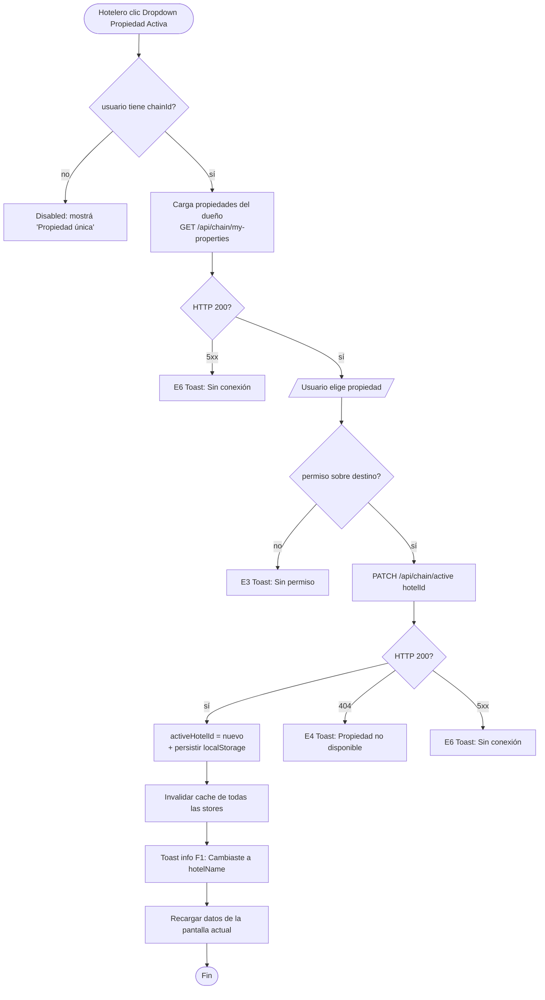
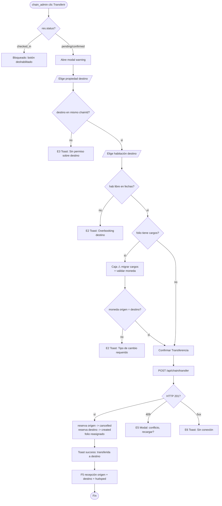

# FRD · M21 — Multipropiedad (Gestión de Cadena desde el Usuario Hotelero)

> **Módulo de gestión multi-propiedad DESDE el lado del hotelero** (una cadena con varias propiedades: reportes consolidados, transferencia de reservas, equipos por propiedad). Es el espejo "cliente" de T1-Super-Admin: donde T1 documenta cómo el **super-admin de plataforma** administra tenants, M21 documenta cómo un **hotelero dueño de varias propiedades** opera su portafolio.
>
> ⚠ **LECTURA CRÍTICA DE CÓDIGO REAL:** este módulo **NO EXISTE implementado**. No hay modelo de cadena/grupo, no hay selector de propiedad activa, no hay reportes consolidados, no hay transferencia de reservas. Todo está documentado acá como **[PENDIENTE]** salvo las **primitivas de aislamiento multi-tenant** (campo `hotelId` en cada tabla + resolver `hotelOf`), que **sí existen** y son la base sobre la que se construiría M21. La columna "Gap" cita `file:line` exacto.
>
> Para la parte de plataforma (CRUD de hoteles, suspender tenant, suscripciones, impersonación), ver **T1-Super-Admin.md §3.1** — este documento **no duplica** esa superficie, solo la referencia.

**Módulo:** M21 — Multipropiedad
**Pantallas cubiertas:** (NINGUNA existe hoy — todas [PENDIENTE]) · Selector de propiedad activa · Dashboard de cadena · Reportes consolidados · Transferencia de reservas · Equipos por propiedad
**Servicios frontend:** no existen (pendiente `Chain.service.ts` / `Portfolio.service.ts`)
**Endpoints backend:** no existen (pendiente `/api/chain/*`)
**Primitivas reales existentes:** `hotelId` en todas las tablas operativas · `hotelOf(req)` resolver (`composition-root.ts:97-103`) · tabla `hotels` (`hoteles/model.ts:4-21`)

---

## 1. Modelo de datos (fuente de verdad)

### 1.1 Tabla `hotels` — el Tenant/Propiedad (**REAL**, `hoteles/model.ts:4-21`)

| Campo | Tipo | Default | Notas |
|-------|------|---------|-------|
| `id` | string | — | PK, UUID |
| `name` | string | — | required |
| `address` | string | — | |
| `phone` | string | — | |
| `email` | string | — | |
| `country` | string | — | |
| `currency` | string | `"USD"` | |
| `timezone` | string | `"America/Santo_Domingo"` | |
| `plan` | string | `"professional"` | `starter` \| `professional` \| `enterprise` |
| `status` | string | `"active"` | `active` \| `pendiente` \| `suspendido` |
| `roomsCount` | number | `0` | |
| `active` | number | `1` | flag numérico (1/0) |
| timestamps | — | — | `createdAt`, `updatedAt` |

> ⚠ **GAP #1 — NO EXISTE concepto de cadena.** El modelo `hotels` **no tiene** `ownerId`, `chainId`, `groupId` ni `parentId` (`hoteles/model.ts:4-21`). Cada hotel es un tenant **plano e independiente**. No hay forma de agrupar varias propiedades bajo un mismo dueño en la base de datos.

### 1.2 Relación Usuario → Hotel (**REAL**, 1:1 estricto)

| Origen | Campo | Tipo | Notas |
|--------|-------|------|-------|
| `usuarios/model.ts:12` | `hotelId` | string, indexed | Un usuario pertenece a **UN** hotel |
| `frontend/src/types/index.ts:148` | `User.hotelId` | string | Binding del frontend |
| `frontend/src/types/index.ts:149` | `User.hotelName` | string | Solo display |
| `auth.store.ts:19` | `currentHotel` | computed | `= user.value?.hotelName` — **solo lectura, sin setter** |

> ⚠ **GAP #2 — Binding 1:1 inmutable.** El `hotelId` vive dentro del **token JWT del usuario** y nunca se "conmuta" en sesión. **No existe** `activeHotelId` en el store, ni `selectHotel()`, ni `switchHotel()`. Verificado: grep de `activeHotel|selectedHotel|switchHotel|selectHotel|chainId|ownerId` en `frontend/src` + `backend/src` = **0 resultados**.

### 1.3 Aislamiento de datos por `hotelId` (**REAL**)

Toda tabla operativa sella `hotelId` y los endpoints de agregación filtran por él:

| Tabla | Sello `hotelId` | Fuente |
|-------|-----------------|--------|
| `reservations` | `{ required: true, indexed: true }` | `reservas/model.ts:10` |
| `rooms` | required, indexed | (patrón uniforme) |
| `guests` | required, indexed | (patrón uniforme) |
| `configuration` (KV multi-tenant) | `{ required: true }` | `composition-root.ts:33` |
| `audit_log`, `api_keys`, `announcements` | nullable (null = plataforma) | ver T1 §2.4–2.6 |

### 1.4 Resolver de tenant — `hotelOf(req)` (**REAL**, `composition-root.ts:97-103`)

Prioridad de resolución del hotel del scope:

```
1. req.query.hotelId          (explícito en la URL)
2. req.user.hotelId           (del token, si ≠ 'platform')
3. primer hotel en DB         (FALLBACK — solo para super_admin sin hotelId)
```

> ⚠ **GAP #3 — Sin agregación multi-hotel.** `hotelOf` resuelve a **UN** hotel. **No existe** ningún endpoint que reciba una *lista* de hotelIds (o un `chainId`) y agregue. `/api/dashboard`, `/api/reports`, `/api/night-audit`, `/api/checkin`, `/api/planning`, `/api/booking-engine`, `/api/settings` (`composition-root.ts:106-323`) **todos** filtran `{ hotelId: id }` único. Un dueño de cadena **no puede ver KPIs sumados** de sus propiedades.

---

## 2. Pantalla — Selector de Propiedad Activa [PENDIENTE]

> No existe en la UI. Es el control en el header que deja al hotelero cambiar la propiedad sobre la que opera. Es **prerrequisito** de todo lo demás de M21.

### 2.1 Decision Table

| Trigger (label EXACTO) | Condición / Estado previo | Resultado | Modal/Toast (texto literal) | Errores (códigos) | Notif F5 |
|------------------------|---------------------------|-----------|------------------------------|-------------------|----------|
| **Dropdown "Propiedad Activa"** del header (clic) [PENDIENTE] | usuario pertenece a cadena con >1 propiedad | Despliega lista de propiedades del dueño | — | — | — |
| Seleccionar propiedad de la lista [PENDIENTE] | propiedad accesible para el usuario | `activeHotelId = nuevo`, recarga datos de todas las pantallas, badge de header cambia a nuevo `hotelName` | Toast info F1: "Cambiaste a {hotelName}." | E3 "No tenés acceso a esa propiedad." | — |
| **"Ver todas"** (en el dropdown) [PENDIENTE] | rol = `chain_admin` | Navega a Dashboard de Cadena (§3) | — | — | — |
| Recarga de página con `activeHotelId` persistido [PENDIENTE] | `activeHotelId` en localStorage | Restaura la última propiedad seleccionada | — | E4 "Esa propiedad ya no está disponible." → vuelve a la primera accesible | — |

**Estado HOY:** ❌ No implementado. `currentHotel` (`auth.store.ts:19`) es `computed` de solo lectura sobre `user.hotelName`. No hay dropdown en ningún layout. Cambiar de hotel hoy exige **cerrar sesión y entrar con un usuario de otra propiedad** (cada propiedad = un `hotelId` en el token).

### 2.2 Flow — Seleccionar propiedad activa [TARGET]



**Pasos numerados (target):**
1. El dropdown del header lista las propiedades del `chainId` del usuario (hoy no existe `chainId`).
2. Al elegir, se llama a un endpoint que **renueva el token** con el nuevo `hotelId` scope (hoy no existe — el token se emite una sola vez en `/auth/login`).
3. Se persiste `activeHotelId` en localStorage y se invalida la caché de las stores de Pinia.
4. Toast info F1 "Cambiaste a {hotelName}." + recarga de los datos en pantalla.

---

## 3. Pantalla — Dashboard de Cadena / Portafolio [PENDIENTE]

> Vista consolidada de todas las propiedades del dueño. **No existe.** Hoy el único dashboard (`composition-root.ts:106-146`) filtra **un solo** hotel.

### 3.1 Decision Table

| Trigger (label EXACTO) | Condición | Resultado | Modal/Toast | Errores | Notif F5 |
|------------------------|-----------|-----------|-------------|---------|----------|
| Acceder a `/chain` [PENDIENTE] | rol = `chain_admin` | KPIs **sumados**: ocupación media ponderada, revenue total, ADR/RevPAR consolidado, reservas, huéspedes | Skeleton F6 mientras carga | E3 "Sin permiso" · E6 "Sin conexión" | — |
| Tarjeta de propiedad individual (clic) [PENDIENTE] | propiedad del chainId | Cambia `activeHotelId` a esa + `router.push('/panel')` | Toast info: "Cambiaste a {hotelName}." | — | — |
| Toggle **"Hoy / 7d / 30d"** [PENDIENTE] | — | Recalcula agregación con el rango | — | — | — |
| **"📥 Exportar consolidado"** [PENDIENTE] | datos cargados | Descarga CSV/Excel con tabla propiedad × KPI | Toast success: "Reporte consolidado exportado." | E6 | — |
| Ordenamiento por columna (Ocupación/Revenue/ADR) [PENDIENTE] | — | Reordena tarjetas client-side | — | — | — |

**Estado HOY:** ❌ No existe la ruta `/chain`, ni `Chain.service.ts`, ni endpoint `/api/chain/*`, ni agregación multi-hotel. La agregación más cercana es `/api/admin/analytics` (`composition-root.ts:357-368`) pero: (a) exige `super_admin` (no accesible a un hotelero), (b) calcula `mrr`/`totalHoteles`/`byPlan` de **toda la plataforma**, no del chain del usuario, y (c) `monthlyRevenue: []` y `avgOccupancy: 0` vienen vacíos.

---

## 4. Pantalla — Reportes Consolidados [PENDIENTE]

> Hoy `/api/reports` (`composition-root.ts:148-173`) devuelve métricas de **un** hotel. M21 requiere sumar las mismas métricas a nivel cadena.

### 4.1 Decision Table

| Trigger (label EXACTO) | Condición | Resultado | Modal/Toast | Errores | Notif F5 |
|------------------------|-----------|-----------|-------------|---------|----------|
| Select rango de fechas [PENDIENTE] | — | Recalcula todos los KPIs en el rango | — | — | — |
| Tab **"Revenue por canal"** [PENDIENTE] | datos cargados | Stacked bar por propiedad × canal (direct/booking/expedia/…) | — | — | — |
| Tab **"ADR / RevPAR"** [PENDIENTE] | datos cargados | Tabla propiedad × ADR × RevPAR × tendencia | — | — | — |
| Tab **"Top huéspedes"** consolidado [PENDIENTE] | datos cargados | Merge de `topGuests` de todas las propiedades (`composition-root.ts:171`) | — | — | — |
| **"Comparar propiedades"** [PENDIENTE] | ≥2 seleccionadas | Vista side-by-side de KPIs | — | — | — |
| **"📥 Exportar"** [PENDIENTE] | — | Descarga multi-hoja (una por propiedad + total) | Toast success: "Reporte exportado." | E6 | — |

**Estado HOY:** ❌ Sin endpoint consolidado. Cada `/api/reports?hotelId=X` es una llamada aislada.

---

## 5. Pantalla — Transferencia de Reservas entre Propiedades [PENDIENTE]

> Mover una reserva de la Propiedad A a la Propiedad B (ej. overbooking local → derivar a hotel hermano). **No existe ningún endpoint ni UI.**

### 5.1 Decision Table

| Trigger (label EXACTO) | Condición / Estado previo | Resultado | Modal/Toast (texto literal) | Errores (códigos) | Notif F5 |
|------------------------|---------------------------|-----------|------------------------------|-------------------|----------|
| **"Transferir a otra propiedad"** (en detalle de reserva) [PENDIENTE] | reserva `status ∈ {pending, confirmed}` Y usuario es `chain_admin` sobre origen Y destino | Abre **modal `warning`** F2: "Transferir Reserva" + caja ⚠ "⚠ La reserva pasará a {destino}. Folios, cargos y habitación deben reasignarse." | Modal warning (MASTER §2.2) | — | — |
| Select **propiedad destino** (en modal) [PENDIENTE] | destino ≠ origen, destino del chainId | Carga tipos de hab disponibles del destino | — | E4 "Propiedad destino no encontrada" | — |
| Select **habitación destino** [PENDIENTE] | hab libre en fechas | Valida disponibilidad cross-hotel | — | E2 "La Hab {n} de {destino} ya está reservada esas fechas." | — |
| **"Confirmar Transferencia"** [PENDIENTE] | origen+destino+hab ok, folio compatible | Crea reserva espejo en destino, cancela original, **reubica folio** | Toast success: "Reserva de {huésped} transferida a {destino}." + cierra | E2 (overbooking destino) · E5 (conflicto concurrente) · E6 | **Sí:** F5 a recepción de origen + recepción de destino + huésped "Tu reserva ahora es en {destino}" |
| Reserva con `status=checked_in` + **"Transferir"** | huésped ya adentro | **BLOQUEADO** | Botón deshabilitado + tooltip "No se puede transferir una reserva con check-in activo." | E2 (regla) | — |
| Reserva con folio con cobros [PENDIENTE] | folio tiene `charges` | Requiere confirmación extra: caja ⚠ "⚠ El folio tiene {N} cargos. Se migrarán a {destino} en la moneda del destino." | — | E2 "Moneda distinta: requiere tipo de cambio" | — |

**Estado HOY:** ❌ `reservations.hotelId` es `required` e inmutable post-creación (`reservas/model.ts:10`). No existe `transferReservation()`. No hay UI de transferencia. No hay conector cross-hotel.

### 5.2 Flow — Transferir reserva entre propiedades [TARGET]



---

## 6. Pantalla — Equipos por Propiedad [PENDIENTE]

> Gestión de usuarios agrupados por propiedad, desde el dueño de cadena. Hoy los usuarios se gestionan solo desde T1 (`/admin/users`, `super_admin`).

### 6.1 Decision Table

| Trigger (label EXACTO) | Condición | Resultado | Modal/Toast | Errores | Notif F5 |
|------------------------|-----------|-----------|-------------|---------|----------|
| Filtro **"Propiedad"** (select) [PENDIENTE] | — | Filtra usuarios con `hotelId = X` dentro del chainId | — | — | — |
| **"+ Invitar a propiedad"** [PENDIENTE] | propiedad destino seleccionada | Abre **modal `form`** F2: "Invitar a {hotelName}" | Campos: Nombre*, Email*, Rol* (hotel_admin/receptionist), Propiedad* | — | — |
| **"Enviar Invitación"** [PENDIENTE] | datos ok | POST crea usuario con `hotelId = destino` + email invite | Toast success: "Invitación a {email} para {hotelName} enviada." | E2 "Ya existe un usuario con ese email" · E6 | **Sí:** email al invitado |
| **"Mover a otra propiedad"** (en fila de usuario) [PENDIENTE] | usuario del chainId | Abre modal `warning` + select destino | Toast success: "{name} ahora está en {destino}." | E2 "No podés mover: es el único admin de {origen}." | F5 al usuario "Ahora operás en {destino}" |
| **"Desactivar"** [PENDIENTE] | usuario del chainId | PUT active=0 | Toast success: "{name} desactivado." | E2 "Último admin" | — |

**Estado HOY:** ❌ `usuarios.hotelId` es inmutable desde UI de hotelero (T1 lo muta local sin persistir, `users.vue:369-382`). No existe endpoint `/api/chain/users` ni movimiento cross-hotel.

---

## 7. Consecuencias cross-módulo (efecto dominó de M21)

M21 es **transversal**: su selector de propiedad activa y sus operaciones afectan a todos los módulos M01–M26:

| Acción en M21 | Módulos afectados | Efecto | Notificación F5 |
|---------------|-------------------|--------|-----------------|
| **Cambiar propiedad activa** | TODOS (M01–M26) | Todas las stores recargan con nuevo `hotelId`; dashboard, reservas, habitaciones, housekeeping, folios se re-scoping | — (es acción directa) |
| **Transferir reserva** | Reservas (M01), Folios (M13), Channel Mgr (M02), Billing (M23) | Reserva cancelada en origen (libera hab → F5 housekeeping), creada en destino, folio migrado, sincronización OTA en ambos | F5 recepción origen + destino + huésped + "Sincronizar {canal}" en destino |
| **Reporte consolidado** | Analytics (M21/T1), Night Audit (M16) | KPIs sumados; el night-audit queda por propiedad (no se audita跨-propiedad) | — |
| **Crear propiedad en la cadena** | Hoteles (T1 §3.1), Suscripciones (T1) | Nuevo `hotels` row vinculado al `chainId`; hereda plan | F5 al dueño "Nueva propiedad agregada" |
| **Mover usuario entre propiedades** | Auth, Audit (T1) | Token renovado con nuevo `hotelId`; audit_log marca el movimiento | F5 al usuario |

---

## 8. Reglas de negocio a validar en backend (E2)

Estas reglas **no existen hoy** — son el contrato que el backend M21 debe exigir (HTTP 400 `BUSINESS_RULE`):

1. **Transferir reserva con check-in activo** → "No se puede transferir: el huésped ya está alojado en {origen}."
2. **Transferir a propiedad fuera del chainId** → "La propiedad destino no pertenece a tu cadena."
3. **Transferir con overbooking en destino** → "La Hab {n} de {destino} ya está reservada esas fechas."
4. **Transferir entre monedas distintas sin tipo de cambio** → "Moneda distinta ({origen}→{destino}). Definí el tipo de cambio."
5. **Cambiar a propiedad sin acceso** → "No tenés acceso a {hotelName}."
6. **Mover el único `hotel_admin` de una propiedad** → "No se puede mover: es el único administrador de {origen}. Asigná otro primero."
7. **Desactivar el último admin de la cadena** → "Debe quedar al menos un `chain_admin`."
8. **Crear propiedad que excede el límite del plan** → "Tu plan permite {M} propiedades; ya tenés {N}." (límites: starter=1, professional=3, enterprise=99, ver T1 §2.7)
9. **Transferir reserva de grupo/grupal sin mover todo el grupo** → "Esta reserva es parte de un grupo. Transferí el grupo completo."

---

## 9. Gap analysis (file:line)

### 9.1 Lo que SÍ existe (primitivas multi-tenant)

| Archivo | Línea | Qué hace | Aprovechable para M21 |
|---------|-------|----------|------------------------|
| `composition-root.ts` | 97-103 | `hotelOf(req)` resuelve hotel del scope | Base del selector — extender a lista/chainId |
| `reservas/model.ts` | 10 | `hotelId: { required, indexed }` | Garantiza que cada reserva sabe a qué propiedad pertenece |
| `composition-root.ts` | 33 | `Configuration.hotelId required` (KV multi-tenant) | Config por propiedad ya aislada |
| `hoteles/model.ts` | 4-21 | Tabla `hotels` | Catálogo de propiedades (falta `ownerId`/`chainId`) |
| `composition-root.ts` | 106-323 | Endpoints con `hotelOf` | Filtros por hotelId ya listos para "re-apuntar" |

### 9.2 Lo que FALTA — modelo de datos

| Archivo | Línea | Gap | Fix |
|---------|-------|-----|-----|
| `hoteles/model.ts` | 4-21 | Sin `ownerId`/`chainId`/`groupId`/`parentId` | Agregar `chainId` (FK a nueva tabla `hotel_chains`) + `ownerUserId` |
| `usuarios/model.ts` | 12 | `hotelId` simple, sin soporte multi-propiedad | Agregar tabla puente `user_hotels` (N:N) o campo `chainAdminOf` |
| `frontend/src/types/index.ts` | 148 | `User.hotelId: string` (único) | Agregar `chainId?`, `accessibleHotelIds: string[]`, `activeHotelId` |
| `auth.store.ts` | 7-19 | Sin `activeHotelId` reactive ni setter | Agregar `activeHotelId = ref()`, `selectHotel(id)`, persistencia |
| (no existe) | — | Sin tabla `hotel_chains` | Crear migración con `id`, `name`, `ownerUserId`, `defaultCurrency` |

### 9.3 Lo que FALTA — endpoints backend

| Archivo | Línea | Gap | Fix |
|---------|-------|-----|-----|
| `composition-root.ts` | 148-173 | `/api/reports` es single-hotel | Agregar `/api/chain/reports?chainId=` que agrega N hoteles |
| `composition-root.ts` | 106-146 | `/api/dashboard` single-hotel | Agregar `/api/chain/dashboard` consolidado |
| (no existe) | — | Sin `/api/chain/my-properties` | GET propiedades del `chainId` del usuario |
| (no existe) | — | Sin `/api/chain/transfer` | POST transfiere reserva cross-hotel |
| (no existe) | — | Sin `/api/chain/active` (token renewal) | PATCH reemite JWT con nuevo `hotelId` scope |
| (no existe) | — | Sin `/api/chain/users` | GET/POST/PUT usuarios del chainId |

### 9.4 Lo que FALTA — frontend (selector + pantallas)

| Archivo | Línea | Gap | Fix |
|---------|-------|-----|-----|
| `auth.store.ts` | 19 | `currentHotel` es computed de solo lectura | Convertir a state mutable + `selectHotel()` |
| `auth.store.ts` | 53-58 | `loginAs()` impersona (T1) — no es "cambiar propiedad" | Separar impersonación (super-admin) de cambio-propiedad (chain_admin) |
| layouts (`AppLayout`/`PanelLayout`) | — | Sin dropdown de propiedad en header | Agregar componente `PropertySelector.vue` |
| router | — | Sin rutas `/chain/*` | Agregar `chain-dashboard`, `chain-reports`, `chain-transfer` |
| `hotels.vue` (super-admin) | 432-450 | `saveHotel`/`toggleSuspend` local-only | (ya documentado en T1 §7.2 — no duplicar) |

### 9.5 Fuga de tenant detectada (riesgo de seguridad M21)

| Archivo | Línea | Problema | Severidad |
|---------|-------|----------|-----------|
| `hoteles/index.ts` | 43-44 | `GET /api/hoteles` y `/api/hoteles/:id` admiten `hotel_admin` | 🔴 **ALTA** — un `hotel_admin` puede listar/ver **todos los hoteles** de la plataforma |
| `hoteles/service.ts` | 45 | `filters.hotelId = query.hotelId` pero `hotels` **no tiene** campo `hotelId` → filtro inerte | 🔴 **ALTA** — el filtro no acota nada; `list()` devuelve el catálogo completo |
| `hoteles/index.ts` | 45-47 | POST/PUT/DELETE admiten `hotel_admin` | 🔴 **ALTA** — un hotelero podría crear/modificar/borrar hoteles ajenos |

> ⚠ Esta fuga debe cerrarse **antes** de construir M21: si cualquier `hotel_admin` ya ve/edita todos los hoteles, el modelo de "cadena" pierde sentido. Ver Checklist §10.1.

### 9.6 Feedback (vs MASTER) — estado M21

| Categoría | Estado M21 |
|-----------|------------|
| F1 Toast | N/A (no hay pantallas) |
| F2 Modal | [PENDIENTE] definidos en §5.1, §6.1 (`warning` transferencia, `form` invitación) |
| F3 Inline error | [PENDIENTE] |
| F4 Alert de página | [PENDIENTE] banner "Estás operando sobre {hotelName}" |
| F5 Notificación | [PENDIENTE] F5 en transferencia (origen/destino/huésped) |
| F6 Loading | [PENDIENTE] skeleton en dashboard consolidado |

---

## 10. Checklist de verificación M21

### 10.1 Cierre de fuga de tenant (PREREQUISITO — antes de M21)
- [ ] `GET /api/hoteles` y `/api/hoteles/:id` restringidos a `super_admin` (hoy: `hotel_admin` también, `hoteles/index.ts:43-44`)
- [ ] `POST/PUT/DELETE /api/hoteles` restringidos a `super_admin` (hoy: `hotel_admin`, `hoteles/index.ts:45-47`)
- [ ] Quitar o corregir el filtro inerte `query.hotelId` en `hoteles/service.ts:45`
- [ ] Audit de acceso cross-tenant (loguear todo `GET /api/hoteles`)

### 10.2 Modelo de cadena
- [ ] Tabla `hotel_chains` (`id`, `name`, `ownerUserId`, `defaultCurrency`, timestamps)
- [ ] Campo `hotels.chainId` (FK) en `hoteles/model.ts`
- [ ] Tabla puente `user_hotels` (N:N) o rol `chain_admin` + `accessibleHotelIds`
- [ ] `User.chainId` y `User.activeHotelId` en `frontend/src/types/index.ts:143-149`
- [ ] `activeHotelId` state + `selectHotel()` en `auth.store.ts`

### 10.3 Selector de propiedad activa (§2)
- [ ] `PropertySelector.vue` en el header de `PanelLayout`
- [ ] Endpoint `GET /api/chain/my-properties`
- [ ] Endpoint `PATCH /api/chain/active` (renueva token con nuevo `hotelId`)
- [ ] Persistencia de `activeHotelId` en localStorage + restauración
- [ ] Toast info F1 "Cambiaste a {hotelName}."
- [ ] Invalidación de caché de stores al cambiar
- [ ] E3 "Sin permiso" + E4 "Propiedad no disponible"

### 10.4 Dashboard de cadena (§3)
- [ ] Ruta `/chain` con guard `requiresChainAdmin`
- [ ] Endpoint `GET /api/chain/dashboard` (agrega N hoteles)
- [ ] KPIs ponderados (ocupación media por habitaciones, no media simple)
- [ ] Skeleton F6 mientras carga
- [ ] Tarjetas clickeables → cambian propiedad activa
- [ ] Exportar consolidado

### 10.5 Reportes consolidados (§4)
- [ ] Endpoint `GET /api/chain/reports`
- [ ] Revenue por canal stacked por propiedad
- [ ] ADR/RevPAR comparativo
- [ ] Top huéspedes mergeado
- [ ] Comparación side-by-side
- [ ] E2 regla #8 (límite de propiedades por plan)

### 10.6 Transferencia de reservas (§5)
- [ ] Endpoint `POST /api/chain/transfer`
- [ ] UI "Transferir a otra propiedad" en detalle de reserva
- [ ] Modal `warning` F2 con caja ⚠ (MASTER §2.4)
- [ ] Bloqueo si `status=checked_in` (E2 #1)
- [ ] Validación de disponibilidad cross-hotel (E2 #3)
- [ ] Migración de folio + validación de moneda (E2 #4)
- [ ] F5 a recepción origen + destino + huésped
- [ ] Sincronización OTA en destino (M02)

### 10.7 Equipos por propiedad (§6)
- [ ] Endpoint `GET /api/chain/users`
- [ ] Filtro por propiedad
- [ ] Invitar a propiedad específica
- [ ] Mover usuario cross-propiedad (E2 #6)
- [ ] E2 no desactivar último admin

### 10.8 Transversal
- [ ] Rol `chain_admin` en `UserRole` (`frontend/src/types/index.ts:141`)
- [ ] Guard `requiresChainAdmin` en router
- [ ] Banner F4 "Operando sobre {hotelName}" visible en todo `/panel/*`
- [ ] Audit log de toda operación de cadena (transferencia, cambio de propiedad, movimiento de usuario)

---

## 11. Pendiente de documentar en M21 (próximas iteraciones)

- [ ] Política de currency conversion en transferencia cross-moneda (¿tipo de cambio manual o service?)
- [ ] Migración de night-audit (M16) al consolidar: ¿una auditoría por cadena o una por propiedad?
- [ ] Permisos granulares: ¿un `chain_admin` ve los folios (M13) de todas sus propiedades o solo KPIs?
- [ ] Reservas grupales (M01) transferidas en bloque (E2 #9)
- [ ] Límite de propiedades por plan y flujo de upgrade al superarlo (T1 §2.7)
- [ ] Compartir inventario entre propiedades hermanas (pool de habitaciones) — ¿in-scope de M21 o feature separada?
- [ ] Single sign-on cross-propiedad para huéspedes recurrentes (M25 Guest)

---

*Este documento vive en `FRD/M21-Multipropiedad.md`. Sigue el molde de `M01-PMS-Central.md`. La superficie de plataforma (CRUD/suspender tenants, suscripciones, impersonación) está en `T1-Super-Admin.md` — este M21 **referencia** T1 y **no la duplica**. Casi todo el módulo es [PENDIENTE]; al implementar, partir cerrando la fuga de tenant (§10.1) y construyendo el modelo de cadena (§10.2).*
