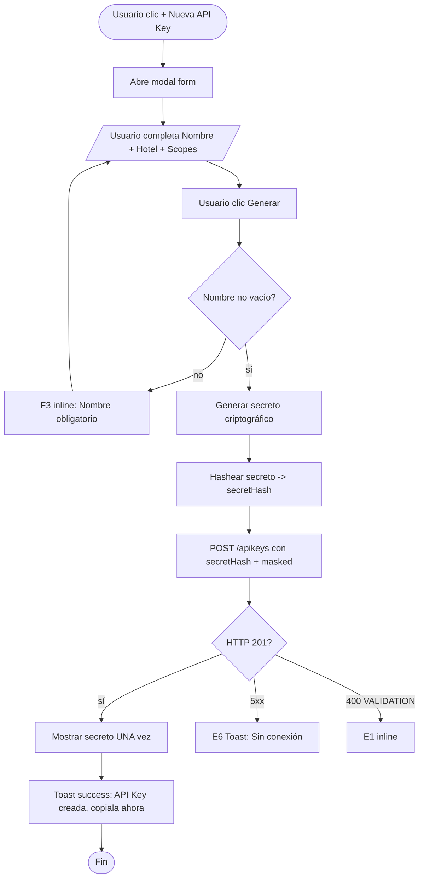
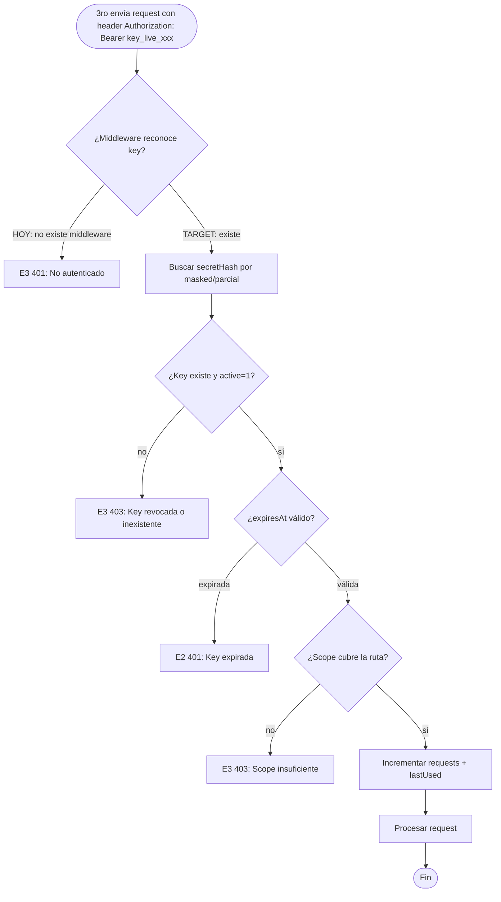
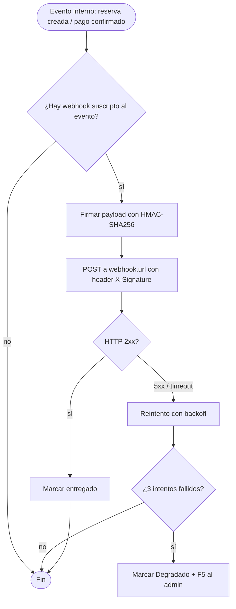
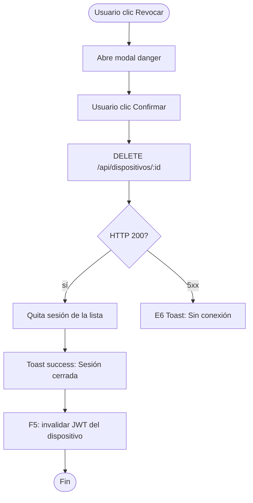

# FRD · M22 — API Abierta e Integraciones (API Keys, Webhooks, Integraciones externas)

> **Módulo de integraciones.** Documenta cómo terceros (Channex, pasarelas de pago, cerraduras, ERPs) se conectan a ManagerHotel mediante **API Keys** y **webhooks**, y qué pantallas administran ese acceso.
>
> Todo lo documentado acá está **extraído del código real** de `backend/src/modules/apikeys/`, `backend/src/modules/dispositivos/`, `backend/src/modules/canales/`, `frontend/src/pages/super-admin/api-keys.vue` y `frontend/src/pages/devices/index.vue`. La columna "Estado" marca **REAL** (existe y funciona) vs **PENDIENTE** (mock, scaffold o no implementado).

**Módulo:** M22 — API Abierta e Integraciones
**Pantallas cubiertas:** API Keys & Webhooks (super-admin) · Dispositivos Conectados · Integraciones (Channex vía módulo `canales`)
**Servicios frontend:** `Platform.service.ts` (apiKeys), `Operations.service.ts` (dispositivos), `Channel.service.ts` (Channex)
**Servicios backend:** módulos `apikeys`, `dispositivos`, `canales` (Channex) + conector `habitaciones-canales`

---

## 1. Modelo de datos (fuente de verdad)

### 1.1 Entidad `ApiKey` — tabla `api_keys`

Schema real en `backend/src/modules/apikeys/model.ts:4-18`:

| Campo | Tipo DB | Nullable | Notas / Estado |
|-------|---------|----------|----------------|
| `id` | string | NO (PK) | UUID generado por el cliente |
| `hotelId` | string | sí (indexed) | Scope de hotel; vacío = global/plataforma |
| `name` | string | NO | Etiqueta legible (ej: "Conexión Channex") |
| `scope` | string | sí | **String libre**, no validado contra una lista (ver §7.1) |
| `masked` | string | sí | Versión enmascarada para mostrar en UI |
| `secretHash` | string | sí | Hash del secreto — **PENDIENTE: nunca se hashea/genera en el servicio** (ver §7.2) |
| `active` | number | default 1 | 1=activa, 0=revocada |
| `requests` | number | default 0 | Contador de uso — **PENDIENTE: nada lo incrementa** |
| `lastUsed` | string | sí | Fecha último uso — **PENDIENTE: nada lo actualiza** |
| `createdAt` / `updatedAt` | string | timestamps | Auto |

> ⚠ **CAMPOS AUSENTES del modelo real** (definidos en el prompt del módulo pero NO en `model.ts`):
> - `expiresAt` (expiración) — **no existe**. Las keys no vencen nunca automáticamente.
> - `scopes[]` como array — el modelo guarda un único `scope: string`. La UI envía un string joined por coma (`api-keys.vue:207`).
> - `lastUsedByIp` / `lastUsedByUserAgent` — no existen.
> - No hay tabla `webhooks` ni tabla `integrations`.

### 1.2 Entidad `Device` (sesiones) — tabla `devices`

Schema real en `backend/src/modules/dispositivos/model.ts:4-20`:

| Campo | Tipo | Notas / Estado |
|-------|------|----------------|
| `id` | string (PK) | — |
| `hotelId` | string (indexed) | — |
| `userId` / `userName` | string | Usuario de la sesión |
| `device` | string | Descripción (ej: "Chrome on Windows") |
| `icon` | string | Emoji default 🖥️ |
| `browser` / `os` / `ip` | string | Huella de la sesión |
| `isMobile` | number | 0/1 |
| `lastActivity` | string | Último acceso |

> ⚠ **GAP ESTRUCTURAL:** el módulo `usuarios` (login) **NO escribe en `devices`** al autenticar — no hay conector `usuarios-dispositivos`. La tabla solo se llena por seed (`migrate-db.ts`). Por lo tanto las "sesiones activas" reales son **0** salvo data de demo.

### 1.3 Integraciones existentes (REAL) vs planeadas (PENDIENTE)

| Integración | Estado | Dónde vive | Notas |
|-------------|--------|------------|-------|
| **Channex** (Channel Manager) | ✅ **REAL** | `backend/src/modules/canales/` + `usecases/channex.ts` | Push de ARI (availability/rates/restrictions), recepción de bookings, test-connection, mapping, iframe token. Usa `channexApiKey` por hotel o `CHANNEX_API_KEY` env. **No usa el módulo `apikeys`** — la credencial vive en `canales` config. |
| **Stripe** | ❌ **PENDIENTE** | — | 0 matches en `backend/src`. Solo aparece como string en seed de payment methods (`migrate-db.ts:231`). |
| **MercadoPago** | ❌ **PENDIENTE** | — | No existe. |
| **PayPal** | ❌ **PENDIENTE** | — | Solo string en seed (`migrate-db.ts:231`), sin integración. |
| **Cerraduras electrónicas** (Salto/Assa Abloy) | ❌ **PENDIENTE** | — | Solo como categoría de mantenimiento (`migrate-db.ts:182`, `cerraduras→locks`). Sin API. |
| **ERPs / Contabilidad** | ❌ **PENDIENTE** | — | No existe. |
| **Webhooks salientes** (notificar a 3ros) | ❌ **PENDIENTE** | — | Sin tabla, sin endpoint, sin dispatcher. UI es mock. |
| **Webhooks entrantes** (recibir de 3ros) | ❌ **PENDIENTE** | — | No hay endpoints `/webhooks/*`. Channex usa **polling** del feed, no webhooks. |

---

## 2. Pantalla — API Keys & Webhooks (`/admin/api-keys`)

Cabecera con título "API Keys & Webhooks" + botón **"+ Nueva API Key"**. Tres bloques: tabla de keys activas, panel de Rate Limits, tabla de webhooks. Modal de creación con nombre, hotel y scope chips (`api-keys.vue:1-166`).

> ⚠ **GAP CRÍTICO DE RUTA — la lista NUNCA carga de backend real.**
> - Frontend (`Platform.service.ts:10`): `http.get('/api-keys')` → el cliente `http.ts:21` prefija `/api` → request final **`GET /api/api-keys`**.
> - Backend (`apikeys/index.ts:43`): registra **`/api/apikeys`** (sin guion, plural).
> - Resultado: **404**. El `catch {}` vacío en `api-keys.vue:192` traga el error y la tabla queda en `[]`. La UI se ve "sin keys" aunque existan en la DB.

### 2.1 Decision Table

| Trigger | Condición / Estado previo | Resultado | Modal/Toast (texto literal) | Errores posibles (códigos) | Notificación F5 | Estado |
|---------|---------------------------|-----------|------------------------------|-----------------------------|-----------------|--------|
| Carga de página (`onMounted`) | — | Llama `PlatformService.apiKeys()` | — | **E6/E7 silenciado** por `catch {}` vacío (`api-keys.vue:192`) → la tabla queda vacía sin feedback | — | ❌ **Rota por route mismatch** (ver nota ↑) |
| Botón **"+ Nueva API Key"** (`api-keys.vue:9`) | — | Abre **modal form**: campos Nombre, Hotel, Scope chips | Modal `form`: "Nueva API Key" | — | — | ✅ REAL (UI) |
| Toggle de scope chip (read:reservations, write:reservations, read:rooms, write:rooms, read:billing, write:billing, read:guests, write:guests — `api-keys.vue:174`) | — | Agrega/quita scope del array local | — | — | — | ✅ REAL (UI local) |
| Botón **"Cancelar"** (`api-keys.vue:160`) | modal abierto | Cierra modal sin acción | — | — | — | ✅ REAL |
| Botón **"Generar"** (`api-keys.vue:161`) con form válido | `newKey.name` no vacío | **PENDIENTE (target):** POST a `/apikeys` generando secreto criptográfico + hash + mostrar UNA sola vez. **HOY:** `generateKey()` (`api-keys.vue:203`) solo hace `apiKeys.value.unshift({...mock})` — **no llama a la API**, no genera secreto, no hashea. La "key" es `'key_live_••••••••' + Math.random()`. | **Target:** Toast success: "API Key creada. Copiala ahora, no se volverá a mostrar." **Hoy:** sin toast. | E1 "El nombre es obligatorio" (no validado hoy) · E6 | — | ❌ **MOCK: no persiste, no genera secreto** |
| Botón **"Generar"** con nombre vacío | `newKey.name === ''` | **Target:** no enviar, F3 inline "Nombre obligatorio". **Hoy:** igualmente crea un mock con nombre vacío. | F3 inline | E1 | — | ❌ Sin validación |
| Clic en icono copiar (`copyKey`, `api-keys.vue:40,221`) | key en lista | `navigator.clipboard.writeText(key.masked)` — copia el **mask** (no el secreto, que no existe) | — | — | — | ✅ REAL (copia el mask) |
| Botón **"Revocar"** / **"Reactivar"** (`api-keys.vue:55,216`) | `key.active` true/false | **PENDIENTE (target):** PUT `/apikeys/:id { active: 0/1 }`. **HOY:** `revokeKey()` (`api-keys.vue:216`) solo togguea `key.active` en memoria local — **no llama a la API**. Al recargar, revierte. | **Target:** Toast: "API Key {name} revocada." / "...reactivada." **Hoy:** sin toast ni efecto backend. | E6 | **Sí (target):** F5 al servicio integrado "Tu acceso fue revocado" | ❌ **MOCK: toggle local sin persistencia** |
| Botón **"+ Nuevo Webhook"** (`api-keys.vue:90`) | — | **HOY:** botón sin `@click`. No abre nada. | — | — | — | ❌ **PENDIENTE: sin handler** |
| Botón **"Probar"** (webhook, `api-keys.vue:123`) | webhook en lista | **HOY:** botón sin `@click`. No hace nada. | — | — | — | ❌ **PENDIENTE: sin handler** |
| Botón **"Eliminar"** (webhook, `api-keys.vue:124`) | webhook en lista | **HOY:** botón sin `@click`. No hace nada. | — | — | — | ❌ **PENDIENTE: sin handler** |
| Bloque **Rate Limits** (panel derecho, `api-keys.vue:65-83`) | — | Renderiza `rateLimits` — pero `rateLimits` es `ref<any[]>([])` y **nunca se carga** (no hay fetch ni seed). Siempre vacío. | — | — | — | ❌ **MOCK estático vacío** |
| Tabla **Webhooks Configurados** (`api-keys.vue:86-130`) | — | Renderiza `webhooks` — pero `webhooks` es `ref<any[]>([])` y **nunca se carga**. Siempre vacía. | — | — | — | ❌ **MOCK estático vacío** |

**Gaps actuales (API Keys & Webhooks):**
- ❌ **Route mismatch**: frontend pide `/api/api-keys`, backend sirve `/api/apikeys` → lista siempre vacía.
- ❌ **"Generar" no persiste**: mock en memoria, sin POST, sin generación criptográfica de secreto, sin hash (`secretHash` nunca se calcula).
- ❌ **"Revocar" no persiste**: toggle local sin PUT.
- ❌ **Sin middleware de auth por API Key**: `auth.authenticate()` solo acepta JWT (`composition-root.ts:42`). **No existe forma de usar una API Key para llamar a la API** — las keys son decorativas hoy.
- ❌ **Sin enforcement de scopes**: `scope` se guarda como string libre, pero ningún middleware valida `read:*` / `write:*` contra la ruta invocada.
- ❌ **Webhooks**: sin tabla, sin endpoint, sin dispatcher. Toda la UI de webhooks es mock sin handlers.
- ❌ **Rate Limits**: panel sin datos, sin lógica de throttle real.
- ❌ `catch {}` vacío traga errores silenciosamente → violación de §5 (debería ser Toast E6/E7 + F4).

### 2.2 Flow — Crear API Key (target, hoy es mock)

> **Estado HOY:** el flujo salta directo de D a un `unshift` local sin pasar por F–I. No hay secreto, no hay POST, no hay toast.

### 2.3 Flow — Usar API Key (PENDIENTE: no implementado)

> **Estado HOY:** rama X0 siempre. La API no acepta API Keys en absoluto.

### 2.4 Flow — Webhook saliente (PENDIENTE: no implementado)

---

## 3. Pantalla — Dispositivos Conectados (`/panel/devices`)

Cabecera con KPIs (sesiones activas, usuarios conectados, dispositivos móviles, último acceso). Tabla de sesiones activas con filtros por rol/dispositivo + tabla de historial. Botón "Cerrar Todas las Sesiones" (`devices/index.vue`).

### 3.1 Decision Table

| Trigger | Condición / Estado previo | Resultado | Modal/Toast (texto literal) | Errores posibles (códigos) | Notificación F5 | Estado |
|---------|---------------------------|-----------|------------------------------|-----------------------------|-----------------|--------|
| Carga (`onMounted`, `devices/index.vue:174`) | — | `OperationsService.dispositivos(hotelId)` → GET `/api/dispositivos` | — | **E6/E7 silenciado** por `catch {}` vacío (`devices/index.vue:186`) | — | ✅ REAL (ruta correcta, mapea a módulo) |
| Filtro **Rol** (Todos/Admin/Recepción/Super Admin, `devices/index.vue:45-50`) | — | Filtra `filteredSessions` local | — | — | — | ⚠ **Parcial:** compara contra `session.role` que siempre es `''` (el mapeo `onMounted` no setea `role`, línea 181) → el filtro nunca matchea |
| Filtro **Dispositivo** (Escritorio/Móvil/Tablet, `devices/index.vue:51-56`) | — | Filtra por `isMobile` / string 'iPad' | — | — | — | ✅ REAL (local) |
| Botón **"Revocar"** (sesión, `devices/index.vue:108,210`) | sesión en lista | **HOY:** `revokeSession()` (`devices/index.vue:210`) solo hace `sessions.value = sessions.value.filter(...)` — **no llama a DELETE `/api/dispositivos/:id`**. Al recargar, la sesión vuelve. | **Target:** Toast: "Sesión de {user} cerrada." **Hoy:** sin toast ni efecto backend. | E6 | **Sí (target):** invalidar JWT de esa sesión | ❌ **MOCK: filtrado local** |
| Botón **"Cerrar Todas las Sesiones"** (`devices/index.vue:12,214`) | ≥1 sesión | **HOY:** `revokeAll()` vacía el array local — **sin llamada backend**. | **Target:** Modal `danger`: "¿Cerrar todas las sesiones? Los usuarios serán desconectados." **Hoy:** borra sin confirmar ni avisar. | E6 | — | ❌ **MOCK + peligroso: sin confirmación** |
| Botón **"Exportar"** (historial, `devices/index.vue:124`) | — | **HOY:** `<button>` sin `@click`. No hace nada. | — | — | — | ❌ **PENDIENTE: sin handler** |

**Gaps actuales (Dispositivos):**
- ❌ **Revocación puramente local**: ni individual ni masiva llaman al backend.
- ❌ **"Cerrar Todas" sin confirmación** → viola §2.2 (debería ser modal `danger` con anti-clic-accidental).
- ❌ Filtro por Rol roto (el campo `role` nunca se popula desde el DTO).
- ❌ `catch {}` vacío traga errores de carga.
- ❌ La tabla `devices` no se puebla en login real (sin conector `usuarios-dispositivos`).

### 3.2 Flow — Revocar sesión (target, hoy es mock)

> **Estado HOY:** A → directo a F (local), sin B, D, G, H.

---

## 4. Integraciones externas — estado real

### 4.1 Channex (Channel Manager) — ✅ REAL

Documentado en profundidad en M02 (Channel Manager). Resumen de la superficie que M22 debe exponer:

- **Módulo:** `backend/src/modules/canales/` + `usecases/channex.ts`.
- **Credencial por hotel:** `channexApiKey` guardada en config del módulo `canales` (`model.ts:15`), **NO** en el módulo `apikeys`.
- **Operaciones:** syncProperty (crea property/room_types/rate_plans/availability/restrictions), pushRate (conector `habitaciones-canales.ts`), testConnection, mappingDetails, listGroups, createOTAChannel, deactivateChannel, fetchBookingFeed (polling), ingestBookings, generateIframeToken.
- **Conector:** `habitaciones-canales.ts` reacciona a `onHabitacionesUpdated` → `canales.pushRate`.
- **Dirección de conexión:** saliente (ManagerHotel → Channex API) + polling del feed. **No hay webhook entrante** de Channex.

### 4.2 Pasarelas de pago (Stripe / MercadoPago / PayPal) — ❌ PENDIENTE

- 0 líneas de código de integración en `backend/src`.
- Solo referencias cosméticas en seed (`migrate-db.ts:231`).
- El módulo `folios`/`facturas` no invoca ninguna pasarela.

### 4.3 Cerraduras electrónicas — ❌ PENDIENTE

- Solo existe como categoría de tickets de mantenimiento.
- Sin API de Salto/Assa Abloy/Dormakaba.

### 4.4 ERPs / Contabilidad — ❌ PENDIENTE

- No existe integración. La exportación contable es un gap.

### 4.5 Webhooks (salientes e entrantes) — ❌ PENDIENTE

- Sin tabla `webhooks`, sin endpoint de registro, sin dispatcher de eventos, sin verificación de firma.
- Toda la UI de webhooks en `api-keys.vue:86-130` es mock sin handlers.

---

## 5. Consecuencias cross-módulo (eventos que M22 podría disparar)

Estos son los efectos que **deberían** producirse al gestionar accesos externos. **HOY ninguno está cableado.**

| Acción en M22 | Módulo afectado | Efecto esperado | Notificación F5 | Estado |
|---------------|-----------------|-----------------|-----------------|--------|
| Crear API Key con `write:reservations` | Reservas (M01) | Permitir POST/PUT desde 3ros con esa key | — | ❌ PENDIENTE |
| Revocar API Key activa | Servicios integrados (Channex, ERP) | Bloquear próximas requests; cortar conexiones vivas | F5 al admin "Key {name} revocada, {n} servicios afectados" | ❌ PENDIENTE |
| Registrar webhook `reservation.created` | Reservas (M01) | Al crear reserva → POST al webhook firmado | — | ❌ PENDIENTE |
| Webhook `payment.confirmed` | Billing/Folios (M13) | Al confirmar pago → notificar al ERP | — | ❌ PENDIENTE |
| "Cerrar Todas las Sesiones" | Auth / todos | Invalidar todos los JWT vivos | F5 a cada usuario "Tu sesión fue cerrada" | ❌ PENDIENTE |
| Push de tarifa (Channex) — **REAL** | Habitaciones (M01) → Canales (M02) | Cambio de `basePrice` → `canales.pushRate` | — | ✅ REAL (`habitaciones-canales.ts`) |

---

## 6. Documentación técnica (PENDIENTE)

M22 debería exponer documentación pública para integradores. **HOY no existe.**

| Recurso | Estado | Notas |
|---------|--------|-------|
| Spec OpenAPI / Swagger | ❌ PENDIENTE | No hay. Las rutas están dispersas en `composition-root.ts` e `index.ts` por módulo. |
| Guía "Cómo crear tu API Key" | ❌ PENDIENTE | — |
| Catálogo de scopes (`read:*` / `write:*`) | ❌ PENDIENTE | Los 8 chips de `api-keys.vue:174` son la única fuente, pero no hay doc ni validación. |
| Ejemplos de webhook payload + firma | ❌ PENDIENTE | — |
| Postman collection | ❌ PENDIENTE | — |
| Status page de integraciones | ❌ PENDIENTE | — |

---

## 7. Reglas de negocio a validar en backend (E2 / E3)

El backend debe rechazar o bloquear estas situaciones. **HOY ninguna está implementada.**

### 7.1 Scopes — validación de lista cerrada (E1 / E3)

**Target:** `scope` solo acepta estos valores (catálogo cerrado, no string libre):

| Scope | Permiso |
|-------|---------|
| `read:reservations` | GET reservas/folios |
| `write:reservations` | POST/PUT reservas |
| `read:rooms` | GET habitaciones |
| `write:rooms` | PUT habitaciones |
| `read:billing` | GET facturas/folios |
| `write:billing` | POST facturas/cobros |
| `read:guests` | GET huéspedes |
| `write:guests` | POST/PUT huéspedes |

**Regla E1:** cualquier scope fuera de esta lista → 400 `VALIDATION` "Scope inválido: {x}.".
**Regla E3:** request con key cuyo scope no cubre la ruta → 403 "Scope insuficiente para {acción}.".

> **HOY (`apikeys/validators/schema.ts:5`):** `scope` es `{ type: 'string' }` sin enum → acepta cualquier string.

### 7.2 Generación y verificación de secreto (E2)

| # | Regla | Cuándo | Mensaje | Estado |
|---|-------|--------|---------|--------|
| 1 | El secreto se genera server-side con `crypto.randomBytes(32)` hex y se hashea (bcrypt/sha256) antes de guardar; el plano se devuelve **una sola vez** en la response de creación | Crear API Key | — | ❌ PENDIENTE (`service.create` guarda el DTO tal cual, `secretHash` queda null) |
| 2 | Una key revocada (`active=0`) no puede autenticar | Cualquier request con key | E3 "Key revocada." | ❌ PENDIENTE |
| 3 | Una key expirada (`expiresAt < now`) no puede autenticar | Cualquier request con key | E2 "Key expirada el {fecha}." | ❌ PENDIENTE (campo `expiresAt` no existe) |
| 4 | `requests` y `lastUsed` se actualizan en cada uso autenticado | Post-auth middleware | — | ❌ PENDIENTE (nada los escribe) |
| 5 | Solo `super_admin` puede crear keys globales (sin `hotelId`); `hotel_admin` solo con su `hotelId` | Crear API Key | E3 "Sin permiso para crear key global." | ❌ PENDIENTE (el controller no valida ownership del hotelId) |
| 6 | Revocar una key con conexiones activas corta los tokens/sesiones derivadas | Revocar | — | ❌ PENDIENTE |
| 7 | Un webhook con >5 fallos consecutivos pasa a "Degradado" y suspende envíos | Dispatcher | — | ❌ PENDIENTE (no hay dispatcher) |
| 8 | Firma HMAC del payload obligatoria; 3ro debe verificar `X-Signature` | Webhook saliente | — | ❌ PENDIENTE |

---

## 8. Checklist de verificación M22

Estado actual vs. target. Marcar cuando se cumpla.

### Backend — apikeys
- [ ] Generar secreto criptográfico + hash en `service.create` (hoy: no hace nada)
- [ ] Agregar campo `expiresAt` al modelo + validación de expiración
- [ ] Middleware de auth por API Key (Bearer key_live_...) además del JWT
- [ ] Enforcement de scopes por ruta (catálogo cerrado de 8 scopes)
- [ ] Incrementar `requests` + `lastUsed` en cada uso
- [ ] Validar ownership: `hotel_admin` no crea keys globales
- [ ] Endpoint de revocación con corte de conexiones activas
- [ ] `arckode analyze` = 0 violaciones tras los cambios

### Backend — webhooks
- [ ] Tabla `webhooks` (url, events[], secret, status, delivered, failed, hotelId)
- [ ] Endpoints CRUD `/api/webhooks`
- [ ] Dispatcher de eventos (suscripción por tipo de evento)
- [ ] Firma HMAC-SHA256 del payload + header `X-Signature`
- [ ] Reintentos con backoff exponencial (máx 3)
- [ ] Estado "Degradado" tras >5 fallos + F5 al admin

### Backend — dispositivos / sesiones
- [ ] Conector `usuarios-dispositivos`: registrar sesión en login, actualizar `lastActivity`
- [ ] DELETE `/api/dispositivos/:id` invalida JWT de esa sesión
- [ ] Endpoint "cerrar todas las sesiones" (bulk revoke)

### Frontend — api-keys.vue
- [ ] **FIX route mismatch:** `Platform.service.ts:10` debe llamar `/apikeys` (no `/api-keys`)
- [ ] "Generar" hace POST real + muestra secreto una vez + toast success
- [ ] "Revocar/Reactivar" hace PUT real + toast
- [ ] Validación E1: nombre obligatorio antes de generar
- [ ] Estado loading en "Generar" y "Revocar"
- [ ] Handlers en "+ Nuevo Webhook", "Probar", "Eliminar"
- [ ] Cargar rateLimits desde backend
- [ ] Quitar `catch {}` vacío → Toast E6/E7 en error de carga
- [ ] Modal `danger` al revocar (consecuencia: corta 3ros)

### Frontend — devices/index.vue
- [ ] "Revocar" llama DELETE real + toast
- [ ] "Cerrar Todas" → modal `danger` de confirmación + bulk revoke
- [ ] Poblar `session.role` en el mapeo (filtro roto hoy)
- [ ] Quitar `catch {}` vacío
- [ ] Handler en "Exportar"

### Documentación
- [ ] Spec OpenAPI generada desde las rutas
- [ ] Guía de creación de API Key + catálogo de scopes
- [ ] Ejemplos de webhook payload + verificación de firma
- [ ] Postman collection

---

## 9. Pendiente de documentar en M22 (próximas iteraciones)

- [ ] Integración Stripe (cobros, reembolsos, webhooks de pago)
- [ ] Integración MercadoPago
- [ ] Integración PayPal
- [ ] Integración cerraduras (Salto/Assa Abloy) — check-in dispara clave de hab
- [ ] Integración ERP/contabilidad (exportación de asientos)
- [ ] Rate limiting real por plan (rpm/daily) con respuesta 429
- [ ] Auditoría de uso de API Keys (qué key llamó qué endpoint y cuándo) → módulo `auditlog`
- [ ] Rotación automática de keys
- [ ] IP allowlist por key
- [ ] Mock server / sandbox para integradores

---

*Documento extraído del código real el 2026-06-19. Toda marca "❌ PENDIENTE" corresponde a un gap verificado contra el código citado (file:line). Toda marca "✅ REAL" corresponde a funcionalidad que existe y responde.*
