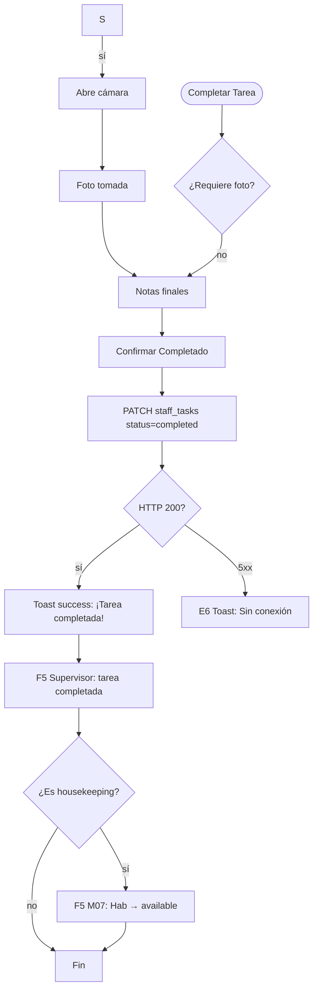

# FRD · M24 — App SOLMI Staff (App Móvil del Personal)

> **Módulo no implementado.** Este documento define el comportamiento TARGET para la app móvil del personal hotelero de SOLMI OS. Sigue el molde de `M01-PMS-Central.md`.
>
> Todo lo documentado acá es **comportamiento esperado** basado en estándares de apps de personal hotelero (Hotelkit, ALICE, Knowcross, Quore). Las columnas "Gap" marcan que TODO está pendiente de implementación.

**Módulo:** M24 — App SOLMI Staff
**Estado:** 🔴 No implementado
**Fecha:** 2026-06-19
**Pantallas cubiertas:** Home · Tareas · Chat · Inventario · Check-lists · Emergencias · Mi Perfil
**Servicios frontend target:** PWA/Vue 3 mobile-first, `StaffApp.service.ts`, `Task.service.ts`, `Chat.service.ts`
**Servicios backend target:** módulos `staff-tasks`, `staff-chat`, `staff-inventory`, `staff-checklists`, `staff-emergencies`

---

## 1. Propósito

M24 es una Progressive Web App (PWA) optimizada para móviles que da al personal del hotel (housekeeping, mantenimiento, recepción, gerencia) acceso rápido a sus tareas diarias, comunicación en tiempo real, reportes de issues, check-lists de inspección, y alertas de emergencia. Funciona como el hub operativo móvil que conecta con M07 (Housekeeping), M08 (Mantenimiento), M01 (PMS), y M09 (Empleados). Diseñada para usar en el piso del hotel sin depender de una computadora de escritorio.

---

## 2. Modelo de datos (target)

### 2.1 Tareas Assignadas (`staff_tasks`)

| Columna | Tipo | Descripción |
|---------|------|-------------|
| `id` | UUID | PK |
| `hotel_id` | UUID | FK → hotels |
| `assigned_to` | UUID | FK → employees |
| `assigned_by` | UUID | FK → employees |
| `type` | ENUM | `housekeeping` · `maintenance` · `inspection` · `laundry` · `minibar` · `turndown` · `special_request` |
| `priority` | ENUM | `low` · `normal` · `high` · `urgent` |
| `status` | ENUM | `pending` · `in_progress` · `completed` · `blocked` · `cancelled` |
| `title` | VARCHAR(300) | Nombre de la tarea |
| `description` | TEXT | Detalle |
| `room_id` | UUID | FK → rooms (si aplica) |
| `reservation_id` | UUID | FK → reservations (si aplica) |
| `due_at` | TIMESTAMP | Fecha/hora límite |
| `started_at` | TIMESTAMP | Cuando el empleado la comenzó |
| `completed_at` | TIMESTAMP | Cuando la terminó |
| `estimated_minutes` | INTEGER | Estimación original |
| `actual_minutes` | INTEGER | Tiempo real |
| `notes` | TEXT | Notas del empleado |
| `photos` | JSONB | URLs de fotos tomadas durante la tarea |
| `created_at` | TIMESTAMP | — |

### 2.2 Chat de Equipo (`staff_messages`)

| Columna | Tipo | Descripción |
|---------|------|-------------|
| `id` | UUID | PK |
| `hotel_id` | UUID | FK → hotels |
| `sender_id` | UUID | FK → employees |
| `channel` | ENUM | `general` · `housekeeping` · `maintenance` · `front_desk` · `management` · `direct` |
| `recipient_id` | UUID | FK → employees (solo si channel=direct) |
| `message` | TEXT | Texto del mensaje |
| `message_type` | ENUM | `text` · `image` · `voice` · `file` · `task_reference` |
| `attachment_url` | VARCHAR(500) | URL de imagen/audio/archivo |
| `task_reference_id` | UUID | FK → staff_tasks (si menciona una tarea) |
| `is_read` | BOOLEAN | — |
| `created_at` | TIMESTAMP | — |

### 2.3 Check-lists de Inspección (`staff_checklists`)

| Columna | Tipo | Descripción |
|---------|------|-------------|
| `id` | UUID | PK |
| `hotel_id` | UUID | FK → hotels |
| `name` | VARCHAR(200) | Nombre del check-list |
| `type` | ENUM | `room_inspection` · `checkout_cleaning` · `deep_cleaning` · `safety_check` · `maintenance_audit` · `opening_checklist` · `closing_checklist` |
| `items` | JSONB | Lista de ítems (ver §2.4) |
| `is_active` | BOOLEAN | — |
| `created_at` | TIMESTAMP | — |

### 2.4 Estructura de `items` (checklist)

```json
{
  "items": [
    {
      "id": "item_1",
      "text": "Sábanas cambiadas",
      "required": true,
      "category": "bedroom",
      "photo_required": false
    },
    {
      "id": "item_2",
      "text": "Baño desinfectado",
      "required": true,
      "category": "bathroom",
      "photo_required": true
    },
    {
      "id": "item_3",
      "text": "Toallas reemplazadas",
      "required": true,
      "category": "bathroom",
      "photo_required": false
    }
  ]
}
```

### 2.5 Respuestas de Check-list (`staff_checklist_responses`)

| Columna | Tipo | Descripción |
|---------|------|-------------|
| `id` | UUID | PK |
| `checklist_id` | UUID | FK → staff_checklists |
| `room_id` | UUID | FK → rooms |
| `employee_id` | UUID | FK → employees |
| `responses` | JSONB | `{ "item_1": { "done": true }, "item_2": { "done": true, "photo_url": "..." } }` |
| `status` | ENUM | `in_progress` · `completed` · `failed` |
| `notes` | TEXT | Observaciones |
| `started_at` | TIMESTAMP | — |
| `completed_at` | TIMESTAMP | — |

### 2.6 Alertas de Emergencia (`staff_emergencies`)

| Columna | Tipo | Descripción |
|---------|------|-------------|
| `id` | UUID | PK |
| `hotel_id` | UUID | FK → hotels |
| `reported_by` | UUID | FK → employees |
| `type` | ENUM | `fire` · `flood` · `medical` · `security` · `power_outage` · `gas_leak` · `evacuation` · `other` |
| `severity` | ENUM | `low` · `medium` · `high` · `critical` |
| `location` | VARCHAR(200) | Ubicación exacta (piso, habitación, área) |
| `description` | TEXT | Descripción del incidente |
| `status` | ENUM | `active` · `responding` · `resolved` · `false_alarm` |
| `responded_by` | UUID | FK → employees (quién respondió) |
| `resolved_at` | TIMESTAMP | — |
| `photos` | JSONB | Evidencia fotográfica |
| `created_at` | TIMESTAMP | — |

### 2.7 Inventario de Housekeeping (`staff_inventory`)

| Columna | Tipo | Descripción |
|---------|------|-------------|
| `id` | UUID | PK |
| `hotel_id` | UUID | FK → hotels |
| `item_name` | VARCHAR(200) | Nombre del ítem (toallas, sábanas, amenities) |
| `category` | ENUM | `linen` · `amenity` · `cleaning` · `minibar` · `other` |
| `current_stock` | INTEGER | Stock actual |
| `min_stock` | INTEGER | Stock mínimo para alertar |
| `unit` | VARCHAR(50) | Unidad de medida |
| `last_restocked_at` | TIMESTAMP | — |
| `updated_at` | TIMESTAMP | — |

---

## 3. Pantalla — Home / Dashboard (`/app/staff`)

Vista mobile-first: greeting con nombre del empleado, turno actual, tareas de hoy, badges por prioridad.

### 3.1 Decision Table

| Trigger | Condición | Resultado | Modal/Toast (texto) | Errores | Notif F5 |
|---------|-----------|-----------|----------------------|---------|----------|
| Abrir app | — | Home: "¡Buenos días, {nombre}!" · Tareas de hoy: {n} pendientes · Turno: {horario} | — | — | — |
| Badge **"🔴 Urgentes"** | hay tareas urgentes | Lista de tareas urgentes arriba del feed | — | — | — |
| Badge **"🟡 Hoy"** | hay tareas para hoy | Lista de tareas del día ordenadas por prioridad | — | — | — |
| Clic en tarea | — | Abre detalle de tarea: título, habitación, notas, fotos, acción "Iniciar" / "Completar" | — | — | — |
| **"Iniciar Tarea"** | status = pending | status → in_progress, started_at = now | **Toast success:** "Tarea '{título}' iniciada." | E6 | — |
| **"Completar Tarea"** | status = in_progress | Abre modal: notas finales + foto obligatoria si aplica | — | — | — |
| **"Confirmar Completado"** | status = in_progress | status → completed, completed_at = now | **Toast success:** "¡Tarea '{título}' completada! +{n} min registrados." | E6 | F5 Supervisor: "Tarea completada por {empleado}" |
| **"Reportar Bloqueo"** | status = in_progress | status → blocked, modal: motivo del bloqueo | **Toast success:** "Tarea '{título}' marcada como bloqueada." | E6 | F5 Supervisor: "Tarea bloqueada: {motivo}" |
| Clic en **"💬 Chat"** | — | Abre lista de canales de chat | — | — | — |
| Clic en **"🚨 Emergencia"** | — | Abre formulario de reporte de emergencia | — | — | — |
| Clic en **"📋 Check-list"** | — | Abre check-list de la habitación asignada | — | — | — |
| Clic en **"📦 Inventario"** | — | Abre vista de stock | — | — | — |
| Clic en **"👤 Mi Perfil"** | — | Abre perfil: nombre, rol, turno, horas trabajadas, tareas completadas | — | — | — |

### 3.2 Flow — Completar Tarea



---

## 4. Pantalla — Chat (`/app/staff/chat`)

### 4.1 Decision Table

| Trigger | Condición | Resultado | Modal/Toast (texto) | Errores | Notif F5 |
|---------|-----------|-----------|----------------------|---------|----------|
| Clic en **"General"** | — | Chat general del hotel (todos los empleados) | — | — | — |
| Clic en **"Housekeeping"** | — | Chat del equipo de housekeeping | — | — | — |
| Clic en **"Mantenimiento"** | — | Chat del equipo de mantenimiento | — | — | — |
| Clic en **"Recepción"** | — | Chat del equipo de front desk | — | — | — |
| Clic en empleado (direct message) | — | Chat directo con ese empleado | — | — | — |
| **"Enviar Mensaje"** | texto no vacío | POST staff_messages | — | E6 | — |
| **"📷 Foto"** | cámara disponible | Abre cámara, adjunta foto al mensaje | — | — | — |
| **"🎤 Audio"** | — | Graba nota de voz (max 60s) | — | — | — |
| **"📎 Archivo"** | — | Selector de archivo adjunto | — | — | — |
| **"📌 Referenciar Tarea"** | — | Busca tarea por ID/título, adjunta referencia | — | — | — |
| Mensaje nuevo recibido | — | Badge de no-leído en canal, push notification | — | — | F5 Badge actualizado |

---

## 5. Pantalla — Check-list (`/app/staff/checklist/:roomId`)

### 5.1 Decision Table

| Trigger | Condición | Resultado | Modal/Toast (texto) | Errores | Notif F5 |
|---------|-----------|-----------|----------------------|---------|----------|
| Abrir check-list para habitación | — | Lista de ítems con checkboxes, fotos obligatorias | — | — | — |
| Toggle checkbox (ítem done) | — | Marca ítem como completado | — | — | — |
| **"📷 Tomar Foto"** (ítem photo_required) | — | Abre cámara, guarda foto, marca done | — | E6 | — |
| Todos los ítems completados | — | Habilita botón "Finalizar Check-list" | — | — | — |
| **"Finalizar Check-list"** | todos los ítems done | POST staff_checklist_responses | **Toast success:** "Check-list de Hab {n} completada." | E2 "Faltan ítems obligatorios" · E6 | F5 M07: "Hab {n} inspeccionada" |
| **"Reportar Problema"** (ítem fallado) | — | Abre modal: descripción del problema, foto, prioridad | Modal `form`: "Reportar Problema" | — | — |
| **"Enviar Reporte"** | descripción no vacía | Crea ticket en M08 Mantenimiento + post en chat | **Toast success:** "Problema reportado. Ticket #{n} creado." | E6 | F5 Mantenimiento: "Nuevo ticket de inspección" |

---

## 6. Pantalla — Inventario (`/app/staff/inventory`)

### 6.1 Decision Table

| Trigger | Condición | Resultado | Modal/Toast (texto) | Errores | Notif F5 |
|---------|-----------|-----------|----------------------|---------|----------|
| Abrir inventario | — | Lista de ítems con stock actual vs mínimo | — | — | — |
| Filtro por categoría | — | Filtra: linen, amenity, cleaning, minibar | — | — | — |
| Badge **"⚠ Stock Bajo"** | stock < min_stock | Lista de ítems por debajo del mínimo | — | — | — |
| **"Registrar Uso"** | — | Modal: ítem, cantidad usada | — | — | — |
| Confirmar uso | cantidad válida | PATCH stock: stock - cantidad | **Toast success:** "{cantidad} {ítem} registrados como usados." | E2 "Stock insuficiente" · E6 | — |
| **"Registrar Reposición"** | — | Modal: ítem, cantidad recibida | — | — | — |
| Confirmar reposición | cantidad válida | PATCH stock: stock + cantidad | **Toast success:** "{cantidad} {ítem} agregados al stock." | E6 | — |
| **"Pedir Reposición"** (stock bajo) | stock < min_stock | Envía solicitud a compras/gerencia | **Toast success:** "Solicitud de reposición enviada." | E6 | F5 Compras: "Stock bajo: {ítem} ({stock}/{min})" |

---

## 7. Pantalla — Emergencias (`/app/staff/emergency`)

### 7.1 Decision Table

| Trigger | Condición | Resultado | Modal/Toast (texto) | Errores | Notif F5 |
|---------|-----------|-----------|----------------------|---------|----------|
| **"🚨 EMERGENCIA"** (botón rojo grande) | — | Abre formulario de emergencia: tipo, severidad, ubicación, descripción, foto | Modal `danger` xl: "Reportar Emergencia" | — | — |
| Seleccionar tipo "Fuego" | — | Severidad auto = `critical`, envía alerta inmediata a todos | — | — | — |
| Seleccionar tipo "Médica" | — | Severidad auto = `high`, alerta a gerencia + seguridad | — | — | — |
| **"Enviar Alerta"** | tipo + ubicación | POST staff_emergencies → push a TODOS los empleados | **Toast danger:** "⚠ EMERGENCIA reportada: {tipo} en {ubicación}. Alerta enviada a todo el staff." | E6 (retry con sonido) | **F5 MASA:** push a todos los dispositivos |
| **"🚨 Responder"** (otro empleado) | — | status → responding, notified_by = employee | **Toast info:** "Tu emergencia está siendo atendida por {empleado}." | — | — |
| **"✅ Resolver"** (reportero o gerencia) | — | status → resolved, resolved_at = now | **Toast success:** "Emergencia #{n} resuelta." | — | F5 "Emergencia #{n} resuelta: {tipo}" |
| **"⚠ Falsa Alarma"** | — | **Modal danger:** "¿Marcar como falsa alarma? Se notificará a todos." | Modal danger | E6 | F5 "Falsa alarma reportada por {empleado}" |

### 7.2 Flow — Reportar Emergencia

```mermaid
flowchart TD
    A([🚨 EMERGENCIA]) --> B[Modal danger: Formulario]
    B --> C[Tipo + severidad + ubicación + descripción]
    C --> D[Enviar Alerta]
    D --> E[POST staff_emergencies]
    E --> F[Push notification a TODOS los dispositivos]
    F --> G["Toast danger: EMERGENCIA reportada"]
    G --> H{¿Otros empleados responden?}
    H -- sí --> I[status → responding]
    I --> J[Toast: "Atendida por {empleado}"]
    H -- no --> K[Gerente escalada]
    K --> L[Resolución o falsa alarma]
    J --> L
    L --> M[status → resolved]
    M --> N[F5: Emergencia resuelta]
    N --> O([Fin])
```

---

## 8. Consecuencias cross-módulo (eventos que dispara M24)

| Acción en M24 | Módulo afectado | Efecto | Notificación F5 |
|---------------|-----------------|--------|-----------------|
| Tarea housekeeping completada | Housekeeping (M07) | Hab → available si check-list aprobado | "Hab {n} lista para venta" |
| Tarea mantenimiento completada | Mantenimiento (M08) | Ticket cerrado | "Ticket #{n} resuelto" |
| Problema reportado en check-list | Mantenimiento (M08) | Crear ticket automático | "Nuevo ticket de inspección: {hab}" |
| Check-list completado | Housekeeping (M07) | Actualizar inspección | — |
| Stock bajo detectado | Inventario (stock) | Alerta a compras | "Stock bajo: {ítem}" |
| Emergencia reportada | Empleados (M09) | Push a todos los dispositivos | "⚠ EMERGENCIA: {tipo}" |
| Mensaje en chat | — | Push notification al destinatario | — |
| Tarea bloqueada | Supervisores | Notificación de bloqueo | "Tarea bloqueada: {motivo}" |

---

## 9. Gap analysis

| # | Gap | Severidad | Descripción |
|---|-----|-----------|-------------|
| G1 | Módulo completo no existe | 🔴 BLOCKER | No hay PWA, backend, ni servicios |
| G2 | Sin PWA configurada | 🔴 BLOCKER | No hay service worker, manifest, ni offline |
| G3 | Sin sistema de tareas móvil | 🔴 BLOCKER | No hay asignación de tareas a dispositivos |
| G4 | Sin chat en tiempo real | 🔴 CRÍTICO | No hay WebSocket para mensajes |
| G5 | Sin check-lists móviles | 🟡 ALTO | No hay inspecciones desde el teléfono |
| G6 | Sin cámara integrada | 🟡 ALTO | No hay fotos de evidencia |
| G7 | Sin sistema de emergencia | 🟡 ALTO | No hay alertas push masivas |
| G8 | Sin inventario móvil | 🟠 MEDIO | No hay registro de stock desde el piso |
| G9 | Sin voice notes | 🟠 MEDIO | No hay mensajes de voz |
| G10 | Sin tracking GPS de ubicación | 🟠 MEDIO | No hay geolocalización de empleados en el hotel |

---

## 10. Checklist de verificación M24

### Home / Dashboard
- [ ] Greeting personalizado con turno
- [ ] Conteo de tareas pendientes/urgentes
- [ ] Badges por prioridad
- [ ] Acceso rápido a chat, emergencia, check-list, inventario

### Tareas
- [ ] Lista de tareas asignadas con filtros
- [ ] Iniciar tarea (status → in_progress)
- [ ] Completar tarea con notas + foto
- [ ] Reportar bloqueo con motivo
- [ ] Push notification para nuevas tareas
- [ ] Tiempo registrado automáticamente

### Chat
- [ ] Canales de equipo (general, housekeeping, maintenance, front_desk)
- [ ] Mensajes directos
- [ ] Envío de texto, foto, audio, archivos
- [ ] Referenciar tarea en mensaje
- [ ] Badge de no-leído
- [ ] Push notification para mensajes nuevos

### Check-lists
- [ ] Check-list por habitación
- [ ] Checkboxes con fotos obligatorias
- [ ] Finalizar check-list
- [ ] Reportar problema → crear ticket M08
- [ ] Sync con M07 para cambiar estado de hab

### Inventario
- [ ] Lista de stock actual vs mínimo
- [ ] Badge "Stock Bajo"
- [ ] Registrar uso/reposición
- [ ] Pedir reposición automática

### Emergencias
- [ ] Botón de emergencia prominente
- [ ] Tipos predefinidos con severidad auto
- [ ] Push a TODOS los dispositivos
- [ ] Responder/emergencia atendida
- [ ] Resolver / falsa alarma
- [ ] Retry con sonido si falla el envío

### Cross-módulo
- [ ] Actualiza M07 (housekeeping) al completar tareas
- [ ] Crea tickets en M08 desde check-lists
- [ ] Alerta a M09 (empleados) en emergencias
- [ ] Notificaciones F5 en eventos clave

---

*Documento generado como target. Todo está pendiente de implementación. Copiar molde de `M01-PMS-Central.md`.*
