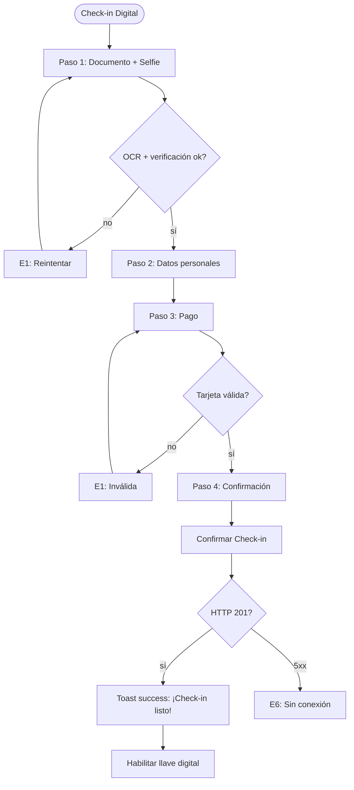
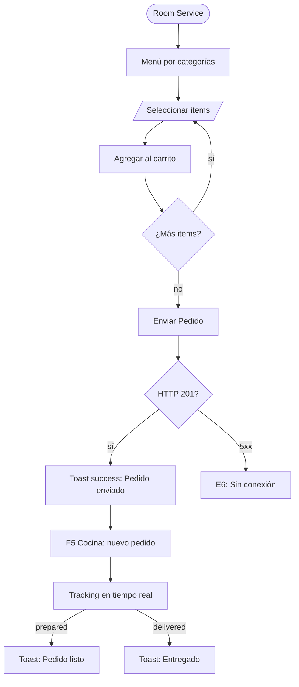

# FRD · M25 — App SOLMI Guest (App Móvil del Huésped)

> **Módulo no implementado.** Comportamiento TARGET basado en apps de huésped hotelero (Marriott Bonvoy, Hilton Honors, Four Seasons, Citizen M). Sigue molde de `M01-PMS-Central.md`.

**Módulo:** M25 — App SOLMI Guest
**Estado:** 🔴 No implementado
**Fecha:** 2026-06-19
**Pantallas:** Check-in Digital · Llave Digital · Room Service · Chat · Servicios · Mi Estancia · Loyalty · Feedback
**Backend target:** módulos `guest-app`, `digital-key`, `room-service-guest`, `guest-chat`, `guest-services`

---

## 1. Propósito

PWA para huéspedes: check-in/check-out desde el celular, llave digital NFC/BLE, room service, chat con recepción, servicios del hotel (spa, restaurantes, tours), historial de estancia, y acumulación/canje de puntos de fidelidad (M20).

---

## 2. Modelo de datos (target)

### 2.1 Check-in Digital (`guest_checkins`)

| Columna | Tipo | Descripción |
|---------|------|-------------|
| `id` | UUID | PK |
| `reservation_id` | UUID | FK → reservations |
| `guest_id` | UUID | FK → guests |
| `hotel_id` | UUID | FK → hotels |
| `status` | ENUM | `pending` · `documents_submitted` · `verified` · `completed` · `rejected` |
| `id_document_type` | ENUM | `passport` · `national_id` · `drivers_license` · `other` |
| `id_document_front_url` | VARCHAR(500) | Foto frontal del documento |
| `selfie_url` | VARCHAR(500) | Selfie para verificación facial |
| `signature_url` | VARCHAR(500) | Firma digital |
| `payment_method` | JSONB | `{ type: "card", last4: "4242", brand: "visa" }` |
| `special_requests` | TEXT | Solicitudes especiales |
| `arrival_time` | TIME | Hora estimada de llegada |
| `verified_at` | TIMESTAMP | — |
| `completed_at` | TIMESTAMP | — |

### 2.2 Llave Digital (`guest_digital_keys`)

| Columna | Tipo | Descripción |
|---------|------|-------------|
| `id` | UUID | PK |
| `guest_id` | UUID | FK → guests |
| `reservation_id` | UUID | FK → reservations |
| `room_id` | UUID | FK → rooms |
| `key_type` | ENUM | `primary` · `secondary` · `temporary` |
| `protocol` | ENUM | `nfc` · `bluetooth` · `ble` · `wifi` |
| `status` | ENUM | `active` · `expired` · `revoked` · `pending_activation` |
| `valid_from` | TIMESTAMP | Check-in time |
| `valid_until` | TIMESTAMP | Check-out + 2h |
| `activation_count` | INTEGER | — |

### 2.3 Pedidos Room Service (`guest_room_orders`)

| Columna | Tipo | Descripción |
|---------|------|-------------|
| `id` | UUID | PK |
| `hotel_id` | UUID | FK → hotels |
| `guest_id` | UUID | FK → guests |
| `reservation_id` | UUID | FK → reservations |
| `room_id` | UUID | FK → rooms |
| `items` | JSONB | `[{ menu_item_id, name, quantity, price, notes }]` |
| `total_amount` | DECIMAL(10,2) | — |
| `status` | ENUM | `pending` · `confirmed` · `preparing` · `ready` · `delivered` · `cancelled` |
| `delivery_time` | ENUM | `now` · `scheduled` |
| `scheduled_time` | TIME | — |
| `payment_method` | ENUM | `room_charge` · `card` · `cash` |
| `charged_to_room` | BOOLEAN | — |
| `confirmed_at` | TIMESTAMP | — |
| `delivered_at` | TIMESTAMP | — |

### 2.4 Chat Guest-Recepción (`guest_messages`)

| Columna | Tipo | Descripción |
|---------|------|-------------|
| `id` | UUID | PK |
| `hotel_id` | UUID | FK → hotels |
| `guest_id` | UUID | FK → guests |
| `reservation_id` | UUID | FK → reservations |
| `sender_type` | ENUM | `guest` · `staff` · `bot` |
| `sender_id` | UUID | FK → guests o employees |
| `message` | TEXT | — |
| `message_type` | ENUM | `text` · `image` · `voice` · `system` |
| `attachment_url` | VARCHAR(500) | — |
| `is_read` | BOOLEAN | — |

### 2.5 Servicios Solicitados (`guest_service_requests`)

| Columna | Tipo | Descripción |
|---------|------|-------------|
| `id` | UUID | PK |
| `hotel_id` | UUID | FK → hotels |
| `guest_id` | UUID | FK → guests |
| `reservation_id` | UUID | FK → reservations |
| `service_type` | ENUM | `spa` · `restaurant` · `tour` · `transport` · `laundry` · `amenity` · `concierge` · `late_checkout` · `early_checkin` · `extra_towel` · `wake_up_call` |
| `details` | JSONB | Datos específicos del servicio |
| `status` | ENUM | `pending` · `confirmed` · `in_progress` · `completed` · `cancelled` |
| `scheduled_date` | DATE | — |
| `scheduled_time` | TIME | — |

### 2.6 Feedback (`guest_feedback`)

| Columna | Tipo | Descripción |
|---------|------|-------------|
| `id` | UUID | PK |
| `hotel_id` | UUID | FK → hotels |
| `guest_id` | UUID | FK → guests |
| `reservation_id` | UUID | FK → reservations |
| `type` | ENUM | `mid_stay` · `post_stay` · `specific_service` · `complaint` · `suggestion` |
| `overall_rating` | INTEGER | 1-5 |
| `categories` | JSONB | `{ cleanliness, service, location, value }` |
| `comment` | TEXT | — |
| `response_from_hotel` | TEXT | Respuesta del gerente |
| `is_public` | BOOLEAN | — |

### 2.7 Historial de Estancia (`guest_stay_history`)

| Columna | Tipo | Descripción |
|---------|------|-------------|
| `id` | UUID | PK |
| `guest_id` | UUID | FK → guests |
| `reservation_id` | UUID | FK → reservations |
| `hotel_id` | UUID | FK → hotels |
| `room_number` | VARCHAR(10) | — |
| `room_type` | VARCHAR(50) | — |
| `check_in_date` | DATE | — |
| `check_out_date` | DATE | — |
| `total_nights` | INTEGER | — |
| `total_spent` | DECIMAL(12,2) | — |
| `rating` | INTEGER | 1-5 |
| `loyalty_points_earned` | INTEGER | — |

---

## 3. Pantalla — Check-in Digital (`/guest/check-in`)

### 3.1 Decision Table

| Trigger | Condición | Resultado | Modal/Toast (texto) | Errores | Notif F5 |
|---------|-----------|-----------|----------------------|---------|----------|
| Abrir check-in | reserva confirmada, sin completar | Wizard 4 pasos: Documento → Datos → Pago → Confirmación | — | — | — |
| Foto de documento | — | Abre cámara, OCR extrae datos | **Toast info:** "Documento detectado: {nombre}." | E1 "No se pudo leer. Reintentá." | — |
| Selfie verificación | — | Cámara frontal, compara con documento | — E1 "La foto no coincide." | — | — |
| Paso 3: Pago | — | Selector: tarjeta guardada o nueva | — | E1 "Tarjeta inválida" | — |
| **"Confirmar Check-in"** | todos los pasos ok | POST guest_checkins | **Toast success:** "¡Check-in listo! Hab {n}. Llave digital habilitada." | E2 "Reserva no confirmada" · E6 | — |
| **"Usar Llave Digital"** | check-in completado | Abre pantalla llave digital | — | — | — |

### 3.2 Flow — Check-in Digital

---

## 4. Pantalla — Llave Digital (`/guest/digital-key`)

### 4.1 Decision Table

| Trigger | Condición | Resultado | Modal/Toast (texto) | Errores | Notif F5 |
|---------|-----------|-----------|----------------------|---------|----------|
| Abrir llave digital | key active | Muestra llave + botón "Abrir Puerta" | — | — | — |
| **"Abrir Puerta"** | key active, cerca del cerrojo | Envía NFC/BLE | **Toast success:** "Puerta Hab {n} abierta." | E6 "Cerrojo no detectado" · E2 "Llave expirada" | — |
| **"Compartir Llave"** | primary key | Form: nombre huésped, duración | — | — | — |
| **"Activar Llave Secundaria"** | datos ok | POST digital-keys secondary | **Toast success:** "Llave para {nombre} activada." | E2 "Máx 2 secundarias" · E6 | — |
| **"Revocar Llave"** | — | **Modal danger:** "¿Revocar llave de {nombre}?" | Modal danger | E6 | — |
| **"Reportar Problema"** | — | Abre chat pre-mensaje: "Mi llave no funciona Hab {n}" | — | — | — |

---

## 5. Pantalla — Room Service (`/guest/room-service`)

### 5.1 Decision Table

| Trigger | Condición | Resultado | Modal/Toast (texto) | Errores | Notif F5 |
|---------|-----------|-----------|----------------------|---------|----------|
| **"Room Service"** | — | Menú: categorías (desayuno, almuerzo, cena, bebidas, snacks) | — | — | — |
| Filtro "Disponible ahora" | horario vs hora actual | Solo items en servicio | — | — | — |
| **"Agregar al Pedido"** | cantidad >= 1 | Agrega al carrito | **Toast info:** "Agregado. Total: ${total}." | — | — |
| **"Enviar Pedido"** | items > 0 | POST guest_room_orders | **Toast success:** "Pedido enviado. Estimado: {n} min." | E2 "Fuera de horario" · E6 | F5 Cocina: "Nuevo pedido Hab {n}" |
| **"Llevar a la cuenta"** | — | charged_to_room = true | — | — | — |
| Seguir pedido | — | Tracking: pending → confirmed → preparing → ready → delivered | — | — | — |
| **"Cancelar Pedido"** | pending/confirmed | **Modal confirm:** "¿Cancelar pedido?" | Modal confirm | E2 "Ya en preparación" · E6 | — |
| **"Repetir Pedido"** | historial | Carga items anteriores al carrito | — | — | — |

### 5.2 Flow — Room Service

---

## 6. Pantalla — Chat (`/guest/chat`)

### 6.1 Decision Table

| Trigger | Condición | Resultado | Modal/Toast (texto) | Errores | Notif F5 |
|---------|-----------|-----------|----------------------|---------|----------|
| **"Chat"** | — | Chat con recepción | — | — | — |
| **"Enviar Mensaje"** | texto no vacío | POST guest_messages | — | E6 | — |
| **"📷 Foto"** | — | Adjunta imagen | — | — | — |
| **"🎤 Audio"** | — | Nota de voz (max 60s) | — | — | — |
| Mensajes predefinidos | — | Botones: "Toallas extra", "¿Hora del desayuno?", "Late checkout", "Reportar problema" | — | — | — |
| Mensaje nuevo staff | — | Push notification | — | — | — |

---

## 7. Pantalla — Servicios (`/guest/services`)

### 7.1 Decision Table

| Trigger | Condición | Resultado | Modal/Toast (texto) | Errores | Notif F5 |
|---------|-----------|-----------|----------------------|---------|----------|
| **"Servicios"** | — | Grid: Spa, Restaurantes, Tours, Transporte, Laundry, Concierge | — | — | — |
| Clic en servicio | — | Detalle: descripción, horarios, precios, disponibilidad | — | — | — |
| **"Reservar"** | slots disponibles | Formulario específico por servicio | — | — | — |
| **"Confirmar Reserva"** | datos ok | POST guest_service_requests | **Toast success:** "Reserva de {servicio} confirmada para {fecha}." | E2 "Sin disponibilidad" · E6 | F5 {servicio}: "Nueva reserva" |
| **"Cancelar Reserva"** | status pending/confirmed | **Modal confirm:** "¿Cancelar reserva de {servicio}?" | Modal confirm | E2 "Ya en progreso" · E6 | — |
| **"Solicitar Late Checkout"** | — | Form: hora deseada | — | — | — |
| **"Solicitar Wake-up Call"** | — | Selector de hora | **Toast success:** "Despertador programado para {hora}." | E6 | — |

---

## 8. Pantalla — Mi Estancia (`/guest/my-stay`)

### 8.1 Decision Table

| Trigger | Condición | Resultado | Modal/Toast (texto) | Errores | Notif F5 |
|---------|-----------|-----------|----------------------|---------|----------|
| **"Mi Estancia"** | — | Resumen: hotel, hab, fechas, noches, total gastado, puntos loyalty | — | — | — |
| **"Check-out"** | status = checked_in | Wizard: revisar cuenta, servicios pendientes, feedback | — | — | — |
| **"Confirmar Check-out"** | sin pendientes | POST checkout digital | **Toast success:** "¡Check-out completado! Gracias por tu estancia." | E2 "Hay servicios pendientes de cobro" · E6 | F5 PMS: "Check-out digital completado Hab {n}" |
| **"Ver Factura"** | — | Descarga PDF con desglose | — | E6 | — |
| **"Ver Historial"** | — | Lista de estancias anteriores | — | — | — |
| **"Dejar Opinión"** | post check-out | Form: rating 1-5, categorías, comentario | — | — | — |
| **"Enviar Opinión"** | rating seleccionado | POST guest_feedback | **Toast success:** "¡Gracias por tu opinión!" | E6 | F5 CRM: "Nueva opinión de {huésped}" |

---

## 9. Consecuencias cross-módulo

| Acción en M25 | Módulo afectado | Efecto | Notif F5 |
|---------------|-----------------|--------|----------|
| Check-in digital completado | PMS (M01) | Reserva → checked_in, hab → occupied | "Check-in digital Hab {n}" |
| Llave digital activada | PMS (M01) | Incrementar activation_count | — |
| Check-out digital completado | PMS (M01) | Reserva → checked_out, hab → dirty | "Check-out digital Hab {n}" |
| Check-out digital | Billing (M13) | Generar folio final | "Folio generado para {huésped}" |
| Room service pedido | Room Service | Crear orden en cocina | "Nuevo pedido Hab {n}" |
| Feedback enviado | CRM (M14) | Actualizar datos de estancia, analytics | — |
| Servicio reservado | Servicios hotel | Crear reserva en el módulo correspondiente | — |
| Check-out | Loyalty (M20) | Acumular puntos por estancia | "+{n} puntos para {miembro}" |

---

## 10. Gap analysis

| # | Gap | Severidad | Descripción |
|---|-----|-----------|-------------|
| G1 | Módulo completo no existe | 🔴 BLOCKER | No hay PWA, backend, ni servicios |
| G2 | Sin check-in digital | 🔴 BLOCKER | No hay wizard de check-in con OCR |
| G3 | Sin llave digital | 🔴 BLOCKER | No hay integración NFC/BLE |
| G4 | Sin room service | 🔴 CRÍTICO | No hay menú ni pedidos |
| G5 | Sin chat guest-staff | 🟡 ALTO | No hay comunicación en tiempo real |
| G6 | Sin servicios del hotel | 🟡 ALTO | No hay reservas de spa/restaurant/tours |
| G7 | Sin check-out digital | 🟡 ALTO | No hay wizard de check-out |
| G8 | Sin feedback mid-stay | 🟠 MEDIO | No hay encuestas durante la estancia |
| G9 | Sin tracking de pedidos | 🟠 MEDIO | No hay estado en tiempo real de room service |
| G10 | Sin offline mode | 🟠 MEDIO | No hay contenido cacheado sin conexión |

---

## 11. Checklist de verificación M25

### Check-in Digital
- [ ] Wizard 4 pasos funcional
- [ ] OCR de documento + selfie verificación
- [ ] Validación de pago
- [ ] Generación de llave digital post check-in
- [ ] Push de bienvenida

### Llave Digital
- [ ] Abrir puerta via NFC/BLE
- [ ] Compartir llave secundaria
- [ ] Revocar llave
- [ ] Manejo de expiración
- [ ] Alerta sin Bluetooth/NFC

### Room Service
- [ ] Menú con categorías y filtros
- [ ] Carrito de compras
- [ ] Métodos de pago (room charge / tarjeta)
- [ ] Tracking de estado en tiempo real
- [ ] Cancelar pedido antes de preparación
- [ ] Repetir pedido anterior

### Chat
- [ ] Chat con recepción
- [ ] Envío de texto, foto, audio
- [ ] Mensajes predefinidos
- [ ] Push notification

### Servicios
- [ ] Grid de servicios del hotel
- [ ] Reservar servicio con disponibilidad
- [ ] Cancelar reserva
- [ ] Late checkout / wake-up call

### Mi Estancia
- [ ] Resumen de estancia
- [ ] Check-out digital con revisión de cuenta
- [ ] Descarga de factura PDF
- [ ] Dejar opinión post check-out

### Cross-módulo
- [ ] Actualiza M01 (check-in/out)
- [ ] Crea ordenes room service
- [ ] Acumula puntos M20 (loyalty)
- [ ] Genera factura M13
- [ ] Actualiza CRM M14

---

*Documento generado como target. Todo está pendiente de implementación.*
