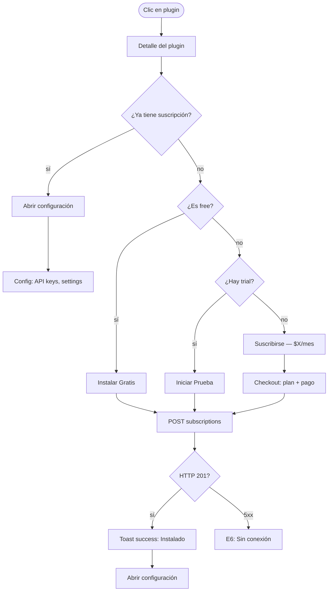

# FRD · M26 — SOLMI Marketplace (Integraciones y Plugins)

> **Módulo no implementado.** Comportamiento TARGET basado en marketplaces de software hotelero (Cloudbeds Marketplace, SiteMinder App Store, Mews Marketplace). Sigue molde de `M01-PMS-Central.md`.

**Módulo:** M26 — SOLMI Marketplace
**Estado:** 🔴 No implementado
**Fecha:** 2026-06-19
**Pantallas:** Catálogo · Detalle Plugin · Configuración · Mi Suscripción · Desarrolladores · Reviews · Analytics
**Backend target:** módulos `marketplace`, `plugins`, `subscriptions`, `reviews`, `developer-portal`

---

## 1. Propósito

M26 es un marketplace de integraciones y complementos donde los hoteles pueden descubrir, instalar, y gestionar plugins de terceros y módulos propios de SOLMI que extienden la funcionalidad base. Incluye categorías como: channel managers, payment gateways, PMS integrations, CRM tools, analytics, IoT/smart rooms, housekeeping robots, revenue management, y más. Los desarrolladores pueden publicar sus propias integraciones siguiendo la API de SOLMI (M22).

---

## 2. Modelo de datos (target)

### 2.1 Plugins (`marketplace_plugins`)

| Columna | Tipo | Descripción |
|---------|------|-------------|
| `id` | UUID | PK |
| `developer_id` | UUID | FK → marketplace_developers |
| `name` | VARCHAR(200) | Nombre del plugin |
| `slug` | VARCHAR(200) | URL-friendly |
| `tagline` | VARCHAR(300) | Descripción corta |
| `description` | TEXT | Descripción completa (markdown) |
| `category` | ENUM | `channel_manager` · `payment` · `pms_integration` · `crm` · `analytics` · `iot` · `housekeeping` · `revenue` · `marketing` · `communication` · `security` · `other` |
| `type` | ENUM | `integration` · `plugin` · `addon` · `theme` · `automation` |
| `pricing_model` | ENUM | `free` · `monthly` · `per_booking` · `per_property` · `one_time` |
| `price` | DECIMAL(10,2) | Precio base (0 si free) |
| `currency` | VARCHAR(3) | USD, EUR, etc. |
| `trial_days` | INTEGER | Días de prueba gratis (NULL = sin prueba) |
| `icon_url` | VARCHAR(500) | Icono del plugin |
| `screenshots` | JSONB | URLs de screenshots |
| `video_url` | VARCHAR(500) | Demo video |
| `website_url` | VARCHAR(500) | Sitio del desarrollador |
| `support_url` | VARCHAR(500) | Soporte del desarrollador |
| `docs_url` | VARCHAR(500) | Documentación |
| `min_solmi_version` | VARCHAR(20) | Versión mínima de SOLMI requerida |
| `is_featured` | BOOLEAN | — |
| `is_verified` | BOOLEAN | Verificado por SOLMI |
| `total_installs` | INTEGER | — |
| `avg_rating` | DECIMAL(2,1) | — |
| `reviews_count` | INTEGER | — |
| `status` | ENUM | `draft` · `pending_review` · `approved` · `rejected` · `suspended` · `archived` |
| `created_at` | TIMESTAMP | — |
| `updated_at` | TIMESTAMP | — |

### 2.2 Desarrolladores (`marketplace_developers`)

| Columna | Tipo | Descripción |
|---------|------|-------------|
| `id` | UUID | PK |
| `user_id` | UUID | FK → users (cuenta SOLMI) |
| `company_name` | VARCHAR(200) | — |
| `company_website` | VARCHAR(500) | — |
| `description` | TEXT | Sobre la empresa/desarrollador |
| `logo_url` | VARCHAR(500) | — |
| `is_verified` | BOOLEAN | — |
| `payout_method` | ENUM | `bank_transfer` · `paypal` · `stripe` |
| `payout_details` | JSONB | Datos de payout encriptados |
| `total_earnings` | DECIMAL(12,2) | — |
| `plugins_count` | INTEGER | — |
| `created_at` | TIMESTAMP | — |

### 2.3 Suscripciones (`marketplace_subscriptions`)

| Columna | Tipo | Descripción |
|---------|------|-------------|
| `id` | UUID | PK |
| `hotel_id` | UUID | FK → hotels |
| `plugin_id` | UUID | FK → marketplace_plugins |
| `status` | ENUM | `active` · `trialing` · `past_due` · `cancelled` · `expired` |
| `plan` | ENUM | `free` · `starter` · `pro` · `enterprise` |
| `price_paid` | DECIMAL(10,2) | — |
| `billing_cycle` | ENUM | `monthly` · `yearly` · `one_time` |
| `trial_ends_at` | TIMESTAMP | — |
| `current_period_start` | TIMESTAMP | — |
| `current_period_end` | TIMESTAMP | — |
| `cancelled_at` | TIMESTAMP | — |
| `config` | JSONB | Configuración específica del plugin para este hotel |
| `installed_at` | TIMESTAMP | — |
| `created_at` | TIMESTAMP | — |

### 2.4 Reviews (`marketplace_reviews`)

| Columna | Tipo | Descripción |
|---------|------|-------------|
| `id` | UUID | PK |
| `plugin_id` | UUID | FK → marketplace_plugins |
| `hotel_id` | UUID | FK → hotels |
| `user_id` | UUID | FK → users |
| `rating` | INTEGER | 1-5 |
| `title` | VARCHAR(200) | — |
| `comment` | TEXT | — |
| `response_from_developer` | TEXT | — |
| `responded_at` | TIMESTAMP | — |
| `is_verified_install` | BOOLEAN | — |
| `helpful_count` | INTEGER | — |
| `created_at` | TIMESTAMP | — |

### 2.5 Configuración de Plugin (`marketplace_plugin_configs`)

| Columna | Tipo | Descripción |
|---------|------|-------------|
| `id` | UUID | PK |
| `plugin_id` | UUID | FK → marketplace_plugins |
| `hotel_id` | UUID | FK → hotels |
| `config_data` | JSONB | Configuración del plugin (API keys, settings) |
| `is_active` | BOOLEAN | — |
| `last_sync_at` | TIMESTAMP | Última sincronización |
| `sync_status` | ENUM | `ok` · `error` · `pending` |
| `error_log` | TEXT | Último error de sincronización |
| `created_at` | TIMESTAMP | — |
| `updated_at` | TIMESTAMP | — |

### 2.6 Instalaciones / Uso (`marketplace_usage`)

| Columna | Tipo | Descripción |
|---------|------|-------------|
| `id` | UUID | PK |
| `subscription_id` | UUID | FK → marketplace_subscriptions |
| `event_type` | ENUM | `api_call` · `webhook` · `sync` · `action` |
| `event_data` | JSONB | Detalle del evento |
| `created_at` | TIMESTAMP | — |

---

## 3. Pantalla — Catálogo (`/panel/marketplace`)

### 3.1 Decision Table

| Trigger | Condición | Resultado | Modal/Toast (texto) | Errores | Notif F5 |
|---------|-----------|-----------|----------------------|---------|----------|
| Clic en **"Marketplace"** | — | Grid de plugins: featured arriba, luego por categoría, con búsqueda | — | — | — |
| Filtro por categoría | — | Filtra: channel_manager, payment, analytics, etc. | — | — | — |
| Filtro por pricing (Free / From $X) | — | Filtra por modelo de precio | — | — | — |
| Filtro **"Solo Verificados"** | — | Solo plugins con is_verified = true | — | — | — |
| Búsqueda por nombre/descripción | — | Búsqueda full-text | — | — | — |
| Ordenar por: Popular / Rating / Nuevo / Precio | — | Reordena el grid | — | — | — |
| Clic en plugin | — | Abre detalle: descripción, screenshots, pricing, reviews, instalaciones | — | — | — |
| **"Instalar Gratis"** | plugin free, hotel no tiene suscripción | POST subscriptions | **Toast success:** "Plugin '{nombre}' instalado. Configuralo en Ajustes." | E6 | — |
| **"Iniciar Prueba"** | plugin de pago, sin suscripción activa, trial_days > 0 | POST subscriptions status=trialing | **Toast success:** "Prueba de {días} días iniciada para '{nombre}'." | E2 "Ya tenés una suscripción a este plugin" · E6 | — |
| **"Suscribirse — $X/mes"** | sin suscripción o trial expirado | Abre checkout: selección de plan, pago | **Toast success:** "Suscripción a '{nombre}' activa." | E2 "Error en el pago" · E6 | — |
| **"Cancelar Suscripción"** | suscripción activa | **Modal danger:** "¿Cancelar '{nombre}'? Perderás acceso al final del periodo." | Modal danger | E6 | — |
| **"Configurar"** (plugin instalado) | — | Abre pantalla de configuración específica del plugin | — | — | — |
| **"Desinstalar"** (plugin instalado) | — | **Modal danger:** "¿Desinstalar '{nombre}'? Se eliminarán los datos de configuración." | Modal danger | E6 | — |

### 3.2 Flow — Instalar Plugin

---

## 4. Pantalla — Detalle Plugin (`/panel/marketplace/:slug`)

### 4.1 Decision Table

| Trigger | Condición | Resultado | Modal/Toast (texto) | Errores | Notif F5 |
|---------|-----------|-----------|----------------------|---------|----------|
| Abrir detalle | — | Tabs: Descripción · Screenshots · Pricing · Reviews · Docs | — | — | — |
| Tab **"Descripción"** | — | Markdown renderizado, features list, compatibility | — | — | — |
| Tab **"Screenshots"** | — | Gallery de imágenes + video demo | — | — | — |
| Tab **"Pricing"** | — | Tabla de planes: Free, Starter ($X/mes), Pro ($Y/mes), Enterprise (custom) | — | — | — |
| Tab **"Reviews"** | — | Rating promedio, distribución de estrellas, lista de reviews con respuesta del dev | — | — | — |
| Tab **"Docs"** | — | Link a documentación externa | — | — | — |
| **"Escribir Review"** | hotel tiene suscripción activa | Form: rating 1-5, título, comentario | — | — | — |
| **"Enviar Review"** | rating + comentario | POST marketplace_reviews | **Toast success:** "Review publicada." | E6 | — |
| **"Marcar como Útil"** (review) | — | Incrementa helpful_count | — | — | — |

---

## 5. Pantalla — Mis Suscripciones (`/panel/marketplace/subscriptions`)

### 5.1 Decision Table

| Trigger | Condición | Resultado | Modal/Toast (texto) | Errores | Notif F5 |
|---------|-----------|-----------|----------------------|---------|----------|
| **"Mis Suscripciones"** | — | Lista de plugins instalados: nombre, estado, precio, próximo cobro | — | — | — |
| Filtro por estado | — | Filtra: active, trialing, past_due, cancelled | — | — | — |
| Clic en suscripción | — | Detalle: plan actual, facturación, uso (API calls), config | — | — | — |
| **"Cambiar Plan"** | — | Selector de planes disponibles | — | — | — |
| **"Confirmar Cambio"** | plan nuevo seleccionado | PATCH subscription | **Toast success:** "Plan cambiado a {nuevo_plan}. Ajuste de precio en el próximo ciclo." | E2 "El plan seleccionado no está disponible" · E6 | — |
| **"Actualizar Método de Pago"** | — | Form: nueva tarjeta o método | — | — | — |
| **"Ver Facturas"** | — | Lista de facturas de suscripciones | — | — | — |
| **"Reactivar"** | suscripción cancelled/expired | status → active | **Toast success:** "Suscripción reactivada." | E6 | — |

---

## 6. Pantalla — Configuración de Plugin (`/panel/marketplace/:slug/config`)

### 6.1 Decision Table

| Trigger | Condición | Resultado | Modal/Toast (texto) | Errores | Notif F5 |
|---------|-----------|-----------|----------------------|---------|----------|
| Abrir configuración | — | Form dinámico según el plugin (API keys, webhooks, settings) | — | — | — |
| Ingresar API Key | — | Validación en tiempo real contra el servicio del plugin | — | E1 "API Key inválida. Verificá con tu proveedor." | — |
| **"Guardar Configuración"** | datos válidos | POST plugin_configs | **Toast success:** "Configuración de '{plugin}' guardada." | E6 | — |
| **"Probar Conexión"** | config guardada | Ejecuta health check contra el servicio | **Toast success:** "Conexión exitosa con {plugin}." / **Toast error:** "No se pudo conectar. Verificá las credenciales." | E6 | — |
| Toggle **"Activo/Inactivo"** | — | PATCH is_active | **Toast success:** "{plugin} activado/desactivado." | E6 | — |
| **"Sincronizar Ahora"** | plugin activo | Fuerza sync de datos | **Toast success:** "Sincronización completada." / **Toast error:** "Error en sincronización: {detalle}." | E6 | — |
| **"Ver Logs"** | — | Lista de eventos de uso (API calls, errors, syncs) | — | — | — |
| **"Desinstalar"** | — | **Modal danger:** "¿Desinstalar '{plugin}'? Se eliminarán configuración y datos." | Modal danger | E6 | — |

---

## 7. Pantalla — Portal de Desarrolladores (`/panel/marketplace/developer`)

### 7.1 Decision Table

| Trigger | Condición | Resultado | Modal/Toast (texto) | Errores | Notif F5 |
|---------|-----------|-----------|----------------------|---------|----------|
| **"Registrarse como Desarrollador"** | usuario sin developer profile | Form: empresa, website, descripción, logo, payout method | — | — | — |
| **"Enviar Solicitud"** | datos completos | POST marketplace_developers | **Toast success:** "Solicitud enviada. Revisaremos tu perfil." | E6 | — |
| **"Mi Dashboard"** | developer verificado | KPIs: plugins publicados, instalaciones totales, earnings, reviews | — | — | — |
| **"+ Nuevo Plugin"** | developer verificado | Wizard: info → pricing → assets → submit | — | — | — |
| **"Enviar para Revisión"** | plugin completo | status → pending_review | **Toast success:** "Plugin enviado para revisión. Recibirás una notificación." | E2 "Faltan campos requeridos" · E6 | — |
| **"Ver Earnings"** | — | Gráfico de ingresos por mes, pagos recibidos, próximo payout | — | — | — |
| **"Configurar Payout"** | — | Form: método de pago, datos bancarios | — | — | — |
| **"Responder Review"** | — | Form: respuesta pública al review del usuario | **Toast success:** "Respuesta publicada." | E6 | — |

---

## 8. Consecuencias cross-módulo

| Acción en M26 | Módulo afectado | Efecto | Notif F5 |
|---------------|-----------------|--------|----------|
| Plugin de channel manager instalado | Channel Manager (M02) | Nueva integración disponible para configurar | "Nuevo plugin: {nombre} listo para configurar" |
| Plugin de payment instalado | Cobros (M13) | Nuevo método de pago disponible | — |
| Plugin de analytics instalado | BI (M16) | Nuevas métricas/data sources | — |
| Plugin de housekeeping instalado | Housekeeping (M07) | Nuevas funcionalidades de gestión | — |
| Plugin de IoT instalado | Smart Rooms | Control de habitaciones inteligentes | — |
| API key configurada | API (M22) | Conexión activa con servicio externo | — |
| Plugin de revenue instalado | Revenue (M12) | Algoritmos de pricing dinámico | — |
| Review publicada | — | Actualizar avg_rating del plugin | — |
| Suscripción cancelada | — | Plugin se desactiva al final del periodo | "Suscripción a {plugin} se cancelará el {fecha}" |

---

## 9. Gap analysis

| # | Gap | Severidad | Descripción |
|---|-----|-----------|-------------|
| G1 | Módulo completo no existe | 🔴 BLOCKER | No hay marketplace, catálogo, ni backend |
| G2 | Sin catálogo de plugins | 🔴 BLOCKER | No hay estructura de plugins ni listings |
| G3 | Sin sistema de suscripciones | 🔴 BLOCKER | No hay billing ni planes |
| G4 | Sin portal de desarrolladores | 🔴 CRÍTICO | No hay developer portal ni publicación |
| G5 | Sin reviews/ratings | 🟡 ALTO | No hay opiniones de usuarios |
| G6 | Sin configuración de plugins | 🟡 ALTO | No hay forms dinámicos de config |
| G7 | Sin verificación de plugins | 🟡 ALTO | No hay proceso de review/approval |
| G8 | Sin pagos a desarrolladores | 🟠 MEDIO | No hay sistema de revenue share |
| G9 | Sin analytics de uso | 🟠 MEDIO | No hay tracking de API calls por plugin |
| G10 | Sin SDK de desarrolladores | 🟠 MEDIO | No hay herramientas para crear plugins |

---

## 10. Checklist de verificación M26

### Catálogo
- [ ] Grid de plugins con búsqueda y filtros
- [ ] Categorías funcionales
- [ ] Filtro por pricing (free/pago)
- [ ] Filtro por verificados
- [ ] Ordenar por popularidad/rating/nuevo
- [ ] Featured plugins destacados
- [ ] Paginación

### Detalle Plugin
- [ ] Tabs: descripción, screenshots, pricing, reviews, docs
- [ ] Gallery de imágenes
- [ ] Video demo
- [ ] Tabla de planes
- [ ] Reviews con respuesta del desarrollador

### Instalación y Suscripción
- [ ] Instalar plugin gratis
- [ ] Iniciar trial de pago
- [ ] Checkout con método de pago
- [ ] Cancelar suscripción (modal danger)
- [ ] Reactivar suscripción
- [ ] Cambiar plan
- [ ] Ver historial de facturas

### Configuración
- [ ] Form dinámico según plugin
- [ ] Validación de API keys
- [ ] Probar conexión
- [ ] Activar/desactivar plugin
- [ ] Sincronizar datos
- [ ] Ver logs de uso

### Portal de Desarrolladores
- [ ] Registro de desarrollador
- [ ] Dashboard de earnings
- [ ] Publicar plugin nuevo
- [ ] Enviar para revisión
- [ ] Responder reviews
- [ ] Configurar payout

### Cross-módulo
- [ ] Instalación crea integración en módulo correspondiente
- [ ] Actualiza M22 (API) con nuevas conexiones
- [ ] Reviews actualizan rating del plugin
- [ ] Suscripciones generan facturas en M13
- [ ] Notificaciones F5 en eventos clave

---

*Documento generado como target. Todo está pendiente de implementación.*
