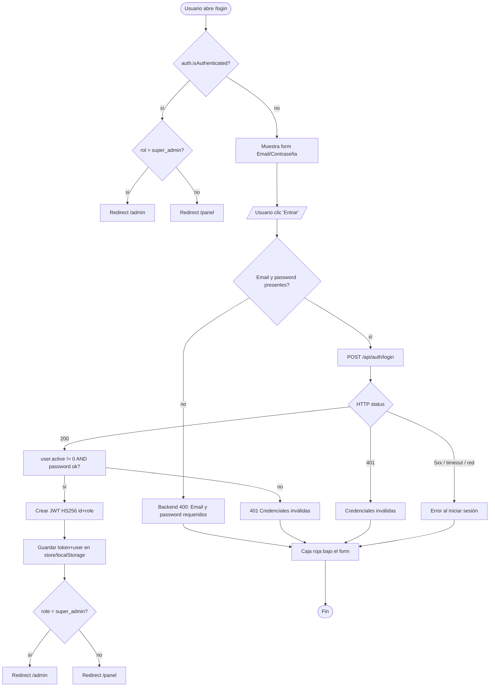
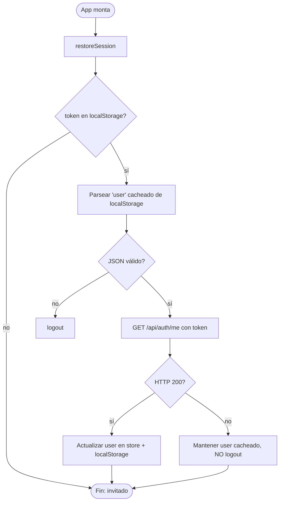
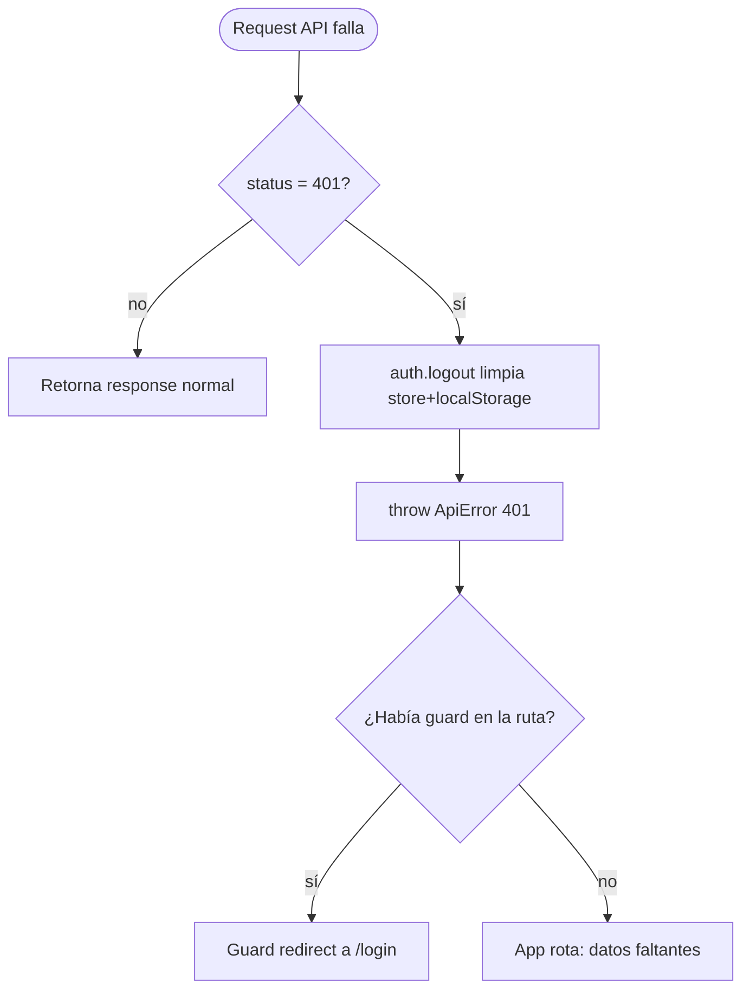
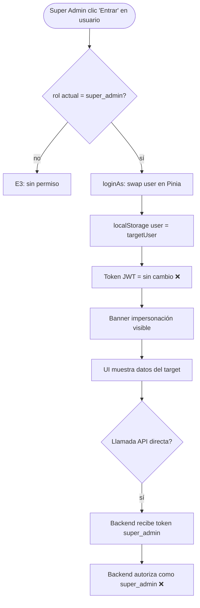
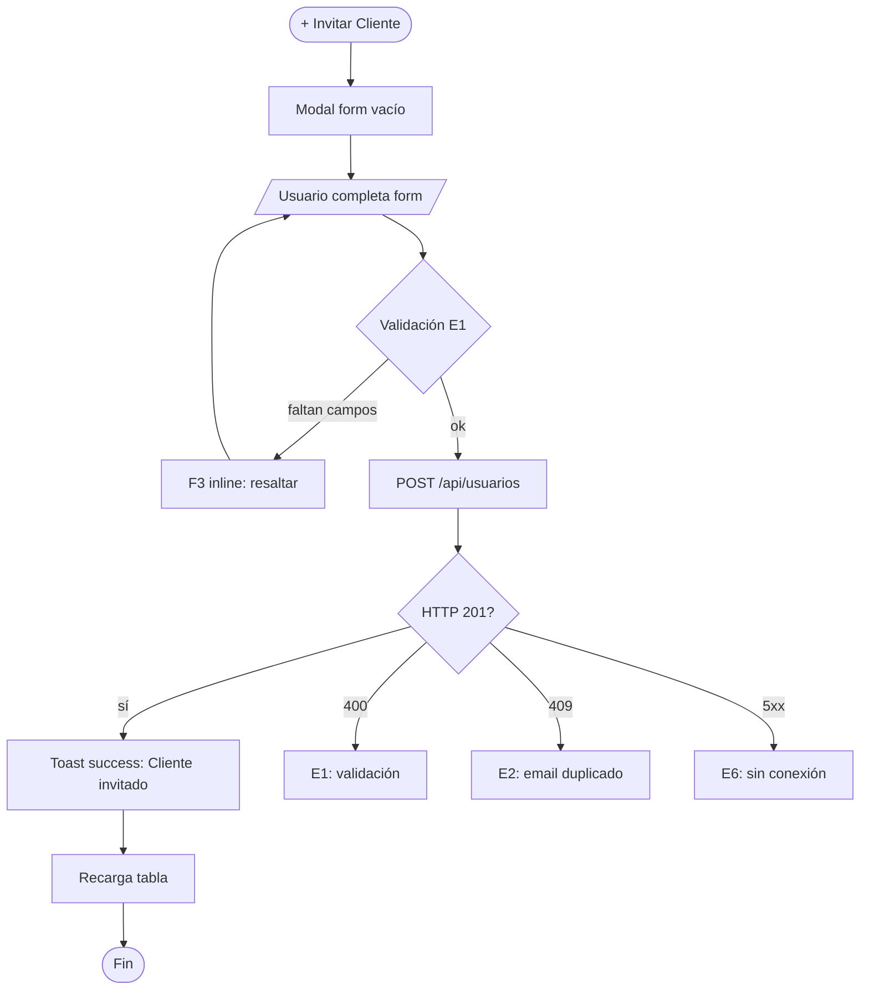

# FRD · T0 — Auth / Login (Sección Transversal)

> **Sección transversal.** T0 no es un módulo de negocio: es la capa de identidad de la que dependen TODOS los módulos (M01–M26). Documenta login, sesión, roles, guards del router y impersonación del super-admin.
>
> Todo lo documentado acá está **extraído del código real**: backend `composition-root.ts`, módulo `usuarios`, `arckode-framework/kernel/auth.ts` + `adapters/jwt.ts`; frontend `pages/auth/login.vue`, `stores/auth.store.ts`, `services/Auth.service.ts`, `services/http.ts`, `router/index.ts`. La columna "Gap" marca lo que hoy NO cumple el modelo canónico (`00-MASTER.md`).

**Módulo:** T0 — Auth / Login
**Estado:** Parcialmente implementado
**Fecha:** 2026-06-19 · **Última actualización:** 2026-06-19
**Pantallas cubiertas:** Login (`/login`) · Guards del router · Restore de sesión · Impersonación (super-admin) · Logout
**Servicios frontend:** `Auth.service.ts`, `http.ts` (interceptor 401)
**Servicios backend:** módulo `usuarios` (login, me) · `Auth` (kernel) · `jwtTokenAdapter`

---

## 1. Modelo de datos (fuente de verdad)

### 1.1 Tabla `users` (modelo ORM)

Fuente: `backend/src/modules/usuarios/model.ts`

| Campo | Tipo | Req | Default | Notas |
|-------|------|-----|---------|-------|
| `id` | string | sí | — | `crypto.randomUUID()` |
| `name` | string | sí | — | Nombre completo |
| `email` | string | sí | — | `unique`, `indexed`. Es la clave de login |
| `password` | string | sí | — | Hasheado **bcrypt** vía `Bun.password.hash` (ver §1.4) |
| `role` | string | — | `hotel_admin` | Ver §1.2 |
| `hotelId` | string | — | — | `indexed`. Multi-tenant |
| `active` | number | — | `1` | `0` = inactivo → bloquea login |
| `token` | string | — | — | Se persiste el último JWT emitido |
| `avatar` / `phone` | string | — | — | Opcionales |

### 1.2 Tabla `roles`

Fuente: `backend/src/migrations/1781807164200_create_roles.ts`

| Campo | Tipo | Req | Default | Notas |
|-------|------|-----|---------|-------|
| `id` | string | sí | — | UUID |
| `name` | string | sí | — | Nombre del rol |
| `icon` | string | — | `'👤'` | Emoji del rol |
| `color` | string | — | — | Clase CSS |
| `system` | number | — | `0` | `1` = rol de sistema (no borrable) |
| `hotelId` | string | — | — | `null` = rol global de plataforma |
| `permissions` | string | — | `'[]'` | JSON array de permisos |
| `users` | number | — | `0` | Conteo de usuarios con este rol |

### 1.3 Roles activos (`user.role`)

Fuente: `composition-root.ts` (rutas `auth.authenticate(...)`), `router/index.ts` (guards `meta.requires*`).

| Rol | Label UI (`login.vue:67`) | Acceso base | Roles que lo ven |
|-----|--------------------------|-------------|------------------|
| `super_admin` | Super Admin | `/admin` (plataforma multi-hotel) | — |
| `hotel_admin` | Hotel Admin | `/panel` (todos los sub-módulos del hotel) | super_admin (vía impersonación) |
| `receptionist` | Recepcionista | `/panel` (sub-set: dashboard, reservations, rooms, guests, support, checkin) | super_admin |

**Matriz de acceso por ruta:**

| `meta` guard | Rutas | ¿Quién pasa? |
|-------------|-------|--------------|
| `requiresSuperAdmin` | `/admin` y todas sus hijas | solo `super_admin` (`impersonating` también pasa) |
| `requiresHotelAuth` | `/panel` (layout) | `hotel_admin`, `receptionist`, y `super_admin` **sólo si `impersonating`** |
| `requiresHotelAdmin` | `/panel/reports`, `housekeeping`, `maintenance`, `night-audit`, `groups`, `opiniones`, `gastos`, `settings`, `booking-engine`, `packages`, `planning`, `channel-manager`, `channel/:id`, `devices` | `super_admin` o `hotel_admin` |
| `layout: 'none'` | `/`, `/login` | público |

### 1.4 Hasheo de password

Fuente: `backend/src/modules/usuarios/service.ts:54-62`.

| Operación | Implementación real | Notas |
|-----------|---------------------|-------|
| Hash al crear/editar | `Bun.password.hash(p, 'bcrypt')` (`service.ts:55`) | **bcrypt** vía runtime Bun |
| Verificar en login | soporta `$2*` (bcrypt) y `$argon2*` vía `Bun.password.verify`; **fallback a texto plano** `stored === plain` (`service.ts:58-61`) | El fallback plano es un riesgo |
| Migración lazy | si el hash no empieza con `$2`/`$argon2`/no contiene `:`, se re-hashea como bcrypt y persiste (`service.ts:21-23`) | Convierte legacy plano → bcrypt en el próximo login exitoso |

> ⚠ **INCONSISTENCIA (Gap #3):** el `Auth` del framework (`kernel/auth.ts:95-113`) expone `hashPassword`/`comparePassword` basados en **scrypt** (`salt:hash` con `:`), PERO el módulo `usuarios` **no los usa** — implementa los suyos con bcrypt. Coexisten dos estrategias de hashing. El fallback a texto plano (`service.ts:61`) debilita la seguridad.

### 1.5 Payload del JWT

Fuente: `arckode-framework/kernel/auth.ts:23-28` + `adapters/jwt.ts:11,18`.

```json
{ "id": "<userId>", "role": "<super_admin|hotel_admin|receptionist>", "type": "access" }
```

| Claim | Origen | Notas |
|-------|--------|-------|
| `id` | `user.id` | Identidad |
| `role` | `user.role` | Único mecanismo de autorización en el token |
| `type` | fijo `access` | El middleware rechaza tokens con `type !== 'access'` (`auth.ts:58`) |

**Configuración del token** (`composition-root.ts:14-17`):

| Variable | Default | Uso |
|----------|---------|-----|
| `JWT_SECRET` | (requerido) | Llave HMAC-SHA256 |
| `JWT_EXPIRES` | `24h` | TTL access token |
| `JWT_REFRESH_EXPIRES` | `7d` | TTL refresh token (**definido pero NO usado**) |

**Algoritmo:** `HS256` (HMAC-SHA256). Firma en `adapters/jwt.ts:11`, verificación con whitelist `algorithms: ['HS256']` en `:18` (mitiga algorithm-confusion).

> ⚠ **INCONSISTENCIA (Gap #1):** el payload **NO contiene `hotelId`**. El scope multi-tenant se resuelve en runtime en `hotelOf()` (`composition-root.ts:97-103`): query `?hotelId=` → `req.user.hotelId` → fallback al primer hotel. Pero `req.user` sólo trae `{ id, role }` del JWT (`auth.ts:79`), así que `req.user.hotelId` es `undefined` salvo que venga por query.

### 1.6 Respuesta de login (contrato backend → frontend)

`POST /api/auth/login` → 200 (`controller.ts:12-13`):

```json
{ "token": "<jwt>", "user": { "id": "...", "nombre": "...", "email": "...", "role": "...", "hotelId": "..." } }
```

> El backend retorna la key **`nombre`** (no `name`) con el valor de `user.name` (`service.ts:26`). El frontend lo mapea con `name: raw.nombre` (`Auth.service.ts:30`).
> El endpoint `GET /api/auth/me` devuelve el mismo shape pero **sin `hotelName`** (`service.ts:33`), por lo que tras un `restoreSession` el `currentHotel` queda vacío.

---

## 2. Pantalla — Login (`/login`)

Fuente: `frontend/src/pages/auth/login.vue`.

Card centrada con logo `M` (gradiente navy→blue), título "ManagerHotel" y subtítulo "Hospitality OS · LATAM". Formulario Email/Contraseña + bloque "Cuentas Demo".

### 2.1 Decision Table

| Trigger | Condición / Estado previo | Resultado | Modal/Toast (texto literal) | Errores posibles (códigos) | Notif F5 |
|---------|---------------------------|-----------|------------------------------|-----------------------------|----------|
| Cargar `/login` estando autenticado | `auth.isAuthenticated = true` | Redirect automático | — | — | — |
| ↳ si rol `super_admin` Y `!impersonating` | ídem | Redirect a `/admin` (`router/index.ts:230`) | — | — | — |
| ↳ si otro rol | ídem | Redirect a `/panel` (`router/index.ts:233`) | — | — | — |
| Input **Email** vacío + submit | campo vacío | Navegador bloquea (`required`, `type=email`) | — | E1 implícito (HTML nativo, no F3 inline propio) | — |
| Input **Contraseña** vacía + submit | campo vacío | Navegador bloquea (`required`) | — | E1 (HTML nativo) | — |
| Botón **"Entrar"** (idle) / **"Entrando..."** (loading) | email+password presentes | `auth.login()` → POST `/auth/login` | Botón loading F6 (spinner + `disabled` + opacidad). **Sin toast success** | E1 "Email y password requeridos" · E2 "Credenciales inválidas" · E6 "Sin conexión" | — |
| Login exitoso (HTTP 200) | credenciales válidas, `user.active !== 0` | Guarda `token`+`user` en store y localStorage; redirect por rol | **Target:** Toast success F1 "Sesión iniciada." **Hoy: nada** (solo redirect) | — | — |
| Login fallido (HTTP 401) | email no existe / password inválida / `active === 0` | Sin redirect; `error.value = e.message` | Caja roja `bg-red/10` bajo el form: `"Credenciales inválidas"` (texto del `AuthError`, `service.ts:17,19`). **No es F1 toast ni F3 inline** | E2 (mapeado como credenciales inválidas) | — |
| Login fallido (HTTP 400) | falta email o password | Sin redirect | Caja roja: `"Email y password requeridos"` (`controller.ts:10`) | E1 | — |
| Login fallido (red caída / 5xx) | sin conexión | `error.value = 'Error al iniciar sesión'` (`login.vue:104`) | Caja roja genérica. **No es E6 canónico** | E6 | — |
| Clic en cuenta Demo (bloque "Cuentas Demo") | `onMounted` cargó `/api/public/users` | Precarga `email`+`password='demo123'` y dispara `handleLogin` (`login.vue:110-114`) | — | mismos que login | — |

> **Labels EXACTOS en pantalla:** título `<h2>` **"Iniciar Sesión"** · label **"Email"** · label **"Contraseña"** · botón **"Entrar"** (idle) / **"Entrando..."** (loading) · bloque **"Cuentas Demo"**.

**Gaps actuales (Login):**
- ❌ El éxito **no muestra toast** (sólo redirige) → falta F1 success.
- ❌ El error se muestra en una **caja roja de card** (`bg-red/10`), no en Toast F1 ni en Inline F3 — no encaja en ninguna de las 6 categorías canónicas del master.
- ❌ El mensaje de error de red es genérico `"Error al iniciar sesión"` → debe ser E6.
- ❌ Inputs **precargados** con `admin@managerhotel.com` / `demo123` (`login.vue:62-63`) — inaceptable en producción.
- ❌ `GET /api/public/users` **sin auth** expone `{name, email, role}` de todos los usuarios para alimentar "Cuentas Demo" (`composition-root.ts:399-405`) — Gap de seguridad crítico.

### 2.2 Flow — Login completo



### 2.3 Flow — Restore de sesión (al recargar la app)



> ⚠ **Gap #4:** ante un 401 en `/auth/me`, el store **no hace logout** (`auth.store.ts:48-50`). El token expirado queda en cada request posterior → `http.ts:27-31` fuerza logout disperso.

---

## 3. Sesion · Expiración · 401

### 3.1 Decision Table

| Trigger | Condición | Resultado | Modal/Toast | Errores | Notif F5 |
|---------|-----------|-----------|-------------|---------|----------|
| Cualquier request API devuelve **HTTP 401** | token ausente, inválido o expirado | Interceptor `http.ts:27-31` → `auth.logout()` + `throw ApiError(401, 'Sesión expirada')` | **Target:** Toast info F1 "Tu sesión expiró. Volvé a ingresar." + redirect `/login`. **Hoy:** logout silencioso, **sin toast ni redirect** | 401 → sesión expirada | — |
| Token expirado pero refresh disponible | — | **No aplica:** refresh NO está cableado (Gap #2) | — | — | — |

**Gaps (sesión):**
- ❌ El interceptor 401 hace `logout()` pero **no redirige a `/login`** ni tira toast.
- ❌ **No hay refresh token en uso** pese a existir `Auth.createRefreshToken()`/`Auth.refresh()` en el framework y la config `JWT_REFRESH_EXPIRES=7d`. El login sólo emite access token (`service.ts:24`).
- ❌ **No hay endpoint `/auth/logout`** — el logout es 100% cliente. El token sigue válido en el server hasta expirar (24h) y queda persistido en `users.token` (`service.ts:25`).

### 3.2 Flow — Interceptor 401



---

## 4. Pantalla — Logout

### 4.1 Decision Table

| Trigger | Condición | Resultado | Modal/Toast | Errores | Notif F5 |
|---------|-----------|-----------|-------------|---------|----------|
| Botón logout (icono flecha, `AdminLayout.vue:57` / `SuperAdminLayout.vue:49`) | sesión activa | `auth.logout()` limpia store + localStorage (`auth.store.ts:67-74`) | **Target:** Toast success F1 "Sesión cerrada." **Hoy:** sin feedback; redirect llega al topar con guard | — | — |
| Logout con sesión ya caída (token expirado) | 401 previo ya hizo logout | `logout()` idempotente | — | — | — |

**Gaps (logout):**
- ❌ **No hay endpoint `/auth/logout`** — el token queda válido hasta su expiración y persistido en `users.token`.
- ❌ El botón es **solo icono**, sin `aria-label` ni `title` — problema de accesibilidad.
- ❌ Sin toast de confirmación.

---

## 5. Impersonación (super-admin)

Fuente: `stores/auth.store.ts:53-65`, `pages/super-admin/users.vue:348-362`, `layouts/AdminLayout.vue:4-9`.

### 5.1 Decision Table

| Trigger | Condición | Resultado | Modal/Toast | Errores | Notif F5 |
|---------|-----------|-----------|-------------|---------|----------|
| Botón **"Entrar"** en fila de usuario (`/admin/users`) | usuario activo, no es super_admin; rol actual `super_admin` | `auth.loginAs(targetUser)`, `router.push('/')` (`users.vue:360-361`) | Banner naranja fijo top (z-50): "Modo impersonación..." **Sin toast success** | E3 si el caller no es super_admin (`auth.store.ts:54` rechaza silenciosamente) | — |
| `loginAs` ejecutado por no-super_admin | `!isSuperAdmin` | `return` silencioso (`auth.store.ts:54`) | **Nada** — el botón debería ocultarse | E3 (no notificado) | — |
| Botón **"✕ Volver a Super Admin"** (banner) | `impersonating = true` Y `originalUser` set | Restaura `originalUser`, `impersonating=false`, redirect `/admin` | Banner se oculta. **Sin toast** | — | — |
| Logout mientras se impersona | `impersonating = true` | `logout()` limpia `originalUser` + `impersonating` | — | — | — |

> ⚠ **Gap #5 (CRÍTICO):** la impersonación es **100% frontend**. `loginAs` sólo swapea `user.value` en Pinia y localStorage; **no intercambia el token JWT** (`auth.store.ts:53-58`). El `Authorization: Bearer <token>` sigue siendo el del super_admin → el backend autoriza con rol `super_admin`, no con el del usuario impersonado. La "impersonación" actual es **cosmética**: cambia lo que el UI muestra pero no reduce privilegios en el servidor.
>
> ⚠ **Gap #5b:** durante la impersonación, `canAccessSuperAdmin` se apaga pero el token real sigue siendo super_admin → un admin podría llamar a `/api/admin/*` directamente y pasar. Inseguro.

### 5.2 Flow — Impersonación



---

## 6. Pantalla — Gestión de usuarios (`/admin/users`)

Fuente: `frontend/src/pages/super-admin/users.vue`.

Vista de super-admin para gestionar clientes/propietarios de hoteles. Tabla paginada con filtros, métricas y acciones CRUD.

### 6.1 Decision Table

| Trigger | Condición | Resultado | Modal/Toast | Errores | Notif F5 |
|---------|-----------|-----------|-------------|---------|----------|
| Botón **"+ Invitar Cliente"** | — | Abre modal form para crear usuario | Modal `form`: "Invitar Cliente" | — | — |
| **"Crear"** válido (form completo) | nombre, email, password presentes | POST `/api/usuarios` → hashea password → crea en BD | **Toast success:** "Cliente {nombre} invitado." | E1 "Campo obligatorio" · E2 "Email ya registrado" · E6 | — |
| Clic en fila de usuario | — | Abre modal detail o form de edición | Modal `form`: "Editar Cliente" | — | — |
| **"Guardar"** (edición) | form válido | PUT `/api/usuarios/:id` | **Toast success:** "Cliente {nombre} actualizado." | E5 conflicto · E6 | — |
| Botón **"Entrar"** en fila (impersonar) | super_admin logueado | `loginAs` → redirect home | Banner impersonación | E3 si no es super_admin | — |
| Botón **"Exportar"** | — | Descarga CSV de usuarios | — | — | — |
| Filtros (buscar, rol, hotel, estado) | — | Filtra la tabla | — | — | — |

### 6.2 Flow — Crear usuario



---

## 7. Endpoints — API completa de Auth

### 7.1 Rutas del módulo `usuarios`

Fuente: `backend/src/modules/usuarios/index.ts:32-40`.

| Método | Path | Auth requerido | Roles permitidos | Controller | Notas |
|--------|------|---------------|------------------|------------|-------|
| `POST` | `/api/auth/login` | **No** (público) | — | `login(req)` | Emite JWT |
| `GET` | `/api/auth/me` | Sí | `hotel_admin`, `receptionist`, `super_admin` | `me(req)` | Self-lookup por `req.user.id` |
| `GET` | `/api/usuarios` | Sí | `hotel_admin`, `super_admin` | `index(req)` | Lista usuarios del hotel |
| `POST` | `/api/usuarios` | Sí | `hotel_admin`, `super_admin` | `store(req)` | Crea usuario |
| `PUT` | `/api/usuarios/:id` | Sí | `hotel_admin`, `super_admin` | `update(req)` | Actualiza usuario |
| `DELETE` | `/api/usuarios/:id` | Sí | `hotel_admin`, `super_admin` | `destroy(req)` | Elimina usuario |

### 7.2 Endpoint público (fuera del módulo)

Fuente: `composition-root.ts:399-405`.

| Método | Path | Auth | Notas |
|--------|------|------|-------|
| `GET` | `/api/public/users` | **No** ⚠ | Expone `{name, email, role}` de todos los usuarios. alimenta "Cuentas Demo". **Riesgo de seguridad** |

### 7.3 Validadores

Fuente: `backend/src/modules/usuarios/validators/schema.ts`.

**CreateUsuarioSchema:**

| Campo | Tipo | Req | Min | Max |
|-------|------|-----|-----|-----|
| `name` | string | sí | 2 | 100 |
| `email` | string | sí | 5 | 200 |
| `password` | string | sí | 6 | 100 |
| `role` | string | no | — | — |
| `hotelId` | string | no | — | — |
| `phone` | string | no | — | — |

**UpdateUsuarioSchema:** mismos campos, todos opcionales, sin `hotelId`.

### 7.4 Contrato de respuesta de login

`POST /api/auth/login` → **200:**

```json
{
  "token": "<jwt-string>",
  "user": {
    "id": "uuid",
    "nombre": "string",
    "email": "string",
    "role": "hotel_admin",
    "hotelId": "string"
  }
}
```

`POST /api/auth/login` → **400:**

```json
{ "error": "Email y password requeridos" }
```

`POST /api/auth/login` → **401:**

```json
{ "error": "Credenciales inválidas" }
```

---

## 8. Consecuencias cross-módulo

T0 es la sección transversal: **todos los módulos M01–M26 dependen de T0**.

| Módulo consumidor | Cómo depende de T0 | Riesgo si T0 falla |
|-------------------|--------------------|--------------------|
| M01 PMS Central | `auth.authenticate('hotel_admin','receptionist','super_admin')` en `/api/checkin`, `/api/planning` | Sin token → 401 → interceptor logout |
| M02 Channel Manager | `/api/channels/*` requiere auth + rol | Sin sesión, no se sincroniza Channex |
| M07 Housekeeping / M08 Mantenimiento | rutas `requiresHotelAdmin` | Guard denegado silencioso (Gap E3) |
| M13 Billing / Folios | `/api/folios/:id/invoice` requiere `hotel_admin`/`super_admin` | Sin permiso → 403 backend |
| M23 Facturación / Night Audit | `/api/night-audit` requiere `hotel_admin`/`super_admin` | Idem |
| Plataforma super-admin | `/api/admin/*` requiere `super_admin` | Impersonación cosmética NO reduce permisos (Gap #5) |
| Cualquier módulo | `http.ts` inyecta `Authorization: Bearer <token>` en TODA request | Token expirado → cascada de 401 |

**Evento que T0 emite:** `user.created`, `user.disabled` (declarados en `contract.events`, `usuarios/index.ts:20`) — pendiente de cablear a notificaciones F5.

---

## 9. Reglas de negocio a validar en backend (E2/E3)

Clasificación de errores reales de T0 según `00-MASTER.md §5`:

| Situación real (código) | Código hoy | Código canónico | Acción |
|--------------------------|------------|-----------------|--------|
| Email o password vacíos en submit (`controller.ts:10` → 400) | 400 → E1 | **E1** validación | Mostrar F3 inline (no caja roja genérica) |
| Email no existe / password inválida / `active === 0` (`service.ts:17,19` → 401) | 401 → "caja roja" | **E2** regla de negocio (credenciales) | Toast F1 error "Credenciales inválidas" |
| Rol sin acceso a ruta protegida (`router/index.ts:247,269`) | redirect silencioso | **E3** permisos | Toast F1 "No tenés permiso para acceder a esa sección." |
| `loginAs` por no-super_admin (`auth.store.ts:54`) | return mudo | **E3** permisos | Botón debe ocultarse; si se llama, toast E3 |
| Red caída / 5xx en login (`login.vue:104`) | caja roja genérica | **E6** red/servidor | Toast "No hay conexión. Reintentá en unos segundos." |
| Token expirado en request autenticada (`http.ts:27-31` → 401) | logout silencioso | sesión expirada → redirect `/login` + Toast info "Tu sesión expiró. Volvé a ingresar." | Implementar redirect + toast |
| `users.token` con JWT filtrado / `GET /api/public/users` expone emails | no clasificado | **riesgo de seguridad** | Eliminar endpoint público; no persistir token plano |

---

## 10. Gap analysis (con file:line)

| # | Gap | Dónde (file:line) | Severidad |
|---|-----|--------------------|-----------|
| 1 | JWT payload **sin `hotelId`** → scope multi-tenant resuelto con fallback inseguro al primer hotel | `kernel/auth.ts:23-28`, `composition-root.ts:97-103` | **Alta** |
| 2 | **Refresh token no cableado**: existe en framework y config pero el login sólo emite access token | `service.ts:24`, `composition-root.ts:16`, `kernel/auth.ts:30-53` | Media |
| 3 | **Dos estrategias de hashing** (bcrypt en usuarios vs scrypt en framework) + **fallback a texto plano** | `service.ts:55-61`, `kernel/auth.ts:95-113` | **Alta** |
| 4 | `restoreSession` **no hace logout ante 401** → token expirado persiste | `auth.store.ts:48-50` | Media |
| 5 | **Impersonación cosmética**: no cambia el token → backend sigue autorizando como super_admin | `auth.store.ts:53-58`, `super-admin/users.vue:360` | **Crítica** |
| 5b | Durante impersonación, `/api/admin/*` sigue alcanzable con token real de super_admin | `auth.store.ts:18`, `composition-root.ts:349-394` | **Crítica** |
| 6 | **Recuperación/cambio de password inexistentes** (`changePassword` declarado en contract, no implementado) | `usuarios/index.ts:19` (sólo contract) | **Alta** |
| 7 | `GET /api/public/users` **sin auth** expone `{name,email,role}` de todos los usuarios | `composition-root.ts:399-405`, `login.vue:75` | **Crítica** |
| 8 | Inputs de login **precargados** con demo creds | `login.vue:62-63` | **Alta** (prod) |
| 9 | Error de login en **caja roja de card**, no encaja en F1–F6 | `login.vue:26` | Media |
| 10 | Login exitoso **sin toast** | `login.vue:96-102` | Media |
| 11 | Interceptor 401 hace logout pero **no redirige a `/login` ni tira toast** | `http.ts:27-31` | **Alta** |
| 12 | Guards deniegan por rol con **redirect silencioso** (sin Toast E3) | `router/index.ts:247,269` | Media |
| 13 | `create()` setea `activo:1` (**typo español**) — el campo real del modelo es `active` | `service.ts:42` vs `model.ts:13` | Media |
| 14 | Botón logout **solo icono**, sin `aria-label`/texto | `AdminLayout.vue:57`, `SuperAdminLayout.vue:49` | Baja (a11y) |
| 15 | `me()` no retorna `hotelName` → `currentHotel` vacío tras restore | `service.ts:33`, `Auth.service.ts:32` | Baja |
| 16 | Token JWT **persistido en `users.token`** sin revocación ni denylist | `service.ts:25` | **Alta** |

---

## 11. Checklist de verificación T0

Estado actual vs. target. Marcar cuando se cumpla.

### Login
- [ ] Inputs **no precargados** en producción (Gap #8)
- [ ] Validación inline F3 E1 (no caja roja genérica) (Gap #9)
- [ ] Toast success F1 "Sesión iniciada." al loguear (Gap #10)
- [ ] Toast E2 "Credenciales inválidas." en 401 de login
- [ ] Toast E6 "No hay conexión. Reintentá..." en fallo de red
- [ ] Botón "Entrar" con estado loading F6 (parcial: ya tiene "Entrando..." + `disabled`)
- [ ] Eliminar `GET /api/public/users` o protegerlo (Gap #7)

### Sesión / token
- [ ] JWT incluye `hotelId` en el payload (Gap #1)
- [ ] Refresh token cableado end-to-end (Gap #2)
- [ ] `restoreSession` invalida sesión ante 401 (Gap #4)
- [ ] Interceptor 401 → redirect `/login` + Toast info "Tu sesión expiró." (Gap #11)
- [ ] No persistir token plano en `users.token` o implementar denylist (Gap #16)

### Hashing
- [ ] Eliminar fallback a texto plano en `verifyPassword` (Gap #3)
- [ ] Unificar estrategia de hashing (bcrypt o scrypt, no ambas) (Gap #3)

### Guards / permisos
- [ ] Toast E3 al denegar ruta por rol (Gap #12)
- [ ] `assertOwnership` del backend aplicado a endpoints multi-tenant (Gap #1)

### Impersonación
- [ ] Endpoint `/auth/impersonate` que emita token del target (Gap #5)
- [ ] Bloquear `/api/admin/*` durante impersonación real (Gap #5b)
- [ ] Toast success al iniciar/detener impersonación

### Logout
- [ ] Endpoint `/auth/logout` con revocación (Gap #16)
- [ ] Botón logout con texto/`aria-label` (Gap #14)
- [ ] Toast success "Sesión cerrada."

### Recuperación de password
- [ ] Flujo "olvidé mi contraseña" (`/auth/forgot` + `/auth/reset`) (Gap #6)
- [ ] Implementar `changePassword` declarado en el contract (Gap #6)

---

## 12. Pendiente de documentar en T0 (próximas iteraciones)

- [ ] Matriz detallada de permisos por rol y por módulo (quién ve qué en el sidebar)
- [ ] Rotación de `JWT_SECRET` y manejo de tokens emitidos pre-rotación
- [ ] Auditoría de login (`auditlog` module: registrar login exitoso, fallo, impersonación)
- [ ] Rate-limiting / lockout tras N intentos fallidos (no existe hoy)
- [ ] 2FA / SSO (no en scope v1, pero documentar la decisión)
- [ ] Migración masiva de usuarios legacy en texto plano (hoy es lazy por login)

---

*Sección transversal T0. Sin auth, ningún módulo M01–M26 responde. Corregir los Gaps #5, #7 y #8 antes de cualquier rollout a producción.*
