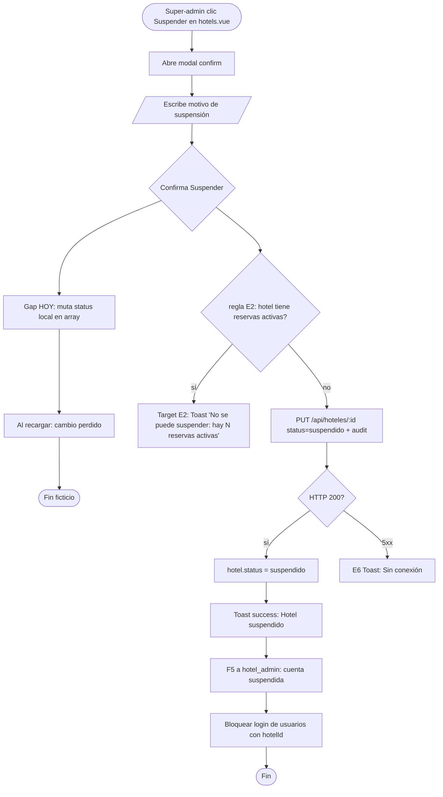

# FRD · T1 — Super-Admin (Plataforma Multi-Hotel)

> **Sección transversal.** Este documento cubre el panel de plataforma del super-admin: gestión de tenants (hoteles), suscripciones, facturación de plataforma, usuarios globales, roles y permisos, API keys, audit log, monitoreo, anuncios, soporte y analytics. Es la capa que está POR ENCIMA de todos los módulos M0x–M2x — cualquier acción acá afecta a uno o varios hoteles completos.
>
> Todo lo documentado está **extraído del código real** de `frontend/src/pages/super-admin/*`, `frontend/src/layouts/SuperAdminLayout.vue`, `frontend/src/stores/auth.store.ts`, `frontend/src/services/{SuperAdmin,Platform}.service.ts`, `backend/src/composition-root.ts` y `backend/src/modules/{hoteles,usuarios,roles,apikeys,auditlog,anuncios}`. La columna "Gap" marca lo que hoy NO cumple el modelo canónico de `00-MASTER.md` y hay que corregir.

**Sección:** T1 — Super-Admin
**Rutas cubiertas:** `/admin` y todas sus hijas (13 sub-pantallas)
**Layout:** `SuperAdminLayout.vue` (sidebar navy + header blanco)
**Servicios frontend:** `SuperAdmin.service.ts`, `Platform.service.ts`, `ConfigService` (en Platform.service.ts)
**Endpoints backend:** `GET /api/admin/{hoteles,users,analytics,subscriptions,audit,announcements,monitoring}` + módulos CRUD `/{hoteles,usuarios,roles,apikeys,auditlog,anuncios}`

---

## 1. Scope y sub-pantallas

### 1.1 Lista de sub-pantallas (13)

| # | Ruta | Archivo | Título (label EXACTO del header) | Estado real |
|---|------|---------|----------------------------------|-------------|
| 1 | `/admin` | `index.vue` | "Dashboard" | Lee analytics/hotels/audit de API; tarjetas de salud hardcodedas |
| 2 | `/admin/hotels` | `hotels.vue` | "Gestión de Hoteles" | Lee API; **crear/editar/suspender son locales** (sin persistencia) |
| 3 | `/admin/subscriptions` | `subscriptions.vue` | (sin h1) | Lee API; **editar/crear planes local**; planes hardcodedos |
| 4 | `/admin/support` | `support.vue` | (métricas + tabla) | Lee tickets de API; **responder es local** (push a array) |
| 5 | `/admin/billing` | `billing.vue` | (métricas) | Lee API; **marcar pagado / recordar son locales**; único toast custom |
| 6 | `/admin/analytics` | `analytics.vue` | "Analytics Platform" | **100% hardcodedo** — cero llamadas a API |
| 7 | `/admin/users` | `users.vue` | "Clientes / Propietarios de Hoteles" | Lee API; **invitar/editar/activar/desactivar locales**; impersonación frontend-only |
| 8 | `/admin/monitoring` | `monitoring.vue` | "Monitoreo del Sistema" | Lee monitoring API (parcial); **health cards hardcodedas** |
| 9 | `/admin/audit` | `audit.vue` | "Auditoría" | Lee API; KPIs hardcodedos; filtros client-side |
| 10 | `/admin/announcements` | `announcements.vue` | "Anuncios & Comunicados" | Lee API; **enviar anuncio es local** (push a array) |
| 11 | `/admin/api-keys` | `api-keys.vue` | "API Keys & Webhooks" | Lee API; **generar/revocar locales**; webhooks vacíos |
| 12 | `/admin/roles` | `roles.vue` | "Roles & Permisos" | Lee roles API; **`savePermissions` = `/* TODO: persist */`** |
| 13 | `/admin/settings` | `settings.vue` | (tabs) | Lee/guarda vía ConfigService; **usa `alert()`** |

### 1.2 Modelo de permisos

| Rol / estado | Acceso `/admin/*` | Acceso `/panel/*` | Fuente |
|--------------|-------------------|-------------------|--------|
| `super_admin` (no impersonando) | ✅ | ❌ (redirect a `/admin`) | `router/index.ts:246-249` |
| `super_admin` impersonando | ❌ (redirect a `/panel`) | ✅ (como el user objetivo) | `router/index.ts:257-260` |
| `hotel_admin` / `receptionist` | ❌ (redirect a `/panel`) | ✅ | `router/index.ts:246-249` |

**Backend:** todas las rutas `/api/admin/*` usan `[auth.authenticate('super_admin')]` (`composition-root.ts:330,334,338,350,354,358,362`). No hay endpoint de impersonación en backend.

> ⚠ **GAP CRÍTICO (Impersonación):** `auth.loginAs()` (`auth.store.ts:53-58`) intercambia `user.value` en memoria del navegador, **sin llamar al backend**, **sin generar token de impersonación**, **sin registrar entrada en `audit_log`**. El super-admin "se convierte" en el usuario objetivo solo en el cliente. Cualquier llamada API posterior usa el token original del super-admin → el backend rechaza con 403 (E3) si la ruta requiere `hotel_admin`. Ver §6 Flow.

---

## 2. Modelo de datos (fuente de verdad)

### 2.1 Tabla `hotels` — Tenant/Hotel (`backend/src/modules/hoteles/model.ts:4-21`)

| Campo | Tipo | Default | Notas |
|-------|------|---------|-------|
| `id` | string | — | PK, UUID |
| `name` | string | — | required |
| `address` | string | — | |
| `phone` | string | — | |
| `email` | string | — | |
| `country` | string | — | |
| `currency` | string | `"USD"` | |
| `timezone` | string | `"America/Santo_Domingo"` | |
| `plan` | string | `"professional"` | `starter` \| `professional` \| `enterprise` |
| `status` | string | `"active"` | `active` \| `pendiente` \| `suspendido` |
| `roomsCount` | number | `0` | |
| `active` | number | `1` | flag numérico (1/0) |
| timestamps | — | — | `createdAt`, `updatedAt` |

> ⚠ **Inconsistencia:** el modelo usa `status` (`active`/`pendiente`/`suspendido`) Y `active` (1/0) como dos flags solapados. El frontend `hotels.vue:343` mapea `status` → label español pero ignora `active`.

### 2.2 Tabla `users` — Usuario global (`backend/src/modules/usuarios/model.ts:4-19`)

| Campo | Tipo | Default | Notas |
|-------|------|---------|-------|
| `id` | string | — | PK |
| `name` | string | — | required |
| `email` | string | — | required, unique, indexed |
| `password` | string | — | required (hash) |
| `role` | string | `"hotel_admin"` | `super_admin` \| `hotel_admin` \| `receptionist` |
| `hotelId` | string | — | indexed — tenant binding |
| `active` | number | `1` | 1/0 |
| `token` | string | — | session token |
| `avatar` | string | — | |
| `phone` | string | — | |
| timestamps | — | — | |

> ⚠ **Inconsistencia de tipos:** `usuarios/types.ts:5-16` define `UsuarioDTO` con `rol: 'admin' \| 'usuario'` y `passwordHash`, pero `model.ts:11` define `role: string` y `password: string`. Dos contratos divergentes para el mismo módulo.

### 2.3 Tabla `roles` — Rol y permisos (`backend/src/modules/roles/model.ts:4-17`)

| Campo | Tipo | Default | Notas |
|-------|------|---------|-------|
| `id` | string | — | PK |
| `name` | string | — | required |
| `icon` | string | `"👤"` | emoji |
| `color` | string | — | clase tailwind |
| `system` | number | `0` | 1 = rol de sistema (no borrable) |
| `hotelId` | string | — | null = rol global de plataforma |
| `permissions` | json | `[]` | array de strings tipo `reservations.read` |
| `users` | number | `0` | contador cacheado |
| timestamps | — | — | |

### 2.4 Tabla `api_keys` — Claves de API (`backend/src/modules/apikeys/model.ts:4-18`)

| Campo | Tipo | Default | Notas |
|-------|------|---------|-------|
| `id` | string | — | PK |
| `hotelId` | string | — | indexed — tenant |
| `name` | string | — | required |
| `scope` | string | — | ej: `read:reservations,write:rooms` |
| `masked` | string | — | ej: `key_live_••••1234` |
| `secretHash` | string | — | hash de la clave real |
| `active` | number | `1` | 1/0 |
| `requests` | number | `0` | contador de uso |
| `lastUsed` | string | — | timestamp último uso |
| timestamps | — | — | |

### 2.5 Tabla `audit_log` — Log de auditoría (`backend/src/modules/auditlog/model.ts:4-18`)

| Campo | Tipo | Default | Notas |
|-------|------|---------|-------|
| `id` | string | — | PK |
| `hotelId` | string | — | tenant (null = plataforma) |
| `userId` | string | — | |
| `userName` | string | — | cache del nombre |
| `action` | string | — | required — `login` \| `create` \| `update` \| `delete` \| `sync` |
| `entity` | string | — | ej: `Reservations` |
| `entityId` | string | — | |
| `detail` | text | — | descripción legible |
| `ip` | string | — | |
| timestamps | — | — | |

### 2.6 Tabla `announcements` — Anuncios de plataforma (`backend/src/modules/anuncios/model.ts:4-18`)

| Campo | Tipo | Default | Notas |
|-------|------|---------|-------|
| `id` | string | — | PK |
| `hotelId` | string | — | null = todos los hoteles |
| `authorId` | string | — | super-admin author |
| `title` | string | — | required |
| `message` | text | — | |
| `type` | string | `"info"` | `feature` \| `maintenance` \| `promo` \| `info` \| `urgent` |
| `priority` | string | `"medium"` | |
| `active` | number | `1` | 1/0 |
| `date` | string | — | |
| timestamps | — | — | |

### 2.7 Planes de suscripción (hardcodedos en frontend, no en DB)

Definidos en `subscriptions.vue:104-108` y `billing.vue:235`:

| Plan | Precio/mes | Máx Hab | Máx Users | Máx Props |
|------|-----------|---------|-----------|-----------|
| `starter` | $49 | 30 | 2 | 1 |
| `professional` | $99 | 100 | 5 | 3 |
| `enterprise` | $199 | 9999 | 9999 | 99 |

> ⚠ No existe tabla `plans` ni `subscriptions` en el backend. El "plan" es un campo string en `hotels.plan`. Los pagos son simulados.

---

## 3. Decision Tables por sub-pantalla

### 3.1 Hoteles (`/admin/hotels`) — CRUD tenants + activar/desactivar

**Vista:** tabla o grid con 5 KPIs (Total / Activos / Pendientes / Suspendidos / MRR Total). Filtros: búsqueda, estado, plan, ubicación, ocupación, MRR, ordenamiento. Botones: Ver / Editar / Suspender-Reactivar.

| Trigger (label EXACTO) | Condición / Estado previo | Resultado | Modal/Toast (texto literal) | Errores (códigos) | Notif F5 |
|------------------------|---------------------------|-----------|------------------------------|-------------------|----------|
| **"+ Nuevo Hotel"** (`hotels.vue:16`) | — | Abre modal `form`: "Registrar Nuevo Hotel" (`hotels.vue:235`) | Modal form con campos: Nombre*, Email*, Teléfono, Ubicación*, Habitaciones, Plan*, Estado | — | — |
| **"Ver"** (`hotels.vue:142`) o clic en nombre (`:121`) | hotel existe | Abre modal `detail`: "Detalle del Hotel" (`hotels.vue:198`) | Modal detail con stats (Hab/Ocup/MRR), plan, usuarios, teléfono, registro | — | — |
| **"Editar"** (`hotels.vue:143`) o **"Editar Hotel"** (`:226`) | hotel existe | Abre modal `form`: "Editar Hotel" (`hotels.vue:235`) | Modal form precargado | — | — |
| **"Suspender"** / **"Reactivar"** (`hotels.vue:144`, depende de `hotel.status`) | `status` activo/pendiente → suspendido; o suspendido → activo | Abre modal `confirm`: "Suspender Hotel" / "Reactivar Hotel" (`hotels.vue:272`) | Modal confirm. Si suspender: pide "Motivo de Suspensión *" (textarea, `:280`) | — | — |
| **"Registrar Hotel"** / **"Guardar Cambios"** (`hotels.vue:263`) sin campos obligatorios | `name`/`email`/`location` vacíos | **No envía** (`hotels.vue:433` returns sin acción) | **Gap:** hoy no hay feedback. **Target:** F3 inline "Nombre/Email/Ubicación es obligatorio" | E1 (target) | — |
| **"Registrar Hotel"** (nuevo, válido) | campos ok | **Gap:** hoy muta array local (`hotels.vue:438-440`). **Target:** POST `/api/hoteles` | **Target:** Toast success "Hotel {name} creado." | E2 "Ya existe hotel con ese email" · E6 | — |
| **"Guardar Cambios"** (edición, válido) | campos ok | **Gap:** hoy muta array local (`hotels.vue:436-437`). **Target:** PUT `/api/hoteles/:id` | **Target:** Toast success "Hotel {name} actualizado." | E5 · E6 | — |
| **"Suspender"** (confirmar en modal) | hotel activo, motivo escrito | **Gap:** hoy muta `status` local (`hotels.vue:445-449`). **Target:** PUT `/api/hoteles/:id` con `status: suspendido` | **Target:** Toast success "Hotel {name} suspendido." + caja ⚠ "⚠ Los usuarios de este hotel no podrán acceder hasta reactivarlo" | E2 (target: no suspender con reservas activas) · E6 | **Sí (target):** F5 a hotel_admin "Tu cuenta fue suspendida. Contactá a soporte." |
| **"Reactivar"** (confirmar en modal) | hotel suspendido | **Gap:** hoy muta `status` local. **Target:** PUT `/api/hoteles/:id` con `status: active` | **Target:** Toast success "Hotel {name} reactivado." | E6 | — |
| **"📥 Exportar"** (`hotels.vue:86`) | lista filtrada | Descarga CSV `hoteles-{fecha}.csv` (`hotels.vue:414-425`) | — | — | — |
| Toggle **tabla/grid** (`hotels.vue:10,13`) | — | Cambia vista sin recargar | — | — | — |
| Filtros (búsqueda/estado/plan/ubicación/ocupación/MRR/sort) | — | Filtran `filteredHotels` computed client-side (`hotels.vue:362-392`) | — | — | — |
| **"Limpiar todo"** (`hotels.vue:35`) | filtros activos | Resetea todos los filtros (`hotels.vue:405-412`) | — | — | — |

**Gap actual (Hotels):**
- ❌ `saveHotel()` (`hotels.vue:432-443`) y `toggleSuspend()` (`:445-450`) **no llaman a la API** — mutan `hotels.value` (array local). Al recargar, los cambios se pierden.
- ❌ Validación silenciosa: si faltan campos, el botón no hace nada (sin feedback F3).
- ❌ Sin estado loading en botones de acción.
- ❌ Sin toast de éxito/error.
- ❌ Suspend reason no se persiste ni se envía a `audit_log`.

---

### 3.2 Usuarios (`/admin/users`) — CRUD usuarios + impersonación

**Vista:** tabla con 5 KPIs (Total / Activos / Inactivos / Pendientes / Activos Hoy). Filtros: búsqueda, rol, hotel, estado, ordenamiento. Acciones: Ver / Editar / Entrar (impersonar) / Log / Activar-Desactivar.

| Trigger (label EXACTO) | Condición / Estado previo | Resultado | Modal/Toast (texto literal) | Errores (códigos) | Notif F5 |
|------------------------|---------------------------|-----------|------------------------------|-------------------|----------|
| **"+ Invitar Cliente"** (`users.vue:11`) | — | Abre modal `form`: "Invitar Nuevo Cliente" (`users.vue:164`) | Campos: Nombre*, Email*, Teléfono, Rol* (Hotel Admin/Recepcionista/Super Admin), Hotel*, Plan | — | — |
| **"Ver"** (`users.vue:103`) o clic en nombre (`:84`) | usuario existe | Abre modal `detail`: "Detalle del Cliente" (`users.vue:123`) | Muestra rol, plan, hotel, habitaciones, última actividad, registro, permisos | — | — |
| **"Editar"** (`users.vue:104`) o **"Editar"** (`:155`) | usuario existe | Abre modal `form`: "Editar Cliente" (`users.vue:164`) | Form precargado | — | — |
| **"Entrar"** (`users.vue:105`) | `status='Activo'` Y `role !== 'Super Admin'` | **Impersonación:** llama `auth.loginAs(targetUser)` (`users.vue:348-362`) + `router.push('/')` | **Gap:** hoy no hay confirmación. **Target:** Modal `warning`: "⚠ Vas a entrar como {name} ({role} de {hotel}). Todas tus acciones se registrarán en audit log." [Entrar como] [Cancelar] | E3 (target: backend rechaza si no super_admin) | **Sí (target):** F5/audit "Super-admin impersonó a {user}" |
| **"Log"** (`users.vue:106`) | — | Abre modal `detail`: "Actividad Reciente" (`users.vue:206`) | **Gap:** datos hardcodedos (`activityLogs`, `users.vue:331-338`) — no viene de API | — | — |
| **"Desactivar"** / **"Activar"** (`users.vue:107`) | `status` activo↔inactivo | **Gap:** hoy muta `user.status` en memoria (`users.vue:384`). **Target:** PUT `/api/usuarios/:id` con `active: 0/1` | **Target:** Toast success "Usuario {name} desactivado/activado." | E2 (target: no desactivar último admin del hotel) · E6 | — |
| **"Enviar Invitación"** / **"Guardar Cambios"** (`users.vue:196`) sin nombre/email | campos vacíos | **No envía** (`users.vue:370` returns) | **Gap:** sin feedback. **Target:** F3 inline | E1 (target) | — |
| **"Enviar Invitación"** (nuevo, válido) | campos ok | **Gap:** hoy muta array local (`users.vue:374-380`). **Target:** POST `/api/usuarios` + envía email invite | **Target:** Toast success "Invitación enviada a {email}." | E2 "Ya existe un usuario con ese email" · E6 | **Sí (target):** email al invitado |
| **"Guardar Cambios"** (edición) | campos ok | **Gap:** hoy muta array local. **Target:** PUT `/api/usuarios/:id` | **Target:** Toast success "Usuario {name} actualizado." | E5 · E6 | — |
| **"📥 Exportar"** (`users.vue:10`) | lista filtrada | Descarga CSV `usuarios-{fecha}.csv` (`users.vue:386-397`) | — | — | — |

**Gap actual (Users):**
- ❌ `saveUser()` (`users.vue:369-382`) y `toggleUserStatus()` (`:384`) **no llaman a la API**.
- ❌ `loginAsUser()` (`users.vue:348-362`) impersona sin confirmación modal, sin audit log, sin token backend.
- ❌ `activityLogs` (`users.vue:331-338`) es un array hardcodedo de 6 entradas — no viene del backend.
- ❌ "Activos Hoy" (`users.vue:274`) cuenta `status === 'Activo'` en vez de logins del día (dato no disponible).

---

### 3.3 API Keys (`/admin/api-keys`) — Generar / revocar

| Trigger (label EXACTO) | Condición | Resultado | Modal/Toast (texto) | Errores | Notif F5 |
|------------------------|-----------|-----------|----------------------|---------|----------|
| **"+ Nueva API Key"** (`api-keys.vue:9`) | — | Abre modal `form`: "Nueva API Key" (`api-keys.vue:135`) | Campos: Nombre, Hotel (select), Scope (botones toggle: read:reservations, write:reservations, etc.) | — | — |
| **"Generar"** (`api-keys.vue:161`) | nombre+hotel ok | **Gap:** hoy genera string random local (`api-keys.vue:203-214`), no llama API. **Target:** POST `/api/apikeys` → backend genera `secretHash` + `masked` | **Target:** Modal `detail` mostrando la clave completa UNA vez: "Copiá esta clave ahora, no se volverá a mostrar: `key_live_xxxx`" | E2 · E6 | — |
| **"Revocar"** / **"Reactivar"** (`api-keys.vue:54-56`) | key activa/inactiva | **Gap:** hoy muta `key.active` local (`api-keys.vue:216-219`). **Target:** DELETE/PUT `/api/apikeys/:id` | **Target:** Toast success "API Key {name} revocada." + caja ⚠ "⚠ Las integraciones que usaban esta clave dejarán de funcionar" | E6 | **Sí (target):** F5 a hotel_admin "Tu API Key {name} fue revocada" |
| Botón copiar (`api-keys.vue:40-42`) | — | `navigator.clipboard.writeText(key.masked)` | **Gap:** sin toast de confirmación. **Target:** Toast info "Clave copiada al portapapeles." | — | — |
| **"+ Nuevo Webhook"** (`api-keys.vue:89`) | — | **Gap:** botón sin `@click` handler — no hace nada | — | — | — |
| **"Probar"** / **"Eliminar"** (webhooks, `api-keys.vue:123-124`) | — | **Gap:** botones sin handler | — | — | — |

**Gap actual (API Keys):**
- ❌ `generateKey()` y `revokeKey()` no persisten (`api-keys.vue:203-219`).
- ❌ Webhooks section: 3 botones sin handler (`+ Nuevo Webhook`, `Probar`, `Eliminar`).
- ❌ `rateLimits` ref (`api-keys.vue:180`) nunca se carga — la sección Rate Limits está vacía.
- ❌ La clave se "genera" con `Math.random()` — no es criptográficamente segura, no se persiste, el `secretHash` del modelo backend nunca se usa.

---

### 3.4 Anuncios (`/admin/announcements`) — Broadcast plataforma

| Trigger (label EXACTO) | Condición | Resultado | Modal/Toast (texto) | Errores | Notif F5 |
|------------------------|-----------|-----------|----------------------|---------|----------|
| **"Nuevo Anuncio"** (`announcements.vue:9`) | — | Abre modal `form`: "Nuevo Anuncio" (`announcements.vue:116`) | Campos: Título, Tipo (feature/maintenance/promo/info/urgent), Audiencia (Todos los hoteles / Solo admins), Mensaje | — | — |
| **"Enviar Ahora"** (`announcements.vue:152`) | título+mensaje ok | **Gap:** hoy push a array local (`announcements.vue:200-213`). **Target:** POST `/api/anuncios` | **Target:** Toast success "Anuncio '{title}' enviado a {audiencia}." | E2 · E6 | **Sí:** F5 a todos los hoteles/admins objetivo |
| **"Ver"** (`announcements.vue:54`) | anuncio existe | **Gap:** botón sin handler | — | — | — |
| **"Eliminar"** (`announcements.vue:55`) | anuncio existe | **Gap:** botón sin handler | — | — | — |
| Plantillas guardadas (clic, `announcements.vue:89`) | — | **Gap:** items sin handler — solo hover visual | — | — | — |

**Gap actual (Announcements):**
- ❌ `sendAnnouncement()` no llama API (`announcements.vue:200-213`).
- ❌ Botones Ver/Eliminar sin handler.
- ❌ "Alcance" stats hardcodedas: "Hoteles totales: 24, Usuarios: 89" (`announcements.vue:69-76`).
- ❌ `templates` y `scheduled` son arrays hardcodedos/empty.
- ❌ `TYPE_LABEL` (`announcements.vue:169`) no mapea todos los tipos del select (falta `promo`/`urgent`).

---

### 3.5 Roles & Permisos (`/admin/roles`) — Matriz de permisos

| Trigger (label EXACTO) | Condición | Resultado | Modal/Toast (texto) | Errores | Notif F5 |
|------------------------|-----------|-----------|----------------------|---------|----------|
| Clic en card de rol (`roles.vue:19`) | — | Selecciona rol, muestra matriz abajo (`selectedRole`) | — | — | — |
| Checkbox permiso (matriz, `roles.vue:84-100`) | `selectedRole` set | Toggle en `selectedRole.permissions` (local) | — | — | — |
| **"Seleccionar Todo"** (`roles.vue:50`) | — | Llena `permissions` con los 108 permisos (18 módulos × 6 acciones, `roles.vue:261-269`) | — | — | — |
| **"Quitar Todo"** (`roles.vue:51`) | — | Vacía `permissions` (`roles.vue:272-275`) | — | — | — |
| **"Guardar Cambios"** (permisos, `roles.vue:110`) | `selectedRole` set | **Gap:** `savePermissions()` = `/* TODO: persist */` (`roles.vue:277`). **Target:** PUT `/api/roles/:id` | **Target:** Toast success "Permisos de {role} actualizados." | E2 (target: no quitar `.admin` del último super_admin) · E6 | — |
| **"+ Crear Rol"** (`roles.vue:9,36`) | — | Abre modal `form`: "Crear Nuevo Rol" (`roles.vue:160`) | Campos: Nombre, Icono (emoji picker), Color (color picker) | — | — |
| **"Crear Rol"** (modal, `roles.vue:185`) | nombre ok | **Gap:** push a array local (`roles.vue:279-291`). **Target:** POST `/api/roles` | **Target:** Toast success "Rol {name} creado." | E2 · E6 | — |
| Toggle Feature Flag por plan (`roles.vue:137-148`) | — | Mutación local de `featureFlags` | — | — | — |
| **"Guardar Features"** (`roles.vue:155`) | — | **Gap:** botón sin handler | — | — | — |

**Gap actual (Roles):**
- ❌ `savePermissions` es un stub vacío (`roles.vue:277`).
- ❌ `createRole()` no persiste (`roles.vue:279-291`).
- ❌ `featureFlags` se carga vía ConfigService pero **nunca se guarda** ("Guardar Features" sin handler).
- ❌ `permissionCategories` (`roles.vue:213-232`) define 18 módulos — algunos no existen como rutas (ej: `nightaudit`, `planning`).

---

### 3.6 Billing (`/admin/billing`) — Facturación de plataforma

| Trigger (label EXACTO) | Condición | Resultado | Modal/Toast (texto) | Errores | Notif F5 |
|------------------------|-----------|-----------|----------------------|---------|----------|
| Clic en factura #ID (`billing.vue:81`) o **"Ver"** (`:98`) | factura existe | Abre modal `detail`: "Factura #{id}" (`billing.vue:116`) | Muestra hotel, plan, concepto, monto, método, fechas emisión/vencimiento, notas | — | — |
| **"Recordar"** (`billing.vue:99`) | `status = Pendiente/Vencido` | Abre modal `form`: "Enviar Recordatorio" (`billing.vue:158`) | Select tipo: Amable/Firme/Urgente + textarea mensaje | — | — |
| **"Enviar"** (recordatorio, `billing.vue:178`) | — | **Gap:** hoy solo toast local (`billing.vue:337`). **Target:** POST `/api/admin/billing/{id}/remind` | Toast success: "📧 Recordatorio enviado a {hotel}" (`billing.vue:205`) | E6 (target) | **Sí (target):** email al hotel |
| **"Pagado"** (`billing.vue:100`) | `status ≠ Pagado` | Abre modal `confirm`: "Confirmar Pago" (`billing.vue:184`) | Modal centrado con ✅, "¿Marcar como pagado?" | — | — |
| **"Confirmar Pago"** (`billing.vue:199`) | — | **Gap:** hoy muta `status` local (`billing.vue:341-346`). **Target:** PUT `/api/admin/billing/{id}/pay` | Toast success: "✅ Factura #{id} marcada como pagada" (`billing.vue:205`) | E6 | — |
| **"📄 Descargar PDF"** (`billing.vue:150`) | — | **Gap:** botón sin handler | — | — | — |
| **"📥 Exportar"** (`billing.vue:44`) | lista filtrada | Descarga CSV (`billing.vue:348-360`) | Toast success: "📥 Facturas exportadas correctamente" (`billing.vue:205`) | — | — |
| Tabs (Todas/Pagadas/Pendientes/Vencidas, `billing.vue:50`) | — | Filtra por status | — | — | — |
| Filtros (búsqueda/estado/plan/fecha/sort) | — | `filteredInvoices` computed client-side | — | — | — |

**Gap actual (Billing):**
- ❌ `confirmMarkAsPaid()` no persiste (`billing.vue:341-346`).
- ❌ `confirmReminder()` no envía nada (`billing.vue:337`).
- ❌ "Descargar PDF" sin handler (`billing.vue:150`).
- ❌ Las facturas se fabrican en frontend: `billing.vue:239-257` mapea hoteles → facturas con ID `INV-001`, concepto "Plan X — Junio 2026" (hardcodedo), sin datos reales de pago.
- ✅ **ÚNICA página con toast** (custom, `billing.vue:205-208`) — pero no sigue la anatomía canónica del MASTER (no es top-right, es bottom-right; sin variantes color; sin auto-cierre configurable).

---

### 3.7 Soporte (`/admin/support`) — Tickets plataforma

| Trigger (label EXACTO) | Condición | Resultado | Modal/Toast (texto) | Errores | Notif F5 |
|------------------------|-----------|-----------|----------------------|---------|----------|
| Filtro status (Todos/Abiertos/En Progreso/Resueltos/Cerrados, `support.vue:16`) | — | Filtra `filteredTickets` | — | — | — |
| Clic en fila o **"Abrir"** (`support.vue:47`) | ticket existe | Abre vista chat (`selectedTicket`, `support.vue:56`) | Header con #ID, asunto, hotel, categoría + select de status | — | — |
| Select status (`support.vue:72`) | ticket abierto | **Gap:** hoy muta `selectedTicket.status` local. **Target:** PUT `/api/tickets/:id` | **Target:** Toast success "Ticket #{id} → {status}." | E6 | **Sí (target):** F5 al hotel "Tu ticket #{id} cambió a {status}" |
| **"Enviar"** (mensaje, `support.vue:130`) | texto o imagen | **Gap:** push a `replies` local (`support.vue:230-243`). **Target:** POST `/api/tickets/:id/messages` | **Target:** Toast success "Respuesta enviada." | E6 | — |
| Botón adjuntar imagen (`support.vue:125`) | input file | Preview local via FileReader (`support.vue:216-224`) | — | — | — |
| Clic imagen (`support.vue:111`) | reply con image | Abre modal image fullscreen (`support.vue:139`) | — | — | — |
| **"←"** (volver, `support.vue:60`) | ticket abierto | Cierra vista chat → vuelve a lista | — | — | — |

**Gap actual (Support):**
- ❌ `sendMessage()` no persiste (`support.vue:230-243`).
- ❌ Cambio de status no persiste.
- ❌ Los tickets se cargan de `OperationsService.tickets()` (módulo `tickets` del hotel), **no de un endpoint de plataforma** — los tickets de todos los hoteles se mezclan sin filtro de hotel.
- ❌ `hotel` se setea vacío (`support.vue:190`) — la columna "Hotel" no muestra datos.

---

### 3.8 Auditoría (`/admin/audit`) — Solo lectura

| Trigger | Condición | Resultado | Modal/Toast | Errores | Notif |
|---------|-----------|-----------|-------------|---------|-------|
| Filtros (búsqueda/acción/hotel/fecha) | — | `filteredLogs` client-side (`audit.vue:166-173`) | — | — | — |
| **"Exportar CSV"** (`audit.vue:11`) | — | **Gap:** botón sin handler | — | — | — |
| Paginación (1/2/3/→, `audit.vue:117-120`) | — | **Gap:** botones sin handler — sin paginación real | — | — | — |

**Gap actual (Audit):**
- ❌ KPIs hardcodedos: "Eventos Hoy: 1,247 / Logins: 89 / Errores: 3 / Retención: 90 días" (`audit.vue:19-33`).
- ❌ "Exportar CSV" sin handler.
- ❌ Paginación fake (botones estáticos).
- ❌ `filterDate` (`audit.vue:54-59`) declarado pero **no se usa** en `filteredLogs` (`audit.vue:166`).
- ❌ `filterAction` compara contra `category.toLowerCase()` pero las categorías vienen capitalizadas (`audit.vue:155`) — el filtro de acción nunca matchea.

---

### 3.9 Analytics (`/admin/analytics`) — Reportes globales

| Trigger | Condición | Resultado | Modal/Toast | Errores | Notif |
|---------|-----------|-----------|-------------|---------|-------|
| Select dateRange (`analytics.vue:10`) | — | **Gap:** no recalcula nada — todos los datos son estáticos | — | — | — |
| Hover sobre barra de chart | — | Muestra valor en tooltip | — | — | — |
| **"📥 Exportar"** (`analytics.vue:16`) | — | Descarga JSON con KPIs hardcodeados (`analytics.vue:321-337`) | — | — | — |

**Gap actual (Analytics):**
- ❌ **100% mock data.** Cero llamadas a API. Todos los arrays (`kpis`, `revenueData`, `mrrBreakdown`, `growthData`, `occupancyData`, `channels`, `countries`, `topHotels`) son literales hardcodedos (`analytics.vue:247-319`).
- ❌ El endpoint `/api/admin/analytics` SÍ existe (`composition-root.ts:338`) y devuelve datos reales (mrr, totalHoteles, byPlan), pero `analytics.vue` no lo usa — solo lo usa `index.vue`.
- ❌ dateRange selector no afecta nada.

---

### 3.10 Monitoreo (`/admin/monitoring`) — Salud del sistema

| Trigger | Condición | Resultado | Modal/Toast | Errores | Notif |
|---------|-----------|-----------|-------------|---------|-------|
| **"Refrescar"** (`monitoring.vue:14`) | — | **Gap:** botón sin handler | — | — | — |
| **"Forzar Backup Ahora"** (`monitoring.vue:197`) | — | **Gap:** botón sin handler | — | — | — |

**Gap actual (Monitoring):**
- ❌ Las 4 tarjetas de System Status (`monitoring.vue:20-92`: API Gateway 99.99%, DB 8.2GB, CDN 24.5GB, Email 1,892 enviados) son **hardcodedas** — no vienen de API.
- ❌ `apiEndpoints` (`monitoring.vue:223-228`) mapea `peticionesAudit` que no existe en el response de `/admin/monitoring` (`composition-root.ts:362-375`) → siempre vacío.
- ❌ `recentErrors` y `backups` (`monitoring.vue:230-232`) nunca se cargan — arrays vacíos.
- ❌ CPU/Memoria/Disco (`monitoring.vue:143-180`) hardcodedos al 34%/62%/45%.
- ❌ El endpoint SÍ devuelve `memoria` y `uptime` reales (`composition-root.ts:372-373`) pero el frontend los ignora (los muestra hardcodedos).

---

### 3.11 Settings (`/admin/settings`) — Configuración plataforma

| Trigger (label EXACTO) | Condición | Resultado | Modal/Toast (texto literal) | Errores | Notif F5 |
|------------------------|-----------|-----------|------------------------------|---------|----------|
| Tabs (Plataforma/Email/Seguridad/Integraciones/Facturación, `settings.vue:5`) | — | Cambia `activeTab` | — | — | — |
| **"Guardar Cambios"** (`settings.vue:7`) | tabs Plataforma/Email | Llama `ConfigService.set()` x2 (`settings.vue:212-221`) | **Gap:** hoy `showSaved` flag sin UI visible. **Target:** Toast success "Configuración guardada." | **Gap:** `catch (e) { alert(e?.message) }` (`settings.vue:221`). **Target:** Toast E7 "No se pudo guardar. Reintentá." | — |
| Toggle integración on/off (`settings.vue:113`) | — | Mutación local `integration.connected` | — | — | — |
| **"Conectar"** (`settings.vue:121`) | integración off | Mutación local (`integration.connected = true`) | — | — | — |
| **"Probar Conexión"** (`settings.vue:117`) | integración conectada | **Gap:** botón sin handler | — | — | — |
| **"Enviar Email de Prueba"** (`settings.vue:65`) | tab Email | **Gap:** `alert('Email de prueba enviado a ' + smtpUser)` (`settings.vue:225`). **Target:** POST `/api/admin/test-email` + Toast success "Email de prueba enviado a {email}." | — | — |
| Toggle email template active (`settings.vue:75`) | — | Mutación local | — | — | — |

**Gap actual (Settings):**
- ❌ `alert()` en `testEmail` (`settings.vue:225`) y en catch de `saveSettings` (`settings.vue:221`).
- ❌ Tabs Seguridad/Integraciones/Facturación: los datos se cargan vía ConfigService pero **"Guardar Cambios"** solo persiste Plataforma + SMTP (`settings.vue:215-217`).
- ❌ **Bug en Platform.service.ts:** `ConfigService.get()` (`Platform.service.ts:18`) usa `/configuracion/${clave}` pero `clave` no está definido (debería ser `key`). `ConfigService.set()` (`:22`) envía `{ clave, valor }` pero usa `key`/`value` del closure. Inconsistencia de nombres → las llamadas fallarían silenciosamente.

---

### 3.12 Dashboard (`/admin`) — Resumen

| Trigger | Condición | Resultado | Modal/Toast | Errores | Notif |
|---------|-----------|-----------|-------------|---------|-------|
| Acciones rápidas: **"Nuevo Hotel"** / **"Crear Plan"** / **"Enviar Newsletter"** / **"Ver Reportes"** (`index.vue:225-240`) | — | **Gap:** 4 botones sin `@click` handler — solo hover visual | — | — | — |
| Toggle **"6 meses" / "12 meses"** (`index.vue:25-26`) | — | **Gap:** botones sin handler — no cambian el chart | — | — | — |
| **"Ver todos →"** (`index.vue:80,134`) | — | `router-link` a `/admin/hotels` y `/admin/support` | — | — | — |

**Gap actual (Dashboard):**
- ❌ Las 4 "Acciones Rápidas" no tienen handler (`index.vue:225-240`).
- ❌ Toggle 6/12 meses sin efecto.
- ❌ System Health section (`index.vue:172-216`): Uptime 99.9%, API 142ms, DB OK, Storage 67% — **hardcodedos**, no de API.
- ❌ `revenueData` y `planDistribution` dependen de `analytics.monthlyRevenue` y `byPlan` — el backend devuelve `monthlyRevenue: []` vacío (`composition-root.ts:347`), así que el chart MRR siempre está vacío.
- ❌ `PlatformService` referenciado en `index.vue:295,302` pero **no importado** — TypeError en runtime.

---

## 4. Flows

### 4.1 Flow — Impersonar hotel (super-admin entra como admin de un hotel)

> ⚠ **Estado actual:** la impersonación es 100% frontend. No hay token swap ni audit. El flow target requiere backend.

```mermaid
flowchart TD
    A([Super-admin clic Entrar en users.vue]) --> B{role ≠ Super Admin?}
    B -- no --> X1[Gap: botón oculto, no se muestra]
    B -- sí --> C[Gap HOY: loginAs directo sin confirmar]
    C --> D[Gap HOY: user.value = targetUser en memoria]
    D --> E[Gap HOY: router.push '/' → va a /panel]
    E --> F{Llamada API con token original}
    F --> backend rechaza 403 --> X2[E3 Toast: Sin permiso]
    F --> backend permite* --> G[*solo si ruta no filtra por hotelId]
    G --> H([Fin impersonación rota])

    A --> TARGET1[Modal warning: vas a entrar como X]
    TARGET1 --> TARGET2[Confirma]
    TARGET2 --> TARGET3[POST /api/admin/impersonate userId]
    TARGET3 --> TARGET4{HTTP 200?}
    TARGET4 -- sí --> TARGET5[Token impersonación + audit_log]
    TARGET5 --> TARGET6[router.push /panel]
    TARGET6 --> TARGET7[Banner naranja: Estás como {user}]
    TARGET7 --> TARGET8[Botón Salir → stopImpersonation]
    TARGET8 --> TARGET9[POST /api/admin/impersonate/stop + audit]
    TARGET9 --> TARGET10([Fin])
    TARGET4 -- 403 --> X3[E3 Toast: No podés impersonar]
    TARGET4 -- 5xx --> X4[E6 Toast: Sin conexión]
```

**Pasos numerados (estado actual):**
1. Super-admin clic **"Entrar"** en `users.vue:105` (botón naranja).
2. `loginAsUser()` (`users.vue:348-362`) construye `targetUser` con `role: hotel_admin|receptionist` y `hotelId`.
3. `auth.loginAs(targetUser)` (`auth.store.ts:53-58`): guarda `originalUser`, setea `impersonating=true`, reemplaza `user.value`.
4. `router.push('/')` → el guard `requiresHotelAuth` (`router/index.ts:252-260`) ve `isSuperAdmin && !impersonating` = false → permite `/panel`.
5. **Problema:** el `token` en localStorage sigue siendo del super-admin. Cualquier llamada a `/api/*` que valide `hotelId` o `role` fallará con 403 (E3) o accederá con privilegios de super-admin (peligroso).

### 4.2 Flow — Activar/Desactivar tenant



---

## 5. Consecuencias cross-módulo (efecto dominó)

T1 es la **capa más alta** — sus acciones afectan a TODOS los módulos M0x–M2x vía multi-tenant:

| Acción en T1 | Módulos afectados | Efecto | Notificación F5 |
|--------------|-------------------|--------|-----------------|
| **Suspender hotel** | TODOS (M01–M26) | Bloquear login de usuarios con ese `hotelId`; reservas activas continúan pero no se crean nuevas; channel manager (M02) deja de sincronizar | F5 a hotel_admin "Tu cuenta fue suspendida" |
| **Cambiar plan hotel** (downgrade) | Channel Mgr (M02), Booking Engine (M20), API Keys | Si baja de Enterprise a Starter: desactivar channel manager, reducir límite de habitaciones, revocar API keys enterprise | F5 "Tu plan cambió a {plan}. Revisá tus límites." |
| **Desactivar usuario** | Auth, todos los del hotel | Invalidar token (`users.token`), bloquear login, cerrar sesiones activas | — |
| **Impersonar usuario** | Audit (T1), todos los del hotel | Todas las acciones quedan en audit_log con flag `impersonatedBy` | F5/audit "Super-admin {x} impersonó a {y}" |
| **Revocar API Key** | Channel Mgr (M02), integraciones externas | Las integraciones que usaban esa clave dejan de recibir webhooks | F5 "Tu API Key {name} fue revocada" |
| **Crear anuncio** | Dashboard (M01), notificaciones (M26) | Banner en dashboard de todos los hoteles objetivo + notificación F5 | F5 "{título}" |
| **Cambiar feature flag** (roles.vue) | Módulo afectado | Si se desactiva `channels` en plan Starter, el menú y las rutas de Channel Manager se ocultan | — |
| **Guardar permisos de rol** | Todas las rutas con `requiresHotelAdmin` | Los usuarios con ese rol ven cambiar sus accesos inmediatamente | — |

---

## 6. Reglas de negocio a validar en backend (E2)

El backend debe rechazar (HTTP 400 `BUSINESS_RULE`) estas situaciones. **Hoy NINGUNA está implementada** — todos los endpoints `/api/admin/*` son solo `GET`:

1. **Suspender hotel con reservas activas** (`status = checked_in`) → "No se puede suspender el hotel: hay {N} reservas con huéspedes en casa."
2. **Desactivar último `hotel_admin` de un hotel** → "No se puede desactivar: es el único administrador de {hotel}. Asigná otro primero."
3. **Crear hotel con email ya existente** → "Ya existe un hotel con ese email."
4. **Crear usuario con email ya existente** → "Ya existe un usuario con ese email."
5. **Cambiar plan a uno con menos habitaciones de las que tiene el hotel** → "El hotel tiene {N} habitaciones, el plan {plan} permite máximo {M}."
6. **Quitar permiso `.admin` del último super_admin** → "No se puede quitar: debe quedar al menos un super-admin."
7. **Borrar rol de sistema** (`system = 1`) → "Los roles de sistema no se pueden eliminar."
8. **Borrar rol con usuarios asignados** (`users > 0`) → "No se puede eliminar: {N} usuarios tienen este rol. Reasignalos primero."
9. **Revocar API Key usada en las últimas 24h** → confirmación extra: "Esta clave se usó hace {X}h. ¿Confirmar revocación?"
10. **Impersonar a otro super_admin** → "No se puede impersonar a otro super-admin."

---

## 7. Gap analysis (file:line)

### 7.1 Anti-patrones `alert()` / `confirm()` nativos

| Archivo | Línea | Código | Fix |
|---------|-------|--------|-----|
| `settings.vue` | 221 | `catch (e: any) { alert(e?.message \|\| 'Error al guardar') }` | Toast E7 |
| `settings.vue` | 225 | `alert('Email de prueba enviado a ' + settings.value.smtpUser)` | Toast success |

### 7.2 Operaciones sin persistencia (local-only)

| Archivo | Función | Línea | Qué hace hoy | Debería |
|---------|---------|-------|--------------|---------|
| `hotels.vue` | `saveHotel()` | 432-443 | Mutar `hotels.value` local | POST/PUT `/api/hoteles` |
| `hotels.vue` | `toggleSuspend()` | 445-450 | Mutar `status` local | PUT `/api/hoteles/:id` + audit |
| `users.vue` | `saveUser()` | 369-382 | Mutar `users.value` local | POST/PUT `/api/usuarios` |
| `users.vue` | `toggleUserStatus()` | 384 | Mutar `user.status` local | PUT `/api/usuarios/:id` |
| `api-keys.vue` | `generateKey()` | 203-214 | `Math.random()` local | POST `/api/apikeys` |
| `api-keys.vue` | `revokeKey()` | 216-219 | Mutar `active` local | DELETE `/api/apikeys/:id` |
| `announcements.vue` | `sendAnnouncement()` | 200-213 | Push a array local | POST `/api/anuncios` |
| `roles.vue` | `savePermissions()` | 277 | `/* TODO: persist */` | PUT `/api/roles/:id` |
| `roles.vue` | `createRole()` | 279-291 | Push a array local | POST `/api/roles` |
| `billing.vue` | `confirmMarkAsPaid()` | 341-346 | Mutar `status` local | PUT `/api/admin/billing/:id/pay` |
| `billing.vue` | `confirmReminder()` | 337 | Solo toast | POST `/api/admin/billing/:id/remind` |
| `support.vue` | `sendMessage()` | 230-243 | Push a `replies` local | POST `/api/tickets/:id/messages` |
| `subscriptions.vue` | `savePlan()` | 148-159 | Mutar `plans` local | POST/PUT plan |

### 7.3 Botones sin handler (dead buttons)

| Archivo | Línea | Botón |
|---------|-------|-------|
| `index.vue` | 225-240 | "Nuevo Hotel", "Crear Plan", "Enviar Newsletter", "Ver Reportes" (4) |
| `index.vue` | 25-26 | Toggle "6 meses" / "12 meses" |
| `api-keys.vue` | 89 | "+ Nuevo Webhook" |
| `api-keys.vue` | 123-124 | "Probar", "Eliminar" (webhooks) |
| `announcements.vue` | 54-55 | "Ver", "Eliminar" (anuncios) |
| `roles.vue` | 155 | "Guardar Features" |
| `monitoring.vue` | 14 | "Refrescar" |
| `monitoring.vue` | 197 | "Forzar Backup Ahora" |
| `audit.vue` | 11 | "Exportar CSV" |
| `audit.vue` | 117-120 | Paginación 1/2/3/→ |
| `billing.vue` | 150 | "📄 Descargar PDF" |
| `settings.vue` | 117 | "Probar Conexión" (integraciones) |

### 7.4 Datos hardcodedos (no de API)

| Archivo | Línea | Qué |
|---------|-------|-----|
| `analytics.vue` | 247-319 | TODO: KPIs, revenueData, mrrBreakdown, growthData, occupancyData, channels, countries, topHotels |
| `monitoring.vue` | 20-92 | System Status cards (API 99.99%, DB 8.2GB, CDN 24.5GB, Email 1,892) |
| `monitoring.vue` | 143-180 | CPU 34%, Memoria 62%, Disco 45% |
| `index.vue` | 172-216 | System Health (Uptime 99.9%, API 142ms, Storage 67%) |
| `audit.vue` | 19-33 | KPIs (1,247 eventos, 89 logins, 3 errores) |
| `announcements.vue` | 69-83 | Alcance (24 hoteles, 89 usuarios, 72% apertura) |
| `users.vue` | 331-338 | `activityLogs` (6 entradas estáticas) |

### 7.5 Bugs de integración

| Archivo | Línea | Bug |
|---------|-------|-----|
| `index.vue` | 295,302 | `PlatformService` usado pero **no importado** → TypeError |
| `Platform.service.ts` | 18 | `ConfigService.get()` usa `${clave}` (undefined) en vez de `${key}` |
| `Platform.service.ts` | 22 | `ConfigService.set()` envía `{ clave, valor }` pero las vars son `key`/`value` |
| `SuperAdmin.service.ts` | 38 | `name: h.nombre` duplicado en línea 37 y 38 (segundo sobreescribe) |
| `audit.vue` | 166 | `filterAction` compara contra `category.toLowerCase()` pero categorías son capitalizadas → filtro nunca matchea |
| `audit.vue` | 54-59 | `filterDate` declarado pero no usado en `filteredLogs` |

### 7.6 Feedback faltante (vs MASTER)

| Categoría | Estado T1 |
|-----------|-----------|
| F1 Toast | ❌ Solo `billing.vue` (custom, no canónico). Resto: sin toasts. |
| F2 Modal | ✅ Estructura correcta en hotels/users/billing/announcements/api-keys/roles |
| F3 Inline error | ❌ Cero validaciones inline en toda T1 |
| F4 Alert de página | ❌ Ninguno |
| F5 Notificación | ❌ Ninguna generada (todo es local) |
| F6 Loading | ❌ Cero botones con estado loading en T1 |

---

## 8. Checklist de verificación T1

### Hoteles
- [ ] `saveHotel()` llama a POST/PUT `/api/hoteles` (hoy: local)
- [ ] `toggleSuspend()` llama a PUT + persiste motivo en audit_log (hoy: local)
- [ ] Validación E2: no suspender con reservas activas
- [ ] F3 inline en campos obligatorios (nombre/email/ubicación)
- [ ] Toast success/error
- [ ] Estado loading en "Guardar Cambios" y "Suspender"
- [ ] Caja ⚠ al suspender (consecuencia en usuarios del hotel)

### Usuarios
- [ ] `saveUser()` llama a POST/PUT `/api/usuarios` (hoy: local)
- [ ] `toggleUserStatus()` llama a PUT (hoy: local)
- [ ] Modal `warning` antes de impersonar con caja ⚠
- [ ] Backend: endpoint `/api/admin/impersonate` con token swap + audit
- [ ] Banner visible de impersonación en `/panel` (hoy: no hay)
- [ ] `activityLogs` desde API (hoy: hardcodedo)
- [ ] E2: no desactivar último hotel_admin

### API Keys
- [ ] `generateKey()` llama a POST, backend genera secretHash (hoy: Math.random local)
- [ ] Modal mostrando clave completa una sola vez
- [ ] `revokeKey()` llama a DELETE (hoy: local)
- [ ] Handlers en "+ Nuevo Webhook", "Probar", "Eliminar"
- [ ] Rate Limits cargados de API (hoy: vacío)

### Anuncios
- [ ] `sendAnnouncement()` llama a POST `/api/anuncios` (hoy: local)
- [ ] Handlers en "Ver" y "Eliminar"
- [ ] F5 a hoteles objetivo al enviar
- [ ] Stats de alcance desde API (hoy: hardcodedas)

### Roles
- [ ] `savePermissions()` persiste (hoy: stub `/* TODO */`)
- [ ] `createRole()` llama a POST (hoy: local)
- [ ] "Guardar Features" tiene handler
- [ ] E2: no quitar `.admin` del último super_admin

### Billing
- [ ] `confirmMarkAsPaid()` llama a PUT (hoy: local)
- [ ] `confirmReminder()` envía email real (hoy: solo toast)
- [ ] "Descargar PDF" con handler
- [ ] Facturas desde endpoint real (hoy: fabricadas en frontend)
- [ ] Toast canónico (migrar de custom bottom-right a sistema F1 top-right)

### Soporte
- [ ] `sendMessage()` persiste (hoy: local)
- [ ] Cambio de status persiste
- [ ] Filtro por hotel (hoy: tickets mezclados sin hotel)
- [ ] Columna "Hotel" muestra datos (hoy: vacía)

### Analytics
- [ ] Conectar a `/api/admin/analytics` (hoy: 100% mock)
- [ ] dateRange afecta los datos
- [ ] Charts desde datos reales

### Monitoreo
- [ ] System Status desde API (hoy: hardcodedas)
- [ ] CPU/Memoria/Disco desde `process.memoryUsage`/`os` (hoy: literales)
- [ ] Handlers en "Refrescar" y "Forzar Backup"
- [ ] `recentErrors` y `backups` cargados de API

### Auditoría
- [ ] KPIs desde API (hoy: hardcodedos)
- [ ] "Exportar CSV" con handler
- [ ] Paginación funcional (hoy: botones estáticos)
- [ ] `filterDate` implementado en `filteredLogs`
- [ ] Fix: `filterAction` comparar case-insensitive correcto

### Settings
- [ ] Reemplazar `alert()` en testEmail (línea 225) → Toast
- [ ] Reemplazar `alert()` en saveSettings catch (línea 221) → Toast E7
- [ ] "Guardar Cambios" persiste TODOS los tabs (hoy: solo Plataforma+SMTP)
- [ ] "Probar Conexión" con handler
- [ ] Fix bug `clave`/`key` en Platform.service.ts

### Transversal
- [ ] Sistema de toasts F1 unificado (hoy: solo billing custom)
- [ ] Loading state en todos los botones de acción
- [ ] Banner de impersonación en `/panel` con botón "Salir"
- [ ] Audit log en TODA acción de super-admin (crear/suspender/impersonar/revocar)

---

## 9. Pendiente de documentar en T1 (próximas iteraciones)

- [ ] Matriz de permisos completa por rol (qué ruta ve cada rol) — hoy difiere entre `roles.vue` (18 módulos) y `router/index.ts` (rutas reales)
- [ ] Webhooks: estructura de payload, eventos soportados, reintentos
- [ ] Feature flags: cómo se evalúan en runtime (no hay guard en router que los lea)
- [ ] Migración/cancelación de plan: flujo de downgrade con consequences
- [ ] Retención de audit_log (90 días hardcodedos, sin policy real)
- [ ] 2FA para super_admin (settings lo menciona pero no hay implementación)

---

*Este documento vive en `FRD/T1-Super-Admin.md`. Sigue el molde de `M01-PMS-Central.md` adaptado a sección transversal multi-pantalla. Cuando una sub-pantalla cambie, actualizar su Decision Table y Gap analysis correspondiente.*
