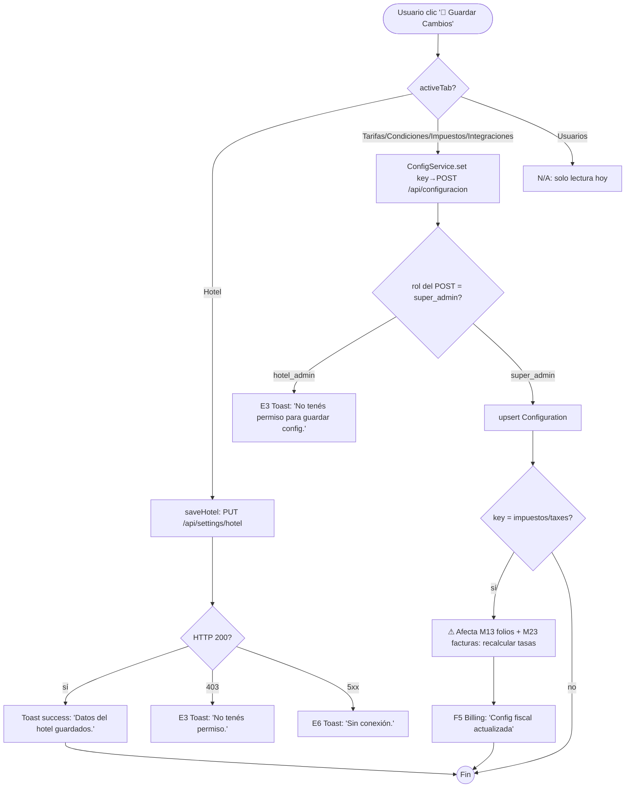
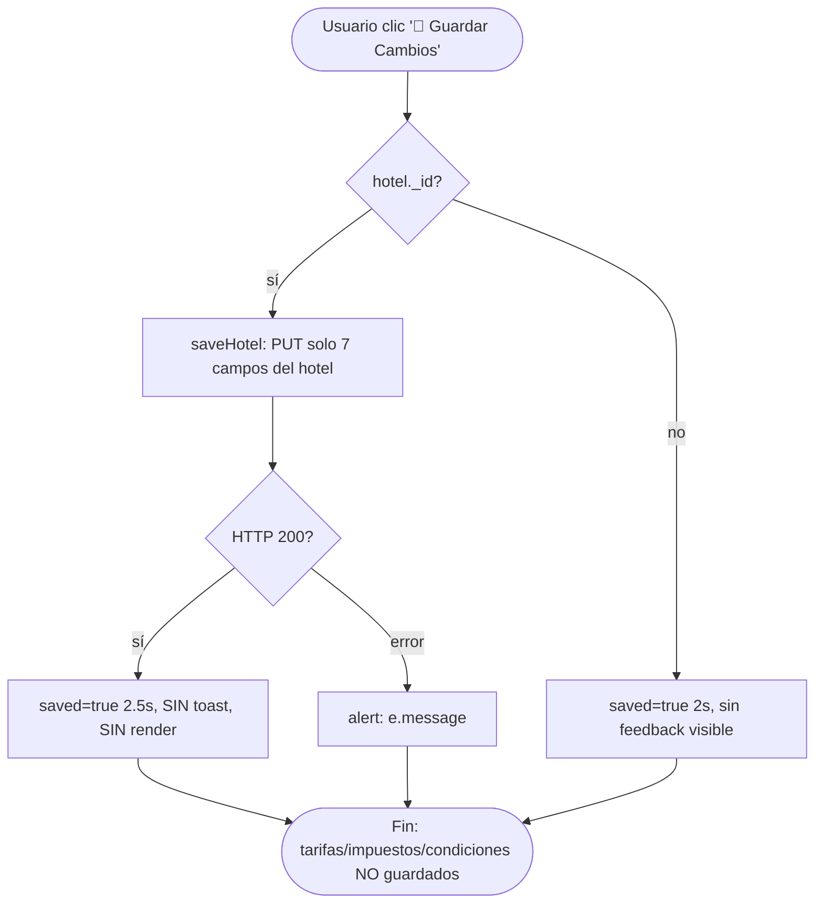

# FRD · T2 — Settings / Configuración (Sección transversal)

> **Sección transversal.** T2 no es un módulo de negocio: es la pantalla `/panel/settings` desde donde un `hotel_admin` (o `super_admin`) configura TODA la plataforma del hotel —datos fiscales, moneda, tarifas, impuestos, condiciones, integraciones y usuarios. Documentada siguiendo el molde de `M01-PMS-Central.md` y las categorías de feedback de `00-MASTER.md`.
>
> Todo lo documentado acá está **extraído del código real** de `frontend/src/pages/settings/index.vue` (780 líneas), `frontend/src/services/Hotel.service.ts`, `frontend/src/services/Platform.service.ts` (`ConfigService`) y `backend/src/composition-root.ts` (endpoints `/api/settings`, `/api/settings/hotel`, `/api/configuracion`). La columna "Gap" marca lo que hoy NO cumple el modelo canónico y hay que corregir.

**Módulo:** T2 — Settings / Configuración
**Pantalla cubierta:** `/panel/settings` (6 pestañas: Hotel · Tarifas · Condiciones · Impuestos · Integraciones · Usuarios)
**Servicios frontend:** `Hotel.service.ts` (`settings`, `updateSettings`), `Platform.service.ts` (`ConfigService.get/set`), `SuperAdmin.service.ts` (`users`)
**Servicios backend:** endpoints de agregación en `composition-root.ts`; modelo KV `Configuration`; módulos `hoteles`, `usuarios`, `roles`, `apikeys`

---

## 1. Modelo de datos (fuente de verdad)

### 1.1 Modelo `Hotels` (tabla `hotels`) — `backend/src/modules/hoteles/model.ts:4`

| Campo | Tipo | ¿Se edita en T2? | Notas |
|-------|------|-------------------|-------|
| `id` | string | No | PK |
| `name` | string | **Sí** (tab Hotel) | |
| `address` | string | **Sí** | |
| `phone` | string | **Sí** | |
| `email` | string | **Sí** | |
| `country` | string | **Sí** | valores ISO: DO, CO, MX, PE, CL, AR |
| `currency` | string (default `USD`) | **Sí** | USD, DOP, COP, MXN, PEN, CLP, ARS |
| `timezone` | string | **Sí** | IANA tz |
| `plan` | string (default `professional`) | Solo lectura | starter / professional / enterprise |
| `status` | string (default `active`) | No | |
| `roomsCount` | number | No | |
| `active` | number | No | |

> ⚠ **GAP ESTRUCTURAL #1:** el modelo `Hotels` **NO tiene** campos `checkIn`, `checkOut`, `freeCancellation`, `depositRequired`, `depositPercent`, `weekendSurcharge`. Las tarjetas "Check-In / Check-Out" y "Políticas" de la pestaña Hotel (`index.vue:88-132`) editan `hotel.value` pero `saveHotel()` (`index.vue:742-754`) **nunca los envía al backend** → **no persisten**.

### 1.2 Modelo `Configuration` (tabla `configuration`) — KV multi-tenant — `composition-root.ts:29`

| Campo | Tipo | Notas |
|-------|------|-------|
| `id` | string (uuid) | PK |
| `hotelId` | string | `'platform'` = default global; otro = propio del hotel |
| `key` | string (indexed) | ej: `impuestos`, `taxes`, `temporadas`, `cargos_extra`, `metodos_pago`, `facturacion_electronica` |
| `value` | json | array u objeto serializado |

**Resolución de un valor de config** (`composition-root.ts:325-329`, GET `/api/configuracion/:key`):
```
1. buscar Configuration { hotelId: <hotel>, key }
2. si no existe → fallback a Configuration { hotelId: 'platform', key }
3. devolver { valor: row.value | null }
```

> ⚠ **BUG DOCUMENTADO #1 (nomenclatura clave/valor):** el endpoint POST `/api/configuracion` (`composition-root.ts:331-343`) recibe del body `{ clave, valor, hotelId }` (español) pero **persiste** con campos del modelo `{ key: clave, value: val }` (inglés). El GET `/api/configuracion/:key` lee por `key` (inglés) — consistente con el modelo, pero la frontera API usa español. El `ConfigService` frontend (`Platform.service.ts:15-24`) puentea esto enviando `{ clave: key, valor: value }`. Funciona, pero es frágil: cualquier consumidor nuevo que use `key/value` en el body rompe.

> ⚠ **BUG DOCUMENTADO #2 (rol del POST):** `POST /api/configuracion` exige rol **`super_admin`** únicamente (`composition-root.ts:331`). Un `hotel_admin` **no puede** escribir su propia configuración fiscal vía este endpoint. Aunque la UI tuviera el botón de guardar impuestos, el hotel_admin recibiría un 403 (E3).

### 1.3 Catálogos esperados por la UI vs claves reales leídas — `index.vue:720-731`

| Clave (`key`) leída | Tab que la consume | Campos que espera la UI (español) | Campos que lee `taxRateFor` (billing) |
|---------------------|--------------------|------------------------------------|----------------------------------------|
| `metodos_pago` | Condiciones → Métodos de Pago | `id, nombre, icon, activo` | — |
| `temporadas` | Tarifas → Temporada | `nombre, icon, fechas, recargo, activo` | — |
| `cargos_extra` | Tarifas → Cargos Extras | `nombre, icon, precio` | — |
| `impuestos` | Impuestos | `nombre, icon, etiqueta, tasa, activo` | `activo ?? active`, `tasa ?? rate` |
| `facturacion_electronica` | Integraciones → Facturación Electrónica | (objeto crudo) | — |

> ⚠ **GAP #2 (impuestos duales ES/EN):** `taxRateFor` (`folios/usecases/folio-math.ts:10-19` y `facturas/usecases/billing.ts:10-19`) busca primero `key:'taxes'` y luego `key:'impuestos'`, y suma `t.tasa ?? t.rate`. La UI de T2 **solo** lee `key:'impuestos'` y renderiza `t.tasa`. Si alguien puebla `taxes` (EN) con `{active, rate}`, la facturación lo usaría pero la UI de Settings **no lo mostraría**. Inconsistencia de fuente de verdad fiscal.

### 1.4 Permisos por endpoint

| Endpoint | Roles permitidos | Efecto |
|----------|------------------|--------|
| `GET /api/settings` | `hotel_admin`, `super_admin` | Devuelve hotel + baseRates (de Rooms) |
| `PUT /api/settings/hotel` | `hotel_admin`, `super_admin` | Actualiza Hotels |
| `GET /api/configuracion/:key` | `hotel_admin`, `receptionist`, `super_admin` | Lee KV (con fallback platform) |
| `POST /api/configuracion` | **`super_admin` únicamente** | Escribe KV → hotel_admin bloqueado |

---

## 2. Pantalla — Pestaña Hotel (`activeTab === 'hotel'`) — `index.vue:28-159`

Cabecera con título "Configuración" + botón global **"💾 Guardar Cambios"**. Sidebar con "Plan Actual" (solo lectura) y "Logo del Hotel" (click sin handler).

### 2.1 Decision Table

| Trigger | Condición / Estado previo | Resultado | Modal/Toast (texto literal) | Errores posibles (códigos) | Notificación F5 |
|---------|---------------------------|-----------|------------------------------|-----------------------------|-----------------|
| Carga de pestaña (`onMounted`) | `hotelId` resuelto o `undefined` | `HotelService.settings(hotelId)` → rellena `hotel.value` (tolera `nombre`/`name`, `telefono`/`phone`) | — | E6 "Sin conexión" (hoy silenciado en `catch`) | — |
| Editar inputs (name/country/address/phone/email/timezone/currency) | — | Mutación local en `hotel.value` (sin guardar) | — | — | — |
| Editar "Hora de Check-In / Check-Out" | — | Mutación local `hotel.checkIn/checkOut` | — | — | **GAP:** no persiste (no es campo del modelo, no lo envía `saveHotel`) |
| Toggle "Cancelación gratuita" / "Depósito obligatorio" | — | Mutación local `hotel.freeCancellation/depositRequired` | — | — | **GAP:** no persiste |
| **"💾 Guardar Cambios"** (header, `saveAll`) | `hotel.value._id` existe | Llama `saveHotel()` (ver fila abajo). Si no hay `_id`, **no guarda nada** pero igual prende `saved` 2s | **Hoy: NADA visible.** `saved.value=true` 2s pero el template **no renderiza** `saved` → feedback invisible. **Target:** Toast success "Datos del hotel guardados." | E3 "No tenés permiso" · E6 "Sin conexión" | — |
| `saveHotel()` (llamado por `saveAll`) | `_id` set | `PUT /api/settings/hotel` con **solo** `{name, country, address, phone, email, timezone, currency}` | **Hoy:** ningún toast. **Target:** Toast success "Hotel actualizado." | E6. **Hoy:** `alert(e.message)` (anti-patrón) | — |
| `PUT /api/settings/hotel` error | sin permiso / sin conexión | Sin cambio | **Hoy:** `alert('Error al guardar')`. **Target:** Toast E3/E6 | E3 · E6 | — |
| **"Cambiar Plan"** (sidebar) | — | **Nada** (botón sin `@click`) | — | — | — |
| **"Click para cambiar logo"** | — | **Nada** (div sin `@click`) | — | — | — |

**Gap actual (pestaña Hotel):**
- ❌ `checkIn`, `checkOut`, `freeCancellation`, `depositRequired`, `depositPercent`, `weekendSurcharge` se editan pero **no se envían** en `saveHotel()` (`index.vue:744-748`) y **no existen** en el modelo `Hotels`. UI engañosa.
- ❌ `saved` se setea pero **nunca se muestra** en el template (`index.vue:634,749,777`) → cero feedback de éxito.
- ❌ Error vía `alert()` (`index.vue:752`) → debe ser Toast E3/E6.
- ❌ "Cambiar Plan" y "Logo del Hotel" son decorativos (sin handler).

---

## 3. Pantalla — Pestaña Tarifas (`activeTab === 'rates'`) — `index.vue:162-241`

Cuatro tarjetas: "Tarifas Base (por noche)" (de tipos de habitación), "Tarifas por Temporada", "Tarifas de Fin de Semana", "Cargos Extras".

### 3.1 Decision Table

| Trigger | Condición | Resultado | Modal/Toast (texto) | Errores | Notif F5 |
|---------|-----------|-----------|----------------------|---------|----------|
| Carga (`onMounted`) | — | `baseRates` se arma desde `HotelService.settings().baseRates` (tipos únicos de Rooms con su `basePrice`); `seasons` y `extraCharges` desde `ConfigService.get('temporadas'/'cargos_extra')` | — | E6 silenciado | — |
| Editar precio "Tarifas Base" (`rate.price`) | — | Mutación local `baseRates[i].price` | — | — | **GAP:** no persiste (saveAll no llama nada para baseRates) |
| Editar recargo "Tarifas por Temporada" (`season.surcharge`) | — | Mutación local | — | — | **GAP:** no persiste |
| Editar "Tarifas de Fin de Semana" (`hotel.weekendSurcharge`) | — | Mutación local | — | — | **GAP:** no persiste |
| Editar "Cargos Extras" (`charge.price`) | — | Mutación local | — | — | **GAP:** no persiste |
| **"💾 Guardar Cambios"** | — | `saveAll()` → solo guarda datos del hotel; **nada** de tarifas/temporada/cargos se envía | **Hoy:** nada. **Target:** Toast success "Tarifas actualizadas." | — | — |

**Gap actual (pestaña Tarifas):** ❌ **Toda la pestaña es no-persistente.** `baseRates` viene de Rooms pero al editarse no se hace `PUT` a Rooms; `seasons`/`extraCharges` se cargan de Configuration pero `saveAll` nunca llama `ConfigService.set`. Cambios = cosmética de sesión.

---

## 4. Pantalla — Pestaña Impuestos (`activeTab === 'taxes'`) — `index.vue:244-300`

"Configuración de Impuestos" (lista de impuestos con toggle + `label` + `rate`) y "Vista Previa de Factura" (cálculo en vivo). **Esta pestaña es la de mayor impacto cross-módulo** porque alimenta M13 (folios) y M23 (facturación).

### 4.1 Decision Table

| Trigger | Condición | Resultado | Modal/Toast (texto) | Errores | Notif F5 |
|---------|-----------|-----------|----------------------|---------|----------|
| Carga | — | `taxes` desde `ConfigService.get('impuestos')` mapeado a `{name, icon, label, rate, enabled}` | — | E6 silenciado | — |
| Toggle impuesto (`tax.enabled`) | — | Muta local + recalcula `invoiceTotal` (computed) | — | — | — |
| Editar `tax.label` / `tax.rate` | — | Muta local + recalcula preview | — | E1 implícito (input `min=0 max=100` HTML, sin validación de negocio) | — |
| Preview "Vista Previa de Factura" | ≥1 impuesto enabled | `invoiceTotal = base + Σ(base × rate/100)` (`index.vue:762-769`) | — | — | — |
| **"💾 Guardar Cambios"** | — | `saveAll()` → **NO llama** `ConfigService.set('impuestos', …)`. Los impuestos editados **no se guardan** | **Hoy:** nada. **Target:** Toast success "Impuestos guardados." + ⚠ caja "Estos cambios afectan facturas y folios emitidos desde ahora." | **Target E2:** "No se pudo guardar: la tasa debe estar entre 0 y 100." | **Sí (target):** a Billing/M13 "Configuración fiscal actualizada" |

**Gap actual (pestaña Impuestos — CRÍTICO):**
- ❌ **Los impuestos editados no persisten.** `saveAll()` no invoca `ConfigService.set('impuestos', …)`. La pestaña es cosmética.
- ❌ Como consecuencia, `taxRateFor()` (folios/facturas) **siempre devuelve 0** salvo que un `super_admin` (o un seed) haya poblado la fila `Configuration { key:'taxes'|'impuestos' }` por fuera de la UI. → Las facturas y folios **no aplican impuestos** en condiciones normales.
- ❌ Aunque se implementara el guardado, el POST `/api/configuracion` exige `super_admin` (`composition-root.ts:331`) → un `hotel_admin` obtendría E3. Hay que relajar el rol a `hotel_admin` (con scope a su propio hotel) o crear un endpoint específico.
- ❌ Sin validación E1/E2 de rango de tasa (0–100) más allá del atributo HTML `min/max`.

---

## 5. Pantalla — Pestaña Condiciones (`activeTab === 'conditions'`) — `index.vue:408-575`

"Condiciones de Reserva" (check-in/out times, estancia mínima, política de cancelación radio), "Depósitos, Fianzas y Anticipos" (toggles + montos), "Métodos de Pago" (cards toggle), "Cuentas Bancarias para Transferencias" (lista editable).

### 5.1 Decision Table

| Trigger | Condición | Resultado | Modal/Toast (texto) | Errores | Notif F5 |
|---------|-----------|-----------|----------------------|---------|----------|
| Carga | — | `paymentMethods` desde `ConfigService.get('metodos_pago')`; `conditions` y `bankAccounts` con **valores por defecto hardcodeados** (`index.vue:645-654`) | — | E6 silenciado | — |
| Editar "Check-in / Check-out" (times) | — | Muta `conditions.checkInTime/checkOutTime` | — | — | **GAP:** no persiste |
| Editar "Estancia Mínima" baja/alta | — | Muta `conditions.minStayLow/High` | — | — | **GAP:** no persiste |
| Radio "Política de Cancelación" (Flexible/Moderada/Estricta/No Reembolsable) | — | Muta `conditions.cancellationType` | — | — | **GAP:** no persiste |
| Toggle "Depósito de Reserva" / "Fianza por Daños" / "Anticipo Mínimo" | — | Muta `conditions.deposit/damageDeposit/prepayment` | — | — | **GAP:** no persiste |
| Click card "Métodos de Pago" | — | Alterna `method.enabled` | — | — | **GAP:** no persiste |
| **"+ Agregar Cuenta"** (`addBank`) | `bankAccounts.length ≥ 1` | Push objeto vacío `{name, holder, accountNumber, type:'checking'}` | — | — | — |
| **"Eliminar"** (cuenta) (`removeBank`) | `bankAccounts.length > 1` | Splice índice | — | — | — |
| **"💾 Guardar Cambios"** | — | `saveAll()` → **no persiste** conditions, paymentMethods ni bankAccounts | **Hoy:** nada. **Target:** Toast success "Condiciones guardadas." | — | — |

**Gap actual (pestaña Condiciones):** ❌ **Toda la pestaña es no-persistente**, excepto `paymentMethods` y `bankAccounts` que tampoco se guardan. `conditions` (check-in/out, estancia mínima, cancelación, depósitos) vive solo en memoria con defaults hardcodeados.

---

## 6. Pantalla — Pestaña Integraciones (`activeTab === 'integrations'`) — `index.vue:303-405`

Cuatro tarjetas: "Channel Manager" (Channex), "Pasarela de Pagos" (Stripe), "Facturación Electrónica", "WhatsApp Business".

### 6.1 Decision Table

| Trigger | Condición | Resultado | Modal/Toast (texto) | Errores | Notif F5 |
|---------|-----------|-----------|----------------------|---------|----------|
| Carga | — | `eInvoicing` desde `ConfigService.get('facturacion_electronica')`. **Channex/Stripe/WhatsApp son 100% estáticos** (badges "Conectado"/"Activo" y métricas hardcodeadas como `5 canales activos`, `Última sync: 5min`, `pk_test_...xxxx`) | — | — | — |
| **"Configurar"** (Channex, `index.vue:327`) | — | **Nada** (botón sin `@click`) | — | — | — |
| **"Configurar"** (Stripe, `index.vue:349`) | — | **Nada** (botón sin `@click`) | — | — | — |
| **"Configurar Mensajes"** (WhatsApp, `index.vue:402`) | — | **Nada** (botón sin `@click`) | — | — | — |
| Render Facturación Electrónica | `eInvoicing` con items | Lista países/proveedores con badge `connected`/`pending` | — | — | — |

**Gap actual (pestaña Integraciones):**
- ❌ **No existe gestión de API keys** en esta pantalla. Las API keys de Channex/Stripe se gestionan en otro lado (módulo `apikeys` del backend → `ApikeysModule`, consumido por M22 Channel Manager). T2 solo muestra estado estático.
- ❌ **No existe SMTP/Email config** en toda la pantalla (ver §7).
- ❌ **No existe gestión de plantillas** (templates) de WhatsApp/Email (ver §7).
- ❌ Los tres botones "Configurar"/"Configurar Mensajes" son decorativos.

---

## 7. Pantalla — Pestaña Usuarios (`activeTab === 'users'`) — `index.vue:578-622`

Tabla de "Usuarios del Sistema" (read-only) con columnas Usuario/Email/Rol/Estado/Último Acceso/Acciones.

### 7.1 Decision Table

| Trigger | Condición | Resultado | Modal/Toast (texto) | Errores | Notif F5 |
|---------|-----------|-----------|----------------------|---------|----------|
| Carga | — | `SuperAdminService.users()` → filtra por `hotelId` del usuario actual; mapea a `{id, name, email, initials, role, active, lastAccess}` | — | E6 silenciado | — |
| **"+ Invitar Usuario"** (`index.vue:581`) | — | **Nada** (botón sin `@click`) | **Target:** Modal `form` "Invitar Usuario" (email + rol). Hoy: sin acción. | — | — |
| **"Editar"** (fila, `index.vue:617`) | — | **Nada** (botón sin `@click`) | **Target:** Modal `form` "Editar Usuario" (rol, activo, reset password). Hoy: sin acción. | — | — |

**Gap actual (pestaña Usuarios):** ❌ Read-only sin acciones. No hay crear/editar/desactivar/resetear. No hay gestión de **Roles** en T2 (el módulo `roles` existe en backend pero no se expone en esta pantalla).

---

## 8. Flow — Guardar configuración (happy path + errores) — Target



### Flow — Estado ACTUAL (lo que realmente pasa)



---

## 9. Consecuencias cross-módulo (qué alimenta T2)

T2 es **sumidero de configuración** para casi todos los módulos. Lo que se guarda acá (o **debería** guardarse) afecta:

| Config en T2 | Módulo consumidor | Campo/cálculo afectado | ¿Persiste hoy? |
|--------------|-------------------|------------------------|-----------------|
| `Hotels.currency` | M13 Folios · M23 Facturas | `currency` en factura (`billing.ts:46` default `'USD'`) | ✅ Sí |
| `Hotels.timezone` | M01 PMS · M11 Reports | Cálculo de "hoy" en check-in/out | ✅ Sí |
| `Hotels.name/address/phone/email` | M23 Facturas · M17 Briefings | Encabezado de factura, datos del hotel | ✅ Sí |
| `impuestos`/`taxes` (KV) | **M13 Folios** · **M23 Facturas** · **Dashboard** | `taxRateFor()` → monto de impuesto en folios y facturas; `impuestos` del dashboard (`composition-root.ts:221,227`) | ❌ **No** (UI no guarda; taxRate siempre 0) |
| `temporadas` (KV) | M03 Motor de Reservas | Recargos estacionales sobre tarifa base | ❌ No |
| `cargos_extra` (KV) | M13 Folios | Cargos postables | ❌ No |
| `metodos_pago` (KV) | M13/M23 | `paymentMethod` disponible | ❌ No |
| API keys Channex | **M22 Channel Manager** | Push ARI a OTAs | ⚠ No en T2 (en módulo `apikeys`, no expuesto acá) |
| API keys Stripe | M13 Pagos | Cobros con tarjeta / links de pago | ⚠ No en T2 |
| SMTP | **M06 Comms** (email transaccional) | Envío de confirmaciones/facturas | ❌ **No existe sección SMTP** |
| Plantillas WhatsApp | **M06 Comms** | Mensajes de confirmación/recordatorio/check-in | ❌ **No existe sección plantillas** (botón "Configurar Mensajes" muerto) |
| `facturacion_electronica` (KV) | M23 Facturas | Proveedores NCF por país | ⚠ Solo lectura (carga, no guarda) |
| Usuarios/Roles del hotel | Todos (auth) | Quién puede hacer qué | ❌ Read-only (botones muertos) |

---

## 10. Reglas de negocio a validar en backend (E2)

El backend debe rechazar (HTTP 400 `BUSINESS_RULE`) estas situaciones, y el frontend mostrar el Toast E2 correspondiente. **Hoy NINGUNA está implementada** porque el guardado de config no existe.

1. **Tasa de impuesto fuera de rango** → "La tasa de {label} debe estar entre 0 y 100."
2. **Moneda no soportada** → "La moneda {code} no está soportada. Usá USD, DOP, COP, MXN, PEN, CLP o ARS." (frontend ya restringe vía `<select>`, pero falta validación server-side en `PUT /api/settings/hotel`).
3. **Timezone inválido** → "La zona horaria no es válida."
4. **Email del hotel con formato inválido** → "Email del hotel inválido." (E1 inline en target).
5. **Depósito % fuera de 1–100** → "El porcentaje de depósito debe estar entre 1 y 100."
6. **Estancia mínima < 1 noche** → "La estancia mínima debe ser de al menos 1 noche."
7. **Config fiscal sin al menos 1 impuesto activo al emitir factura** → (warning, no bloqueante) "No hay impuestos configurados; la factura se emitirá sin tasa."

> **Regla de auditoría (target):** todo cambio en `impuestos`/`taxes` debe loguearse en `Auditlog` con `{userId, hotelId, antes, después}` porque impacta facturación fiscal.

---

## 11. Gap Analysis (file:line) — qué persiste vs qué es UI vacía

### ✅ PERSISTE realmente (vía `PUT /api/settings/hotel`)
| Dato | Frontend | Backend |
|------|----------|---------|
| name, country, address, phone, email, timezone, currency | `index.vue:744-748` | `composition-root.ts:320-324` |

### ❌ NO PERSISTE — UI engañosa (parece editable pero no guarda)
| Sección | Frontend (file:line) | Causa |
|---------|----------------------|-------|
| Check-In / Check-Out times | `index.vue:88-100` | `saveHotel` no los envía; además **no son campo del modelo** `Hotels` |
| Políticas (Cancelación/Depósito) | `index.vue:103-132` | No se envían; no son campo del modelo |
| Tarifas Base | `index.vue:164-181` | `saveAll` no hace PUT a Rooms |
| Tarifas por Temporada | `index.vue:184-205` | `saveAll` no llama `ConfigService.set('temporadas')` |
| Tarifas Fin de Semana | `index.vue:208-223` | No se envía |
| Cargos Extras | `index.vue:226-240` | `saveAll` no llama `ConfigService.set('cargos_extra')` |
| **Impuestos** | `index.vue:244-274` | `saveAll` no llama `ConfigService.set('impuestos')` → **facturación sin impuestos** |
| Condiciones de Reserva | `index.vue:410-453` | `conditions` es ref local con defaults |
| Depósitos/Fianzas/Anticipos | `index.vue:457-516` | Ídem |
| Métodos de Pago | `index.vue:520-535` | No se llama `ConfigService.set('metodos_pago')` |
| Cuentas Bancarias | `index.vue:539-574` | No se persisten |
| Facturación Electrónica | `index.vue:354-372` | Solo carga (read), no guarda |

### 🚫 NO EXISTE la sección (ausente del todo)
| Sección esperada | Estado |
|------------------|--------|
| **SMTP / Email config** | No hay tarjeta ni inputs en toda la pantalla (0 matches de `smtp`/`SMTP`) |
| **Plantillas (templates) Email/WhatsApp** | No existe edición de plantillas |
| **Gestión de Roles** | No hay UI de roles (módulo `roles` existe en backend) |

### 🔘 Botones decorativos (sin `@click`)
| Botón | file:line |
|-------|-----------|
| "Cambiar Plan" | `index.vue:146` |
| "Click para cambiar logo" | `index.vue:152` |
| "Configurar" (Channex) | `index.vue:327` |
| "Configurar" (Stripe) | `index.vue:349` |
| "Configurar Mensajes" (WhatsApp) | `index.vue:402` |
| "+ Invitar Usuario" | `index.vue:581` |
| "Editar" (usuario) | `index.vue:617` |

### 🐞 Bugs/anti-patrones de feedback (vs `00-MASTER.md`)
| Anti-patrón | file:line | Target |
|-------------|-----------|--------|
| `alert(e.message)` en error de guardado | `index.vue:752` | Toast E3/E6 |
| `saved` seteado pero **nunca renderizado** (cero feedback de éxito) | `index.vue:634,749,777` | Toast success F1 |
| `catch {}` silencioso al cargar settings | `index.vue:715,739` | Toast E6 o Alert F4 con "Reintentar" |
| Sin loading state en "💾 Guardar Cambios" | `index.vue:9` | Spinner F6 + `disabled` |
| Sin modal "¿Descartar cambios?" al cambiar de pestaña con form dirty | — | F2 confirm |
| POST `/api/configuracion` rechaza `hotel_admin` | `composition-root.ts:331` | Permitir `hotel_admin` con scope a su hotel |

### 🐞 Bug de nomenclatura (documentado en composition-root)
| Bug | file:line | Detalle |
|-----|-----------|---------|
| API body usa `clave/valor` (ES), modelo usa `key/value` (EN) | `composition-root.ts:333-340` | Funciona por mapeo manual, pero frágil |
| `taxRateFor` busca `taxes` y luego `impuestos`; UI solo lee `impuestos` | `folio-math.ts:12-13`, `billing.ts:12-13` vs `index.vue:724` | Fuente de verdad fiscal dividida |

---

## 12. Checklist de verificación T2

Estado actual vs. target (sección por sección). Marcar cuando se cumpla.

### Global / Header
- [ ] "💾 Guardar Cambios" con estado loading (F6)
- [ ] Toast success al guardar (hoy: `saved` invisible)
- [ ] Toast E3/E6 reemplaza `alert()` en `saveHotel`
- [ ] `saveAll` guarda TODAS las pestañas, no solo Hotel
- [ ] Modal "¿Descartar cambios?" al salir con form dirty

### Pestaña Hotel
- [ ] Check-In/Out y Políticas persisten (agregar campos al modelo `Hotels` o mover a KV `condiciones`)
- [ ] "Cambiar Plan" abre modal o se quita
- [ ] "Logo del Hotel" funcional o se quita

### Pestaña Tarifas
- [ ] Tarifas Base → PUT a Rooms (por tipo)
- [ ] Temporada/Cargos/Fin de semana → `ConfigService.set`

### Pestaña Impuestos (CRÍTICO)
- [ ] `saveAll` llama `ConfigService.set('impuestos', taxes)`
- [ ] POST `/api/configuracion` permite `hotel_admin` (o nuevo endpoint)
- [ ] Validación E2 tasa 0–100
- [ ] Toast success "Impuestos guardados." + caja ⚠ "afecta facturación"
- [ ] Unificar clave fiscal: `impuestos` o `taxes` (no ambas)
- [ ] Auditlog del cambio fiscal

### Pestaña Condiciones
- [ ] `conditions` persiste vía KV
- [ ] Métodos de Pago y Cuentas Bancarias persisten

### Pestaña Integraciones
- [ ] "Configurar" Channex → modal con API key real (módulo `apikeys`)
- [ ] "Configurar" Stripe → modal con publishable/secret key
- [ ] "Configurar Mensajes" WhatsApp → editor de plantillas (M06)
- [ ] Métricas reales (no hardcodeadas "5 canales", "Última sync: 5min")

### Pestaña Usuarios
- [ ] "+ Invitar Usuario" → modal form (email + rol)
- [ ] "Editar" → modal form (rol, activo, reset password)
- [ ] Gestión de Roles del hotel

### Secciones faltantes (crear)
- [ ] **SMTP/Email config** (host, puerto, user, pass, from)
- [ ] **Plantillas Email** (reserva, factura, check-in)
- [ ] **Plantillas WhatsApp** (confirmación, recordatorio, check-in digital)

---

## 13. Pendiente de documentar en T2 (próximas iteraciones)

- [ ] Matriz de permisos por rol (¿quién puede editar impuestos vs. solo ver?)
- [ ] Versionado/historial de cambios de config fiscal (auditoría retroactiva)
- [ ] Multi-moneda: ¿soporta el hotel tener tarifa en USD y cobrar en DOP? (hoy single-currency)
- [ ] Multi-idioma de plantillas (i18n de comms)
- [ ] Conexión real Channex/Stripe desde T2 vs. módulo dedicado (M22)

---

*Este documento sigue el molde de `M01-PMS-Central.md` (secciones 1 modelo → 2..n decision tables → flows → cross-módulo → reglas E2 → gap analysis → checklist). Para patrones de feedback (F1–F6, E1–E7) ver `00-MASTER.md`.*
