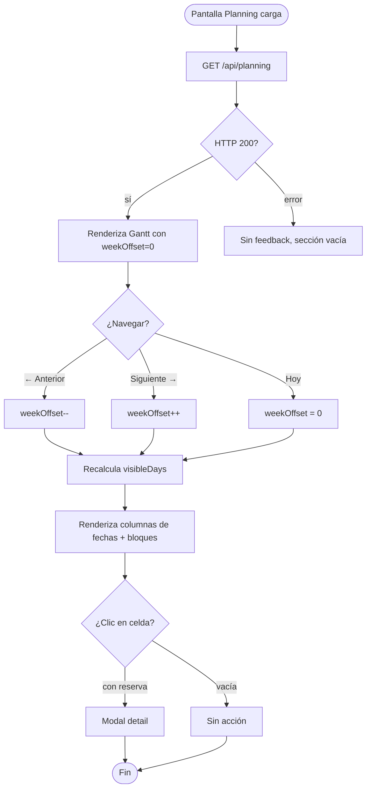
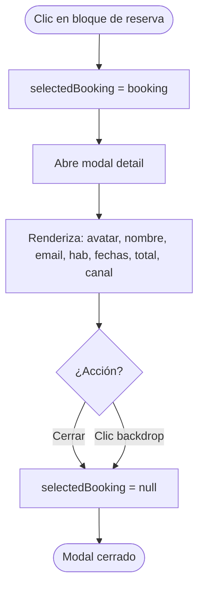

# FRD · T4 — Planning (Rack Calendar / Vista Gantt)

**Transversal:** T4
**Nombre:** Planificación — Rack Calendar
**Estado:** Implementado (parcial)
**Fecha:** 2026-06-19
**Pantalla:** `/panel/planning`
**Frontend:** `frontend/src/pages/planning/index.vue` (410 líneas)
**Backend:** Endpoint inline en `composition-root.ts:175-193` + módulos `reservas`, `habitaciones`, `guests`
**Servicio frontend:** `Operations.service.ts` → `planning(hotelId)`
**Roles:** `hotel_admin`, `receptionist`, `super_admin`

---

## 1. Propósito

Vista tipo rack/Gantt que muestra **todas las habitaciones** del hotel en filas y **días** en columnas, con bloques de color que representan reservas en el timeline. Permite al equipo de recepción y admin visualizar la ocupación, identificar gaps de disponibilidad, y navegar entre semanas/meses.

---

## 2. Modelo de datos (fuente de verdad)

### 2.1 Datos que consume

El endpoint `GET /api/planning` retorna:

```json
{
  "rooms": [{ "id", "number", "type", "status", "hotelId" }],
  "reservas": [{ "id", "roomId", "guestId", "checkIn", "checkOut", "status", "channel", "totalAmount", "guestName", "guestEmail", "roomNumber" }]
}
```

**Origen:** Combina datos de 3 tablas (rooms, reservations, guests) en un solo payload enriquecido.

### 2.2 Agrupación por tipo de habitación

Las habitaciones se agrupan visualmente por `room.type`:

| Tipo DB | Label UI | Color |
|---------|----------|-------|
| `single` / `simple` | Single | teal |
| `double` / `doble` | Double | cyan |
| `suite` | Suite | gold |
| `family` / `familiar` | Family | purple |
| `dorm` | Dorm | gray-400 |

### 2.3 Colores por canal de reserva

| Canal | Color bloque | Abreviatura |
|-------|-------------|-------------|
| `direct` / `directa` | teal | Dir |
| `booking` | cyan | B.com |
| `expedia` | gold | Exp |
| `airbnb` | coral | Air |
| `google` | blue | Goo |
| `whatsapp` | teal | WA |
| `phone` | teal | Tel |

### 2.4 Canales activos (Channex)

El componente carga canales conectados vía `GET /api/channels` (fetch directo, no vía OperationsService) y muestra en la leyenda solo los canales que tienen `conectado: true` o aparecen en reservas locales.

---

## 3. API Endpoints

| Método | Endpoint | Auth | Descripción |
|--------|----------|------|-------------|
| `GET` | `/api/planning?hotelId={id}` | hotel_admin, receptionist, super_admin | Rooms + Reservations enriquecidas |
| `GET` | `/api/channels?hotelId={id}` | auth token | Lista de canales para leyenda |

> ⚠ **Nota:** El endpoint `/api/channels` se llama con `fetch()` nativo en el componente (línea 239), NO vía OperationsService. Esto es inconsistente con el patrón del resto del proyecto.

---

## 4. Frontend — Desglose del componente

### 4.1 Estructura de la página

| Sección | Líneas | Descripción |
|---------|--------|-------------|
| Header | 3–29 | Título "Planificación", navegación de semana (←/→), botón "Hoy", selector de rango (7/14/30 días) |
| Leyenda | 32–53 | Muestra canales activos con colores + Blocked + Maintenance |
| Gantt Chart | 56–139 | Grid sticky: columna habitaciones (w-60) + columnas de fechas (flex-1 min-w-[60px]) |
| Room Type Group | 77–124 | Header de grupo con conteo de ocupadas/libres + filas de habitaciones individuales |
| Totals Row | 127–136 | Fila final con % de ocupación por día (color: teal <50%, gold 50-80%, coral >80%) |
| Booking Detail Modal | 142–179 | Modal de solo lectura al clickear un bloque de reserva |

### 4.2 Estado reactivo

| Variable | Tipo | Descripción |
|----------|------|-------------|
| `viewDays` | `ref(14)` | Cantidad de días visibles (7, 14, 30) |
| `weekOffset` | `ref(0)` | Offset de semanas desde hoy |
| `selectedBooking` | `ref<Booking \| null>` | Reserva seleccionada para modal detalle |
| `planRooms` | `ref<any[]>([])` | Habitaciones del hotel |
| `planReservas` | `ref<any[]>([])` | Reservas del hotel |
| `activeChannels` | `ref<Channel[]>([])` | Canales activos para leyenda |

### 4.3 Computed properties

| Computed | Descripción |
|----------|-------------|
| `visibleDays` | Array de `DateInfo[]` con los días a mostrar (fecha, nombre, número, mes, isToday, isWeekend) |
| `weekLabel` | Label del rango: "19 Jun — 3 Jul, 2026" |
| `roomTypes` | Agrupación de habitaciones por tipo con conteo de ocupadas |
| `totalRooms` | Total de habitaciones |
| `bookings` | Mapeo de reservas a formato `Booking` con guestName, channel, fechas, total |

### 4.4 Funciones principales

| Función | Línea | Descripción |
|---------|-------|-------------|
| `getBookingForDay(roomId, dateStr)` | 338 | Retorna la reserva activa para una habitación en un día específico |
| `isFirstDay(roomId, dateStr)` | 344 | Determina si es el primer día de la reserva (para renderizar el bloque) |
| `getBookingWidth(roomId, day)` | 350 | Calcula el ancho del bloque en px basado en la duración de la reserva |
| `getBookingColor(type)` | 360 | Mapea tipo de canal a color CSS |
| `getChannelColor(channel)` | 373 | Mapea canal a clase de color para el badge en modal |
| `handleCellClick(room, day)` | 384 | Abre modal detalle si hay reserva en esa celda |
| `getOccupancyForDay(dateStr)` | 396 | Calcula % de ocupación para un día |
| `prevWeek / nextWeek / today` | 407-409 | Navegación temporal |

---

## 5. Decision Table

| Trigger | Condición | Resultado | Modal/Toast (texto) | Errores | Notif F5 |
|---------|-----------|-----------|----------------------|---------|----------|
| Clic en celda con reserva | `getBookingForDay()` retorna booking | Abre **modal detail** de reserva | Modal `detail`: nombre huésped, email, habitación, check-in, check-out, total, canal | — | — |
| Clic en celda vacía | `getBookingForDay()` retorna null | **Ninguna acción** (sin feedback) | — | — | — |
| Botón **"←"** (prevWeek) | — | `weekOffset--`, recalcula `visibleDays` | — | — | — |
| Botón **"→"** (nextWeek) | — | `weekOffset++`, recalcula `visibleDays` | — | — | — |
| Botón **"Hoy"** | — | `weekOffset = 0`, vuelve a hoy | — | — | — |
| Selector **"7/14/30 días"** | — | Cambia `viewDays`, recalcula `visibleDays` | — | — | — |
| Botón **"Cerrar"** (modal detail) | modal abierto | Cierra modal | — | — | — |
| Clic en backdrop (`@click.self`) | modal abierto | Cierra modal | — | — | — |

### Gaps de interacción

- ❌ **Clic en celda vacía no abre modal de nueva reserva** — solo celdas con reserva abren el modal de detalle. Debería: abrir modal form con `roomId` + `checkIn` precargados (como en Reservas, M01 §3.1).
- ❌ **Sin drag-resize de reservas** — el bloque de reserva es estático, no permite cambiar fechas arrastrando.
- ❌ **Sin acción de check-in rápido** desde el rack (no hay botón, solo detalle de solo lectura).
- ❌ **Celda vacía no tiene indicador visual** de "disponible" (solo hover).

---

## 6. Flow — Navegación temporal



---

## 7. Flow — Ver detalle de reserva



---

## 8. Dependencias cross-módulo

| Módulo | Qué alimenta a T4 | Tipo |
|--------|-------------------|------|
| M01 — Habitaciones | `rooms[]` con id, number, type, status | Lectura |
| M01 — Reservas | `reservas[]` con roomId, fechas, channel, totalAmount, guestId | Lectura |
| M01 — Huéspedes | `guests[]` enriquece reservas con guestName, guestEmail | Lectura |
| M02 — Channel Manager | Canales activos para leyenda visual | Lectura |

> T4 es **solo lectura** — no dispara escrituras ni mutaciones a otros módulos.

---

## 9. Gap analysis — Implementado vs Target

| # | Aspecto | Estado actual | Target | Ubicación |
|---|---------|--------------|--------|-----------|
| G1 | Data loading | `OperationsService.planning()` vía GET | ✅ Correcto | `planning/index.vue:231` |
| G2 | Canales legend | `fetch()` nativo con token manual | Debe usar OperationsService o módulo canales | `planning/index.vue:239` |
| G3 | Error handling vacío | `catch { /* vacío */ }` — sin feedback al usuario | Toast E6 "No se pudo cargar la planificación" | `planning/index.vue:233` |
| G4 | Clic celda vacía | Sin acción | Abrir modal form de nueva reserva | `planning/index.vue:384-389` |
| G5 | Drag-resize reservas | No implementado | Permitir mover/extender bloques con drag | — |
| G6 | Check-in rápido desde rack | No implementado | Botón "Check-in" en modal detail si reserva=confirmed y fecha=hoy | — |
| G7 | Skeleton loading | No hay skeleton | Skeleton de filas Gantt mientras carga | — |
| G8 | Estado vacío | Sin habitaciones muestra Gantt vacío | Ilustración "Sin habitaciones configuradas" | — |
| G9 | Tooltip en hover | `title` nativo del navegador | Tooltip estilizado con info resumida | `planning/index.vue:109` |
| G10 | Modal detail solo lectura | No tiene acciones | Botones "Check-in" / "Check-out" / "Ir a Reserva" | `planning/index.vue:142-179` |
| G11 | Responsive | Grid horizontal con scroll | En mobile: vista vertical apilada o scroll horizontal con snap | — |
| G12 | Accesibilidad | Sin aria-labels ni keyboard navigation | Navegación con flechas, Enter para abrir detalle | — |

---

## 10. Checklist de verificación T4

### Data
- [ ] `GET /api/planning` retorna rooms + reservas enriquecidas
- [ ] Habitaciones agrupadas por tipo con conteo correcto
- [ ] Reservas se renderizan en la celda correcta (roomId + rango de fechas)
- [ ] Bloque de reserva muestra guestName, canal abreviado, total

### Navegación temporal
- [ ] "← Anterior" retrocede 7 días (o el `viewDays` seleccionado)
- [ ] "Siguiente →" avanza 7 días
- [ ] "Hoy" vuelve al día actual
- [ ] Selector 7/14/30 días cambia la cantidad de columnas visibles
- [ ] Label del rango se actualiza correctamente

### Interacción
- [ ] Clic en bloque de reserva abre modal con datos correctos
- [ ] Clic en celda vacía abre modal de nueva reserva (⚠ NO implementado)
- [ ] Clic en backdrop cierra el modal
- [ ] Botón "Cerrar" cierra el modal

### Visual
- [ ] Colores de canal consistentes con la leyenda
- [ ] Fila de Totales muestra % de ocupación correcto
- [ ] Día actual resaltado en cyan
- [ ] Fines de semana con fondo diferenciado
- [ ] Sticky header al hacer scroll horizontal

### Errores
- [ ] Sin feedback al fallar `GET /api/planning` (⚠ gap: catch vacío)
- [ ] Sin skeleton loading (⚠ gap)
- [ ] Sin estado vacío para hotel sin habitaciones (⚠ gap)

---

*Documento generado desde código real: `frontend/src/pages/planning/index.vue` + `backend/src/composition-root.ts:175-193`.*
