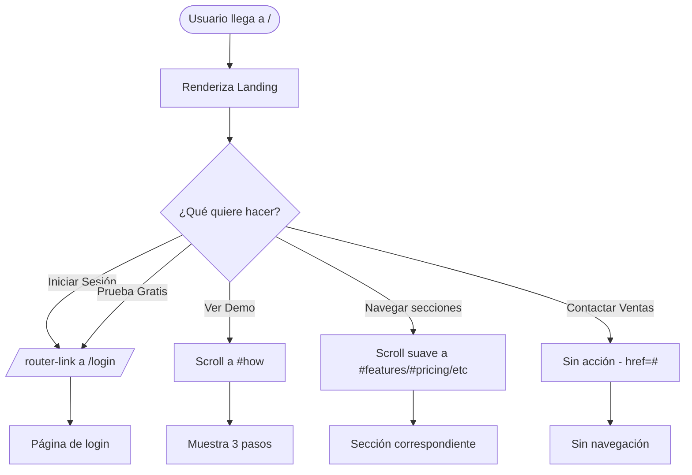

# FRD · T6 — Landing Page (Público / Marketing)

**Transversal:** T6
**Nombre:** Landing Page — Marketing Público
**Estado:** Implementado (parcial)
**Fecha:** 2026-06-19
**Pantalla:** `/` (ruta raíz)
**Frontend:** `frontend/src/pages/landing/index.vue` (523 líneas)
**Backend:** Ninguno (página estática, sin API calls)
**Servicio frontend:** Ninguno (componente puro, `<script setup>` vacío)
**Roles:** Público (sin autenticación)

---

## 1. Propósito

Página de marketing público que presenta ManagerHotel como producto SaaS para hoteles. Es la primera impresión para potenciales clientes: muestra funciones, pricing, testimonios, integraciones y un CTA para registrarse. **No es la página de booking de un hotel específico** (eso es M03 Motor de Reservas).

---

## 2. Modelo de datos

### 2.1 Datos

**No consume datos de backend.** Todo el contenido es hardcoded en el componente:

| Sección | Datos | Tipo |
|---------|-------|------|
| Social Proof | Nombres de 5 hoteles (Hotel Caribe, Gran Hotel SD, etc.) | Estático |
| Features | 6 features con icono, título, descripción | Estático |
| Integraciones | 8 logos (Booking, Expedia, Airbnb, Stripe, SendGrid, DataDog, S3, API) | Estático |
| Pricing | 3 planes (Starter $49, Professional $99, Enterprise $199) | Estático |
| Testimonials | 3 testimonios con avatar, nombre, hotel, quote, rating | Estático |
| Quick stats | "24+ hoteles activos", "84% ocupación", etc. | Estático |

---

## 3. API Endpoints

**Ninguno.** La landing page no hace llamadas a backend. Es 100% estática.

---

## 4. Frontend — Desglose del componente

### 4.1 Estructura de la página

| Sección | Líneas | Descripción |
|---------|--------|-------------|
| Navbar | 3–24 | Logo "ManagerHotel", links ancla (#features, #how, #integrations, #pricing, #testimonials), botones "Iniciar Sesión" y "Prueba Gratis" |
| Hero | 27–99 | Gradiente navy, badge "Hospitality OS #1 en LATAM", título, subtítulo, CTAs ("Comenzar Gratis", "Ver Demo"), dashboard mockup flotante, avatares "24+ hoteles activos" |
| Social Proof Bar | 102–115 | 5 logos de hoteles (texto opaco, sin imágenes reales) |
| Features (Bento Grid) | 118–213 | Grid 3 columnas: Channel Manager (grande, 2 cols), Housekeeping, Facturación, Analytics, Night Audit, Mantenimiento |
| How It Works | 216–242 | 3 pasos: Registra tu hotel, Conecta tus canales, Gestiona todo |
| Integrations | 245–296 | Grid 4x2 de logos de integraciones |
| Pricing | 299–368 | 3 cards: Starter ($49), Professional ($99, "Más Popular"), Enterprise ($199) |
| Testimonials | 371–421 | 3 cards con rating 5★, quote, avatar, nombre, hotel |
| CTA Final | 424–441 | Gradiente navy, "¿Listo para transformar tu hotel?", CTAs |
| Footer | 444–491 | Logo, links Producto/Empresa/Soporte, copyright, Privacidad/Términos/Cookies |

### 4.2 Router links

| Link | Destino | Tipo |
|------|---------|------|
| "Iniciar Sesión" | `/login` | `router-link` |
| "Prueba Gratis" (×3) | `/login` | `router-link` |
| "Empezar Gratis" Starter/Professional | `/login` | `router-link` |
| "Contactar Ventas" Enterprise | `#` (sin destino) | `<a href="#">` |
| "Hablar con Ventas" CTA final | `#` (sin destino) | `<a href="#">` |

### 4.3 Anclas (scroll suave)

| Anchor | Sección |
|--------|---------|
| `#features` | Funciones (Bento Grid) |
| `#how` | Cómo Funciona |
| `#integrations` | Integraciones |
| `#pricing` | Precios |
| `#testimonials` | Testimonios |

### 4.4 Estilos scoped

| Clase | Descripción |
|-------|-------------|
| `.gradient-hero` | Gradiente navy oscuro (#0D2B4E → #1A3A5C) |
| `.gradient-card` | Gradiente cyan → teal |
| `.text-gradient` | Texto con gradiente cyan → teal (clip text) |
| `.card-shadow` / `.card-shadow-lg` | Sombras de elevación |
| `.float` | Animación flotante 6s para dashboard mockup |

---

## 5. Decision Table

| Trigger | Condición | Resultado | Modal/Toast | Errores |
|---------|-----------|-----------|-------------|---------|
| Clic **"Iniciar Sesión"** (navbar) | — | Navega a `/login` | — | — |
| Clic **"Prueba Gratis"** (navbar) | — | Navega a `/login` | — | — |
| Clic **"Comenzar Gratis"** (hero) | — | Navega a `/login` | — | — |
| Clic **"Ver Demo"** (hero) | — | Scroll a `#how` | — | — |
| Clic **"Empezar Gratis"** (Starter) | — | Navega a `/login` | — | — |
| Clic **"Empezar Gratis"** (Professional) | — | Navega a `/login` | — | — |
| Clic **"Contactar Ventas"** (Enterprise) | — | **Nada** (href="#") | — | — |
| Clic **"Comenzar Gratis"** (CTA final) | — | Navega a `/login` | — | — |
| Clic **"Hablar con Ventas"** (CTA final) | — | **Nada** (href="#") | — | — |
| Clic en links de navbar (#features, etc.) | — | Scroll suave a sección | — | — |
| Clic en footer links (Funciones, etc.) | — | Scroll suave o href="#" | — | — |
| Clic **"Privacidad" / "Términos" / "Cookies"** | — | **Nada** (href="#") | — | — |
| Clic en logo ManagerHotel | — | **Nada** (no es router-link) | — | — |

---

## 6. Flow — Navegación pública

---

## 7. Secciones detalladas

### 7.1 Hero Section

- Badge pill: "Hospitality OS #1 en LATAM" con punto pulsante teal
- Título: "Gestiona tu hotel sin complejidad"
- Subtítulo: "La plataforma todo-en-uno que conecta reservas, housekeeping, facturación y channel manager en un solo lugar."
- CTAs: "Comenzar Gratis" (cyan) + "Ver Demo" (blanco/10)
- Social proof: 4 avatares + "24+ hoteles activos"
- Dashboard mockup flotante (animación): muestra ocupación 84%, 7 check-ins, $1.2k ingresos, grid de 8 habitaciones con colores

### 7.2 Features (Bento Grid)

| Feature | Tamaño | Icono | Descripción |
|---------|--------|-------|-------------|
| Channel Manager | 2 cols | 📅 | Sincronización con 50+ OTAs, cada 15 min |
| Housekeeping | 1 col | 🧹 | Tablero Kanban (pendientes/en progreso/completadas) |
| Facturación Electrónica | 1 col | 💰 | DGII, DIAN, SAT — 6 países LATAM |
| Analytics & Reportes | 1 col | 📊 | KPIs: ADR, RevPAR, ocupación, revenue |
| Night Audit | 1 col | 🌙 | Cierre diario automatizado |
| Mantenimiento | 1 col | 🔧 | Órdenes de trabajo, categorías, costos |

### 7.3 Pricing

| Plan | Precio | Habitaciones | Usuarios | Features clave |
|------|--------|-------------|----------|----------------|
| Starter | $49/mes | ≤30 | 2 | Channel Manager básico, Reservas, Soporte email |
| Professional | $99/mes | ≤100 | 6 | CM completo, Housekeeping, Facturación, Reportes, Soporte prioritario |
| Enterprise | $199/mes | Ilimitadas | Ilimitadas | Multi-propiedad, AI, API, Soporte 24/7, Account Manager |

---

## 8. Dependencias cross-módulo

| Módulo | Relación | Tipo |
|--------|----------|------|
| Auth (login) | Destino de todos los CTAs | Navegación |
| M03 Motor de Reservas | NO está conectado (landing es marketing, no booking) | Independiente |

> T6 es **completamente independiente** — no consume datos de ningún módulo de negocio.

---

## 9. Gap analysis — Implementado vs Target

| # | Aspecto | Estado actual | Target | Ubicación |
|---|---------|--------------|--------|-----------|
| G1 | Datos hardcoded | Todo el contenido es estático en el componente | CMS/headless para contenido dinámico (nombres de hoteles, pricing, testimonials) | `landing/index.vue` (todo) |
| G2 | Social Proof | 5 nombres de texto opaco, sin logos reales | Logos SVG reales de hoteles clientes (con permiso) | `landing/index.vue:108-112` |
| G3 | Testimonials | Quotes genéricos, posiblemente ficticios | Testimonios reales con foto + nombre verificado | `landing/index.vue:379-419` |
| G4 | "Contactar Ventas" | `href="#"` sin acción | Modal de contacto o mailto: o link a Calendly | `landing/index.vue:355,438` |
| G5 | "Hablar con Ventas" | `href="#"` sin acción | Mismo que G4 | `landing/index.vue:438` |
| G6 | Logo navbar | No es router-link a `/` | Clic en logo debería navegar a `/` | `landing/index.vue:6-9` |
| G7 | Dashboard mockup | Datos mock (84%, 7, $1.2k) sin conexión a data real | Podría ser un screenshot real o animación con datos de demo | `landing/index.vue:70-96` |
| G8 | SEO / Meta tags | Sin `<title>`, `<meta description>`, Open Graph | Meta tags para SEO + sharing en redes sociales | — |
| G9 | Performance | Animación `.float` 6s + blur 3xl + backdrop-blur | Medir CLS/LCP, posiblemente optimizar blur | `landing/index.vue:498-522` |
| G10 | Responsive | Usa `md:` breakpoints, pero hero grid puede romper en mobile <375px | Testing en 320px-375px | `landing/index.vue:33` |
| G11 | Footer links | Muchos `href="#"` sin destino | Links reales a /privacidad, /terminos, etc. o remove | `landing/index.vue:456-479` |
| G12 | Formulario de contacto | No existe | Form "Hablar con ventas" con name, email, hotel name, message | — |
| G13 | Tracking/analytics | Sin eventos de tracking | Track clicks en CTAs, scroll depth, bounce rate | — |
| G14 | Accesibilidad | Sin aria-labels en navbar, sin skip links | Agregar aria, roles, skip-to-content | — |

---

## 10. Checklist de verificación T6

### Contenido
- [ ] Hero muestra título, subtítulo, CTAs correctos
- [ ] 6 features con icono, título, descripción
- [ ] 3 planes de pricing con precio y features
- [ ] 3 testimonios con rating, quote, nombre, hotel
- [ ] 8 integraciones con logo y nombre
- [ ] Social proof bar con 5 nombres de hoteles

### Navegación
- [ ] Navbar: "Iniciar Sesión" → `/login`
- [ ] Navbar: "Prueba Gratis" → `/login`
- [ ] Hero: "Comenzar Gratis" → `/login`
- [ ] Hero: "Ver Demo" → scroll a `#how`
- [ ] Pricing: "Empezar Gratis" → `/login`
- [ ] Anclas: #features, #how, #integrations, #pricing, #testimonials funcionan

### Feedback
- [ ] Sin `alert()` nativo ✅
- [ ] Sin modales de error ✅ (no hay interacciones que fallen)
- [ ] Sin loading states ✅ (no hay data fetching)

### Visual
- [ ] Gradiente hero correcto (navy oscuro)
- [ ] Dashboard mockup flotante con animación
- [ ] Cards con sombra (card-shadow)
- [ ] Colores consistentes: cyan, teal, navy, coral, gold, purple
- [ ] Responsive en mobile/tablet/desktop
- [ ] Footer con 4 columnas de links

### SEO (⚠ NO implementado)
- [ ] `<title>` tag dinámico
- [ ] `<meta description>` 
- [ ] Open Graph tags para sharing
- [ ] Canonical URL
- [ ] Schema.org Organization

### Seguridad
- [ ] Sin datos sensibles expuestos
- [ ] Sin API keys en el código
- [ ] Sin scripts externos no integrity-checked

---

*Documento generado desde código real: `frontend/src/pages/landing/index.vue` (523 líneas). Página 100% estática, sin backend.*
