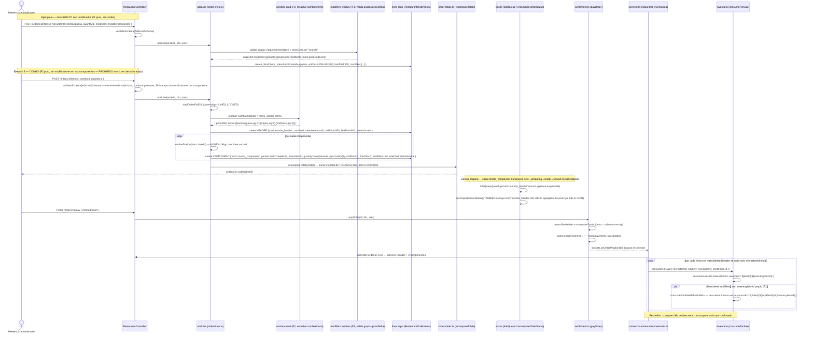

# Design: Carta del restaurante — experiencia avanzada

Change: `carta-experiencia-avanzada` · Fases: F1 (modificadores), F2 (combos), F3 (food
cost), F4 (i18n), F5 (alérgenos), F6 (destacados/franja), F7 (carta pública), F8 (drag &
drop). Todas las specs (`specs/menu-*/spec.md`) están COMPLETAS y auditadas — este
documento no repite su contenido, lo referencia y resuelve las decisiones que cruzan
fases.

## Technical Approach

Ocho fases aditivas sobre `backend/src/modules/restaurant/` (dueño de
`menu_categories`/`menu_items`/`restaurant_order_items`, y de las tablas nuevas
`menu_item_modifier_groups`/`menu_item_modifiers`/`menu_combos`/`menu_combo_items`) más
extensiones puntuales de `backend/src/modules/inventario/` (el puerto `recipePorts`) y del
frontend (`carta.vue`, `comanda.vue`, `menu.vue` nuevo). Ningún cambio toca
`order-totals.ts` ni `settlement.ts` — ambos siguen sumando `lineTotal` por fila sin
enterarse de `kind`, que es exactamente la propiedad que hace posible que F1/F2 no
reabran la lógica de cobro (verificado leyendo `order-totals.ts:36-54` y
`settlement.ts` completos: ninguno filtra por `menuItemId` ni por tipo de línea, solo por
`status !== 'cancelled'`).

Se leyó el código real (no solo las specs) antes de diseñar: `model.ts`,
`order-lines.ts`, `kds.ts`, `order-totals.ts`, `settlement.ts`, el conector
`restaurante-inventario.ts`, `inventario/usecases/recipes.ts`, `items-crud.ts`,
`restaurant/index.ts` (rutas + guards), `shared/permissions.ts`,
`shared/middlewares/rate-limit.ts`, `infrastructure/auth/require-module.ts` y el patrón
público de `bookingengine/index.ts:70` + `controller.ts:60-66`. Los hallazgos que
contradicen o afinan las specs quedan documentados abajo con su archivo:línea exacta.

## Orden de implementación de las 8 fases

**Orden recomendado: F1 → F2 → F3 → F4 → F5 → F6 → F7 → F8** (igual al orden del
`proposal.md`), pero por razones de dependencia real, no por convención. Detalle fase por
fase:

| Fase | ¿Puede ir antes de las anteriores? | Por qué |
|---|---|---|
| **F1** Modificadores | Sí, primera de todas | No depende de nada. Toca `restaurant_order_items.modifiers` y `AddLineSchema`, ningún otro dominio. |
| **F2** Combos | Depende de F1 solo en el sentido de que ambas tocan `addLine`/`AddLineSchema` en el mismo archivo — conviene mergear F1 primero para que F2 extienda una función ya estable, no al revés. Funcionalmente son independientes (ninguna requiere que la otra exista). | `order-lines.ts:61-86` es el punto de fusión de ambas fases; ver "Riesgo transversal" abajo. |
| **F3** Food cost | **Depende de F2 para su mitad de combos.** El endpoint `GET /combos/:id/food-cost` (spec F3, sección API) necesita que `menu_combos`/`menu_combo_items` existan. La mitad de ítem simple (`GET /menu-items/:id/food-cost`) es independiente y podría ir antes de F2 — pero implementarla dos veces (antes y después de F2) es trabajo duplicado sin beneficio real, así que va después de F2 completo. | `menu-food-cost/spec.md` Requirement "Food cost de un combo = suma ponderada de sus componentes" cita explícitamente `menu_combo_items`. |
| **F4** i18n | Independiente de F1/F2/F3 en columnas (`translations` en `menu_categories`/`menu_items`), pero su alcance declarado EXTIENDE a `menu_combos` ("Combos (F2) traducen igual que los ítems", `menu-i18n/spec.md` línea 94-103) — **requiere que F2 ya haya creado la tabla** para poder agregarle la columna `translations`. Si F4 se implementara antes de F2, quedaría una fase pendiente de volver a tocar cuando F2 llegue (ADD COLUMN tardío sobre una tabla que en ese momento no existe). | Mismo razonamiento que F3: dependencia real, no de orden por conveniencia. |
| **F5** Alérgenos | Independiente — solo `menu_items.allergens`. Su único acoplamiento con F2 es de LECTURA (alérgenos de combo = unión derivada en el usecase, sin columna en `menu_combos`), así que no bloquea nada si F2 ya está aplicado, pero tampoco requiere que F4 lo esté. | `menu-allergens/spec.md`: "`menu_combos` NO recibe columna `allergens`". |
| **F6** Destacados/franja | Independiente — solo columnas en `menu_items`. Señala (sin resolverlo, deuda documentada en la propia spec) que F2 NO valida `available`/franja al explotar un combo — ver Riesgos transversales. | `menu-featured-availability/spec.md`, sección "Gap detectado, fuera de alcance". |
| **F7** Carta pública | **No tiene dependencia dura de F4/F5/F6.** El usecase `public-menu.ts` arma el DTO por allow-list (spec F7, sección API: "filtrando explícitamente los campos permitidos"); si `translations`/`allergens`/`featured`/`availableFrom`/`availableTo` todavía no existen como columnas, esos campos simplemente no están en el objeto leído y el DTO los omite/deja en su default (fallback a español, sin alérgenos, sin franja) — no revienta. La razón real para implementarla DESPUÉS de F4/F5/F6 es evitar tocar `public-menu.ts` cuatro veces (una por cada campo que se suma después) en vez de una sola vez con todos los campos ya disponibles. Si el negocio necesita el QR de mesa antes de tener las otras fases listas, **F7 standalone primero es viable** — es una decisión de secuencia por costo de retrabajo, no un bloqueo técnico. Si F2 no está aplicado, `combos: []` sale vacío sin error (mismo criterio "no está montado → responde vacío" que ya usa `recipePorts`). | `menu-public/spec.md`: "Si F4 no está aplicado (o el ítem no tiene esa traducción), la respuesta cae al español sin error" — la propia spec ya lo dice explícitamente. |
| **F8** Drag & drop | Totalmente independiente — 100% frontend, cero cambios de modelo/API (`menu-ordering/spec.md`, sección Database: "Ninguna tabla ni columna nueva ni modificada"). Puede ir en cualquier momento, incluso primero, sin afectar ni ser afectada por F1-F7. | Confirmado: reusa `PUT /categories/:id` y `PUT /menu-items/:id` que ya existen desde `restaurante-pos`. |

**Resumen de dependencias duras** (las únicas que de verdad bloquean orden):
- F3 (parte combo) → requiere F2 aplicado.
- F4 (parte combo) → requiere F2 aplicado.
- Todo lo demás es secuenciable por conveniencia (menos retrabajo), no por bloqueo técnico.

## Diagrama de secuencia — combo con modificadores en un componente, cobro, descuento de stock

Este es el punto de mayor riesgo del change: F1 (modificadores) y F2 (combos) tocan la
MISMA fila (`restaurant_order_items`) y el MISMO usecase (`addLine`), y ninguna de las dos
specs describe qué pasa cuando ambas se combinan (ver "Decisión de diseño: modificadores
dentro de un combo" más abajo — es una laguna real entre specs, no una contradicción, y la
resuelvo con una regla explícita en vez de dejarla implícita).



**Puntos verificados contra código real** (no supuestos):
- El conector (`restaurante-inventario.ts:24-35`) NO cambia una línea de código: itera
  `full.lines`, salta las que no tienen `menuItemId` (el header), y llama
  `consumeForSale` por cada una — el header se autoexcluye por el chequeo `if
  (!l.menuItemId ...) continue` que YA EXISTE hoy.
- `recomputeOrderStatus` (`kds.ts:73-84`) hoy filtra solo `status !== 'cancelled'` — el
  fix de F2 (excluir también `kind==='combo_header'`) es un cambio real de código en ese
  archivo, no cosmético: sin él, el header queda en `status:'new'` para siempre (nunca
  pasa por el KDS) y `active.every(...)` nunca se cumple → la orden queda encallada en
  `'preparing'`.

### Decisión de diseño: modificadores dentro de un combo — PROHIBIDOS en v1 (laguna entre F1 y F2, resuelta por el orquestador)

Ni `menu-modifiers/spec.md` ni `menu-combos/spec.md` decían qué pasa si un componente de
un combo tiene grupos de modificadores configurados (ej. elegir el punto de cocción de la
carne dentro de "Combo Familiar"). Era una laguna real, no una contradicción — cada spec es
completa en su propio dominio, pero el cruce no estaba escrito en ninguna de las dos. El
propio design había propuesto una variante condicional (permitir solo `priceDelta=0`) y la
dejó sin confirmar. **Decisión tomada (no del agente, del orquestador humano-en-el-loop):
se prohíbe COMPLETAMENTE elegir modificadores dentro de un componente de combo en esta v1**
— no la variante condicional.

**Por qué la prohibición total y no la restricción condicional**: la restricción
"`priceDelta=0` permitido, `priceDelta≠0` rechazado" sigue dejando superficie de riesgo:
requiere que el usecase valide correctamente esa regla en cada combinación, es un camino de
código nuevo que nadie pidió, y un bug de validación ahí abriría un hueco de precio real
(upsize gratis). La prohibición total es cero superficie: un componente de combo se vende
"tal cual" lo define el combo, sin selector de modificadores en la UI ni campo aceptado por
el backend. Es coherente con el criterio que el propio `proposal.md` ya usa para otras
exclusiones (self-order, impresión térmica): la opción más simple gana cuando no hay
urgencia de negocio confirmada. Si más adelante se necesita personalizar componentes de un
combo, es una fase F9 acotada con su propia spec — no se improvisa acá.

**Regla concreta**: `AddLineInput` para un combo (`comboId` presente) NO acepta ningún
campo de modificadores por componente. El usecase `addLine` MUST ignorar/rechazar cualquier
intento de pasar modificadores junto a un `comboId` (400 si el body los incluye, para no
fallar en silencio). Las filas `combo_component` NUNCA tienen `modifiers` poblado — el
campo queda `null` igual que hoy, sin código nuevo de parseo en ese camino.

## Diagrama de secuencia — F7 carta pública (sin auth)

```mermaid
sequenceDiagram
    actor G as Huésped (celular, QR de mesa)
    participant R as Router (sin auth.authenticate())
    participant RL as rate-limit.ts
    participant PM as public-menu.ts (usecase nuevo)
    participant MG as chequeo directo de módulo (getModuleStateForPlan)
    participant REPO as repos (categories/items/combos)

    G->>R: GET /api/public/menu/:hotelId?lang=en
    R->>RL: rateLimit('public-menu:'+hotelId+':'+getClientIp(req), {maxAttempts:120, windowMs:300000})
    alt excede el límite propio de esta ruta
        RL-->>G: 429 { retryAfter }
    else dentro del límite
        R->>PM: publicMenu(hotelId, lang)
        PM->>REPO: hotels.findOne({id:hotelId})
        alt hotel no existe
            PM-->>G: 404 genérico
        else hotel existe
            PM->>MG: getModuleStateForPlan(configRepo, plansRepo, hotel.plan) — SIN pasar por auth.authenticate()
            alt restaurant === false para este hotel/plan
                PM-->>G: 404 genérico (mismo mensaje que "hotel no existe" — no filtra cuál es el caso)
            else módulo habilitado
                PM->>REPO: listCategories + listItems + listCombos (ya existentes, reusados)
                PM->>PM: resuelve name/description por lang (fallback campo-por-campo a español, F4)
                PM->>PM: arma DTO por ALLOW-LIST campo por campo (nunca spread del DTO interno)
                Note over PM: excluye SIEMPRE cost/margin/marginPercent/hasRecipe/complete/avgCost/currentStock/stationId/stationName/sortOrder/taxRate/hotelId-por-fila
                PM->>PM: filtra available=0 (86'd) del todo; conserva fuera-de-franja con availableNow:false
                PM-->>G: 200 { hotel:{name}, categories:[...], combos:[...] }
            end
        end
    end
```

**Detalle de la resolución de módulo sin sesión**: `createModuleGuard`
(`infrastructure/auth/require-module.ts:20-34`) hoy depende de `req.user` — no sirve tal
cual para una ruta sin `auth.authenticate()`. F7 MUST llamar directo a
`getModuleStateForPlan(configRepo, plansRepo, hotel.plan)` (la misma función que
`createModuleGuard` usa internamente, `admin/usecases/modules.ts:153-168`) dentro del
propio usecase `public-menu.ts`, sin pasar por el middleware — exactamente lo que la spec
F7 ya indica ("NO usa `moduleGuard`... sino un chequeo directo"), y lo confirmo viable
porque `getModuleStateForPlan` no toca `req` ni `auth` en ningún punto de su firma.

## Architecture Decisions

| # | Decisión | Alternativas consideradas | Rationale |
|---|---|---|---|
| D1 | F1: modificadores se snapshotean en la MISMA fila (`restaurant_order_items.modifiers` JSON), no como sub-líneas | Sub-línea propia con su `lineTotal` (texto original del `proposal.md`) | Cero cambios en `order-totals.ts`/`settlement.ts` (ya verificado: ambos solo suman `lineTotal` por fila). Ya corregido en la propia spec F1, este design lo confirma contra el código real. |
| D2 | F2: la explosión combo→componentes vive en el usecase `restaurant` (`addLine`/`combos-crud.ts`), el conector `restaurante-inventario.ts` no cambia | Conector resuelve combo→N `consumeForSale` (texto original del `proposal.md`) | Viola "connector solo DELEGA vía sockets" — la lógica de explosión es de dominio (`restaurant`), no de cableado. Ya corregido en la spec F2; confirmado leyendo `restaurante-inventario.ts:24-35` completo: hoy ya es un loop tonto sobre `full.lines`, cero rama nueva necesaria. |
| D3 | F2: `AddLineSchema.menuItemId` pasa de `required:true` a condicional (schema no valida XOR, el usecase sí) | Mantener `required:true` y agregar un schema separado para combos | Un segundo schema duplicaría `quantity`/`notes` y complicaría el controller (dos rutas para "agregar línea" en vez de una). El validator no puede expresar XOR entre dos campos opcionales — se acepta que el schema sea más laxo y el usecase sea la única fuente de verdad de la regla real. |
| D4 | F3: el food cost de combo vive en `restaurant` (no en `inventario`), sumando `recipePorts.getRecipeCost` por componente | Usecase de food cost completo en `inventario`, exponiendo un solo endpoint agregado | `inventario` no conoce combos (serían un import cruzado prohibido); `restaurant` ya es dueño de `menu_combos`/`menu_combo_items`, así que la suma pertenece ahí. `inventario` solo expone el dato atómico por ítem vía el puerto ya existente. |
| D5 | F3: `restaurant-catalog:view` es un permiso NUEVO EN USO, deliberadamente más estricto que `restaurant:view` | Reusar `restaurant:view` (el mismo que ya ve el precio) | Costo de receta y margen son datos de rentabilidad, no de operación — mesero/cocina ya ven precio de venta pero nunca tuvieron `restaurant-catalog` en ningún rol operativo (`permissions.ts:198-213`, solo `hotel_admin`). Verificado: hoy NINGUNA ruta usa `restaurant-catalog:view` para lectura (solo para mutación en `restaurant/index.ts:69-88`) — F3 es el primer consumidor real de esa combinación permiso+acción. |
| D6 | F4: `translations` es `type:'json'` nativo del ORM, no un `string` serializado a mano | Replicar el patrón de `hotels.descriptionJson` (string + `JSON.stringify`/`parse` manual en el componente) | Los módulos más nuevos (`ai-recepcionista`, `canales`, `bookingengine`, `paquetes`) ya usan `type:'json'` nativo, que además tiene soporte dedicado en `shared/validators/validate-body.ts:56-61`. `hotels.descriptionJson` es deuda vieja, no el patrón a seguir. |
| D7 | F4: el idioma base ("fallback final") es **español fijo**, nunca una config por hotel | Leer un `hotels.baseLanguage` configurable | La tabla `hotels` no tiene ninguna columna de idioma — no existe hoy. La regla del proyecto "Spanish UI / English DB-API-code" (`openspec/config.yaml`) ya fija español como el idioma de UI de toda la plataforma. Introducir un idioma-base configurable sería alcance nuevo no pedido. |
| D8 | F5: catálogo de alérgenos fijo en código (`ALLERGEN_TAGS`), no una tabla administrable | Tabla `menu_allergen_tags` con CRUD propio (catálogo administrable) | El `proposal.md` fija "sin tabla nueva" para F4-F6. Un catálogo administrable con validación real sería trabajo nuevo no justificado — los alérgenos son una lista razonablemente estándar. Mismo patrón que enums existentes del módulo (`OrderType`, `LineStatus` en `types.ts`). |
| D9 | F5: alérgenos de combo se derivan (unión de componentes) al LEER, nunca se persisten en `menu_combos` | Campo `menu_combos.allergens` editable a mano | Un campo editable a mano queda desactualizado si se cambia un componente después — mismo riesgo que ya evita `hasRecipe`/`menuItemsWithRecipe` (derivar en vez de duplicar). |
| D10 | F6: la hora de comparación es la del SERVIDOR (`new Date()`), sin timezone del hotel | Convertir a `hotel.timezone` antes de comparar | `hotels.timezone` existe en la tabla pero ningún módulo la usa hoy para esto (único precedente, `attendance/clock.ts:43-47`, tampoco la usa). Introducir conversión de zona horaria nueva sería alcance no pedido y una fuente de bugs sutiles (DST, etc.) sin ningún precedente que la valide. Deuda conocida, compartida con `attendance`. |
| D11 | F7: `hotelId` (UUID) crudo en el path, sin slug amigable | Slug derivado del nombre del hotel (como `/api/public/booking/:slug`) | No hay necesidad de un slug legible para un QR de mesa (nadie lo tipea a mano). El UUID no es enumerable; el riesgo de scraping ya lo asume `bookingengine` con el mismo mecanismo (`/api/public/hotel/:slug` usa el id crudo) sin que el proyecto lo haya tratado nunca como problema de seguridad. |
| D12 | F7: rate-limit con clave y límite PROPIOS (120/5min, compuesto hotel+IP) | Reusar el límite de `/api/auth/login` (20/5min) | Login resetea el contador tras éxito (`resetAttempts`); la carta pública no tiene ningún evento de "éxito" que lo resetee, así que CADA request (legítimo o no) suma contra el límite. Con el límite de login, un WiFi de hotel compartido alcanzaría 429 en tráfico normal del almuerzo. **Requiere extender `rateLimit()` — ver D13, gap real encontrado en esta revisión.** |
| D13 (nueva, no estaba en ninguna spec) | `shared/middlewares/rate-limit.ts` debe extender su firma para aceptar límites propios por ruta | — | Ver "Riesgos transversales" abajo — es un hallazgo de este design, no de las specs. |
| D14 | F8: HTML5 Drag and Drop API nativo (`draggable`, `@dragstart`/`@dragover.prevent`/`@drop.prevent`) | Instalar `vuedraggable`/`sortablejs` | `frontend/package.json` no tiene ninguna librería de drag-and-drop hoy; el patrón nativo YA se usa en 3 pantallas (`housekeeping/index.vue`, `maintenance/index.vue`, `ReservationsGantt.vue`). Agregar una dependencia nueva para algo que el proyecto ya resuelve sin ella no se justifica. |

### Hallazgo propio (no citado por ninguna spec): `rateLimit()` hoy es un límite GLOBAL, no parametrizable

Leyendo `shared/middlewares/rate-limit.ts:1-35` completo: `MAX_ATTEMPTS=20` y
`WINDOW_MS=5*60_000` son **constantes de módulo**, no parámetros de la función. La firma
real es `rateLimit(key: string)` — no acepta ningún segundo argumento. La spec F7
(`menu-public/spec.md`, línea 76) escribe el ejemplo de llamada como si `rateLimit`
aceptara un segundo parámetro `{ maxAttempts, windowMs }`:

```
rateLimit('public-menu:' + hotelId + ':' + getClientIp(req), { maxAttempts: 120, windowMs: 5 * 60_000 })
```

Esa firma **no existe hoy en el código**. Si F7 llama a `rateLimit(key)` tal cual está
implementado, obtiene el límite de LOGIN (20 intentos/5min) compartido con TODOS los demás
usos de `rateLimit()` en el proyecto (login, verify-email, resend-verif, forgot-password,
reset-password, create-user — **6 call-sites reales, corregido post-tasks**: `usuarios/index.ts:82`
tiene un 6º consumidor, `resend-verif`, que no estaba contado en la primera lectura de este
design) — exactamente el bug que la propia spec F7 dice evitar
("nunca el mismo `key`/límite que `/api/auth/login`"), porque hoy es un límite de
proceso completo, no por-key.

**Decisión de diseño para resolverlo** (no estaba en ninguna spec, es hallazgo de este
design): extender `rateLimit()` para aceptar un tercer... segundo parámetro opcional de
override:

```ts
export function rateLimit(
  key: string,
  opts?: { maxAttempts?: number; windowMs?: number },
): { allowed: boolean; retryAfter?: number }
```

Con default `opts.maxAttempts ?? MAX_ATTEMPTS` y `opts.windowMs ?? WINDOW_MS` — **100%
retrocompatible**: los 6 call-sites existentes (`usuarios/index.ts`) siguen llamando
`rateLimit(key)` sin segundo argumento y se comportan IGUAL que hoy. F7 es el primer
consumidor que pasa `opts`. Esto agrega `backend/src/shared/middlewares/rate-limit.ts`
como archivo MODIFICADO del change — no estaba en la tabla "Affected Areas" del
`proposal.md`, que solo menciona módulos de `restaurant/`. Lo agrego a la tabla de File
Changes abajo.

## File Changes

| File | Action | Fase | Description |
|---|---|---|---|
| `backend/src/modules/restaurant/model.ts` | Modify | F1/F2/F4/F5/F6 | Registra `MenuItemModifierGroupModel`, `MenuItemModifierModel`, `MenuComboModel`, `MenuComboItemModel`; agrega columnas nullable a `RestaurantOrderItemModel` (`modifiers`, `kind`, `comboId`, `parentLineId`), `MenuCategoryModel`/`MenuItemModel` (`translations`), `MenuItemModel` (`allergens`, `featured`, `availableFrom`, `availableTo`), `MenuComboModel` (`translations`, agregada en F4 sobre la tabla ya creada en F2) |
| `backend/src/modules/restaurant/usecases/modifiers-crud.ts` | Create | F1 | CRUD de grupos/opciones, ownership por `findOne+assertOwnership` (patrón `items-crud.ts`) |
| `backend/src/modules/restaurant/usecases/combos-crud.ts` | Create | F2 | CRUD de combos + explosión header/componentes al vender |
| `backend/src/modules/restaurant/usecases/order-lines.ts` | Modify | F1/F2 | `addLine` valida modificadores (F1) y bifurca `menuItemId` XOR `comboId` (F2); `updateLine`/`removeLine` propagan sobre el grupo `combo_header`+`combo_component` |
| `backend/src/modules/restaurant/usecases/kds.ts` | Modify | F2 | `kdsQueue` (ya excluye por falta de `stationId`, se refuerza explícito) y `recomputeOrderStatus` (`kds.ts:73-84`) EXCLUYEN `kind==='combo_header'` |
| `backend/src/modules/restaurant/usecases/food-cost.ts` | Create | F3 | Cruza `menu_items.price` + `recipePorts.getRecipeCost` (+ suma sobre `menu_combo_items` si F2 aplica) |
| `backend/src/modules/restaurant/usecases/public-menu.ts` | Create | F7 | DTO allow-list, resuelve `?lang=`, filtra 86'd, deriva `availableNow` |
| `backend/src/modules/restaurant/usecases/items-crud.ts` | Modify | F5/F6 | `createItem`/`updateItem` agregan `assertAllergens`, `assertTimeWindow`; DTO agrega `availableNow` derivado |
| `backend/src/modules/restaurant/usecases/categories-crud.ts` | Modify | F4 | Acepta/valida `translations` (rechaza clave `es`) |
| `backend/src/modules/restaurant/validators/schema.ts` | Modify | F1-F6 | `AddLineSchema` (modifiers, comboId, menuItemId condicional), schemas de modifier-group/modifier/combo nuevos, extensiones de `CreateItemSchema`/`UpdateItemSchema`/`CreateCategorySchema` |
| `backend/src/modules/restaurant/controller.ts` | Modify | F1-F7 | Handlers nuevos para modifier-groups, combos, food-cost, public-menu |
| `backend/src/modules/restaurant/index.ts` | Modify | F1-F7 | Rutas nuevas con sus guards (`restaurant`/`restaurant-catalog` según acción); ruta pública SIN guard alguno |
| `backend/src/modules/restaurant/service.ts` | Modify | F3 | Extiende `recipePorts` con `getRecipeCost` (merge parcial, ya soporta spread) |
| `backend/src/connectors/restaurante-inventario.ts` | Modify | F3 | Agrega `getRecipeCost` al objeto que ya inyecta `setRecipePorts` (única línea nueva, no reescribe el loop de consumo) |
| `backend/src/modules/inventario/usecases/recipes.ts` | Modify | F1/F3 | `consumeForSaleWithModifiers` (F1, parsea `line.modifiers`) + `recipeCost` (F3, junto a `listRecipes`) |
| `backend/src/shared/middlewares/rate-limit.ts` | Modify | F7 | **Hallazgo de este design (no en el proposal)**: `rateLimit(key, opts?)` acepta override opcional de `maxAttempts`/`windowMs`, retrocompatible |
| `frontend/src/pages/restaurante/carta.vue` | Modify | F1-F6/F8 | Tabs Modificadores/Combos/Food cost, selector de idioma, checkboxes de alérgenos, campos destacado/franja, badges, drag-and-drop, retiro del input "Orden" |
| `frontend/src/pages/restaurante/comanda.vue` | Modify | F1/F2/F6 | Selector de modificadores antes de agregar línea, listado de combos con componentes desplegables, filtro `availableNow` |
| `frontend/src/pages/public/menu.vue` | Create | F7 | Layout propio mobile-first, sin sidebar de panel |
| `frontend/src/services/Restaurant.service.ts` | Modify | F1-F7 | Tipos y llamadas nuevas |

## Interfaces / Contracts

Los contratos de API/DTO ya están completos y correctos en cada spec (`menu-*/spec.md`,
sección API) — no los repito acá. La única interfaz NUEVA que no está en ninguna spec es
la firma extendida de `rateLimit` (ver D13 arriba, CONFIRMADA) y la extensión de
`AddLineInput` para F1×F2 (modificadores solo en ítem suelto, PROHIBIDOS en combo — decisión
tomada arriba):

```ts
// order-lines.ts — extensión no cubierta por F1 ni F2 individualmente
export interface AddLineInput {
  menuItemId?: string          // F2: ahora opcional (XOR con comboId)
  comboId?: string             // F2: nuevo
  quantity?: number
  notes?: string
  modifiers?: Array<{ modifierId: string }>   // F1: SOLO válido junto a menuItemId. Si viene junto a comboId, addLine MUST rechazar con ValidationError (400) — modificadores dentro de combo están prohibidos en v1.
}
```

## Migraciones de DB

Todas las columnas son NULLABLE / con default compatible — ninguna requiere backfill de
datos existentes (confirma la sección Database de cada spec: "compat retro total").

### Tablas nuevas (creadas por `RUN_MIGRATE=1` vía `CREATE TABLE IF NOT EXISTS`)

| Orden | Tabla | Fase | Depende de |
|---|---|---|---|
| 1 | `menu_item_modifier_groups` | F1 | — |
| 2 | `menu_item_modifiers` | F1 | `menu_item_modifier_groups` (FK lógica `groupId`) |
| 3 | `menu_combos` | F2 | — |
| 4 | `menu_combo_items` | F2 | `menu_combos` (FK lógica `comboId`), `menu_items` (FK lógica `menuItemId`) |

Ninguna de estas 4 tablas entra en `migrate-db.ts` (el script de las 24 tablas "extra
no-modeladas" del CLAUDE.md del proyecto) — todas están declaradas vía
`ModelDefinition`/`orm.define(...)`, así que se crean con el paso 1 estándar
(`RUN_MIGRATE=1 composition-root.ts`), no con `bun run migrate-db.ts`.

### Columnas nuevas sobre tablas existentes (ADD COLUMN, framework 1.6.2)

| Orden | Tabla | Columna(s) | Fase |
|---|---|---|---|
| 5 | `restaurant_order_items` | `modifiers` (json, nullable) | F1 |
| 6 | `restaurant_order_items` | `kind` (string, default `'item'`), `comboId` (string, nullable), `parentLineId` (string, nullable) | F2 |
| 7 | `menu_categories` | `translations` (json, nullable) | F4 |
| 8 | `menu_items` | `translations` (json, nullable) | F4 |
| 9 | `menu_items` | `allergens` (json, nullable) | F5 |
| 10 | `menu_items` | `featured` (number, default 0), `availableFrom`/`availableTo` (string, nullable) | F6 |
| 11 | `menu_combos` | `translations` (json, nullable) | F4 (sobre la tabla creada en el paso 3) |

**F7 y F8 no agregan ninguna columna** (confirmado en ambas specs, sección Database).

### Cómo correrlo, dev (SQLite) vs prod (Postgres)

Igual protocolo que documenta el `CLAUDE.md` del proyecto — este change no introduce
ningún caso especial, ninguna de las columnas usa SQL SQLite-only:

```bash
# Dev (SQLite) — después de mergear el model.ts de CADA fase
cd backend
DB_PATH=data/managerhotel.db RUN_MIGRATE=1 bun run src/composition-root.ts

# Prod (Postgres) — después de deployar el backend de esa fase, ANTES del restart definitivo
cd backend && set -a && source .env && set +a
RUN_MIGRATE=1 /root/.bun/bin/bun run src/composition-root.ts   # ruta completa de bun, ver mem run-migrate-needs-full-bun-path
```

- **Orden**: correr `RUN_MIGRATE=1` después de cada fase mergeada, no una sola vez al
  final — el proposal exige que cada fase (F1-F8) sea "entregable y verificable por
  separado" (`proposal.md`, sección Approach), así que el ciclo natural es deploy código
  de la fase → `RUN_MIGRATE=1` de esa fase → verificar → siguiente fase. Correrlo una sola
  vez al final también funcionaría (idempotente, `CREATE TABLE IF NOT EXISTS` +
  `ADD COLUMN` tolera repetición), pero rompería el criterio de entrega incremental que
  el propio proposal pide.
- **camelCase↔lowercase** (`hotelId`→`hotelid` en Postgres) es nativo del framework 1.6.2
  (`orm-utils.ts`) — no hace falta ningún parche ni postinstall para las tablas/columnas
  nuevas de este change, a diferencia de versiones previas del framework.
- **`menu_item_modifiers.inventoryItemId`** y **`menu_combo_items.menuItemId`** son FKs
  lógicas cross-tabla (no cross-módulo: `menu_combo_items.menuItemId` apunta a
  `menu_items`, dueño del mismo módulo `restaurant`; `inventoryItemId` apunta a
  `inventory_items`, dueño de `inventario` — mismo patrón ya usado por
  `menu_item_recipes.inventoryItemId`, ninguna FK física, se valida en el usecase).
- Ninguna migración requiere `bun run migrate` (el script de 24 tablas extra) — se
  menciona solo para descartar que aplique acá.

## Riesgos de implementación transversales

### R1 — `restaurant_order_items` acumula 4 columnas nuevas de dos fases distintas (F1 + F2), efecto STI

Después de F1+F2, el modelo pasa de ~15 campos propios a ~19
(`id, hotelId, orderId, menuItemId, name, unitPrice, quantity, notes, taxRate, stationId,
stationName, status, lineTotal` + `modifiers, kind, comboId, parentLineId`), con la
particularidad de que **varios campos son mutuamente excluyentes según `kind`**:
- `kind='combo_header'`: `menuItemId=null`, `stationId=null`, `unitPrice`/`lineTotal` SÍ
  tienen el monto real; `comboId` seteado, `parentLineId=null`.
- `kind='combo_component'`: `menuItemId` seteado (como un ítem normal), `unitPrice=0`,
  `lineTotal=0` SIEMPRE; `parentLineId` seteado, `comboId=null`.
- `kind='item'` (default, filas viejas y nuevas sin combo): todos los campos de combo en
  `null`/default, comportamiento idéntico al actual.

Esto es un patrón "single table inheritance" con columnas nulas según el subtipo — NO es
insostenible para el alcance de este change (4 columnas extra es manejable), pero **es un
riesgo real para cualquier código futuro que itere `restaurant_order_items` sin conocer
`kind`**. Evidencia concreta ya encontrada en el código actual: grep completo de
`deps.lines.` / `RestaurantOrderItems` en `backend/src/modules/restaurant/` da 4
call-sites que iteran TODAS las líneas de una orden:

| Archivo:línea | ¿Necesita excluir `combo_header`? | Motivo |
|---|---|---|
| `kds.ts:45` (`kdsQueue`) | Ya lo hace indirectamente (`stationId` null no matchea ningún filtro de estación) — reforzar explícito por claridad | Header no debe aparecer en pantalla |
| `kds.ts:75` (`recomputeOrderStatus`) | **Sí, cambio de código real** | Sin excluir, el header queda `'new'` para siempre → orden encallada (ver diagrama arriba) |
| `order-totals.ts:40` (`recomputeTotals`) | **No** — header con `lineTotal` real + componentes en `0` suman correcto sin exclusión | El diseño de F2 depende justamente de esto: NO filtrar, sumar todo |
| `orders.ts:93` (`getOrder`) | **No** — el frontend necesita TODAS las filas para agrupar por `parentLineId` | Confirmado leyendo `orders.ts:88-95`: devuelve `{...order, lines}` sin filtrar, correcto para F2 |
| `orders.ts:104` (`sendOrder`) | **No** — solo chequea "hay al menos una línea no cancelada", el header cuenta igual sin romper nada | Verificado, no requiere cambio |

**Recomendación de gate para F2**: antes de dar F2 por cerrado, correr
`grep -rn "deps.lines\.\|RestaurantOrderItems" backend/src/modules/restaurant/
backend/src/connectors/` (ya ejecutado en este design) y confirmar caso por caso si el
call-site nuevo o modificado necesita excluir `kind='combo_header'` — no asumir que solo
`kds.ts` importa. El riesgo crece con cada fase futura que agregue lógica sobre líneas de
comanda (ninguna prevista en este change, pero el patrón queda establecido para quien lo
toque después).

### R2 — F2 no valida disponibilidad (`available`/franja F6) al explotar un combo (deuda ya documentada por F6, no de este design)

`order-lines.ts:65` valida `item.available` SOLO en el camino de ítem suelto
(`dto.menuItemId`). El camino de combo (F2) resuelve componentes vía `combos-crud.ts` sin
pasar por ese chequeo. Un combo con un componente 86'd o fuera de franja (F6) se sigue
vendiendo igual. `menu-featured-availability/spec.md` ya lo señala como deuda fuera de su
propio alcance — este design lo confirma como riesgo TRANSVERSAL real (toca F2 Y F6 a la
vez) y recomienda trackearlo en `openspec/changes/deudas-tecnicas-pendientes` tal como
ambas specs sugieren, no resolverlo silenciosamente ampliando F2 o F6.

### R3 — `rateLimit()` es un límite de proceso global, no por-ruta (ver D13) — DECISIÓN TOMADA

Ya detallado arriba como hallazgo de este design. **Confirmado**: se extiende
`rateLimit(key, opts?)` de forma retrocompatible. Afecta solo F7, pero el cambio de firma
en `shared/middlewares/rate-limit.ts` es compartido por TODOS los módulos que ya lo usan
(`usuarios/index.ts`) — cualquier regresión en la firma nueva rompería login/verify-email/
resend-verif/forgot-password/reset-password/create-user simultáneamente (6 call-sites
reales, ver corrección arriba). Gate obligatorio antes de dar F7 por cerrado: test que
verifique que los 6 call-sites existentes (sin `opts`) siguen comportándose exactamente
igual (20 intentos/5min).

### R4 — Combos + modificadores: RESUELTO — prohibidos en v1 (ver decisión de diseño arriba)

Ya no es un riesgo abierto: se prohíbe completamente elegir modificadores dentro de un
componente de combo en esta v1 (no la variante condicional que este design había propuesto
sin confirmar). Cero superficie de "hueco de precio" porque no hay código de validación
condicional que pueda tener un bug — el camino simplemente no existe. Si se necesita en el
futuro, es una fase F9 con su propia spec.

## Testing Strategy

| Layer | What to Test | Approach |
|---|---|---|
| Unit (usecases) | `addLine` con modifiers/combo/franja horaria combinados; `recomputeOrderStatus` con y sin `combo_header`; `consumeForSaleWithModifiers` dedup por `sourceId`; `food-cost.ts` con item sin receta / combo incompleto; `public-menu.ts` allow-list (ningún campo prohibido se filtra) | `bun test` sobre cada usecase nuevo/modificado, mismo patrón que `restaurant/tests/` existente |
| Integration | Flujo completo combo→cobro→descuento de stock (el diagrama de arriba, con repos reales sobre SQLite de test); F7 end-to-end con rate-limit real (verificar 429 al superar 120 en la ventana) | Reusar el harness de integración ya usado por `restaurant/tests/` (si existe) o `inventario/tests/` |
| Regresión | Los 6 call-sites existentes de `rateLimit(key)` sin `opts` (login, verify-email, resend-verif, forgot-password, reset-password, create-user) devuelven el mismo comportamiento (20/5min) tras extender la firma | Test unitario directo sobre `rate-limit.ts` con y sin `opts` |
| Gate obligatorio | `bun run typecheck` + `arckode analyze` (0 violaciones) en backend, `bun run typecheck` (vue-tsc -b) + build en frontend — por CADA fase, no solo al final | Ver `openspec/config.yaml` sección `verify` y `CLAUDE.md` del proyecto |

## Migration / Rollout

Aditivo y reversible por fase (ya cubierto en `proposal.md`, sección Rollback Plan — no se
repite acá). Única adenda de este design: si se revierte F7 y se remueve la ruta pública,
revisar también si `shared/middlewares/rate-limit.ts` quedó con la firma extendida — dejarla
extendida no es un problema (retrocompatible), no hace falta revertirla junto con la ruta.

## Decisiones cerradas (ex Open Questions)

- [x] **Modificadores dentro de un combo: PROHIBIDOS en v1** (no la variante condicional
      `priceDelta=0`). Decisión del orquestador, ver sección del diagrama de secuencia.
- [x] **`rateLimit(key, opts?)` extendido de forma retrocompatible** (D13) — aceptado como
      cambio de infraestructura compartida, agregado a File Changes. Se descarta la
      alternativa de un rate-limiter separado (`public-rate-limit.ts`): duplicaría
      `getClientIp`/lógica de ventana sin beneficio real, dado que el cambio propuesto es
      100% retrocompatible.

## Open Questions (pendientes, no bloquean tasks/implementación)

- [ ] R2 (combo no valida disponibilidad) queda fuera de alcance de este change por
      decisión ya tomada en `menu-featured-availability/spec.md` — confirmar que de verdad
      se trackea en `deudas-tecnicas-pendientes` y no se pierde.

### Next Step
Ready for tasks (sdd-tasks) — recomendado desglosar `tasks.md` en 8 bloques (uno por fase,
F1→F8) más un bloque 0 para el hallazgo transversal de `rate-limit.ts` (D13), ya que ese
archivo no tiene una fase natural propia (lo consume F7 pero es infraestructura
compartida).
