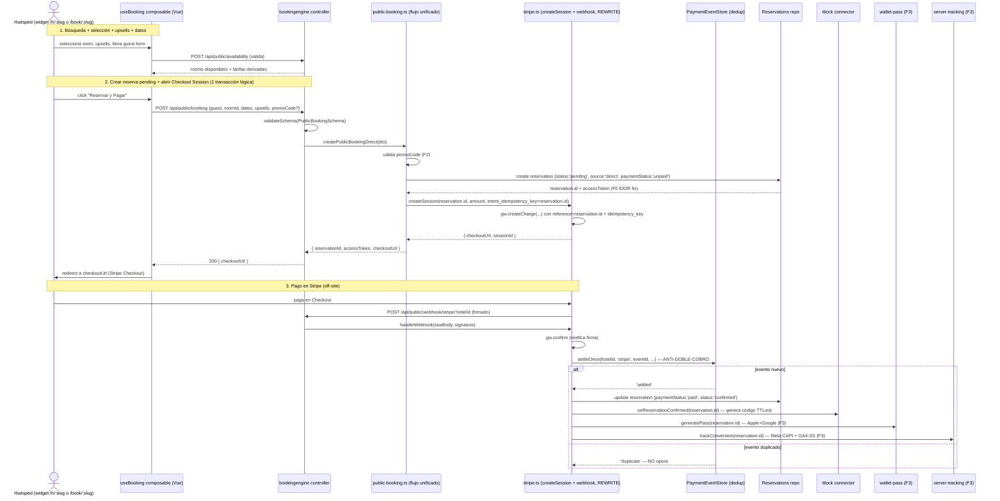
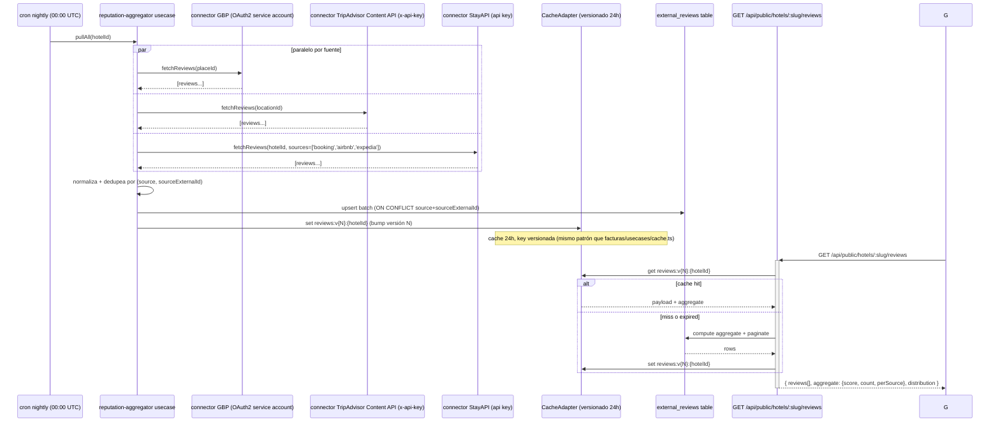

# Design: SOLMI Direct Booking — motor de reservas público + landing configurable

Change: `solmi-direct-booking` · Fases: F0 (fundación pública), F1 (landing configurable),
F2 (widget unificado superior), F3 (diferenciadores: reputación + wallet + tracking),
F4 (hygiene). Todas las specs (`specs/*/spec.md`) son la fuente de verdad — este documento
resuelve las decisiones que cruzan fases, documenta la arquitectura end-to-end, los
flujos externos, y los rollback plans.

## Technical Approach

Cinco fases sobre `backend/src/modules/` (mayormente nuevos módulos sobre
arckode-framework + ediciones puntuales a `bookingengine`/`opiniones`/`hoteles`) y un
frontend público nuevo bajo `frontend/src/pages/public/` + `frontend/src/pages/h/`.
Ningún cambio rompe la operación PMS existente salvo F0 (unificación de flujos, detrás
de feature flag).

Se leyó el código real antes de diseñar (verificación completa, no supuestos). Los
hallazgos que corrigen o afinan el brief original quedan documentados abajo con
archivo:línea exacta.

### Discrepancias encontradas vs el brief (afectan el diseño)

| # | Brief decía | Realidad (verificado) | Implicancia al diseño |
|---|---|---|---|
| D-1 | "El botón *Confirmar y Pagar* no llama al checkout" | El botón dice **"✓ Confirmar Reserva"** (`booking-widget/index.vue:143`). El widget NO cobra, solo crea reserva pendiente | F0 debe reemplazar el botón por uno de pago real + eliminar el flujo "crear y olvidar" |
| D-2 | "2 flujos paralelos: `/booking` → Reservations vs `/bookings` → public_bookings" | Confirmado, PERO el `StripeUseCase` opera sobre `PublicBookingDTO` (`/bookings`) y el UI posta a `/booking` (`Reservations`). **Tablas disjuntas**: cablear Stripe al UI actual no funciona aunque se quiera — primero hay que unificar | F0 unificación es prerequisito HARD del cableado Stripe |
| D-3 | hoteles tiene `lat`/`lng` | Son `latitude`/`longitude` (`hoteles/model.ts:49-50`) | Spec usa esos nombres exactos |
| D-4 | hoteles tiene `slug` | No es columna — se computa `name.toLowerCase().replace(/\s+/g,'-')` (`public-booking.ts:5`). Renombrar el hotel rompe todas las URLs públicas | F0 agrega columna `slug` nullable + seeder desde name + unicidad por hotel |
| D-5 | hoteles tiene `amenities` | No existe — amenities viven en `RoomAmenities` (a nivel habitación, `public-booking.ts:20`) | F0 agrega `amenities` JSON a `hotels` (amenities DEL HOTEL: pool/gym/spa, distintos de los del cuarto) |
| D-6 | hoteles tiene `publicBookingEnabled` | Cercanos: `onlineBookingStatus` (`:46`), `motorVersion` (`:47`), `bookingEngineUrl` (`:40`), `BookingConfig.enabled` (`bookingengine/model.ts:12`) | F0 reusa `onlineBookingStatus='active'` como gate, NO crea flag nuevo |
| D-7 | `starRating` numérico | Es `string` (`:45`) | Spec lo deja string (no bloquea); la allow-list lo castea a number en el DTO si viene vacío |
| D-8 | `descriptionJson` multilingüe | Existe pero sin resolución multilingüe (sin `translations` como restaurant) | F0 agrega `descriptionTranslations` JSON + reusa `restaurant/usecases/i18n.ts:26 resolveForLang` |
| D-9 | hoteles tiene `policies` | Desgranado en ~12 columnas (`cancellationType`, `freeCancellation`, `depositRequired`, `depositPercent`, `releaseHours`, etc.) | Spec NO crea campo `policies` — las expone todas en el DTO público |
| D-10 | `getHotelPublicInfo` hardcodea 14:00/11:00 | Confirmado y además **inconsistente**: el modelo defaultea 15:00/12:00 (`:21-22`) | F0 lee del modelo, no hardcodea |
| D-11 | opiniones tiene `sourceExternalId`/`respondedAt` | NO existen — solo `response` (texto) y timestamps genéricos | F3 agrega ambas columnas para ingestión OTA + tracking de respuesta |
| D-12 | opiniones tiene aggregate score | NO existe en código | F0/F3 lo computa (cacheado, no stored) |
| D-13 | opiniones `channel` siempre `'direct'` | Default `'direct'` + único writer lo hardcodea (`service.ts:116`); columna admite más | F3 ingestión OTA usa los otros valores del union type |
| D-14 | `availability_cache` tabla muerta | Definida + repo instanciado + pasado al constructor, PERO el use case no la lee (`availability.ts:3-14` explica por qué) | F4 decisión: borrar |
| D-15 | Existe `/widget/` iframe estático | SÍ EXISTE: `frontend/public/widget/` con 6 archivos (`index.html`, `booking.js`, `loader.js`, `ga4.js`, `api.js`, `styles.css`). Vite sirve `public/` en la raíz → accesible en `/widget/index.html` y embebible en sitios externos vía `loader.js`. Junto al Vue `/book/:slug` (`booking-widget/index.vue`) son **2 widgets duplicados**, ambos con el pago desconectado | F2 consolida/reemplaza LOS 2 widgets (Vue + estático). El nuevo loader embebible sale del mismo bundle SPA que la landing |

## Las 5 decisiones de arquitectura (YA TOMADAS — documentadas, no reabiertas)

### Decisión 1: Ruta pública del hotel = `/h/:slug`

NO se usa subdominio (`hotel.solmios.com`) en esta iteración. Razones:
- `/h/:slug` no choca con rutas SaaS existentes (`/panel`, `/admin`, `/login`, `/book/:slug` widget existente).
- Subdominio requiere wildcard DNS + wildcard SSL + session cookie scoping — alcance mayor, fuera de este change.
- `/h/:slug` es además la URL canónica para SEO (sitemap, JSON-LD, OG) — un subdominio fragmenta la autoridad de dominio.

**Slug estable**: dado que `hotels` no tiene `slug` (D-4), F0 agrega la columna y la puebla con `slugify(name)`. Editar el nombre del hotel NUNCA MUST cambiar el slug automáticamente — el admin lo cambia a mano en Settings (con validación de unicidad). Esto evita link-rot.

### Decisión 2: 1 widget SPA Vue = landing + embebible

- `/h/:slug` (landing): renderiza bloques configurables (F1) Y contiene el widget inline.
- `/book/:slug` (embebible): MISMO bundle, MISMO store Pinia, pero layout mínimo para iframe.
- `/book/:slug` hoy existe (`booking-widget/index.vue`) y NO tiene pago. F2 lo reemplaza por el componente unificado.
- **D-15 corregido**: hoy existen **2 widgets duplicados**, no 1. (a) El Vue `/book/:slug` (`booking-widget/index.vue`). (b) El widget estático embebible `frontend/public/widget/` (`index.html` + `booking.js` + `loader.js` + `ga4.js` + `api.js` + `styles.css`), servido en `/widget/index.html` y embebible vía `loader.js` en sitios externos. Ambos tienen el pago desconectado.
- El bundle es uno solo; el router decide layout. F2 acaba la duplicación consolidando/reemplazando LOS 2 widgets. El nuevo loader embebible para sitios externos se genera del mismo bundle SPA, NO de archivos sueltos en `public/widget/`. La retrocompat del snippet `loader.js` ya embebido por hoteles se preserva o se documenta como breaking change (decisión en F2).

### Decisión 3: Stack agregador reseñas = GBP + TripAdvisor + StayAPI

NO TrustYou/Revinate ($125+/mes, enterprise-only). Stack elegido:
- **Google Business Profile API** (gratis, OAuth2 service account) — fuente principal.
- **TripAdvisor Content API** (free con backlink a TripAdvisor desde la landing) — fuente secundaria.
- **StayAPI** (agregador pago, €0.035/review o plan €35/mes) — cubre Booking.com/Airbnb/Expedia sin tener que integrar cada una.

Cada uno con su conector en `backend/src/connectors/` (patrón "connector solo DELEGA vía sockets"), cron nightly de pull, cache 24h versionado por fuente (ver D-CACHE abajo).

### Decisión 4: Wallet pass en Fase 3 + integración TTLock

- Apple Wallet pass requiere certificado Apple Developer del hotel dueño ($99/año, NO cubierto por SOLMI OS).
- Google Wallet pass es gratis (service account + JWT).
- TTLock ya está integrado (`ttlock` module + connector) — F3 reusa el endpoint de generar código para inyectarlo en el pass.
- El pass se genera **al confirmar la reserva** (no al check-in), y se regenera si cambia el room assignment.

### Decisión 5: Mapa = Leaflet

Gratis, sin API key, ~40KB gzipped. Lazy-load solo cuando el bloque mapa está visible. NO Google Maps (API key + costos), NO Mapbox (límite commercial).

## Diagrama de secuencia — flujo unificado de reserva con pago Stripe

El punto de mayor riesgo del change: F0 (unificación) + F2 (widget) se combinan para que
el botón del widget cree la reserva Y dispare el pago en una sola transacción lógica.
D-2 es la razón por la que no se puede simplemente "cablear" — el StripeUseCase viejo
opera sobre `public_bookings`, hay que reescribirlo para `Reservations`.



**Puntos verificados contra código real**:
- `PaymentEventStore.settleOnce` ya existe y dedupea por `eventId` (`stripe.ts:91-108`).
- El webhook ya está firmado y raw-body-resuelto (framework 1.6.3, verificado en prod 2026-07-16).
- Lo que F0 agrega: (a) reescribir `createCheckoutSession` para operar sobre `Reservations` (hoy opera sobre `public_bookings` — D-2), (b) agregar `idempotency_key=reservation.id` al `createCharge` (hoy no se pasa — verificación §7), (c) que el widget llame al endpoint y redirect en vez de "create + show success modal".

## Diagrama de secuencia — agregador de reseñas (F3)



## Diagrama de secuencia — wallet pass al confirmar (F3)

```mermaid
sequenceDefinition
    actor G as Huésped
    participant ST as stripe.ts (webhook confirm)
    participant TT as ttlock connector
    participant WP as wallet-pass usecase
    participant APPLE as Apple Developer cert (passkit)
    participant GOOG as Google Wallet API (service account JWT)
    participant DB as wallet_passes table
    participant ML as email (mail link)

    ST->>TT: onReservationConfirmed(reservation.id)
    TT-->>ST: lockCode (código TTLock generado)
    ST->>WP: generatePass(reservation.id, lockCode)
    par generar ambos
        WP->>APPLE: sign pass.pkpass con cert del hotel
        APPLE-->>WP: pass.pkpass (URL firmada)
    and
        WP->>GOOG: create pass object + JWT
        GOOG-->>WP: saveUrl (Add to Google Wallet)
    end
    WP->>DB: upsert wallet_passes {reservationId, appleUrl, googleUrl, lockCode}
    WP->>ML: send confirmation email con ambos links
    ML-->>G: "Tu pase de reserva + código de acceso"
```

## Flujo de auth de APIs externas (F3)

### Google Business Profile (OAuth2 service account)

- Hotel dueño sube su Google service account JSON en Settings (configuration key `gbp_service_account`).
- SOLMI OS actúa como cliente OAuth2 con `assertion` JWT (grant_type=`urn:ietf:params:oauth:grant-type:jwt-bearer`).
- Scope: `https://www.googleapis.com/auth/business.manage`.
- El `placeId` se almacena en `configuration(key='gbp_place_id')` — el admin lo busca una vez y lo guarda.

### TripAdvisor Content API

- API key gratuita solicitada por el hotel dueño a TripAdvisor (suele aprobar en 24-48h con backlink obligatorio).
- Header `x-api-key: <key>`, rate limit 500 req/day.
- `locationId` se obtiene del search endpoint una vez y se guarda en configuration.
- El backlink "Reviews by TripAdvisor" se renderiza en el footer de la landing `/h/:slug` (REQUIRED — sin eso suspenden la key).

### StayAPI

- Service pago, plan €35/mes o pay-per-review (€0.035).
- API key del hotel dueño en configuration.
- Endpoints: `/reviews/{source}` con `{hotel_id}` mapeado a Booking/Airbnb/Expedia property IDs.
- El mapeo (cada OTA property ID → nuestro hotelId) se configura en admin.

## Decisiones de diseño transversales (D1–D14)

### D1 — Slug como columna, no computado

`hotels.slug` (nullable en F0, REQUIRED-after-migration). Seeder F0 lo puebla con `slugify(name)` + sufijo `-<shortHash>` si hay colisión. Editar name NO cambia slug automáticamente. El admin puede editarlo en Settings → valida `^[a-z0-9-]+$`, uniqueness global (slugs son namespace público). Slugs vacíos → fallback a `id`.

### D2 — Unificación de flujos = solo `Reservations`, `public_bookings` se elimina

- `POST /api/public/booking` (singular) queda como EL flujo, ampliado con Stripe.
- `POST /api/public/bookings` (plural) se elimina. Su caso de uso (reservas con pago) lo cubre el flujo unificado.
- `GET /api/public/bookings/:id` (IDOR) se reemplaza por `GET /api/public/reservations/:id?token=<accessToken>` — token devuelto al crear, hasheable, TTL configurable (default 30 días tras checkout).
- `POST /api/public/bookings/:id/checkout` (sobre `public_bookings`) se reemplaza por `POST /api/public/reservations/:id/checkout` (sobre `Reservations`).
- La tabla `public_bookings` NO se dropea en F0 — se conserva + job de migración copia filas a `Reservations` (si las hay). Solo se dropea en un change posterior (ver Rollback).

### D3 — Stripe sobre Reservations, no public_bookings

Reescritura del `StripeUseCase`:
- `createCheckoutSession(reservationId, amount)` opera sobre el repo `Reservations` (NO sobre `BookingEngine/PublicBooking`).
- El `idempotency_key` del `gw.createCharge` pasa a ser `reservation.id` (hoy no se pasa — D-2).
- El `reference` del charge sigue siendo `reservation.id` (mismo campo, mismo uso).
- El webhook `handleStripeWebhook` cambia `repo('BookingEngine')` por `repo('Reservations')` para el `update`.

### D4 — Access token público para IDOR

- Columna nueva `accessToken` (TEXT, nullable) en `Reservations` (tabla `reservations` físicamente — o el nombre real que use el modelo `ReservationModel`).
- Generado con `crypto.randomUUID()` al crear la reserva vía flujo público.
- `GET /api/public/reservations/:id?token=X` valida `reservation.accessToken === hash(X)` antes de devolver datos.
- Si la reserva se creó desde el panel (no pública), `accessToken` es null → el endpoint público rechaza (404 para no revelar existencia).

### D5 — Anti-patrón ORM (mem 1805, vigilar)

TODO campo persistido nuevo (`hotels.slug`, `hotels.amenities`, `hotels.descriptionTranslations`, `reservations.accessToken`, `hotel_media.*`, `landing_blocks.*`, `external_reviews.*`, `wallet_passes.*`, `promo_codes.*`) DEBE estar declarado en el `orm.define(...)` correspondiente. Case-sensitive. Sin declaración → se descarta silenciosamente.

### D6 — Cache versionado (patrón existente)

`CacheAdapter` solo borra claves exactas. Las claves de listado incluyen versión + filtros:
- `reviews:v{N}:{hotelId}` — bump N al re-agregar. Mismo patrón que `facturas/usecases/cache.ts`.
- `hotel:public:v{N}:{slug}` — bump al editar hotel o media.

### D7 — i18n reusado del módulo restaurant

`restaurant/usecases/i18n.ts:26 resolveForLang` se mueve a `shared/i18n.ts` (refactor menor) o se duplicar el patrón. Hotels gana `descriptionTranslations` JSON, igual que `menu_items.translations`. Fallback: español base.

### D8 — SEO: SSR/prerender SOLO landing, no widget checkout

La landing `/h/:slug` DEBE estar en HTML para indexación (JSON-LD, meta, OG). El widget checkout (post-click "Reservar") puede ser 100% client-side (no se indexa). Implementación:
- Vite SSG o prerender en build de las rutas `/h/:slug` conocidas (lista de slugs activos).
- Para hoteles nuevos (post-build), fallback a SSR ligero o revalidación on-demand.

Decisión diferida a F1: SSG estático con rebuild on-hotel-edit vs SSR runtime. Por ahora se documenta como SSG (más simple, alinea con el static-host actual del frontend).

### D9 — Performance sub-2s mobile 4G

- Code-splitting: bloque mapa (Leaflet) solo carga cuando visible (IntersectionObserver).
- Reseñas: lazy load tras primer paint de la landing.
- Imágenes: hero comprimido + responsive srcset; galería con thumbnails + lightbox (no full-size de entrada).
- Tracking (Meta CAPI + GA4-SS): server-side, no bloquea el render.
- Stripe Checkout: redirect (off-site), no embebido.

### D10 — Multi-moneda con geo-IP

- Geo-IP por cabecera `CF-IPCountry` (Cloudflare en prod) o fallback a la moneda base del hotel.
- Conversión: rates en configuration(key='currency_rates'), updateada por cron daily (open exchange rates free).
- Display only — el cobro SIEMPRE es en la moneda base del hotel (`hotels.currency`).

### D11 — Urgencia REAL con dato vivo del PMS

- "3 habitaciones left at this rate" lee `availabilityUseCase.check()` (count por roomType para las fechas seleccionadas) + tarifas derivadas.
- Si quedan ≤3 → badge "Pocas habitaciones a este precio". Si ≤1 → "Última disponible".
- NEVER falsificar — si el count es >5, no se muestra el badge.

### D12 — Promo codes

- Tabla `promo_codes` (id, hotelId, code, kind: 'percent'|'fixed', value, minAmount, maxUses, uses, validFrom, validTo, active).
- Validación en `createPublicBookingDirect`: aplica descuento sobre subtotal (antes de impuestos), respeta minAmount y maxUses (atomic increment).
- Stack: NO permitido (un promo por reserva).

### D13 — Funnel de analytics real (F4)

Reemplaza `topRoomTypes:[]` vacío. Eventos:
- `view` — página `/h/:slug` cargada.
- `search` — fechas enviadas.
- `select` — habitación seleccionada.
- `upsell` — upsell añadido.
- `form` — form de guest empezado.
- `pay` — redirect a Stripe.
- `confirm` — webhook confirmó.
Persiste en tabla `booking_events` (id, hotelId, reservationId?, sessionAnonymousId, event, timestamp, meta).

### D14 — F4 cleanup: availability_cache + publishReview flags

- `availability_cache`: **borrar**. Tabla + repo + paso al constructor eliminados. Razón (verificada): el use case calcula live, ningún proceso la puebla, lleva un comentario explicativo de por qué se abandonó (`availability.ts:3-14`).
- `publishReviewScore`/`publishReviewComments`: **implementar** en F0 (gate del endpoint público de reseñas). `requestReviews`: ya gatea el connector — no se toca.

## Riesgos transversales (R1–R4)

| ID | Riesgo | Mitigación |
|----|--------|------------|
| R1 | La reescritura de `StripeUseCase` (D3) rompe el webhook en prod si se deploya a medias | Deployar backend + frontend en la MISMA release; si el webhook cambia de tabla, el flujo viejo debe estar deprecado behind flag `BOOKING_USE_UNIFIED_FLOW` hasta confirmar 0 uso |
| R2 | El redirect a Stripe Checkout abandona el dominio → el usuario no vuelve | `success_url` y `cancel_url` configuran Stripe para volver a `/h/:slug?booking=:id&token=:token` — al volver, el widget muestra estado (confirmed / pending / failed) |
| R3 | Las APIs externas (GBP/TripAdvisor/StayAPI) caen o rate-limitorean | Cache 24h + fallback al último agregado conocido. La landing NUNCA revienta por una API externa caída (badge "X reseñas de Google" desaparece, pero el score directo sigue) |
| R4 | Apple Wallet requiere cert del hotel dueño → bloquea F3 para hoteles que no lo tienen | El pass Apple es OPTIONAL por hotel (configuration flag). Google Wallet es gratis. Si el hotel no tiene Apple, se genera solo el Google pass + el código TTLock por email |

## Orden de implementación de las 5 fases

**Orden: F0 → F1 → F2 → F3 → F4** (igual al `proposal.md`), por dependencia real:

| Fase | ¿Puede ir antes? | Por qué |
|---|---|---|
| **F0** Fundación | No — base de todo | Sin `getHotelPublicInfo` rico, sin `hotel_media`, sin reviews endpoint, sin unificación — ni F1 ni F2 pueden consumir lo que no existe |
| **F1** Landing | Depende de F0 (endpoint público rico + media + reviews) | Los bloques de landing consumen `/api/public/hotels/:slug`, `/api/public/hotels/:slug/media`, `/api/public/hotels/:slug/reviews` |
| **F2** Widget | Depende de F0 (unificación + Stripe cableado) y conviene post-F1 | Reusa rutas + componentes del landing. Sin F0 unificación, cablear Stripe no funciona (D-2) |
| **F3** Diferenciadores | Depende de F0 (reviews endpoint existe) + F2 (widget existe para inyectar badges + wallet + tracking) | Los badges van DENTRO del widget (F2), el wallet pass dispara al confirmar (F2) |
| **F4** Hygiene | Independiente pero conviene al final | Funnel analytics reemplaza `topRoomTypes:[]` (que se borra). `availability_cache` cleanup no bloquea nada |

**Dependencias duras**:
- F1 (landing) → requiere F0 aplicado.
- F2 (widget) → requiere F0 aplicado (unificación + Stripe).
- F3 (diferenciadores) → requiere F0 + F2.
- F4 (hygiene) → independiente, idealmente último.

## Testing Strategy

Cada fase termina con **Gate de verificación obligatorio** (no solo al final del change):
- `cd backend && bun run typecheck` (0 errores)
- `cd backend && bun run node_modules/arckode-framework/bin/arckode.js analyze` (✅ VÁLIDO, 0 violaciones)
- `cd backend && bun test` (verde, incluyendo tests nuevos de la fase)
- `cd frontend && bun run typecheck` (vue-tsc -b, 0 errores)
- `cd frontend && bun run build` (sin errores de Vite, termina en "✓ built")

Tests específicos requeridos por fase (detalle en `tasks.md`):
- F0: unificación de flujos (compat retro), Stripe session creation, IDOR token check, slug uniqueness.
- F1: allow-list de campos públicos, JSON-LD output, mapa renders.
- F2: promo code validación, urgencia real (count), i18n fallback, multi-moneda conversión.
- F3: agregador dedup por source+sourceExternalId, cache miss/hit, wallet pass generation (mock cert), tracking fire.
- F4: funnel events persistidos, availability_cache ausente tras migrate.

## Rollback Plan por fase

### F0 — Unificación de flujos (riesgo ALTO)

1. **Antes de deployar**: feature flag `BOOKING_USE_UNIFIED_FLOW=true` (default en dev). En prod, deployar con `false` primero, activar por hotel en `configuration`.
2. **NO dropear `public_bookings` en F0**. La tabla queda. El endpoint `/api/public/bookings` (plural) se marca deprecated (log warning) pero responde.
3. **Job de migración**: script `migrate-public-bookings.ts` lee filas de `public_bookings`, las inserta en `Reservations` con `source:'direct', paymentStatus:'paid'` (si ya tenían pago). Idempotente por `public_bookings.id`.
4. **Si F0 rompe en prod**: revertir el commit + setear `BOOKING_USE_UNIFIED_FLOW=false` → el flujo plural viejo vuelve a funcionar. Las reservas nuevas creadas con el flujo unificado quedan en `Reservations` (no se pierden — son filas válidas de la tabla operacional).
5. **Drop de `public_bookings`**: change POSTERIOR (no este), solo cuando telemetría confirme 0 uso del flujo plural por 1 ciclo de release.

### F2 — Reemplazo de widgets (riesgo MEDIO)

- **LOS 2 widgets viejos** se eliminan en el MISMO commit que introduce el nuevo: (a) Vue `/book/:slug` (`pages/booking-widget/index.vue`) y (b) widget estático `public/widget/` (los 6 archivos: `index.html`, `booking.js`, `loader.js`, `ga4.js`, `api.js`, `styles.css`).
- Si el nuevo falla en producción, revertir el commit restaura los viejos sin migración (los endpoints `/public/booking` y `/public/bookings` siguen existiendo — el widget solo los consume).
- **Retrocompat del snippet `loader.js` embebido**: sitios externos ya podrían tener `<script src="/widget/loader.js">`. Opción A (preservar): servir un `loader.js` shim en la misma URL que cargue el nuevo bundle SPA en el iframe. Opción B (breaking): documentar en changelog y notificar a hoteles para actualizar el snippet. Decisión se toma en F2 (task 2.13).
- Mantener el composable `useBooking` compartido entre viejo y nuevo durante 1 release → más fácil revertir.

### F3 — Integraciones externas (riesgo MEDIO)

- Cada fuente externa (GBP/TripAdvisor/StayAPI) se activa por hotel via configuration flag.
- Si una API falla (rate limit, downtime), su conector loguea y saltea — no rompe el cron.
- Wallet pass Apple: si el cert del hotel está vencido o inválido, se loguea y se envía solo Google pass + email con código TTLock.

### F1, F4 — Bajo riesgo

Aditivos/cleanup. Revertir = dejar de usar la UI/ruta nueva. F4 si dropea `availability_cache`, el rollback es recrear la tabla (está vacía anyway).

## Diagrama de módulos y dependencias

```
backend/src/
├── modules/
│   ├── hoteles/                 (MODIFIED: +slug, +amenities, +descriptionTranslations)
│   ├── bookingengine/           (HEAVY MODIFIED: unificación F0, Stripe rewrite, IDOR fix)
│   ├── opiniones/               (MODIFIED: +respondedAt, +sourceExternalId, +aggregate usecase)
│   ├── hotel-media/             (NEW F0)
│   ├── landing/                 (NEW F1)
│   ├── promo-codes/             (NEW F2)
│   ├── external-reviews/        (NEW F3)
│   ├── wallet-pass/             (NEW F3)
│   ├── server-tracking/         (NEW F3)
│   └── abandon-recovery/        (NEW F3)
├── connectors/
│   ├── reservas-opiniones.ts    (existing, untouched)
│   ├── reservas-ttlock.ts       (existing, reused F3)
│   ├── gbp-reviews.ts           (NEW F3)
│   ├── tripadvisor-reviews.ts   (NEW F3)
│   ├── stayapi-reviews.ts       (NEW F3)
│   └── reservas-wallet.ts       (NEW F3, trigger on confirm)
├── shared/
│   └── i18n.ts                  (NEW: extracted from restaurant/usecases/i18n.ts, D7)
└── composition-root.ts          (MODIFIED: wire new modules + connectors)

frontend/src/
├── pages/
│   ├── public/
│   │   ├── hotel-landing.vue    (NEW F1: /h/:slug)
│   │   └── booking-widget.vue   (NEW F2: unified SPA)
│   └── booking-widget/index.vue (DELETED F2: replaced by public/booking-widget.vue)
└── public/
    └── widget/                  (DELETED F2: static widget — index.html, booking.js,
                                 loader.js, ga4.js, api.js, styles.css — reemplazado
                                 por el bundle SPA unificado; nuevo loader embebible
                                 se genera del mismo bundle, ver F2 2.13)
├── components/
│   ├── landing/                 (NEW F1: HeroBlock, GalleryBlock, AmenitiesBlock, MapBlock, ReviewsBlock, RoomsBlock, FaqBlock, CtaBlock, FooterBlock)
│   ├── booking/                 (NEW F2: SearchStep, RoomsStep, UpsellsStep, GuestCheckoutStep, PayStep, ConfirmStep)
│   └── reviews/                 (NEW F3: MultiChannelBadges, AggregateScore, ReviewCard)
├── composables/
│   ├── useBooking.ts            (NEW F2: state machine multi-step)
│   ├── useLanding.ts            (NEW F1)
│   └── useReviews.ts            (NEW F3)
└── services/
    ├── PublicHotel.service.ts   (NEW)
    ├── HotelMedia.service.ts    (NEW)
    ├── PublicReviews.service.ts (NEW)
    ├── Landing.service.ts       (NEW)
    └── Booking.service.ts       (NEW)
```
